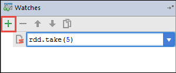

 <properties
    pageTitle="Utiliser les outils de HDInsight dans la boîte à outils Azure pour IntelliJ pour déboguer à distance les applications qui s’exécutent sur les clusters HDInsight Spark | Microsoft Azure"
    description="Découvrez comment utiliser les outils de HDInsight dans la boîte à outils Azure pour IntelliJ déboguer à distance applications s’exécutant sur clusters HDInsight Spark."
    services="hdinsight"
    documentationCenter=""
    authors="nitinme"
    manager="jhubbard"
    editor="cgronlun"
    tags="azure-portal"/>

<tags
    ms.service="hdinsight"
    ms.workload="big-data"
    ms.tgt_pltfrm="na"
    ms.devlang="na"
    ms.topic="article"
    ms.date="09/09/2016"
    ms.author="nitinme"/>

# Utilisez les outils HDInsight dans la boîte à outils Azure pour IntelliJ débogage d’explosion applications à distance sur cluster HDInsight explosion Linux

Cet article fournit des instructions détaillées sur la façon d’utiliser les outils de HDInsight dans la boîte à outils Azure pour IntelliJ à soumettre une tâche à explosion sur cluster HDInsight Spark et déboguer à distance à partir de votre ordinateur de bureau. Pour ce faire, vous devez effectuer les étapes suivantes :

1. Créer un réseau virtuel Azure site à ou point-à-site. Les étapes décrites dans ce document part du principe que vous utilisez un réseau de site à.

2. Créer un cluster explosion dans Azure HDInsight qui fait partie du réseau virtuel site à Azure.

3. Vérifiez la connectivité entre la headnode cluster et votre bureau.

4. Créer une application Scala dans IntelliJ idée et configurez-le pour le débogage distant.

5. Exécuter et déboguer l’application.

##Conditions préalables

* Un abonnement Azure. Voir [Azure obtenir la version d’évaluation gratuite](https://azure.microsoft.com/documentation/videos/get-azure-free-trial-for-testing-hadoop-in-hdinsight/).

* Un cluster explosion Apache sur HDInsight Linux. Pour plus d’informations, voir [groupes de créer Apache explosion dans Azure HDInsight](hdinsight-apache-spark-jupyter-spark-sql.md).
 
* Kit de développement Java Oracle. Vous pouvez l’installer à partir [d’ici](http://www.oracle.com/technetwork/java/javase/downloads/jdk8-downloads-2133151.html).
 
* IntelliJ idée. Cet article utilise la version 15.0.1. Vous pouvez l’installer à partir [d’ici](https://www.jetbrains.com/idea/download/).
 
* Outils de HDInsight du Kit de ressources Azure pour IntelliJ. Outils de HDInsight pour IntelliJ sont disponibles dans le cadre du Kit de ressources Azure pour IntelliJ. Pour obtenir des instructions sur l’installation du Kit de ressources de Azure, voir [l’installation du Kit de ressources Azure pour IntelliJ](../azure-toolkit-for-intellij-installation.md).

* Connectez-vous à votre abonnement Azure de IntelliJ idée. Suivez les instructions [ici](hdinsight-apache-spark-intellij-tool-plugin.md#log-into-your-azure-subscription).
 
* Pendant l’exécution d’application Scala explosion pour le débogage à distance sur un ordinateur Windows, vous pouvez obtenir une exception comme expliqué dans [explosion 2356](https://issues.apache.org/jira/browse/SPARK-2356) qui se produit en raison d’un WinUtils.exe manquant sous Windows. Pour contourner cette erreur, vous devez [Télécharger le fichier exécutable à partir de là](http://public-repo-1.hortonworks.com/hdp-win-alpha/winutils.exe) vers un emplacement, par exemple **C:\WinUtils\bin**. Vous devez ensuite ajouter une variable d’environnement **HADOOP_HOME** et définissez la valeur de la variable **C\WinUtils**.

## Étape 1 : Créer un réseau virtuel Azure

Suivez les instructions dans les liens ci-dessous pour créer un réseau virtuel Azure, puis vérifiez la connectivité entre le bureau et le réseau virtuel Azure.

* [Créer un VNet avec une connexion VPN site à site à l’aide du portail Azure](../vpn-gateway/vpn-gateway-howto-site-to-site-resource-manager-portal.md)
* [Créer un VNet avec une connexion VPN de site à l’aide de PowerShell](../vpn-gateway/vpn-gateway-create-site-to-site-rm-powershell.md)
* [Configurer une connexion point-à-site à un réseau virtuel à l’aide de PowerShell](../vpn-gateway/vpn-gateway-howto-point-to-site-rm-ps.md)

## Étape 2 : Créer un cluster HDInsight Spark

Vous devez également créer un cluster explosion Apache sur Azure HDInsight qui fait partie du réseau virtuel Azure que vous avez créé. Utilisez les informations disponibles en [basé sur Linux créer des groupes dans un HDInsight](hdinsight-hadoop-provision-linux-clusters.md). Dans le cadre de la configuration des facultative, sélectionnez le réseau virtuel Azure que vous avez créé à l’étape précédente.

## Étape 3 : Vérifier la connectivité entre votre bureau et le headnode cluster

1. Obtenir l’adresse IP de l’headnode. Ouvrez Ambari UI pour le cluster. À partir de la carte cluster, cliquez sur **tableau de bord**.

    

2. À partir de la Ambari UI, à partir du coin supérieur droit, cliquez sur **Hosts**.

    

3. Vous devez afficher la liste des headnodes nœuds de travail et des nœuds soigneur. Les headnodes ont la **hn*** préfixe. Cliquez sur la première headnode.

    

4. En bas de la page qui s’ouvre, à partir de la zone **Résumé** , copiez l’adresse IP de l’headnode et le nom d’hôte.

    

5. Inclure l’adresse IP et le nom d’hôte de la headnode au fichier **hosts** sur l’ordinateur à partir de l’endroit où vous souhaitez exécuter et déboguer à distance les tâches explosion. Cela vous permettra de communiquer avec le headnode à l’aide de l’adresse IP, ainsi que le nom d’hôte.

    1. Ouvrir un bloc-notes avec des autorisations élevées. Dans le menu fichier, cliquez sur **Ouvrir** et accédez à l’emplacement du fichier hosts. Sur un ordinateur Windows, il est `C:\Windows\System32\Drivers\etc\hosts`.

    2. Ajoutez le code suivant au fichier **hosts** .

            # For headnode0
            192.xxx.xx.xx hn0-nitinp
            192.xxx.xx.xx hn0-nitinp.lhwwghjkpqejawpqbwcdyp3.gx.internal.cloudapp.net

            # For headnode1
            192.xxx.xx.xx hn1-nitinp
            192.xxx.xx.xx hn1-nitinp.lhwwghjkpqejawpqbwcdyp3.gx.internal.cloudapp.net

5. À partir de l’ordinateur que vous connectés au réseau virtuel Azure qui est utilisé par le cluster HDInsight, vérifiez que vous pouvez tester les deux les headnodes à l’aide de l’adresse IP, ainsi que le nom d’hôte.

6. SSH dans la headnode cluster en suivant les instructions à [se connecter à un cluster de HDInsight à l’aide de SSH](hdinsight-hadoop-linux-use-ssh-windows.md#connect-to-a-linux-based-hdinsight-cluster). À partir de la headnode cluster, taper l’adresse IP de l’ordinateur de bureau. Vous devez tester la connectivité à la fois les adresses IP attribuées à l’ordinateur, une pour la connexion réseau et l’autre pour le réseau virtuel Azure que l’ordinateur est connecté à.

7. Répétez les étapes pour l’autres headnode. 

## Étape 4 : Créer une application explosion Scala l’aide des outils HDInsight Kit de ressources de Azure pour IntelliJ et configurez-le pour le débogage distant

1. Lancez IntelliJ idée et créez un nouveau projet. Dans la boîte de dialogue Nouveau projet, vérifiez les options suivantes, puis cliquez sur **suivant**.

    

    * Dans le volet gauche, sélectionnez **HDInsight**.
    * Dans le volet droit, sélectionnez **explosion sur HDInsight (Scala)**.
    * Cliquez sur **suivant**.

2. Dans la fenêtre suivante, fournissent les détails du projet.

    * Fournir un nom de projet et l’emplacement du projet.
    * **Kit de développement de projet**, vérifiez que vous fournissez une version Java supérieure à 7.
    * Pour **Scala SDK**, cliquez sur **créer**et cliquez sur **Télécharger**, puis sélectionnez la version de Scala à utiliser. **Vérifiez que vous n’utilisez pas la version 2.11.x**. Cet exemple utilise la version **2.10.6**.

        

    * Pour **Explosion SDK**, téléchargez et utilisez le Kit de développement de [ici](http://go.microsoft.com/fwlink/?LinkID=723585&clcid=0x409). Vous pouvez également ignorer cette et utiliser le [référentiel Maven explosion](http://mvnrepository.com/search?q=spark) à la place, cependant Vérifiez que vous disposez du référentiel maven droite installé pour développer vos applications explosion. (Par exemple, vous avez besoin pour vous assurer que vous avez le composant explosion Streaming installé si vous utilisez explosion diffusion ; Également, vérifiez que vous utilisez le référentiel marqué comme Scala 2.10 : n’utilisez pas le référentiel marqué comme Scala 2.11.)

        

    * Cliquez sur **Terminer**.

3. Le projet explosion crée automatiquement un objet à votre place. Pour afficher l’objet, procédez comme suit.

    1. Dans le menu **fichier** , cliquez sur **Structure du projet**.
    2. Dans la boîte de dialogue **Structure du projet** , cliquez sur **objets** pour afficher l’objet par défaut créé.

        

    Vous pouvez également créer votre propre objet Fix en cliquant sur les **+** icône, mise en surbrillance dans l’image ci-dessus.

4. Dans la boîte de dialogue **Structure du projet** , cliquez sur **projet**. Si le **Kit de développement de projet** est défini sur 1.8, assurez-vous que le **niveau de langage de projet** est défini sur **7 - losanges, etc. de capture multiples, processeur,**.

    

4. Ajouter des bibliothèques à votre projet. Pour ajouter une bibliothèque, cliquez sur le nom du projet dans l’arborescence du projet, puis cliquez sur **Ouvrir les paramètres Module**. Dans la boîte de dialogue **Structure du projet** , dans le volet gauche, cliquez sur **bibliothèques**, cliquez sur le signe plus (+) symbole, puis cliquez sur **à partir de Maven**. 

     

    Dans la boîte de dialogue **Bibliothèque de télécharger à partir de référentiel Maven** , rechercher et ajouter les bibliothèques suivantes.

    * `org.scalatest:scalatest_2.10:2.2.1`
    * `org.apache.hadoop:hadoop-azure:2.7.1`

5. Copie `yarn-site.xml` et `core-site.xml` à partir de la headnode cluster et ajoutez au projet. Utilisez les commandes suivantes pour copier les fichiers. Vous pouvez utiliser [Cygwin](https://cygwin.com/install.html) pour exécuter ce qui suit `scp` commandes pour copier les fichiers à partir de la headnodes cluster.

        scp <ssh user name>@<headnode IP address or host name>://etc/hadoop/conf/core-site.xml .

    Étant donné que nous déjà ajouté l’adresse IP du cluster headnode et les noms d’hôtes fo les hôtes du fichier sur le bureau, nous pouvons utiliser les commandes **scp** de la manière suivante.

        scp sshuser@hn0-nitinp:/etc/hadoop/conf/core-site.xml .
        scp sshuser@hn0-nitinp:/etc/hadoop/conf/yarn-site.xml .

    Ajoutez ces fichiers à votre projet en les copiant sous le dossier **/src** dans votre arborescence du projet, par exemple `<your project directory>\src`.

6. Mise à jour la `core-site.xml` à apporter les modifications suivantes.

    1. `core-site.xml`inclut la clé chiffrée pour le compte de stockage associé au cluster. Dans la `core-site.xml` que vous avez ajouté au projet, remplacez la clé chiffrée par la clé de stockage réel associé du compte de stockage par défaut. Consultez [Gérer les touches d’accès rapide votre stockage](../storage/storage-create-storage-account.md#manage-your-storage-account).

            <property>
                <name>fs.azure.account.key.hdistoragecentral.blob.core.windows.net</name>
                <value>access-key-associated-with-the-account</value>
            </property>

    2. Supprimez les entrées suivantes à partir de la `core-site.xml`.

            <property>
                <name>fs.azure.account.keyprovider.hdistoragecentral.blob.core.windows.net</name>
                <value>org.apache.hadoop.fs.azure.ShellDecryptionKeyProvider</value>
            </property>

            <property>
                <name>fs.azure.shellkeyprovider.script</name>
                <value>/usr/lib/python2.7/dist-packages/hdinsight_common/decrypt.sh</value>
            </property>

            <property>
                <name>net.topology.script.file.name</name>
                <value>/etc/hadoop/conf/topology_script.py</value>
            </property>

    3. Enregistrez le fichier.

7. Ajoutez la classe principal pour votre application. Dans l' **Explorateur de projets**, avec le bouton droit **src**, pointez sur **Nouveau**, puis cliquez sur **cours Scala**.

    

8. Dans la boîte de dialogue **Créer une nouvelle classe Scala** , fournir un nom pour le **type** sélection **objet**, puis sur **OK**.

    

9. Dans la `MyClusterAppMain.scala` de fichier, collez le code suivant. Ce code crée l’explosion contexte et lance un `executeJob` méthode à partir de la `SparkSample` objet.

        import org.apache.spark.{SparkConf, SparkContext}

        object SparkSampleMain {
          def main (arg: Array[String]): Unit = {
            val conf = new SparkConf().setAppName("SparkSample")
                                      .set("spark.hadoop.validateOutputSpecs", "false")
            val sc = new SparkContext(conf)
        
            SparkSample.executeJob(sc,
                                   "wasbs:///HdiSamples/HdiSamples/SensorSampleData/hvac/HVAC.csv",
                                   "wasbs:///HVACOut")
          }
        }

10. Répétez les étapes 8 et 9 ci-dessus pour ajouter un nouvel objet Scala appelé `SparkSample`. Ajouter le code suivant à ce cours. Ce code lit les données à partir de la HVAC.csv (disponible dans tous les clusters HDInsight Spark) extrait les lignes qui possèdent uniquement un chiffre dans la colonne septième dans le CSV, puis écrit la sortie dans **/HVACOut** sous le conteneur de stockage par défaut pour le cluster.

        import org.apache.spark.SparkContext
    
        object SparkSample {
          def executeJob (sc: SparkContext, input: String, output: String): Unit = {
            val rdd = sc.textFile(input)
        
            //find the rows which have only one digit in the 7th column in the CSV
            val rdd1 =  rdd.filter(s => s.split(",")(6).length() == 1)
        
            val s = sc.parallelize(rdd.take(5)).cartesian(rdd).count()
            println(s)
        
            rdd1.saveAsTextFile(output)
            //rdd1.collect().foreach(println)
          }
        
        }

11. Répétez classe étapes 8 et 9 ci-dessus pour ajouter un nouveau appelée `RemoteClusterDebugging`. Ce cours met en œuvre l’infrastructure de test explosion qui est utilisé pour le débogage d’applications. Ajoutez le code suivant à la `RemoteClusterDebugging` cours.

        import org.apache.spark.{SparkConf, SparkContext}
        import org.scalatest.FunSuite
        
        class RemoteClusterDebugging extends FunSuite {
        
          test("Remote run") {
            val conf = new SparkConf().setAppName("SparkSample")
                                      .setMaster("yarn-client")
                                      .set("spark.yarn.am.extraJavaOptions", "-Dhdp.version=2.4")
                                      .set("spark.yarn.jar", "wasbs:///hdp/apps/2.4.2.0-258/spark-assembly-1.6.1.2.4.2.0-258-hadoop2.7.1.2.4.2.0-258.jar")
                                      .setJars(Seq("""C:\WORK\IntelliJApps\MyClusterApp\out\artifacts\MyClusterApp_DefaultArtifact\default_artifact.jar"""))
                                      .set("spark.hadoop.validateOutputSpecs", "false")
            val sc = new SparkContext(conf)
        
            SparkSample.executeJob(sc,
              "wasbs:///HdiSamples/HdiSamples/SensorSampleData/hvac/HVAC.csv",
              "wasbs:///HVACOut")
          }
        }

    Quelques points importants à noter ici :
    
    * Pour `.set("spark.yarn.jar", "wasbs:///hdp/apps/2.4.2.0-258/spark-assembly-1.6.1.2.4.2.0-258-hadoop2.7.1.2.4.2.0-258.jar")`, vérifiez que l’assembly explosion JAR est disponible sur le stockage de cluster à l’emplacement spécifié.
    * Pour `setJars`, spécifiez l’emplacement où le fichier jar objet sera créé. Il est généralement `<Your IntelliJ project directory>\out\<project name>_DefaultArtifact\default_artifact.jar`. 

11. Dans la `RemoteClusterDebugging` de cours, cliquez sur le `test` mot-clé et sélectionnez **Créer une Configuration RemoteClusterDebugging**.

    

12. Dans la boîte de dialogue, indiquez un nom pour la configuration et sélectionnez le **type de Test** comme **nom de Test**. Laissez toutes les autres valeurs par défaut, cliquez sur **Appliquer**, puis cliquez sur **OK**.

    

13. Vous devez maintenant voir une liste déroulante dans la barre de menus la configuration de **La série à distance** . 

    

## Étape 5 : Exécuter l’application en mode débogage

1. Dans votre projet idée IntelliJ, ouvrez `SparkSample.scala` et créer un point d’arrêt en regard de « val rdd1 ». Dans le menu contextuel pour la création d’un point d’arrêt, sélectionnez la **ligne de fonction executeJob**.

    

2. Cliquez sur le bouton **Déboguer exécuter** en regard de la configuration **d’Exécuter à distance** déroulante pour démarrer l’application en cours d’exécution.

    

3. Lorsque l’exécution du programme atteint le point d’arrêt, vous devriez voir un onglet **débogueur** dans le volet inférieur.

    

4. Cliquez sur le (**+**) icône pour ajouter un espion, comme illustré dans l’image ci-dessous. 

    

    Dans ce cas, étant donné que l’application s’est interrompu avant la variable `rdd1` a été créé, à l’aide de cette espion, nous pouvons voir quels sont les 5 premières lignes dans la variable `rdd`. Appuyez sur **entrée**.

    

    Ce que vous voyez dans l’image ci-dessus est en cours d’exécution, vous pouvez interroger terrabytes de données et débogage comment votre application progresse. Par exemple, dans le résultat illustré dans l’image ci-dessus, vous pouvez voir que la première ligne de la sortie est un en-tête. Basé sur ce problème, vous pouvez modifier le code de votre application pour ignorer l’en-tête de colonne si nécessaire.

5. Vous pouvez maintenant cliquer sur l’icône du **Programme de CV** pour poursuivre l’exécution de votre application.

    

6. Si l’application est terminée avec succès, vous devriez voir un résultat comme suit.

    

 

## Voir aussi

* [Vue d’ensemble : Apache explosion sur Azure HDInsight](hdinsight-apache-spark-overview.md)

### Scénarios

* [Explosion avec BI : effectuer une analyse de données interactives à l’aide d’explosion dans HDInsight avec les outils de décisionnel](hdinsight-apache-spark-use-bi-tools.md)

* [Explosion avec apprentissage automatique : utilisation explosion dans HDInsight pour analyser la température de construction à l’aide de données HVAC](hdinsight-apache-spark-ipython-notebook-machine-learning.md)

* [Explosion avec apprentissage automatique : utilisation explosion dans HDInsight pour prévoir des résultats de l’inspection alimentaires](hdinsight-apache-spark-machine-learning-mllib-ipython.md)

* [Diffusion en continu explosion : Utilisation explosion dans HDInsight pour la création d’applications en continu en temps réel](hdinsight-apache-spark-eventhub-streaming.md)

* [Analyse de journal de site Web à l’aide d’explosion dans HDInsight](hdinsight-apache-spark-custom-library-website-log-analysis.md)

### Créer et exécuter des applications

* [Créer une application autonome à l’aide de Scala](hdinsight-apache-spark-create-standalone-application.md)

* [Exécution de tâches à distance sur un cluster explosion à l’aide de Livy](hdinsight-apache-spark-livy-rest-interface.md)

### Outils et extensions

* [Utiliser les outils de HDInsight dans la boîte à outils Azure pour IntelliJ pour créer et soumettre des applications Scala d’explosion](hdinsight-apache-spark-intellij-tool-plugin.md)

* [Utiliser HDInsight outils dans la boîte à outils Azure pour Eclipse pour créer des applications d’explosion](hdinsight-apache-spark-eclipse-tool-plugin.md)

* [Utiliser les blocs-notes Zeppelin avec un cluster explosion sur HDInsight](hdinsight-apache-spark-use-zeppelin-notebook.md)

* [Noyaux disponibles pour Jupyter bloc-notes cluster explosion pour HDInsight](hdinsight-apache-spark-jupyter-notebook-kernels.md)

* [Utiliser les packages externes avec Jupyter blocs-notes](hdinsight-apache-spark-jupyter-notebook-use-external-packages.md)

* [Installer Jupyter sur votre ordinateur et vous connecter à un cluster HDInsight Spark](hdinsight-apache-spark-jupyter-notebook-install-locally.md)

### Gérer les ressources

* [Gestion des ressources pour le cluster Apache explosion dans Azure HDInsight](hdinsight-apache-spark-resource-manager.md)

* [Suivre et débogage travaux s’exécutant sur un cluster Apache explosion dans HDInsight](hdinsight-apache-spark-job-debugging.md)
