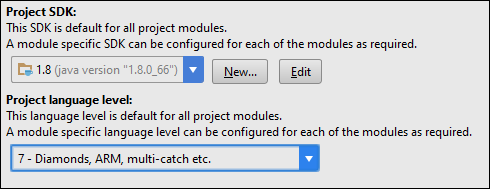
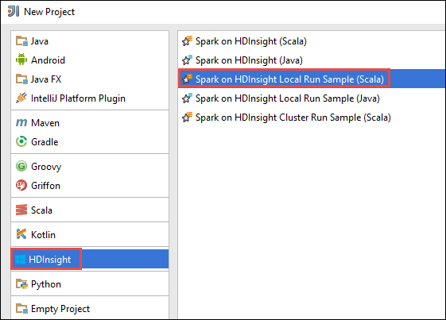

 <properties
    pageTitle="Créer des applications à explosion Scala à l’aide des outils HDInsight dans la boîte à outils Azure pour IntelliJ | Microsoft Azure"
    description="Apprenez à créer une application explosion à s’exécuter sur des clusters HDInsight Spark autonome."
    services="hdinsight"
    documentationCenter=""
    authors="nitinme"
    manager="jhubbard"
    editor="cgronlun"
    tags="azure-portal"/>

<tags
    ms.service="hdinsight"
    ms.workload="big-data"
    ms.tgt_pltfrm="na"
    ms.devlang="na"
    ms.topic="article"
    ms.date="09/09/2016"
    ms.author="nitinme"/>

# Utiliser les outils de HDInsight dans la boîte à outils Azure pour IntelliJ pour créer des applications pour cluster HDInsight explosion Linux explosion

Cet article fournit des instructions détaillées sur le développement d’applications explosion écrites dans Scala et l’envoi pour une HDInsight Spark cluster à l’aide des outils HDInsight dans la boîte à outils Azure pour IntelliJ.  Vous pouvez utiliser les outils de différentes façons :

* Pour développer et soumettre une application Scala Spark sur un cluster HDInsight Spark
* Accéder à vos ressources cluster Azure HDInsight explosion
* Pour développer et exécuter une application Scala Spark localement

Vous pouvez également suivre une vidéo [ici](https://mix.office.com/watch/1nqkqjt5xonza) pour vous aider à démarrer.

>[AZURE.IMPORTANT] Cet outil peut être utilisé pour créer et soumettre des applications uniquement pour un cluster HDInsight Spark sur Linux.

##Conditions préalables

* Un abonnement Azure. Voir [Azure obtenir la version d’évaluation gratuite](https://azure.microsoft.com/documentation/videos/get-azure-free-trial-for-testing-hadoop-in-hdinsight/).

* Un cluster explosion Apache sur HDInsight Linux. Pour plus d’informations, voir [groupes de créer Apache explosion dans Azure HDInsight](hdinsight-apache-spark-jupyter-spark-sql.md).

* Kit de développement Java Oracle. Vous pouvez l’installer à partir [d’ici](http://www.oracle.com/technetwork/java/javase/downloads/jdk8-downloads-2133151.html).

* IntelliJ idée. Cet article utilise la version 15.0.1. Vous pouvez l’installer à partir [d’ici](https://www.jetbrains.com/idea/download/).

## Installer les outils de HDInsight dans Azure Kit de ressources pour IntelliJ

HDInsight des outils pour IntelliJ est disponible dans le cadre du Kit de ressources Azure pour IntelliJ. Pour obtenir des instructions sur l’installation du Kit de ressources de Azure, voir [l’installation du Kit de ressources Azure pour IntelliJ](../azure-toolkit-for-intellij-installation.md).

## Connectez-vous à votre abonnement Azure

1. Lancez l’IDE IntelliJ et ouvrez l’Explorateur d’Azure. Dans le menu **affichage** dans l’IDE, cliquez sur **Outil fenêtres** , puis cliquez sur **Explorateur Azure**.

    

2. Cliquez sur le nœud **Azure** dans l' **Explorateur de Azure**, puis cliquez sur **Gérer les abonnements**.

3. Dans la boîte de dialogue **Gérer les abonnements** , cliquez sur **se connecter** et entrez vos informations d’identification Azure.

    

4. Une fois que vous êtes connecté, la boîte de dialogue **Gérer les abonnements** répertorie tous les abonnements Azure associés avec les informations d’identification. Cliquez sur **Fermer** dans la boîte de dialogue.

5. Dans l’onglet **Azure Explorer** , développez **HDInsight** pour afficher les groupes HDInsight Spark sous votre abonnement.

    

6. Vous pouvez développer davantage un cluster de nom pour afficher les ressources (par exemple, les comptes de stockage) associés au cluster.

    

## Exécutez une application explosion Scala sur un cluster HDInsight Spark

1. Lancez IntelliJ idée et créez un nouveau projet. Dans la boîte de dialogue Nouveau projet, vérifiez les options suivantes, puis cliquez sur **suivant**.

    

    * Dans le volet gauche, sélectionnez **HDInsight**.
    * Dans le volet droit, sélectionnez **explosion sur HDInsight (Scala)**.
    * Cliquez sur **suivant**.

2. Dans la fenêtre suivante, fournissent les détails du projet.

    * Fournir un nom de projet et l’emplacement du projet.
    * **Kit de développement de projet**, vérifiez que vous fournissez une version Java supérieure à 7.
    * Pour **Scala SDK**, cliquez sur **créer**et cliquez sur **Télécharger**, puis sélectionnez la version de Scala à utiliser. **Vérifiez que vous n’utilisez pas la version 2.11.x**. Cet exemple utilise la version **2.10.6**.

        

    * Pour **Explosion SDK**, téléchargez et utilisez le Kit de développement de [ici](http://go.microsoft.com/fwlink/?LinkID=723585&clcid=0x409). Vous pouvez également ignorer cette et utiliser le [référentiel Maven explosion](http://mvnrepository.com/search?q=spark) à la place, cependant Vérifiez que vous disposez du référentiel maven droite installé pour développer vos applications explosion. (Par exemple, vous avez besoin pour vous assurer que vous avez le composant explosion Streaming installé si vous utilisez explosion diffusion ; Également, vérifiez que vous utilisez le référentiel marqué comme Scala 2.10 : n’utilisez pas le référentiel marqué comme Scala 2.11.)

        

    * Cliquez sur **Terminer**.

3. Le projet explosion crée automatiquement un objet à votre place. Pour afficher l’objet, procédez comme suit.

    1. Dans le menu **fichier** , cliquez sur **Structure du projet**.
    2. Dans la boîte de dialogue **Structure du projet** , cliquez sur **objets** pour afficher l’objet par défaut créé.

        

    Vous pouvez également créer votre propre objet Fix en cliquant sur les **+** icône, mise en surbrillance dans l’image ci-dessus.

4. Dans la boîte de dialogue **Structure du projet** , cliquez sur **projet**. Si le **Kit de développement de projet** est défini sur 1.8, assurez-vous que le **niveau de langage de projet** est défini sur **7 - losanges, etc. de capture multiples, processeur,**.

    

5. Ajouter le code source de votre application.

    1. Dans l' **Explorateur de projets**, avec le bouton droit **src**, pointez sur **Nouveau**, puis cliquez sur **cours Scala**.

        

    2. Dans la boîte de dialogue **Créer une nouvelle classe Scala** , fournir un nom pour le **type** sélection **objet**, puis sur **OK**.

        

    3. Dans le fichier **MyClusterApp.scala** , collez le code suivant. Ce code lit les données à partir de la HVAC.csv (disponible dans tous les clusters HDInsight Spark) extrait les lignes qui possèdent uniquement un chiffre dans la colonne septième dans le CSV, puis écrit la sortie dans **/HVACOut** sous le conteneur de stockage par défaut pour le cluster.

            import org.apache.spark.SparkConf
            import org.apache.spark.SparkContext

            object MyClusterApp{
              def main (arg: Array[String]): Unit = {
                val conf = new SparkConf().setAppName("MyClusterApp")
                val sc = new SparkContext(conf)

                val rdd = sc.textFile("wasbs:///HdiSamples/HdiSamples/SensorSampleData/hvac/HVAC.csv")

                //find the rows which have only one digit in the 7th column in the CSV
                val rdd1 =  rdd.filter(s => s.split(",")(6).length() == 1)

                rdd1.saveAsTextFile("wasbs:///HVACOut")
              }

            }

5. Exécutez l’application sur un cluster HDInsight Spark.

    1. Dans l' **Explorateur de projets**, cliquez sur le nom du projet, puis sélectionnez **Soumettre explosion Application à HDInsight**.

        

    2. Vous devrez entrer vos informations d’identification de l’abonnement Azure. Dans la boîte de dialogue **Explosion soumission** , fournissent les valeurs suivantes.

        * Pour les **clusters explosion (Linux uniquement)**, sélectionnez le cluster HDInsight Spark sur lequel vous voulez exécuter votre application.

        * Vous devez soit sélectionner un objet du projet IntelliJ ou sélectionnez une à partir du disque dur.

        * Par rapport à la zone de texte **nom du cours principal** , cliquez sur les points de suspension ( ), sélectionnez la classe principale dans votre code source d’application et puis cliquez sur **OK**.

            

        * Étant donné que le code de l’application dans cet exemple montre comment ne pas exiger des arguments de ligne de commande ou référencez bocaux ou des fichiers, vous pouvez laisser les autres zones de texte vide.

        * Après avoir fourni toutes les entrées, la boîte de dialogue doit ressembler à ceci.

            

        * Cliquez sur **Envoyer**.

    3. L’onglet **Explosion soumission** en bas de la fenêtre devraient affichant l’état d’avancement. Vous pouvez également arrêter l’application en cliquant sur le bouton rouge dans la fenêtre « Explosion soumission ».

        

    Dans la section suivante, vous allez apprendre à accéder à la tâche à l’aide des outils HDInsight Kit de ressources de Azure pour IntelliJ de sortie.

## Accéder et gérer les HDInsight Spark l’aide des outils HDInsight Kit de ressources de Azure pour IntelliJ

Vous pouvez effectuer diverses opérations à l’aide des outils HDInsight qui font partie d’un jeu d’outils Azure pour IntelliJ.

### Accéder à la vue de travail directement à partir des outils HDInsight

1. Dans l' **Explorateur de Azure**, développez **HDInsight**, développez le nom du cluster explosion, puis cliquez sur **tâches**.

2. Dans le volet droit, l’onglet **Affichage du travail explosion** affiche toutes les applications qui ont été exécutées sur le cluster. Cliquez sur le nom de l’application pour laquelle vous souhaitez voir davantage de détails.

    

3. Les zones **Message d’erreur**, **Sortie des tâches**, **Les journaux de travail Livy**et **Les journaux du pilote explosion** sont remplis en fonction de l’application que vous sélectionnez.

4. Vous pouvez également ouvrir l' **Interface utilisateur de l’historique à explosion** et l' **Interface utilisateur fils** (au niveau de l’application) en cliquant sur les boutons respectifs dans la partie supérieure de l’écran.

### Accéder au serveur de l’historique d’explosion

1. Dans l' **Explorateur de Azure**, développez **HDInsight**, avec le bouton droit de votre nom de cluster explosion, puis sélectionnez **Ouvrir l’interface utilisateur de l’historique à explosion**. Lorsque vous y êtes invité, entrez les informations d’identification d’administration pour le cluster. Vous devez avoir indiqué ces lors de la mise en service le cluster.

2. Dans le tableau de bord explosion historique Server, vous pouvez rechercher l’application vous juste après l’exécution d’en utilisant le nom de l’application. Dans le code ci-dessus, vous définissez le nom d’application à l’aide `val conf = new SparkConf().setAppName("MyClusterApp")`. Par conséquent, votre nom de l’application explosion a été **MyClusterApp**.

### Lancer le portail Ambari

Dans l' **Explorateur de Azure**, développez **HDInsight**, avec le bouton droit de votre nom de cluster explosion, puis sélectionnez **Ouvrir portail de gestion de Cluster (Ambari)**. Lorsque vous y êtes invité, entrez les informations d’identification d’administration pour le cluster. Vous devez avoir indiqué ces lors de la mise en service le cluster.

### Gérer les abonnements Azure

Par défaut, les outils HDInsight répertorie les groupes d’explosion de tous vos abonnements Azure. Si nécessaire, vous pouvez spécifier les abonnements pour lequel vous voulez accéder au cluster. Dans l' **Explorateur de Azure**, droit sur le nœud racine **Azure** , puis cliquez sur **Gérer les abonnements**. À partir de la boîte de dialogue, décochez les cases à cocher par rapport à l’abonnement que vous ne souhaitez pas accéder, puis cliquez sur **Fermer**. Vous pouvez également cliquer sur **Se déconnecter** si vous souhaitez vous déconnecter votre abonnement Azure.

## Exécuter une application explosion Scala localement

Vous pouvez utiliser les outils de HDInsight dans la boîte à outils Azure pour IntelliJ pour exécuter des applications de Scala explosion localement sur votre poste de travail. En règle générale, ces applications ne pas besoin d’accéder aux ressources de cluster comme conteneur de stockage et peuvent être exécutées et testées localement.

### Conditions préalables

Pendant l’exécution de l’application Scala explosion locale sur un ordinateur Windows, vous pouvez obtenir une exception comme expliqué dans [explosion 2356](https://issues.apache.org/jira/browse/SPARK-2356) qui se produit en raison d’un WinUtils.exe manquant sous Windows. Pour contourner cette erreur, vous devez [Télécharger le fichier exécutable à partir de là](http://public-repo-1.hortonworks.com/hdp-win-alpha/winutils.exe) vers un emplacement, par exemple **C:\WinUtils\bin**. Vous devez ensuite ajouter une variable d’environnement **HADOOP_HOME** et définissez la valeur de la variable **C\WinUtils**.

### Exécuter une application locale Scala d’explosion  

1. Lancez IntelliJ idée et créez un nouveau projet. Dans la boîte de dialogue Nouveau projet, vérifiez les options suivantes, puis cliquez sur **suivant**.

    

    * Dans le volet gauche, sélectionnez **HDInsight**.
    * Dans le volet droit, sélectionnez **explosion échantillon exécuter HDInsight Local (Scala)**.
    * Cliquez sur **suivant**.

2. Dans la fenêtre suivante, fournissent les détails du projet.

    * Fournir un nom de projet et l’emplacement du projet.
    * **Kit de développement de projet**, vérifiez que vous fournissez une version Java supérieure à 7.
    * Pour **Scala SDK**, cliquez sur **créer**et cliquez sur **Télécharger**, puis sélectionnez la version de Scala à utiliser. **Vérifiez que vous n’utilisez pas la version 2.11.x**. Cet exemple utilise la version **2.10.6**.

        

    * Pour **Explosion SDK**, téléchargez et utilisez le Kit de développement de [ici](http://go.microsoft.com/fwlink/?LinkID=723585&clcid=0x409). Vous pouvez également ignorer cette et utiliser le [référentiel Maven explosion](http://mvnrepository.com/search?q=spark) à la place, cependant Vérifiez que vous disposez du référentiel maven droite installé pour développer vos applications explosion. (Par exemple, vous avez besoin pour vous assurer que vous avez le composant explosion Streaming installé si vous utilisez explosion diffusion ; Également, vérifiez que vous utilisez le référentiel marqué comme Scala 2.10 : n’utilisez pas le référentiel marqué comme Scala 2.11.)

        

    * Cliquez sur **Terminer**.

3. Le modèle ajoute un exemple de code (**LogQuery**) sous le dossier **src** que vous pouvez exécuter localement sur votre ordinateur.

    

4.  Clic droit sur l’application **LogQuery** , puis cliquez sur **« Exécuter « LogQuery » »**. Vous verrez une sortie comme suit dans l’onglet **exécuter** en bas.

    

## Convertir des applications IntelliJ idée existantes à utiliser les outils de HDInsight dans la boîte à outils Azure pour IntelliJ

Vous pouvez également convertir vos applications explosion Scala existantes créées à l’idée de IntelliJ pour être compatibles avec les outils de HDInsight dans la boîte à outils Azure pour IntelliJ. Cela vous permettra d’utiliser l’outil pour soumettre les applications à un cluster HDInsight Spark. Vous pouvez le faire en procédant comme suit :

1. Pour une application explosion Scala existante créée à l’aide d’idée IntelliJ, ouvrez le fichier .iml associé.
2. Au niveau de la racine, vous verrez un élément **module** comme suit :

        <module org.jetbrains.idea.maven.project.MavenProjectsManager.isMavenModule="true" type="JAVA_MODULE" version="4">

3. Modifier l’élément à ajouter `UniqueKey="HDInsightTool"` afin que l’élément de **module** ressemble à ce qui suit :

        <module org.jetbrains.idea.maven.project.MavenProjectsManager.isMavenModule="true" type="JAVA_MODULE" version="4" UniqueKey="HDInsightTool">

4. Enregistrer les modifications. Votre application doit maintenant être compatible avec les outils de HDInsight dans la boîte à outils Azure pour IntelliJ. Vous pouvez tester cela par clic droit sur le nom du projet dans l’Explorateur de projets. Le menu contextuel doit ont désormais la possibilité de **Soumettre explosion Application à HDInsight**.

## Résolution des problèmes

### Erreur « Veuillez utiliser une plus grande taille de segment » dans exécution locale

Dans 1,6 explosion, si vous utilisez une version 32 bits Java SDK au cours d’exécution locale, vous pouvez rencontrer les erreurs suivantes :

    Exception in thread "main" java.lang.IllegalArgumentException: System memory 259522560 must be at least 4.718592E8. Please use a larger heap size.
        at org.apache.spark.memory.UnifiedMemoryManager$.getMaxMemory(UnifiedMemoryManager.scala:193)
        at org.apache.spark.memory.UnifiedMemoryManager$.apply(UnifiedMemoryManager.scala:175)
        at org.apache.spark.SparkEnv$.create(SparkEnv.scala:354)
        at org.apache.spark.SparkEnv$.createDriverEnv(SparkEnv.scala:193)
        at org.apache.spark.SparkContext.createSparkEnv(SparkContext.scala:288)
        at org.apache.spark.SparkContext.<init>(SparkContext.scala:457)
        at LogQuery$.main(LogQuery.scala:53)
        at LogQuery.main(LogQuery.scala)
        at sun.reflect.NativeMethodAccessorImpl.invoke0(Native Method)
        at sun.reflect.NativeMethodAccessorImpl.invoke(NativeMethodAccessorImpl.java:57)
        at sun.reflect.DelegatingMethodAccessorImpl.invoke(DelegatingMethodAccessorImpl.java:43)
        at java.lang.reflect.Method.invoke(Method.java:606)
        at com.intellij.rt.execution.application.AppMain.main(AppMain.java:144)

C’est parce que la taille du segment n’est pas suffisante pour explosion à exécuter, dans la mesure où explosion requiert au moins 471 Mo (vous pouvez obtenir plus d’informations à partir [d’explosion 12081](https://issues.apache.org/jira/browse/SPARK-12081) si vous voulez). Une solution simple consiste à utiliser un SDK Java 64 bits. Vous pouvez également modifier les paramètres de la machine virtuelle Java dans IntelliJ en ajoutant des options suivantes :

    -Xms128m -Xmx512m -XX:MaxPermSize=300m -ea

## Problèmes de commentaires et connus

Actuellement affiché explosion sorties directement n’est ne pas prise en charge et nous travaillons sur ce point.

Si vous avez des suggestions ou des commentaires, ou si vous rencontrez des problèmes lors de l’utilisation de cet outil, n’hésitez pas à envoyez-nous un message électronique à hdivstool à microsoft point com.

## Voir aussi

* [Vue d’ensemble : Apache explosion sur Azure HDInsight](hdinsight-apache-spark-overview.md)

### Scénarios

* [Explosion avec BI : effectuer une analyse de données interactives à l’aide d’explosion dans HDInsight avec les outils de décisionnel](hdinsight-apache-spark-use-bi-tools.md)

* [Explosion avec apprentissage automatique : utilisation explosion dans HDInsight pour analyser la température de construction à l’aide de données HVAC](hdinsight-apache-spark-ipython-notebook-machine-learning.md)

* [Explosion avec apprentissage automatique : utilisation explosion dans HDInsight pour prévoir des résultats de l’inspection alimentaires](hdinsight-apache-spark-machine-learning-mllib-ipython.md)

* [Diffusion en continu explosion : Utilisation explosion dans HDInsight pour la création d’applications en continu en temps réel](hdinsight-apache-spark-eventhub-streaming.md)

* [Analyse de journal de site Web à l’aide d’explosion dans HDInsight](hdinsight-apache-spark-custom-library-website-log-analysis.md)

### Créer et exécuter des applications

* [Créer une application autonome à l’aide de Scala](hdinsight-apache-spark-create-standalone-application.md)

* [Exécution de tâches à distance sur un cluster explosion à l’aide de Livy](hdinsight-apache-spark-livy-rest-interface.md)

### Outils et extensions

* [Utilisez les outils HDInsight dans la boîte à outils Azure pour IntelliJ déboguer applications explosion à distance](hdinsight-apache-spark-intellij-tool-plugin-debug-jobs-remotely.md)

* [Utiliser HDInsight outils dans la boîte à outils Azure pour Eclipse pour créer des applications d’explosion](hdinsight-apache-spark-eclipse-tool-plugin.md)

* [Utiliser les blocs-notes Zeppelin avec un cluster explosion sur HDInsight](hdinsight-apache-spark-use-zeppelin-notebook.md)

* [Noyaux disponibles pour Jupyter bloc-notes cluster explosion pour HDInsight](hdinsight-apache-spark-jupyter-notebook-kernels.md)

* [Utiliser les packages externes avec Jupyter blocs-notes](hdinsight-apache-spark-jupyter-notebook-use-external-packages.md)

* [Installer Jupyter sur votre ordinateur et vous connecter à un cluster HDInsight Spark](hdinsight-apache-spark-jupyter-notebook-install-locally.md)

### Gérer les ressources

* [Gestion des ressources pour le cluster Apache explosion dans Azure HDInsight](hdinsight-apache-spark-resource-manager.md)

* [Suivre et débogage travaux s’exécutant sur un cluster Apache explosion dans HDInsight](hdinsight-apache-spark-job-debugging.md)
