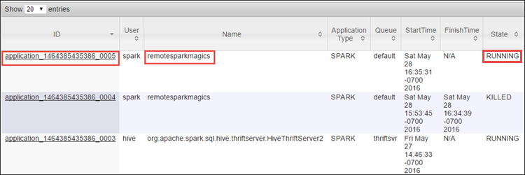
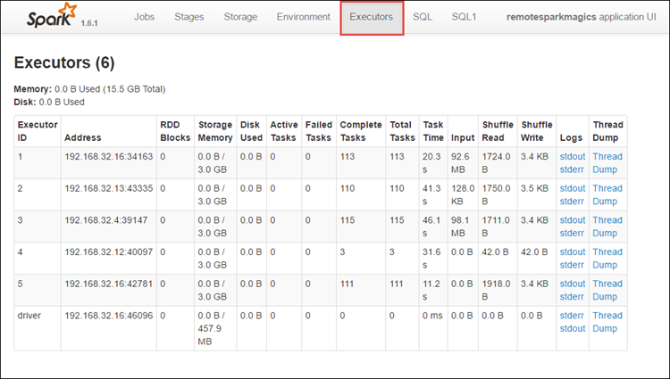
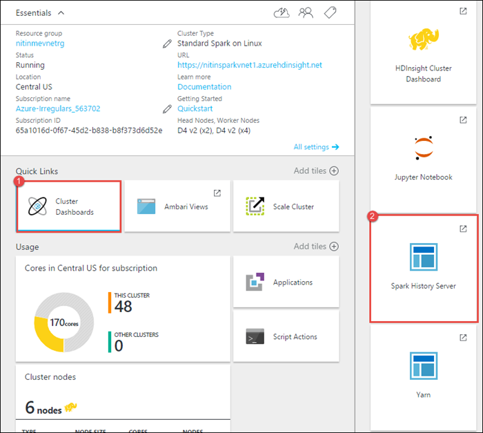

<properties 
    pageTitle="Suivre et débogage travaux s’exécutant sur Apache explosion cluster dans HDInsight | Microsoft Azure" 
    description="Utiliser des fils de l’interface utilisateur, l’interface utilisateur d’explosion et historique explosion server pour suivre et déboguer travaux s’exécutant sur un cluster explosion dans Azure HDInsight" 
    services="hdinsight" 
    documentationCenter="" 
    authors="nitinme" 
    manager="jhubbard" 
    editor="cgronlun"
    tags="azure-portal"/>

<tags 
    ms.service="hdinsight" 
    ms.workload="big-data" 
    ms.tgt_pltfrm="na" 
    ms.devlang="na" 
    ms.topic="article" 
    ms.date="08/25/2016" 
    ms.author="nitinme"/>

# Suivre et débogage des travaux s’exécutant sur cluster Apache explosion dans HDInsight Linux

Dans cet article, vous allez apprendre à effectuer le suivi et déboguer travaux explosion à l’aide de l’interface utilisateur fils explosion l’interface utilisateur et le serveur de l’historique d’explosion. Pour cet article, nous allons commencer un travail explosion à l’aide d’un bloc-notes disponible avec le cluster explosion, **Machine d’apprentissage : analyse prédictive sur les données d’inspection allouées à l’aide de MLLib**. Vous pouvez utiliser la procédure ci-dessous pour effectuer le suivi d’une application que vous avez envoyé à l’aide de n’importe quel autre approche, par exemple, **Envoyer à explosion**.

##Conditions préalables

Vous devez disposer des éléments suivants :

- Un abonnement Azure. Voir [Azure obtenir la version d’évaluation gratuite](https://azure.microsoft.com/documentation/videos/get-azure-free-trial-for-testing-hadoop-in-hdinsight/).
- Un cluster explosion Apache sur HDInsight Linux. Pour plus d’informations, voir [groupes de créer Apache explosion dans Azure HDInsight](hdinsight-apache-spark-jupyter-spark-sql.md).
- Démarrez le bloc-notes, en cours d’exécution **[Machine d’apprentissage : analyse prédictive sur les données d’inspection allouées à l’aide de MLLib](hdinsight-apache-spark-machine-learning-mllib-ipython.md)**. Pour obtenir des instructions sur l’exécution de ce bloc-notes, suivez le lien.  

## Effectuer le suivi d’une application dans l’interface utilisateur fils

1. Lancez l’interface utilisateur de fils. À partir de la carte cluster, cliquez sur **Tableau de bord Cluster**, puis cliquez sur **fils**.

    

    >[AZURE.TIP] Par ailleurs, vous pouvez également lancer l’interface utilisateur de fils à partir de la Ambari UI. Pour lancer la Ambari UI, à partir de la carte cluster, cliquez sur **Tableau de bord Cluster**, puis cliquez sur **Tableau de bord Cluster HDInsight**. À partir de la Ambari UI, cliquez sur **fils**et cliquez sur **Liens rapides**, cliquez sur le Gestionnaire de ressources active, puis cliquez sur **L’interface utilisateur ResourceManager**.  

3. Étant donné que vous avez commencé le travail d’explosion à l’aide de blocs-notes Jupyter, l’application a le nom **remotesparkmagics** (c’est le nom de toutes les applications qui sont démarrées à partir de blocs-notes). Cliquez sur l’ID de l’application sur le nom de l’application pour obtenir plus d’informations sur la tâche. Ceci ouvre l’affichage de l’application.

    

    Pour ces applications sont exécutées depuis les blocs-notes Jupyter, l’état est toujours **en cours d’exécution** jusqu'à ce que vous quittez le bloc-notes.

4. À partir de l’affichage de l’application, vous pouvez explorer les niveaux inférieurs à la suite les conteneurs associé à l’application et les journaux (stdout/stderr) pour en savoir. Vous pouvez également lancer l’interface utilisateur explosion en cliquant sur la liaison correspondant à l' **URL de suivi**, comme illustré ci-dessous. 

    

## Effectuer le suivi d’une application dans l’interface utilisateur explosion

Dans l’interface utilisateur explosion, vous pouvez explorer les tâches explosion qui sont générés par l’application que vous avez commencé plus tôt.

1. Pour lancer l’interface utilisateur explosion, à partir de l’affichage de l’application, cliquez sur le lien par rapport à l' **URL de suivi**, comme le montre la capture d’écran ci-dessus. Vous pouvez voir toutes les tâches exécutées par l’application en cours d’exécution dans le bloc-notes Jupyter explosion.

    

2. Cliquez sur l’onglet **exécuteurs** pour afficher des informations de traitement et de stockage pour chaque exécuteur. Vous pouvez également récupérer la pile d’appel en cliquant sur le lien **Thread vider** .

    
 
3. Cliquez sur l’onglet **étapes** pour voir les étapes associés avec l’application.

    

    Chaque étape peut avoir plusieurs tâches pour lesquels vous pouvez afficher les statistiques d’exécution, comme illustré ci-dessous.

     

4. Dans la page de détails de la scène, vous pouvez lancer DAG visualisation. Développer le lien de **Visualisation DAG** en haut de la page, comme illustré ci-dessous.

    

    DAG ou Direct Aclyic Graph représente les différentes étapes de l’application. Chaque zone bleu dans le graphique représente une opération d’explosion appelée à partir de l’application.

5. Dans la page de détails de la scène, vous pouvez également lancer l’affichage chronologique application. Développer le lien **Chronologie événement** en haut de la page, comme illustré ci-dessous.

    

    Cela permet d’afficher les événements d’explosion sous la forme d’une barre de planning. L’affichage chronologique est disponible à trois niveaux, dans tâches, une tâche et dans une étape. L’image ci-dessus capture l’affichage chronologique pour une étape donnée.

    >[AZURE.TIP] Si vous activez la case à cocher **Activer le zoom avant** , vous pouvez faire défiler à gauche et droite dans l’affichage de la chronologie.

6. Autres onglets dans l’interface utilisateur explosion fournissent des informations utiles sur l’instance explosion également.

    * Onglet stockage - si votre application crée un RDDs, vous trouverez d’informations sur celles de l’onglet stockage.
    * Onglet environnement - cet onglet fournit un grand nombre d’informations utiles sur votre instance explosion telles que la 
        * Version Scala
        * Répertoire de journal des événements associé au cluster
        * Nombre de cœurs exécuteur pour l’application
        * Etc..

## Trouver des informations sur les tâches terminées en utilisant le serveur de l’historique d’explosion

Une fois qu’une tâche est terminée, les informations relatives à la tâche sont conservées dans le serveur de l’historique d’explosion.

1. Pour lancer le serveur de l’historique à explosion, à partir de la carte cluster, cliquez sur **Tableau de bord Cluster**, puis cliquez sur **Explosion historique Server**.

    

    >[AZURE.TIP] Par ailleurs, vous pouvez également lancer l’interface utilisateur d’explosion historique Server à partir de la Ambari UI. Pour lancer la Ambari UI, à partir de la carte cluster, cliquez sur **Tableau de bord Cluster**, puis cliquez sur **Tableau de bord Cluster HDInsight**. À partir de la Ambari UI, cliquez sur **explosion**, cliquez sur **Liens rapides**, puis cliquez sur **L’interface utilisateur du serveur explosion historique**.

2. Vous verrez toutes les applications terminées répertoriées. Cliquez sur un ID de l’application à Explorer les niveaux inférieurs dans une application pour plus d’informations.

    
    

## Voir aussi

* [Vue d’ensemble : Apache explosion sur Azure HDInsight](hdinsight-apache-spark-overview.md)

### Scénarios

* [Explosion avec BI : effectuer une analyse de données interactives à l’aide d’explosion dans HDInsight avec les outils de décisionnel](hdinsight-apache-spark-use-bi-tools.md)

* [Explosion avec apprentissage automatique : utilisation explosion dans HDInsight pour analyser la température de construction à l’aide de données HVAC](hdinsight-apache-spark-ipython-notebook-machine-learning.md)

* [Explosion avec apprentissage automatique : utilisation explosion dans HDInsight pour prévoir des résultats de l’inspection alimentaires](hdinsight-apache-spark-machine-learning-mllib-ipython.md)

* [Diffusion en continu explosion : Utilisation explosion dans HDInsight pour la création d’applications en continu en temps réel](hdinsight-apache-spark-eventhub-streaming.md)

* [Analyse de journal de site Web à l’aide d’explosion dans HDInsight](hdinsight-apache-spark-custom-library-website-log-analysis.md)

### Créer et exécuter des applications

* [Créer une application autonome à l’aide de Scala](hdinsight-apache-spark-create-standalone-application.md)

* [Exécution de tâches à distance sur un cluster explosion à l’aide de Livy](hdinsight-apache-spark-livy-rest-interface.md)

### Outils et extensions

* [Plug-in des outils HDInsight IntelliJ idée permet de créer et soumettre des applications Scala d’explosion](hdinsight-apache-spark-intellij-tool-plugin.md)

* [Plug-in utilisation HDInsight outils idée IntelliJ déboguer applications explosion à distance](hdinsight-apache-spark-intellij-tool-plugin-debug-jobs-remotely.md)

* [Utiliser les blocs-notes Zeppelin avec un cluster explosion sur HDInsight](hdinsight-apache-spark-use-zeppelin-notebook.md)

* [Noyaux disponibles pour Jupyter bloc-notes cluster explosion pour HDInsight](hdinsight-apache-spark-jupyter-notebook-kernels.md)

* [Utiliser les packages externes avec Jupyter blocs-notes](hdinsight-apache-spark-jupyter-notebook-use-external-packages.md)

* [Installer Jupyter sur votre ordinateur et vous connecter à un cluster HDInsight Spark](hdinsight-apache-spark-jupyter-notebook-install-locally.md)

### Gérer les ressources

* [Gestion des ressources pour le cluster Apache explosion dans Azure HDInsight](hdinsight-apache-spark-resource-manager.md)
