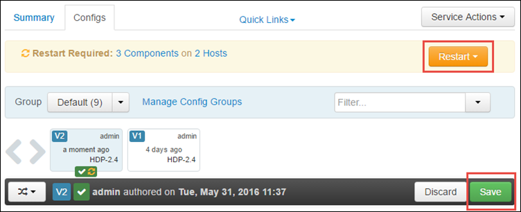

<properties 
    pageTitle="Utiliser le Gestionnaire de ressources pour affecter des ressources pour le cluster Apache explosion dans HDInsight | Microsoft Azure" 
    description="Découvrez comment utiliser le Gestionnaire de ressources pour les clusters explosion sur HDInsight pour améliorer les performances." 
    services="hdinsight" 
    documentationCenter="" 
    authors="nitinme" 
    manager="jhubbard" 
    editor="cgronlun"
    tags="azure-portal"/>

<tags 
    ms.service="hdinsight" 
    ms.workload="big-data" 
    ms.tgt_pltfrm="na" 
    ms.devlang="na" 
    ms.topic="article" 
    ms.date="08/25/2016" 
    ms.author="nitinme"/>

# Gérer des ressources pour le cluster explosion Apache sur HDInsight Linux

Dans cet article, vous allez apprendre à accéder aux interfaces comme Ambari UI, l’interface utilisateur fils, et le serveur de l’historique d’explosion associé à votre cluster explosion. Vous allez également découvrir comment régler la configuration du cluster pour des performances optimales.

**Conditions requises :**

Vous devez disposer des éléments suivants :

- Un abonnement Azure. Voir [Azure obtenir la version d’évaluation gratuite](https://azure.microsoft.com/documentation/videos/get-azure-free-trial-for-testing-hadoop-in-hdinsight/).
- Un cluster explosion Apache sur HDInsight Linux. Pour plus d’informations, voir [groupes de créer Apache explosion dans Azure HDInsight](hdinsight-apache-spark-jupyter-spark-sql.md).

## Comment lancer l’interface utilisateur Web Ambari ?

1. À partir du [Portail Azure](https://portal.azure.com/), à partir de la startboard, cliquez sur la vignette pour votre cluster explosion (si vous l’épinglées à la startboard). Vous pouvez également accéder à votre cluster sous **Rechercher tout** > **Clusters HDInsight**. 
 
2. À partir de la carte de cluster explosion, cliquez sur **tableau de bord**. Lorsque vous y êtes invité, entrez les informations d’identification d’administration pour le cluster explosion.

    ![Barre de lancement Ambari] (./media/hdinsight-apache-spark-resource-manager/hdispark.cluster.launch.dashboard.png "Démarrer le Gestionnaire de ressources")

3. Cela doit lancer l’interface utilisateur de Web Ambari, comme illustré ci-dessous.

    ![Interface utilisateur Ambari Web] (./media/hdinsight-apache-spark-resource-manager/ambari-web-ui.png "Interface utilisateur Ambari Web")   

## Comment lancer le serveur de l’historique d’explosion ?

1. À partir du [Portail Azure](https://portal.azure.com/), à partir de la startboard, cliquez sur la vignette pour votre cluster explosion (si vous l’épinglées à la startboard).

2. À partir de la carte cluster, sous **Liens rapides**, cliquez sur **Tableau de bord Cluster**. Dans la carte **Du tableau de bord Cluster** , cliquez sur **Le serveur explosion historique**.

    ![Serveur de l’historique d’explosion] (./media/hdinsight-apache-spark-resource-manager/launch-history-server.png "Serveur de l’historique d’explosion")

    Lorsque vous y êtes invité, entrez les informations d’identification d’administration pour le cluster explosion.

## Comment lancer l’interface utilisateur fils ?

Vous pouvez utiliser l’interface utilisateur de fils pour surveiller les applications en cours d’exécution sur le cluster explosion. 

1. À partir de la carte cluster, cliquez sur **Tableau de bord Cluster**, puis cliquez sur **fils**.

    

    >[AZURE.TIP] Par ailleurs, vous pouvez également lancer l’interface utilisateur de fils à partir de la Ambari UI. Pour lancer la Ambari UI, à partir de la carte cluster, cliquez sur **Tableau de bord Cluster**, puis cliquez sur **Tableau de bord Cluster HDInsight**. À partir de la Ambari UI, cliquez sur **fils**et cliquez sur **Liens rapides**, cliquez sur le Gestionnaire de ressources active, puis cliquez sur **L’interface utilisateur ResourceManager**.

## Quelle est la configuration de cluster optimales pour exécuter explosion des applications ?

Les trois paramètres clés qui peuvent être utilisés pour une configuration explosion en fonction des besoins de l’application sont `spark.executor.instances`, `spark.executor.cores`, et `spark.executor.memory`. Un exécuteur est un processus lancé pour une application explosion. Il s’exécute sur le nœud de travail et est chargée d’effectuer les tâches de l’application. Le nombre par défaut d’exécuteurs et les tailles exécuteur pour chaque cluster est calculé en fonction du nombre de nœuds de travail et la taille du nœud concerné. Ils sont stockés dans `spark-defaults.conf` sur les nœuds de tête cluster. 

Les paramètres de trois configuration peuvent être configurés au niveau du cluster (pour toutes les applications qui s’exécutent sur le cluster) ou peuvent être spécifiés pour chaque application également.

### Modifier les paramètres à l’aide de Ambari UI

1. À partir de la Ambari UI cliquez sur **explosion**et cliquez sur **configurations**, puis développez **personnalisé explosion définis par défaut**.

    

2. Les valeurs par défaut sont recommandés d’avoir explosion 4 applications s’exécutent simultanément sur le cluster. Vous pouvez modifications ces valeurs à partir de l’interface utilisateur, comme illustré ci-dessous.

    

3. Cliquez sur **Enregistrer** pour enregistrer les modifications de configuration. En haut de la page, vous devrez redémarrez tous les services affectés. Cliquez sur **redémarrer**.

    

### Modifiez les paramètres d’une application en cours d’exécution dans Jupyter bloc-notes

Pour les applications en cours d’exécution dans le bloc-notes Jupyter, vous pouvez utiliser la `%%configure` magie d’apporter les modifications de configuration. Dans l’idéal, vous devez effectuer ces changements au début de l’application, avant d’exécuter votre première cellule de code. Ainsi que la configuration est appliquée à la session Livy, lorsque celui-ci est créé. Si vous souhaitez modifier la configuration ultérieurement dans l’application, vous devez utiliser le `-f` paramètre. Toutefois, en procédant ainsi, tous les cours de l’application ne seront pas conservées.

L’extrait de code ci-dessous montre comment modifier la configuration d’une application en cours d’exécution dans Jupyter.

    %%configure 
    {"executorMemory": "3072M", "executorCores": 4, “numExecutors”:10}

Paramètres de configuration doivent être passés dans sous forme de chaîne JSON et doivent être sur la ligne suivante après la magie, comme illustré dans l’exemple, la colonne. 

### Modifier les paramètres pour une application envoyé à l’aide explosion-submit

Commande suivante est un exemple de la façon de modifier les paramètres de configuration d’une application lot qui est envoyé à l’aide `spark-submit`.

    spark-submit --class <the application class to execute> --executor-memory 3072M --executor-cores 4 –-num-executors 10 <location of application jar file> <application parameters>

### Modifiez les paramètres d’une application envoyé à l’aide de cURL

Commande suivante est un exemple de la façon de modifier les paramètres de configuration pour une application de traitement par lots qui est soumis à l’aide à l’aide d’ourlée.

    curl -k -v -H 'Content-Type: application/json' -X POST -d '{"file":"<location of application jar file>", "className":"<the application class to execute>", "args":[<application parameters>], "numExecutors":10, "executorMemory":"2G", "executorCores":5' localhost:8998/batches

### Comment modifier ces paramètres sur un serveur Thrift explosion ?

Explosion Thrift Server fournit un accès à un cluster explosion JDBC/ODBC et est utilisé pour les requêtes SQL explosion du service. Outils tels que Power BI, etc. de Tableau. protocole ODBC permet de communiquer avec explosion Thrift serveur pour exécuter des requêtes SQL explosion comme une Application explosion. Lorsqu’un cluster explosion est créé, deux instances du serveur Thrift explosion sont démarrés, une sur chaque nœud de tête. Chaque serveur Thrift explosion apparaît sous la forme d’une application explosion dans l’interface utilisateur fils. 

Explosion Thrift Server utilise l’allocation d’exécuteur dynamique explosion et donc le `spark.executor.instances` n’est pas utilisé. En revanche, explosion Thrift Server utilise `spark.dynamicAllocation.minExecutors` et `spark.dynamicAllocation.maxExecutors` pour spécifier le nombre d’exécuteur. Les paramètres de configuration `spark.executor.cores` et `spark.executor.memory` est utilisé pour modifier la taille exécuteur. Vous pouvez modifier ces paramètres comme illustré ci-dessous.

* Développez la catégorie **Avancé explosion-thrift-sparkconf** pour mettre à jour les paramètres `spark.dynamicAllocation.minExecutors`, `spark.dynamicAllocation.maxExecutors`, et `spark.executor.memory`.

     

* Développez la catégorie **personnalisée explosion-thrift-sparkconf** pour mettre à jour le paramètre `spark.executor.cores`.

    

### Comment modifier la mémoire pilote du serveur Thrift explosion ?

Mémoire du pilote explosion Thrift serveur est configuré à 25 % de la taille de RAM nœud de tête, fourni que la taille totale de RAM du nœud principal est supérieure à 14 Go. Vous pouvez utiliser la Ambari UI pour modifier la configuration de mémoire pilote, comme illustré ci-dessous.

* À partir de la Ambari UI cliquez sur **explosion**et cliquez sur **configurations**, développez **avancée explosion environnement**, puis indiquez la valeur pour **spark_thrift_cmd_opts**.

    

## Je n’utilise pas BI avec cluster explosion. Comment reprendre les ressources ?

Étant donné que nous utilisons allocation dynamique explosion, seules les ressources sont utilisées par le serveur thrift sont les ressources pour les masques de deux applications. Pour récupérer ces ressources, vous devez arrêter les services Server Thrift s’exécutant sur le cluster.

1. À partir de la Ambari UI, dans le volet gauche, cliquez sur **explosion**.

2. Dans la page suivante, cliquez sur **Explosion Thrift Servers**.

    

3. Vous devriez voir les deux headnodes sur lequel s’exécute le serveur Thrift explosion. Cliquez sur un de l’headnodes.

    

4. La page suivante répertorie tous les services en cours d’exécution sur ce headnode. Dans la liste cliquez sur le bouton de menu déroulant en regard d’explosion Thrift serveur, puis cliquez sur **Arrêter**.

    

5. Répétez ces étapes pour l’autres headnode.

## Mes blocs-notes Jupyter ne fonctionnent pas comme prévu. Comment puis-je redémarrer le service ?

1. Lancez l’interface utilisateur Web Ambari comme indiqué ci-dessus. Dans le volet de navigation gauche, cliquez sur **Jupyter**, cliquez sur **Actions du Service**, puis cliquez sur **Redémarrer tous les**. Démarre le service Jupyter sur tous les headnodes.

    ![Redémarrez Jupyter] (./media/hdinsight-apache-spark-resource-manager/restart-jupyter.png "Redémarrez Jupyter")

    

## Voir aussi

* [Vue d’ensemble : Apache explosion sur Azure HDInsight](hdinsight-apache-spark-overview.md)

### Scénarios

* [Explosion avec BI : effectuer une analyse de données interactives à l’aide d’explosion dans HDInsight avec les outils de décisionnel](hdinsight-apache-spark-use-bi-tools.md)

* [Explosion avec apprentissage automatique : utilisation explosion dans HDInsight pour analyser la température de construction à l’aide de données HVAC](hdinsight-apache-spark-ipython-notebook-machine-learning.md)

* [Explosion avec apprentissage automatique : utilisation explosion dans HDInsight pour prévoir des résultats de l’inspection alimentaires](hdinsight-apache-spark-machine-learning-mllib-ipython.md)

* [Diffusion en continu explosion : Utilisation explosion dans HDInsight pour la création d’applications en continu en temps réel](hdinsight-apache-spark-eventhub-streaming.md)

* [Analyse de journal de site Web à l’aide d’explosion dans HDInsight](hdinsight-apache-spark-custom-library-website-log-analysis.md)

### Créer et exécuter des applications

* [Créer une application autonome à l’aide de Scala](hdinsight-apache-spark-create-standalone-application.md)

* [Exécution de tâches à distance sur un cluster explosion à l’aide de Livy](hdinsight-apache-spark-livy-rest-interface.md)

### Outils et extensions

* [Plug-in des outils HDInsight IntelliJ idée permet de créer et soumettre des applications Scala d’explosion](hdinsight-apache-spark-intellij-tool-plugin.md)

* [Plug-in utilisation HDInsight outils idée IntelliJ déboguer applications explosion à distance](hdinsight-apache-spark-intellij-tool-plugin-debug-jobs-remotely.md)

* [Utiliser les blocs-notes Zeppelin avec un cluster explosion sur HDInsight](hdinsight-apache-spark-use-zeppelin-notebook.md)

* [Noyaux disponibles pour Jupyter bloc-notes cluster explosion pour HDInsight](hdinsight-apache-spark-jupyter-notebook-kernels.md)

* [Utiliser les packages externes avec Jupyter blocs-notes](hdinsight-apache-spark-jupyter-notebook-use-external-packages.md)

* [Installer Jupyter sur votre ordinateur et vous connecter à un cluster HDInsight Spark](hdinsight-apache-spark-jupyter-notebook-install-locally.md)

### Gérer les ressources

* [Suivre et débogage travaux s’exécutant sur un cluster Apache explosion dans HDInsight](hdinsight-apache-spark-job-debugging.md)

[hdinsight-versions]: hdinsight-component-versioning.md
[hdinsight-upload-data]: hdinsight-upload-data.md
[hdinsight-storage]: hdinsight-hadoop-use-blob-storage.md

[azure-purchase-options]: http://azure.microsoft.com/pricing/purchase-options/
[azure-member-offers]: http://azure.microsoft.com/pricing/member-offers/
[azure-free-trial]: http://azure.microsoft.com/pricing/free-trial/
[azure-management-portal]: https://manage.windowsazure.com/
[azure-create-storageaccount]: storage-create-storage-account.md 
