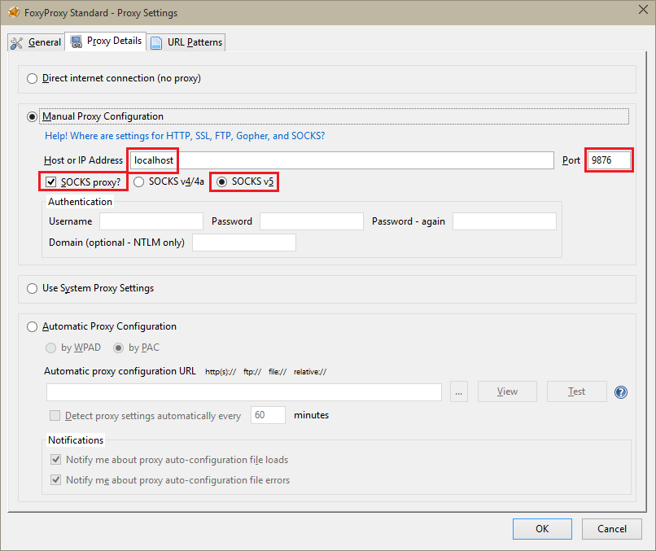

<properties 
    pageTitle="Installer des blocs-notes Zeppelin pour cluster explosion Apache sur HDInsight Linux | Microsoft Azure" 
    description="Obtenir des instructions détaillées sur comment installer et utiliser les blocs-notes Zeppelin avec clusters explosion sur HDInsight Linux." 
    services="hdinsight" 
    documentationCenter="" 
    authors="nitinme" 
    manager="jhubbard" 
    editor="cgronlun"/>

<tags 
    ms.service="hdinsight" 
    ms.workload="big-data" 
    ms.tgt_pltfrm="na" 
    ms.devlang="na" 
    ms.topic="article" 
    ms.date="10/28/2016" 
    ms.author="nitinme"/>

# Installer des blocs-notes Zeppelin pour cluster explosion Apache sur HDInsight Linux

Découvrez comment installer blocs-notes Zeppelin sur clusters explosion Apache et comment utiliser les blocs-notes Zeppelin à exécuter explosion des tâches.

> [AZURE.IMPORTANT] Blocs-notes Zeppelin sont désormais disponibles par défaut avec clusters explosion. Vous n’avez pas besoin d’explicitement les installer sur un cluster explosion plus. Pour plus d’informations, voir [utiliser Zeppelin blocs-notes avec Apache explosion cluster sur HDInsight Linux](hdinsight-apache-spark-zeppelin-notebook.md). 

**Conditions requises :**

* Avant de commencer ce didacticiel, vous devez posséder un abonnement Azure. Voir [Azure obtenir la version d’évaluation gratuite](https://azure.microsoft.com/documentation/videos/get-azure-free-trial-for-testing-hadoop-in-hdinsight/).
* Un cluster explosion Apache. Pour plus d’informations, voir [groupes de créer Apache explosion dans Azure HDInsight](hdinsight-apache-spark-jupyter-spark-sql.md).
* Un clientSSH. Pour la distribution Linux et Unix ou Macintosh OS X, la `ssh` commande est fournie avec le système d’exploitation. Pour Windows, nous vous recommandons de [PuTTY](http://www.chiark.greenend.org.uk/~sgtatham/putty/download.html)

    > [AZURE.NOTE] Si vous souhaitez utiliser un clientSSH autre que `ssh` ou PuTTY, consultez la documentation de votre client comment établir un tunnel SSH.

* Un navigateur web qui peut être configuré pour utiliser un proxy SOCKS

* __(facultatif)__: un plug-in comme [FoxyProxy](http://getfoxyproxy.org/,) que vous pouvez appliquer des règles qui achemine uniquement des demandes spécifiques à travers le tunnel.

    > [AZURE.WARNING] Sans un plug-in comme FoxyProxy, toutes les demandes effectuées via le navigateur peuvent être routés via le tunnel. Cela peut entraîner plus lent chargement des pages web dans votre navigateur.

## Installer Zeppelin sur un cluster d’explosion

Vous pouvez installer Zeppelin sur un cluster explosion utilisant l’action de script. Action de script utilise des scripts personnalisés pour installer des composants sur le cluster qui ne sont pas disponibles par défaut. Vous pouvez utiliser le script personnalisé pour installer Zeppelin à partir du portail Azure, à l’aide HDInsight .NET SDK ou à l’aide de PowerShell Azure. Vous pouvez utiliser le script pour installer Zeppelin soit dans le cadre de la création d’un cluster ou une fois que le cluster est en cours d’exécution. Liens dans les sections suivantes fournissent les instructions sur la procédure à suivre. 

### À l’aide du portail Azure

Pour obtenir des instructions sur la façon d’utiliser le portail Azure pour exécuter l’action de script installer Zeppelin, voir [clusters HDInsight personnaliser à l’aide de Script Action](hdinsight-hadoop-customize-cluster-linux.md#use-a-script-action-from-the-azure-portal). Vous devez apporter quelques modifications aux instructions de cet article.

* Vous devez utiliser le script pour installer Zeppelin. Le script personnalisé installer Zeppelin sur un cluster explosion sur HDInsight n’est disponible sur les liens suivants :
    * Pour les clusters explosion 1.6.0-`https://hdiconfigactions.blob.core.windows.net/linuxincubatorzeppelinv01/install-zeppelin-spark160-v01.sh`
    * Pour les clusters explosion 1.5.2-`https://hdiconfigactions.blob.core.windows.net/linuxincubatorzeppelinv01/install-zeppelin-spark151-v01.sh`

* Vous devez exécuter l’action script uniquement sur la headnode.

* Le script n’a pas besoin de tous les paramètres. 

### À l’aide du Kit de développement .NET HDInsight

Pour obtenir des instructions sur l’utilisation du Kit de développement .NET HDInsight pour exécuter l’action de script installer Zeppelin, voir [clusters HDInsight personnaliser à l’aide de Script Action](hdinsight-hadoop-customize-cluster-linux.md#use-a-script-action-from-the-hdinsight-net-sdk). Vous devez apporter quelques modifications aux instructions de cet article.

* Vous devez utiliser le script pour installer Zeppelin. Le script personnalisé installer Zeppelin sur un cluster explosion sur HDInsight n’est disponible sur les liens suivants :
    * Pour les clusters explosion 1.6.0-`https://hdiconfigactions.blob.core.windows.net/linuxincubatorzeppelinv01/install-zeppelin-spark160-v01.sh`
    * Pour les clusters explosion 1.5.2-`https://hdiconfigactions.blob.core.windows.net/linuxincubatorzeppelinv01/install-zeppelin-spark151-v01.sh`

* Le script n’a pas besoin de tous les paramètres. 

* Définir le type de cluster que vous créez à explosion.

### À l’aide de PowerShell Azure

Utiliser l’extrait de PowerShell suivante pour créer un cluster explosion sur HDInsight Linux avec Zeppelin installé. Selon la version de cluster explosion avoir, vous devez mettre à jour l’extrait de PowerShell ci-dessous pour inclure le lien vers le script personnalisé correspondant. 

* Pour les clusters explosion 1.6.0-`https://hdiconfigactions.blob.core.windows.net/linuxincubatorzeppelinv01/install-zeppelin-spark160-v01.sh`
* Pour les clusters explosion 1.5.2-`https://hdiconfigactions.blob.core.windows.net/linuxincubatorzeppelinv01/install-zeppelin-spark151-v01.sh`

[AZURE.INCLUDE [upgrade-powershell](../../includes/hdinsight-use-latest-powershell.md)]

    Login-AzureRMAccount
    
    # PROVIDE VALUES FOR THE VARIABLES
    $clusterAdminUsername="admin"
    $clusterAdminPassword="<<password>>"
    $clusterSshUsername="adminssh"
    $clusterSshPassword="<<password>>"
    $clusterName="<<clustername>>"
    $clusterContainerName=$clusterName
    $resourceGroupName="<<resourceGroupName>>"
    $location="<<region>>"
    $storage1Name="<<storagename>>"
    $storage1Key="<<storagekey>>"
    $subscriptionId="<<subscriptionId>>"
    
    Select-AzureRmSubscription -SubscriptionId $subscriptionId
    
    $passwordAsSecureString=ConvertTo-SecureString $clusterAdminPassword -AsPlainText -Force
    $clusterCredential=New-Object System.Management.Automation.PSCredential ($clusterAdminUsername, $passwordAsSecureString)
    $passwordAsSecureString=ConvertTo-SecureString $clusterSshPassword -AsPlainText -Force
    $clusterSshCredential=New-Object System.Management.Automation.PSCredential ($clusterSshUsername, $passwordAsSecureString)
    
    $azureHDInsightConfigs= New-AzureRmHDInsightClusterConfig -ClusterType Spark
    $azureHDInsightConfigs.DefaultStorageAccountKey = $storage1Key
    $azureHDInsightConfigs.DefaultStorageAccountName = "$storage1Name.blob.core.windows.net"
    
    Add-AzureRMHDInsightScriptAction -Config $azureHDInsightConfigs -Name "Install Zeppelin" -NodeType HeadNode -Parameters "void" -Uri "https://hdiconfigactions.blob.core.windows.net/linuxincubatorzeppelinv01/install-zeppelin-spark151-v01.sh"
    
    New-AzureRMHDInsightCluster -Config $azureHDInsightConfigs -OSType Linux -HeadNodeSize "Standard_D12" -WorkerNodeSize "Standard_D12" -ClusterSizeInNodes 2 -Location $location -ResourceGroupName $resourceGroupName -ClusterName $clusterName -HttpCredential $clusterCredential -DefaultStorageContainer $clusterContainerName -SshCredential $clusterSshCredential -Version "3.3"
 
## Configurer la SSH tunnel pour accéder à un bloc-notes Zeppelin

Vous allez utiliser SSH tunnel pour accéder aux blocs-notes Zeppelin s’exécutant sur cluster explosion sur HDInsight Linux. Les étapes ci-dessous montrent comment créer un tunnel SSH à l’aide de ssh ligne de commande (Linux) et PuTTY (Windows).

### Créer un tunnel à l’aide de la commande SSH (Linux)

Utiliser la commande suivante pour créer un SSH tunnel à l’aide de la `ssh` commande. Remplacez le __nom d’utilisateur__ avec un utilisateur SSH pour votre cluster HDInsight et __NOMDUCLUSTER__ par le nom de votre cluster HDInsight

    ssh -C2qTnNf -D 9876 USERNAME@CLUSTERNAME-ssh.azurehdinsight.net

Cela crée une connexion qui achemine le trafic au port local 9876 pour le cluster sur SSH. Les options sont :

* **D 9876** - le port local qui achemine le trafic via le tunnel.

* **C** - compresser toutes les données, le trafic web étant principalement du texte.

* **2** - forcer SSH à essayer la version 2 du protocole.

* **q** : mode silencieux.

* **T** - allocation de pseudo tty désactiver, étant donné que nous sommes simplement transfert d’un port.

* **n** - empêcher la lecture de STDIN, étant donné que nous sommes simplement transfert d’un port.

* **N** - ne s’exécutent pas une commande à distance, étant donné que nous sommes simplement transfert d’un port.

* **f** - exécuter en arrière-plan.

Si vous avez configuré le cluster avec un code SSH, vous devrez utiliser la `-i` paramètre et spécifiez le chemin d’accès à la clé privée SSH.

Une fois la commande terminée, le trafic envoyé à port 9876 sur l’ordinateur local doivent être routées sur couche SSL (Secure Sockets) pour le cluster nœud de tête et semblent provenir il.

### Créer un tunnel à l’aide de PuTTY (Windows)

Procédez comme suit pour créer un tunnel SSH à l’aide de PuTTY.

1. Ouvrez PuTTY et entrez vos informations de connexion. Si vous n’êtes pas familiarisé avec PuTTY, voir [Utiliser SSH avec basé sur Linux Hadoop sur HDInsight à partir de Windows](hdinsight-hadoop-linux-use-ssh-windows.md) pour plus d’informations sur l’utilisation avec HDInsight.

2. Dans la section **catégorie** à gauche de la boîte de dialogue, développez **connexion**, développez **SSH**et puis sélectionnez **tunnel**.

3. Dans l’écran **Options de contrôle de transfert de port SSH** , fournissent les informations suivantes :

    * **Port source** : le port sur le client que vous souhaitez transférer. Par exemple, **9876**.

    * Adresse de **destination** - le SSH pour le cluster HDInsight basé sur Linux. Par exemple, **mon_cluster ssh.azurehdinsight.net**.

    * **Dynamique** - routage du proxy SOCKS dynamique vous permettent de conserver.

    

4. Cliquez sur **Ajouter** pour ajouter les paramètres, puis cliquez sur **Ouvrir** pour ouvrir une connexion SSH.

5. Lorsque vous y êtes invité, connectez-vous au serveur. Vous établissez une session SSH et activer le tunnel.

### Utiliser le tunnel à partir de votre navigateur

> [AZURE.NOTE] Les étapes décrites dans cette section utilisent le navigateur FireFox, comme c’est librement disponible pour les systèmes Linux, Unix, Macintosh OS X et Windows. D’autres navigateurs modernes tels que Google Chrome, Microsoft Edge ou Apple Safari devraient fonctionner aussi bien ; Toutefois, le plug-in FoxyProxy utilisé dans certaines étapes peut ne pas être disponible pour tous les navigateurs.

1. Configurer le navigateur pour utiliser **localhost:9876** comme un proxy **SOCKS v5** . Voici ce que les paramètres de Firefox se présentent. Si vous avez utilisé un port autre que 9876, modifiez le port à celui que vous avez utilisé :

    

    > [AZURE.NOTE] Sélection de **DNS distant** résoudra demandes de nom de domaine (DNS) à l’aide du cluster HDInsight. Si cela est désactivée, DNS seront résolu localement.

2. Vérifiez que le trafic est routé via le tunnel en vising un site tel [qu’http://www.whatismyip.com/](http://www.whatismyip.com/) avec les paramètres de proxy activé et désactivé dans Firefox. Tandis que les paramètres sont activés, l’adresse IP sera pour un ordinateur dans le centre de données Microsoft Azure.

### Extensions de navigateur

Bien que configurer le navigateur pour utiliser le tunnel fonctionne, vous ne généralement que vous voulez router tout le trafic via le tunnel. Extensions de navigateur, telles que [FoxyProxy](http://getfoxyproxy.org/) prend en charge les modèles de comparaison pour des demandes d’URL (FoxyProxy Standard ou Plus uniquement), afin que seules les demandes d’URL spécifiques seront envoyées par le tunnel.

Si vous avez installé FoxyProxy Standard, procédez comme suit pour configurer pour qu’il transmet uniquement le trafic de HDInsight via le tunnel.

1. Ouvrez l’extension FoxyProxy dans votre navigateur. Par exemple, dans Firefox, sélectionnez l’icône FoxyProxy en regard du champ adresse.

    

2. Sélectionnez **Ajouter un nouveau Proxy**, sélectionnez l’onglet **Général** , puis entrez un nom de proxy de **HDInsightProxy**.

    

3. Sélectionnez l’onglet **Détails Proxy** et remplir les champs suivants :

    * **Hôte ou l’adresse IP** - il s’agit d’hôte local, étant donné que nous utilisons un tunnel SSH sur l’ordinateur local.

    * **Port** - c’est le port que vous avez utilisé pour le tunnel SSH.

    * **Proxy SOCKS** - Sélectionnez cette option pour activer le navigateur à utiliser le tunnel en tant que proxy.

    * **SOCKS v5** - Sélectionnez cette option pour définir la version requise pour le serveur proxy.

    

4. Sélectionnez l’onglet **Modèles d’URL** , puis **Ajouter un nouveau modèle**. Utilisez ce qui suit pour définir le modèle, puis cliquez sur **OK**:

    * **Nom de motif** - **zeppelinnotebook** - il s’agit d’un nom convivial pour le modèle.

    * **Modèle d’URL** - **\*hn0** * - définit un modèle qui correspond au nom de domaine complet interne du point de terminaison où les blocs-notes Zeppelin sont hébergés. Étant donné que les blocs-notes Zeppelin sont disponibles uniquement sous la headnode0 du cluster, et le point de terminaison est généralement `http://hn0-<string>.internal.cloudapp.net`, l’utilisation du modèle * *hn0** garantir que la demande est redirigée vers le point de terminaison Zeppelin.

        

4. Cliquez sur **OK** pour ajouter le proxy et fermer **Les paramètres Proxy**.

5. En haut de la boîte de dialogue FoxyProxy, passez **En Mode sélectionnez** **proxys d’utiliser des modèles prédéfinis et des priorités**, puis cliquez sur **Fermer**.

    

Après avoir suivi ces étapes, seules les demandes d’URL contenant la chaîne __hn0__ doivent être routés via le tunnel SSL. 

## Accède au bloc-notes Zeppelin

Une fois que vous avez SSH tunnel le programme d’installation, vous pouvez utiliser les étapes suivantes pour accéder à bloc-notes Zeppelin sur le cluster explosion en suivant les étapes ci-dessous. Dans cette section, vous allez apprendre à exécuter % sql et des instructions de hive %.

1. À partir du navigateur web, ouvrez le point de terminaison suivant :

        http://hn0-myspar:9995

    * **hn0** indique headnode0
    * **myspar** est les six premières lettres du nom de cluster explosion.
    * **9995** est le port où Zeppelin bloc-notes est accessible.

2. Créer un bloc-notes. Dans le volet d’en-tête, cliquez sur **le bloc-notes**, puis cliquez sur **Créer une Note**.

    ![Créer un bloc-notes Zeppelin] (./media/hdinsight-apache-spark-use-zeppelin-notebook/hdispark.createnewnote.png "Créer un bloc-notes Zeppelin")

    Sur la même page, sous l’en-tête de **bloc-notes** , vous devez voir un bloc-notes avec le nom commençant par **XXXXXXXXX Note**. Cliquez sur le nouveau bloc-notes.

3. Dans la page web pour le nouveau bloc-notes, cliquez sur l’en-tête, puis modifiez le nom du bloc-notes si vous voulez. Appuyez sur ENTRÉE pour enregistrer le changement de nom. Assurez-vous également que l’en-tête de bloc-notes affiche l’état **connecté** dans le coin supérieur droit.

    ![État des blocs-notes Zeppelin] (./media/hdinsight-apache-spark-use-zeppelin-notebook/hdispark.newnote.connected.png "État des blocs-notes Zeppelin")

### Exécuter des instructions SQL

4. Charger les exemples de données dans une table temporaire. Lorsque vous créez un cluster explosion dans HDInsight, l’exemple de fichier de données, **hvac.csv**, est copié dans le compte de stockage associé sous **\HdiSamples\SensorSampleData\hvac**.

    Dans le paragraphe vide est créé par défaut dans le bloc-notes, collez l’extrait de code suivante.

        // Create an RDD using the default Spark context, sc
        val hvacText = sc.textFile("wasbs:///HdiSamples/HdiSamples/SensorSampleData/hvac/HVAC.csv")
        
        // Define a schema
        case class Hvac(date: String, time: String, targettemp: Integer, actualtemp: Integer, buildingID: String)
        
        // Map the values in the .csv file to the schema
        val hvac = hvacText.map(s => s.split(",")).filter(s => s(0) != "Date").map(
            s => Hvac(s(0), 
                    s(1),
                    s(2).toInt,
                    s(3).toInt,
                    s(6)
            )
        ).toDF()
        
        // Register as a temporary table called "hvac"
        hvac.registerTempTable("hvac")
        
    Appuyez sur **MAJ + ENTRÉE** ou cliquez sur le bouton **lecture** pour le paragraphe exécuter l’extrait de code. L’état dans le coin droit du paragraphe doit vont de prêt, en attente, en cours d’exécution sur terminé. Le résultat s’affiche en bas de la même paragraphe. La capture d’écran ressemble à ceci :

    ![Créer une table à partir des données brutes temporaire] (./media/hdinsight-apache-spark-use-zeppelin-notebook/hdispark.note.loaddDataintotable.png "Créer une table à partir des données brutes temporaire")

    Vous pouvez également fournir un titre à chaque paragraphe. Dans le coin droit, cliquez sur l’icône **paramètres** , puis cliquez sur **Afficher le titre**.

5. Vous pouvez maintenant exécuter des instructions SQL explosion sur la table **hvac** . Collez la requête suivante dans un nouveau paragraphe. La requête extrait l’identificateur de bâtiment et la différence entre la cible et les températures réels pour chaque bâtiment à une date donnée. Appuyez sur **MAJ + ENTRÉE**.

        %sql
        select buildingID, (targettemp - actualtemp) as temp_diff, date 
        from hvac
        where date = "6/1/13" 

    L’instruction **sql %** au début indique le bloc-notes à utiliser le relais explosion SQL. Vous pouvez examiner les interpréteurs définis sous l’onglet **relais** dans l’en-tête du bloc-notes.

    La capture d’écran suivante montre la sortie.

    ![Exécuter une instruction SQL à explosion en utilisant le bloc-notes] (./media/hdinsight-apache-spark-use-zeppelin-notebook/hdispark.note.sparksqlquery1.png "Exécuter une instruction SQL à explosion en utilisant le bloc-notes")

     Cliquez sur les options d’affichage (mis en surbrillance dans rectangle) pour basculer entre différentes représentations pour le même résultat. Cliquez sur **paramètres** pour choisir quels constitue la clé et les valeurs dans les résultats. La capture d’écran ci-dessus utilise **buildingID** comme clé et la moyenne de **temp_diff** comme valeur.

    
6. Vous pouvez également exécuter des instructions SQL explosion à l’aide de variables dans la requête. L’extrait de code suivant montre comment définir une variable, **Temp**, dans la requête avec les valeurs possibles que vous voulez interroger avec. Lorsque vous exécutez tout d’abord la requête, une liste déroulante est remplie automatiquement avec les valeurs spécifiées pour la variable.

        %sql
        select buildingID, date, targettemp, (targettemp - actualtemp) as temp_diff
        from hvac
        where targettemp > "${Temp = 65,65|75|85}" 

    Collez cet extrait de code dans un nouveau paragraphe, puis appuyez sur **MAJ + ENTRÉE**. La capture d’écran suivante montre la sortie.

    ![Exécuter une instruction SQL à explosion en utilisant le bloc-notes] (./media/hdinsight-apache-spark-use-zeppelin-notebook/hdispark.note.sparksqlquery2.png "Exécuter une instruction SQL à explosion en utilisant le bloc-notes")

    Pour les requêtes ultérieures, vous pouvez sélectionner une nouvelle valeur dans la liste déroulante et exécutez à nouveau la requête. Cliquez sur **paramètres** pour choisir quels constitue la clé et les valeurs dans les résultats. La capture d’écran ci-dessus utilise **buildingID** comme clé, la moyenne de **temp_diff** comme valeur et **targettemp** en tant que groupe.

7. Redémarrez le relais explosion SQL pour quitter l’application. Cliquez sur l’onglet **relais** en haut et pour le relais explosion, cliquez sur **redémarrer**.

    ![Redémarrez l’intepreter Zeppelin] (./media/hdinsight-apache-spark-use-zeppelin-notebook/hdispark.zeppelin.restart.interpreter.png "Redémarrez l’intepreter Zeppelin")

### Exécuter des instructions hive

1. Dans le bloc-notes Zeppelin, cliquez sur le bouton **relais** .

    ![Mise à jour la ruche relais] (./media/hdinsight-apache-spark-use-zeppelin-notebook/zeppelin-update-hive-interpreter-1.png "Mise à jour la ruche relais")

2. Pour le relais **hive** , cliquez sur **Modifier**.

    ![Mise à jour la ruche relais] (./media/hdinsight-apache-spark-use-zeppelin-notebook/zeppelin-update-hive-interpreter-2.png "Mise à jour la ruche relais")

    Mettre à jour les propriétés suivantes.

    * Définissez **default.password** sur le mot de passe que vous avez spécifié pour l’utilisateur d’administration lors de la création du cluster HDInsight Spark.
    * La valeur **default.url** `jdbc:hive2://<spark_cluster_name>.azurehdinsight.net:443/default;ssl=true?hive.server2.transport.mode=http;hive.server2.thrift.http.path=/hive2`. Remplacer ** \<spark_cluster_name >** avec le nom de votre cluster explosion.
    * Définissez **default.user** sur le nom de l’utilisateur d’administration que vous avez spécifié lors de la création du cluster. Par exemple, *administrateur*.

3. Cliquez sur **Enregistrer** et lorsque vous êtes invité à redémarrer le relais hive, cliquez sur **OK**.

4. Créer un bloc-notes et exécutez l’instruction suivante pour répertorier toutes les tables hive sur le cluster.

        %hive
        SHOW TABLES

    Par défaut, un cluster HDInsight a un exemple de tableau appelé **hivesampletable** doit s’afficher le résultat suivant.

    ![Ruche sortie] (./media/hdinsight-apache-spark-use-zeppelin-notebook/zeppelin-update-hive-interpreter-3.png "Ruche sortie")

5. Exécutez l’instruction suivante pour répertorier les enregistrements dans le tableau.

        %hive
        SELECT * FROM hivesampletable LIMIT 5

    Vous devez une sortie semblable à celui-ci.

    ![Ruche sortie] (./media/hdinsight-apache-spark-use-zeppelin-notebook/zeppelin-update-hive-interpreter-4.png "Ruche sortie")

## Voir aussi

* [Vue d’ensemble : Apache explosion sur Azure HDInsight](hdinsight-apache-spark-overview.md)

### Scénarios

* [Explosion avec BI : effectuer une analyse de données interactives à l’aide d’explosion dans HDInsight avec les outils de décisionnel](hdinsight-apache-spark-use-bi-tools.md)

* [Explosion avec apprentissage automatique : utilisation explosion dans HDInsight pour analyser la température de construction à l’aide de données HVAC](hdinsight-apache-spark-ipython-notebook-machine-learning.md)

* [Explosion avec apprentissage automatique : utilisation explosion dans HDInsight pour prévoir des résultats de l’inspection alimentaires](hdinsight-apache-spark-machine-learning-mllib-ipython.md)

* [Diffusion en continu explosion : Utilisation explosion dans HDInsight pour la création d’applications en continu en temps réel](hdinsight-apache-spark-eventhub-streaming.md)

* [Analyse de journal de site Web à l’aide d’explosion dans HDInsight](hdinsight-apache-spark-custom-library-website-log-analysis.md)

### Créer et exécuter des applications

* [Créer une application autonome à l’aide de Scala](hdinsight-apache-spark-create-standalone-application.md)

* [Exécution de tâches à distance sur un cluster explosion à l’aide de Livy](hdinsight-apache-spark-livy-rest-interface.md)

### Outils et extensions

* [Plug-in des outils HDInsight IntelliJ idée permet de créer et soumettre des applications Scala d’explosion](hdinsight-apache-spark-intellij-tool-plugin.md)

* [Plug-in utilisation HDInsight outils idée IntelliJ déboguer applications explosion à distance](hdinsight-apache-spark-intellij-tool-plugin-debug-jobs-remotely.md)

* [Noyaux disponibles pour Jupyter bloc-notes cluster explosion pour HDInsight](hdinsight-apache-spark-jupyter-notebook-kernels.md)

* [Utiliser les packages externes avec Jupyter blocs-notes](hdinsight-apache-spark-jupyter-notebook-use-external-packages.md)

* [Installer Jupyter sur votre ordinateur et vous connecter à un cluster HDInsight Spark](hdinsight-apache-spark-jupyter-notebook-install-locally.md)

### Gérer les ressources

* [Gestion des ressources pour le cluster Apache explosion dans Azure HDInsight](hdinsight-apache-spark-resource-manager.md)

* [Suivre et débogage travaux s’exécutant sur un cluster Apache explosion dans HDInsight](hdinsight-apache-spark-job-debugging.md)

[hdinsight-versions]: hdinsight-component-versioning.md
[hdinsight-upload-data]: hdinsight-upload-data.md
[hdinsight-storage]: hdinsight-hadoop-use-blob-storage.md

[azure-purchase-options]: http://azure.microsoft.com/pricing/purchase-options/
[azure-member-offers]: http://azure.microsoft.com/pricing/member-offers/
[azure-free-trial]: http://azure.microsoft.com/pricing/free-trial/
[azure-management-portal]: https://manage.windowsazure.com/
[azure-create-storageaccount]: storage-create-storage-account.md 

