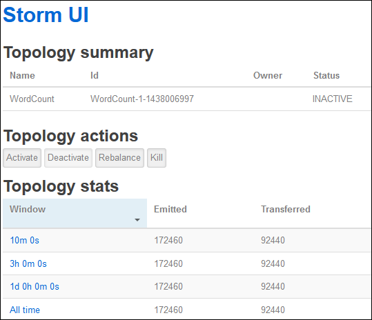

<properties
    pageTitle="Didacticiel Apache vague : prise en main vague de Linux sur HDInsight | Microsoft Azure"
    description="Prise en main analytique de données volumineux à l’aide de vague d’Apache et les exemples vague Starter sur HDInsight basé sur Linux. Découvrez comment utiliser vague de pour traiter les données en temps réel."
    keywords="vague d’Apache, didacticiel de vague apache, analytique de données volumineux, starter vague"
    services="hdinsight"
    documentationCenter=""
    authors="Blackmist"
    manager="jhubbard"
    editor="cgronlun"/>

<tags
   ms.service="hdinsight"
   ms.devlang="java"
   ms.topic="get-started-article"
   ms.tgt_pltfrm="na"
   ms.workload="big-data"
   ms.date="10/12/2016"
   ms.author="larryfr"/>

# Didacticiel Apache vague : prise en main avec les exemples vague Starter pour analytique de données volumineux sur HDInsight

Vague d’Apache est un système de calcul scalable, tolérance, distribués et en temps réel pour le traitement des flux de données. Avec vague d’Azure HDInsight, vous pouvez créer un cluster vague sur le nuage qui effectue analytique de vue de données en temps réel.

> [AZURE.NOTE] Les étapes décrites dans cet article créent un cluster basé sur Linux HDInsight. Pour créer une vague de fonctionnant sous Windows sur cluster HDInsight, voir [didacticiel Apache vague : prise en main l’échantillon vague Starter à l’aide d’analytique de données sur HDInsight](hdinsight-apache-storm-tutorial-get-started.md)

## Conditions préalables

[AZURE.INCLUDE [delete-cluster-warning](../../includes/hdinsight-delete-cluster-warning.md)]

Vous devez disposer des éléments suivants pour terminer ce didacticiel vague Apache :

- **Azure un abonnement**. Voir [Azure obtenir la version d’évaluation gratuite](https://azure.microsoft.com/documentation/videos/get-azure-free-trial-for-testing-hadoop-in-hdinsight/).

- **Familiarisation avec SSH et SCP**. Pour plus d’informations sur l’utilisation de SSH et SCP avec HDInsight, voir les rubriques suivantes :

    - **Les clients Linux, Unix ou OS X**: voir [Utiliser SSH avec basé sur Linux Hadoop sur HDInsight de Linux, OS X ou Unix](hdinsight-hadoop-linux-use-ssh-unix.md)

    - **Les clients Windows**: consultez [Utiliser SSH avec basé sur Linux Hadoop sur HDInsight à partir de Windows](hdinsight-hadoop-linux-use-ssh-windows.md)

### Exigences de contrôle d’accès

[AZURE.INCLUDE [access-control](../../includes/hdinsight-access-control-requirements.md)]

## Créer un cluster vague

Dans cette section, vous créez un cluster de version 3.2 HDInsight (vague de version 0.9.3) à l’aide d’un modèle Azure le Gestionnaire de ressources. Pour plus d’informations sur les versions de HDInsight et de niveau de service souscrit, voir [le contrôle de version composant HDInsight](hdinsight-component-versioning.md). Pour les autres méthodes de création cluster, consultez [créer HDInsight clusters](hdinsight-hadoop-provision-linux-clusters.md).

1. Cliquez sur l’image suivante pour ouvrir le modèle dans le portail Azure.         

    
    
    Le modèle se trouve dans un conteneur blob publique, *https://hditutorialdata.blob.core.windows.net/armtemplates/create-linux-based-storm-cluster-in-hdinsight.json*. 
   
2. À partir de la carte de paramètres, entrez les informations suivantes :

    - **Nomducluster**: entrez un nom pour le cluster Hadoop que vous allez créer.
    - **Mot de passe et le nom de connexion cluster**: le nom de connexion par défaut est administrateur.
    - **SSH nom d’utilisateur et mot de passe**.
    
    Veuillez noter ces valeurs.  Vous en aurez besoin plus loin dans le didacticiel.

    > [AZURE.NOTE] SSH est utilisée pour accéder à distance cluster HDInsight en utilisant une ligne de commande. Le nom d’utilisateur et mot de passe que vous utilisez ici est utilisé lors de la connexion au cluster via SSH. En outre, le nom d’utilisateur SSH doit être unique, qu’il crée un compte d’utilisateur sur tous les nœuds de cluster HDInsight. Les éléments suivants sont les noms des comptes réservées par services sur le cluster et ne peuvent pas être utilisés en tant que le nom d’utilisateur SSH :
    >
    > racine, hdiuser, vague de, hbase, ubuntu, soigneur, hdfs, fils, mapred, hbase, hive, oozie, falcon, sqoop, administrateur, tez, hcat, hdinsight soigneur.

    > Pour plus d’informations sur l’utilisation de SSH avec HDInsight, voir un des articles suivants :

    > * [Utiliser le protocole SSH avec basé sur Linux Hadoop sur HDInsight de Linux, Unix ou OS X](hdinsight-hadoop-linux-use-ssh-unix.md)
    > * [Utiliser le protocole SSH avec basé sur Linux Hadoop sur HDInsight à partir de Windows](hdinsight-hadoop-linux-use-ssh-windows.md)

    
3. Cliquez sur **OK** pour enregistrer les paramètres.

4.la à partir de la carte de **déploiement personnalisé** , cliquez sur zone de liste déroulante **groupe de ressources** , puis cliquez sur **Nouveau** pour créer un nouveau groupe de ressources. Le groupe de ressources est un conteneur qui regroupe cluster, le compte de stockage dépendantes et autres ressources liées.

5 Cliquez sur **conditions juridiques**, puis cliquez sur **créer**.

6. Cliquez sur **créer**. Vous verrez une vignette intitulée déploiement d’envoi pour le déploiement du modèle. Il est nécessaire à environ 20 minutes pour créer le cluster et la base de données SQL.

##Exécuter un échantillon vague Starter sur HDInsight

Les exemples de [vague de starter](https://github.com/apache/storm/tree/master/examples/storm-starter) sont inclus dans le cluster HDInsight. Dans la procédure suivante, vous exécuterez l’exemple WordCount.

1. Connectez-vous au cluster HDInsight à l’aide de SSH :

        ssh USERNAME@CLUSTERNAME-ssh.azurehdinsight.net
        
    Si vous avez utilisé un mot de passe pour votre compte d’utilisateur SSH, vous devrez entrer. Si vous avez utilisé une clé publique, vous devrez peut-être utiliser les `-i` paramètre pour spécifier la clé privée correspondante. Par exemple, `ssh -i ~/.ssh/id_rsa USERNAME@CLUSTERNAME-ssh.azurehdinsight.net`.
        
    Pour plus d’informations sur l’utilisation de SSH avec basé sur Linux HDInsight, voir les articles suivants :
    
    * [Utiliser le protocole SSH avec basé sur Linux Hadoop sur HDInsight de Linux, Unix ou OS X](hdinsight-hadoop-linux-use-ssh-unix.md)

    * [Utiliser le protocole SSH avec basé sur Linux Hadoop sur HDInsight à partir de Windows](hdinsight-hadoop-linux-use-ssh-windows)

2. Utilisez la commande suivante pour démarrer un exemple de topologie :

        storm jar /usr/hdp/current/storm-client/contrib/storm-starter/storm-starter-topologies-*.jar storm.starter.WordCountTopology wordcount
        
    > [AZURE.NOTE] La `*` partie du nom de fichier est utilisé pour faire correspondre le numéro de version, car HDInsight est mis à jour les modifications.

    L’exemple de topologie WordCount démarre sur le cluster, avec un nom convivial de « wordcount ». Il vous sera aléatoirement générer phrases et pour compter les occurrences de chaque mot dans la phrase.

    > [AZURE.NOTE] Lorsque vous soumettez topologie pour le cluster, vous devez d’abord copier le fichier jar contenant le cluster avant d’utiliser la `storm` commande. Cela peut être effectuée à l’aide de la `scp` commande à partir du client où se trouve le fichier. Par exemple,`scp FILENAME.jar USERNAME@CLUSTERNAME-ssh.azurehdinsight.net:FILENAME.jar`
    >
    > L’exemple WordCount et autres exemples de starter vague, figurent déjà dans votre cluster en `/usr/hdp/current/storm-client/contrib/storm-starter/`.

##Contrôler la topologie

L’interface utilisateur vague de fournit une interface web pour l’utilisation de topologies en cours d’exécution et est inclus sur votre cluster HDInsight.

Procédez comme suit pour contrôler la topologie à l’aide de l’interface utilisateur vague de :

1. Ouvrez un navigateur web pour https://CLUSTERNAME.azurehdinsight.net/stormui, où __CLUSTERNAME__ est le nom de votre cluster. Cette action ouvre l’interface utilisateur vague de.

    > [AZURE.NOTE] Si vous êtes invité à fournir un nom d’utilisateur et mot de passe, entrez l’administrateur de cluster (administrateur) et votre mot de passe que vous avez utilisé quand créer le cluster.

2. Sous **topologie de synthèse**, sélectionnez l’entrée **wordcount** dans la colonne **nom** . Ceci affiche plus d’informations sur la topologie.

    

    Cette page fournit les informations suivantes :

    * **Statistiques de topologie** - informations de base sur les performances de topologie, organisées en périodes.

        > [AZURE.NOTE] Sélection d’un certain laps de temps modifie la fenêtre de temps pour les informations affichées dans d’autres sections de la page.

    * **Becs verseurs amovibles** - informations de base sur becs verseurs, y compris la dernière erreur renvoyée par chaque bec.

    * **Boulons** - informations de base sur détaillée.

    * **Configuration de la topologie** - des informations détaillées sur la configuration de la topologie.

    Cette page permet également d’actions qui peuvent être prises sur la topologie :

    * **Activer** - traitement de CV d’une topologie désactivée.

    * **Désactiver** - interrompt une topologie en cours d’exécution.

    * **Rééquilibrer** - ajuste le parallélisme de la topologie. Vous devez rééquilibrer topologies en cours d’exécution après avoir modifié le nombre de nœuds dans le cluster. Cela permet de la topologie d’ajustez le parallélisme à compense le nombre de nœuds dans le cluster augmentée/réduite. Pour plus d’informations, voir [Présentation du parallélisme d’une topologie vague](http://storm.apache.org/documentation/Understanding-the-parallelism-of-a-Storm-topology.html).

    * **Arrêter** - met fin à une topologie vague après le délai spécifié.

3. À partir de cette page, sélectionnez une entrée dans la section **becs verseurs amovibles** ou **boulons** . Ceci affiche des informations sur le composant sélectionné.

    

    Cette page affiche les informations suivantes :

    * **Statistiques bec/boulons** - informations de base sur les performances des composants, organisées en périodes.

        > [AZURE.NOTE] Sélection d’un certain laps de temps modifie la fenêtre de temps pour les informations affichées dans d’autres sections de la page.

    * **Statistiques de saisie** (boulons uniquement) - informations sur les composants qui génèrent des données utilisées par les boulons.

    * **Statistiques de sortie** - informations sur les données émises par cette boulons.

    * **Les exécuteurs** - informations sur les instances de ce composant.

    * **Erreurs** : erreurs produites par ce composant.

4. Lorsque vous affichez les détails d’un bec ou boulons, sélectionnez une entrée dans la colonne **Port** dans la section **exécuteurs** pour afficher les détails d’une instance spécifique du composant.

        2015-01-27 14:18:02 b.s.d.task [INFO] Emitting: split default ["with"]
        2015-01-27 14:18:02 b.s.d.task [INFO] Emitting: split default ["nature"]
        2015-01-27 14:18:02 b.s.d.executor [INFO] Processing received message source: split:21, stream: default, id: {}, [snow]
        2015-01-27 14:18:02 b.s.d.task [INFO] Emitting: count default [snow, 747293]
        2015-01-27 14:18:02 b.s.d.executor [INFO] Processing received message source: split:21, stream: default, id: {}, [white]
        2015-01-27 14:18:02 b.s.d.task [INFO] Emitting: count default [white, 747293]
        2015-01-27 14:18:02 b.s.d.executor [INFO] Processing received message source: split:21, stream: default, id: {}, [seven]
        2015-01-27 14:18:02 b.s.d.task [INFO] Emitting: count default [seven, 1493957]

    À partir de ces données, vous pouvez voir que word **sept** s’est produite 1493957 heures. C’est le nombre de fois qu’il a été détecté dans la mesure où cette topologie a été démarrée.

##Arrêter la topologie

Revenir à la page de **Résumé de la topologie** pour la topologie de nombre de mots, puis sélectionnez le bouton **Supprimer** dans la section **actions de la topologie** . Lorsque vous y êtes invité, entrez 10 pour les secondes d’attente avant d’arrêter la topologie. Après un délai, la topologie n’apparaît plus lorsque vous accédez à la section **Vague d’interface utilisateur** du tableau de bord.

##Supprimer le cluster

[AZURE.INCLUDE [delete-cluster-warning](../../includes/hdinsight-delete-cluster-warning.md)]

##Étapes suivantes

Dans ce didacticiel vague Apache, vous avez utilisé la Starter vague d’apprendre à créer une vague de sur cluster HDInsight et utiliser le tableau de bord vague de pour déployer, surveiller et gérer des topologies vague. Ensuite, découvrez comment [topologies basé sur Java développer à l’aide de Maven](hdinsight-storm-develop-java-topology.md).

Si vous êtes déjà familiarisé avec développement topologies basé sur Java et que vous souhaitez déployer une topologie existante à HDInsight, voir [déployer et gérer des topologies vague Apache sur HDInsight](hdinsight-storm-deploy-monitor-topology-linux.md).

Si vous êtes développeur .NET, vous pouvez créer c# ou hybride c# / topologies Java à l’aide de Visual Studio. Pour plus d’informations, voir [développer c# topologies pour vague d’Apache sur HDInsight à l’aide de Hadoop tools pour Visual Studio](hdinsight-storm-develop-csharp-visual-studio-topology.md).

Par exemple topologies qui peuvent être utilisés avec vague d’HDInsight, voir les exemples suivants :

    * [Exemples de topologies pour vague d’HDInsight](hdinsight-storm-example-topology.md)

[apachestorm]: https://storm.incubator.apache.org
[stormdocs]: http://storm.incubator.apache.org/documentation/Documentation.html
[stormstarter]: https://github.com/apache/storm/tree/master/examples/storm-starter
[stormjavadocs]: https://storm.incubator.apache.org/apidocs/
[azureportal]: https://manage.windowsazure.com/
[hdinsight-provision]: hdinsight-provision-clusters.md
[preview-portal]: https://portal.azure.com/
