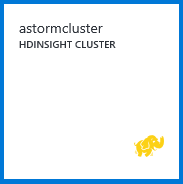

<properties
    pageTitle="Didacticiel Apache vague : prise en main vague de | Microsoft Azure"
    description="Prise en main analytique de données volumineux à l’aide de vague d’Apache et les exemples vague Starter sur HDInsight. Découvrez comment utiliser vague de pour traiter les données en temps réel."
    keywords="vague d’Apache, didacticiel de vague apache, analytique de données volumineux, starter vague"
    services="hdinsight"
    documentationCenter=""
    authors="Blackmist"
    manager="jhubbard"
    editor="cgronlun"
    tags="azure-portal"/>

<tags
   ms.service="hdinsight"
   ms.devlang="java"
   ms.topic="article"
   ms.tgt_pltfrm="na"
   ms.workload="big-data"
   ms.date="09/07/2016"
   ms.author="larryfr"/>

# Didacticiel Apache vague : prise en main avec les exemples vague Starter pour analytique de données volumineux sur HDInsight

Vague d’Apache est un système de calcul scalable, tolérance, distribués et en temps réel pour le traitement des flux de données. Avec vague de sur Microsoft Azure HDInsight, vous pouvez créer un cluster vague sur le nuage qui effectue analytique volumineux données en temps réel. 

> [AZURE.NOTE] Les étapes décrites dans cet article créent un cluster HDInsight fonctionnant sous Windows. Pour créer une vague de basé sur Linux sur cluster HDInsight, voir [didacticiel Apache vague : prise en main l’échantillon vague Starter à l’aide d’analytique de données sur HDInsight](hdinsight-apache-storm-tutorial-get-started-linux.md)

## Conditions préalables

[AZURE.INCLUDE [delete-cluster-warning](../../includes/hdinsight-delete-cluster-warning.md)]

Vous devez disposer des éléments suivants pour terminer ce didacticiel vague Apache :

- **Azure un abonnement**. Voir [Azure obtenir la version d’évaluation gratuite](https://azure.microsoft.com/documentation/videos/get-azure-free-trial-for-testing-hadoop-in-hdinsight/).

### Exigences de contrôle d’accès

[AZURE.INCLUDE [access-control](../../includes/hdinsight-access-control-requirements.md)]

## Créer un cluster vague

Vague d’HDInsight utilise le stockage Blob Azure pour stocker les fichiers journaux et topologies envoyés pour le cluster. Procédez comme suit pour créer un compte de stockage Azure pour une utilisation avec votre cluster :

1. Connectez-vous au [portail Azure][preview-portal].

2. Sélectionnez **Nouveau**, sélectionnez __Données Analytique__, puis __HDInsight__.

    

3. Entrez un __nom de Cluster__. Une coche verte apparaît en regard du __Nom du Cluster__ si elle est disponible.

4. Si vous avez plusieurs abonnements, sélectionnez l’entrée __d’abonnement__ pour sélectionner l’abonnement Azure qui sera utilisé pour le cluster.

5.  __Sélectionner le Type de Cluster__ permet de sélectionner un cluster __vague de__ . Pour le __système d’exploitation__, sélectionnez Windows. Pour le __Cluster de niveau__, sélectionnez STANDARD. Enfin, utilisez le bouton de sélection pour enregistrer ces paramètres.

    

5. __Groupe de ressources__, vous pouvez utiliser la liste déroulante pour afficher la liste des groupes de ressources existant, puis sélectionnez l’option pour créer le cluster dans. Ou vous pouvez sélectionnez __Nouveau__ , puis entrez le nom du nouveau groupe de ressources. Une coche verte apparaît pour indiquer si le nouveau nom de groupe est disponible.

6. Sélectionnez __les informations d’identification__, puis entrez un __Nom de connexion Cluster__ et __Cluster mot de passe__. Enfin, utilisez __Sélectionnez__ pour définir les informations d’identification. Bureau à distance n’est pas utilisée dans ce document, afin que vous pouvez laisser cette option désactivée.

    

6. Pour la __Source de données__, vous pouvez sélectionner l’entrée à choisir une source de données existante, ou créer un nouvel identifiant.

    

    Pour le moment, vous pouvez sélectionner un compte de stockage Azure comme source de données pour un cluster HDInsight. Utilisez ce qui suit pour comprendre les entrées dans la carte de __Source de données__ .

    - __Méthode de sélection__: définir l’option __à partir de tous les abonnements__ pour activer l’exploration des comptes de stockage dans vos abonnements. Si vous voulez entrer le __Nom de stockage__ et la __Touche d’accès rapide__ d’un compte de stockage existant la valeur __Touche d’accès rapide__ .

    - __Créer un nouveau__: utilisez cette option pour créer un nouveau compte de stockage. Utiliser le champ qui s’affiche pour entrer le nom du compte de stockage. Une coche verte s’affiche si le nom n’est disponible.

    - __Choisissez le conteneur par défaut__: utilisez cette option pour entrer le nom du conteneur par défaut à utiliser pour le cluster. Bien que vous pouvez taper n’importe quel nom ici, nous vous recommandons d’utilisant le même nom que le cluster de sorte que vous pouvez facilement reconnaître que le conteneur est utilisé pour ce cluster spécifique.

    - __Emplacement__: se trouve dans la région géographique du compte de stockage sera ou seront créée dans.

        > [AZURE.IMPORTANT] Sélectionner l’emplacement pour la source de données par défaut définit également l’emplacement du cluster HDInsight. La source de données par défaut et cluster doit se trouver dans la même région.

    - __Sélectionnez__: utilisez cette option pour enregistrer la configuration de source de données.

7. Sélectionnez le __Nœud tarifs niveaux__ pour afficher des informations sur les nœuds qui seront créés pour ce cluster. Par défaut, le nombre de nœuds de travail est défini sur __4__. Définissez cette option __1__, si cela est suffisant pour ce didacticiel et réduit le coût du cluster. La valeur estimée du cluster apparaît en bas de cette carte.

    

    Permet de __Sélectionner__ enregistrer les informations de __Nœud tarifs niveaux__ .

8. Sélectionnez __Configuration facultative__. Cette carte permet de sélectionner la version cluster, ainsi que configurer d’autres paramètres facultatifs tels que la participation à un __Réseau virtuel__.

    

9. Assurez-vous que le __code confidentiel pour Startboard__ est sélectionnée et puis cliquez sur __créer__. Cela crée le cluster et lui ajoute une vignette d’à la Startboard de votre portail Azure. L’icône indique que le cluster est mise en service, et les modifications apportées à afficher l’icône de HDInsight une fois la mise en service est terminée.

  	| Lors de la mise en service | Mise en service complète |
  	| ------------------ | --------------------- |
  	|  |  |

    > [AZURE.NOTE] Il prend un certain temps pour le cluster doit être créée, généralement environ 15 minutes. Utiliser la vignette sur la Startboard ou l’entrée de __Notifications__ à gauche de la page, pour vérifier le processus de configuration.

## Exécuter un échantillon vague Starter sur HDInsight

Ce didacticiel vague Apache présente analytique données volumineuses l’utilisation des exemples vague Starter sur GitHub.

Chaque vague de sur cluster HDInsight est fourni avec le tableau de bord vague de, qui peut être utilisé pour télécharger et exécuter des topologies vague sur le cluster. Chaque cluster est également fourni avec des exemples de topologies qui peuvent être exécutés directement à partir du tableau de bord vague de.

### Se connecter au tableau de bord

Le tableau de bord se trouve à **https://&lt;nom_cluster >.azurehdinsight.net//**, où **clustername** est le nom du cluster. Vous pouvez également trouver un lien vers le tableau de bord en sélectionnant le cluster à partir de la Startboard et en cliquant sur le lien de __tableau de bord__ dans la partie supérieure de la cuillère.

> [AZURE.NOTE] Lorsque vous vous connectez au tableau de bord, vous êtes invité à entrer un nom d’utilisateur et mot de passe. Il s’agit du nom d’administrateur (**administrateur**) et le mot de passe lorsque vous avez créé le cluster.

Une fois que le tableau de bord vague d’a chargé, le formulaire de **Topologie envoyer** s’affiche.

Le formulaire de **Topologie soumettre** peut servir de télécharger et exécuter des fichiers .jar qui contiennent des topologies vague. Il inclut également plusieurs exemples de base qui sont fournies avec le cluster.

### Exécuter l’exemple statistiques du projet Starter vague dans GitHub

Les exemples fournis avec le cluster incluent plusieurs variations de topologie de comptage de word. Ces exemples sont notamment une **goulotte** qui émet aléatoirement phrases et **boulons** scinder chaque phrase en mots individuels, puis compter le nombre de fois chaque mot s’est produite. Ces exemples sont des [exemples de vague de Starter](https://github.com/apache/storm/tree/master/examples/storm-starter), qui sont une partie de vague d’Apache.

Effectuez les opérations suivantes pour exécuter un échantillon vague Starter :

1. Sélectionnez **StormStarter - WordCount** dans le menu déroulant **Fichier Jar** . Cette opération remplit les champs **Nom du cours** et **Des paramètres supplémentaires** avec les paramètres de cet exemple.

    

    * **Nom du cours** : la classe dans le fichier .jar qui envoie la topologie.
    * **Paramètres supplémentaires** - tous les paramètres requis par la topologie. Dans cet exemple, le champ est utilisé pour fournir un nom convivial pour la topologie soumis.

2. Cliquez sur **Envoyer**. Après quelques instants, le champ de **résultat** affiche la commande utilisée pour envoyer la tâche, ainsi que les résultats de la commande. Le champ **erreur** affiche toutes les erreurs dans l’envoi de la topologie.

    

    > [AZURE.NOTE] Les résultats n’indiquent pas que la topologie terminée - **une vague topologie, une fois démarrée, s’exécute jusqu'à l’arrêt it.** La topologie statistiques génère phrases aléatoires et conserve un décompte du nombre de fois qu’il rencontre chaque mot, jusqu'à ce que vous l’arrêter.

### Contrôler la topologie

L’interface utilisateur vague de peut servir à contrôler la topologie.

1. Sélectionnez **Vague d’interface utilisateur** dans la partie supérieure du tableau de bord vague de. Cela permet d’afficher des informations de synthèse pour le cluster et toutes les topologies en cours d’exécution.

    

    Dans la page ci-dessus, vous pouvez voir l’heure de que la topologie a été active, ainsi que le nombre de collaborateurs, les exécuteurs et les tâches en cours d’utilisation.

    > [AZURE.NOTE] La colonne **nom** contient le nom convivial fourni précédemment via le champ **Des paramètres supplémentaires** .

4. Sous **topologie de synthèse**, sélectionnez l’entrée **wordcount** dans la colonne **nom** . Cela permet d’afficher plus d’informations sur la topologie.

    

    Cette page fournit les informations suivantes :

    * **Statistiques de topologie** - informations de base sur les performances de topologie, organisées en périodes.

        > [AZURE.NOTE] Sélection d’un certain laps de temps modifie la fenêtre de temps pour les informations affichées dans d’autres sections de la page.

    * **Becs verseurs amovibles** - informations de base sur becs verseurs, y compris la dernière erreur renvoyée par chaque bec.

    * **Boulons** - informations de base sur détaillée.

    * **Configuration de la topologie** - des informations détaillées sur la configuration de la topologie.

    Cette page permet également d’actions qui peuvent être prises sur la topologie :

    * **Activer** - traitement de CV d’une topologie désactivée.

    * **Désactiver** - interrompt une topologie en cours d’exécution.

    * **Rééquilibrer** - ajuste le parallélisme de la topologie. Vous devez rééquilibrer topologies en cours d’exécution après avoir modifié le nombre de nœuds dans le cluster. Cela permet de la topologie d’ajustez le parallélisme à compense le nombre de nœuds dans le cluster augmentée/réduite. Pour plus d’informations, voir [Présentation du parallélisme d’une topologie vague](http://storm.apache.org/documentation/Understanding-the-parallelism-of-a-Storm-topology.html).

    * **Arrêter** - met fin à une topologie vague après le délai spécifié.

5. À partir de cette page, sélectionnez une entrée dans la section **becs verseurs amovibles** ou **boulons** . Cela permet d’afficher des informations sur le composant sélectionné.

    

    Cette page affiche les informations suivantes :

    * **Statistiques bec/boulons** - informations de base sur les performances des composants, organisées en périodes.

        > [AZURE.NOTE] Sélection d’un certain laps de temps modifie la fenêtre de temps pour les informations affichées dans d’autres sections de la page.

    * **Statistiques de saisie** (boulons uniquement) - informations sur les composants qui génèrent des données utilisées par les boulons.

    * **Statistiques de sortie** - informations sur les données émises par cette boulons.

    * **Les exécuteurs** - informations sur les instances de ce composant.

    * **Erreurs** : erreurs produites par ce composant.

5. Lorsque vous affichez les détails d’un bec ou boulons, sélectionnez une entrée dans la colonne **Port** dans la section **exécuteurs** pour afficher les détails d’une instance spécifique du composant.

        2015-01-27 14:18:02 b.s.d.task [INFO] Emitting: split default ["with"]
        2015-01-27 14:18:02 b.s.d.task [INFO] Emitting: split default ["nature"]
        2015-01-27 14:18:02 b.s.d.executor [INFO] Processing received message source: split:21, stream: default, id: {}, [snow]
        2015-01-27 14:18:02 b.s.d.task [INFO] Emitting: count default [snow, 747293]
        2015-01-27 14:18:02 b.s.d.executor [INFO] Processing received message source: split:21, stream: default, id: {}, [white]
        2015-01-27 14:18:02 b.s.d.task [INFO] Emitting: count default [white, 747293]
        2015-01-27 14:18:02 b.s.d.executor [INFO] Processing received message source: split:21, stream: default, id: {}, [seven]
        2015-01-27 14:18:02 b.s.d.task [INFO] Emitting: count default [seven, 1493957]

    À partir de ces données, vous pouvez voir que word **sept** s’est produite 1,493,957 heures. C’est le nombre de fois qu’il a été détecté dans la mesure où cette topologie a été démarrée.

### Arrêter la topologie

Revenir à la page de **Résumé de la topologie** pour la topologie de nombre de mots, puis sélectionnez **Supprimer** dans la section **actions de la topologie** . Lorsque vous y êtes invité, entrez 10 pour les secondes d’attente avant d’arrêter la topologie. Après un délai, la topologie n’apparaît plus lorsque vous accédez à la section **Vague d’interface utilisateur** du tableau de bord.

##Supprimer le cluster

[AZURE.INCLUDE [delete-cluster-warning](../../includes/hdinsight-delete-cluster-warning.md)]

## Résumé

Dans ce didacticiel vague Apache, vous avez utilisé la Starter vague d’apprendre à créer une vague de sur cluster HDInsight et utiliser le tableau de bord vague de pour déployer, surveiller et gérer des topologies vague.

## Étapes suivantes

* **HDInsight Tools pour Visual Studio** - outils HDInsight vous permet d’utiliser Visual Studio pour envoyer, surveiller et gérer des topologies vague semblables au tableau de bord vague de mentionné précédemment. Outils HDInsight permet de créer des topologies c# vague et inclut des exemples de topologies que vous pouvez déployer et exécuter sur votre cluster.

    Pour plus d’informations, voir [prise en main l’aide des outils HDInsight pour Visual Studio](hdinsight-hadoop-visual-studio-tools-get-started.md).

* **Fichiers d’exemples** - cluster The HDInsight vague propose plusieurs exemples dans le répertoire **%STORM_HOME%\contrib** . Chaque exemple doit contenir les éléments suivants :

    * Le code source - par exemple, sources.jar du 2057 0.9.1.2.1.5.0 vague de starter

    * Les documents Java - par exemple, javadoc.jar du 2057 0.9.1.2.1.5.0 vague de starter

    * L’exemple - par exemple, storm-starter-0.9.1.2.1.5.0-2057-jar-with-dependencies.jar

    Utilisez la commande « jar » pour extraire le code source ou documents Java. Par exemple, « vague de xvf - jar-starter-0.9.1.2.1.5.0.2057-javadoc.jar ».

    > [AZURE.NOTE] Documents Java composent des pages Web. Une fois extraits, utilisez un navigateur pour afficher le fichier **index.html** .

    Pour accéder à ces exemples, vous devez activer le Bureau à distance pour la vague de sur cluster HDInsight et puis copiez les fichiers à partir de **%STORM_HOME%\contrib**.

* Le document suivant contient une liste d’autres exemples qui peuvent être utilisés avec vague d’HDInsight :

    * [Exemples de topologies pour vague d’HDInsight](hdinsight-storm-example-topology.md)

[apachestorm]: https://storm.incubator.apache.org
[stormdocs]: http://storm.incubator.apache.org/documentation/Documentation.html
[stormstarter]: https://github.com/apache/storm/tree/master/examples/storm-starter
[stormjavadocs]: https://storm.incubator.apache.org/apidocs/
[azureportal]: https://manage.windowsazure.com/
[hdinsight-provision]: hdinsight-provision-clusters.md
[preview-portal]: https://portal.azure.com/
