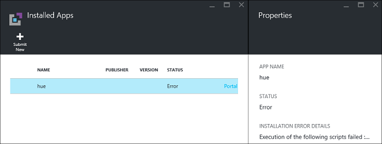

<properties
    pageTitle="Installer des applications Hadoop sur HDInsight | Microsoft Azure"
    description="Découvrez comment installer des applications de HDInsight les applications HDInsight."
    services="hdinsight"
    documentationCenter=""
    authors="mumian"
    manager="jhubbard"
    editor="cgronlun"
    tags="azure-portal"/>

<tags
    ms.service="hdinsight"
    ms.devlang="na"
    ms.topic="hero-article"
    ms.tgt_pltfrm="na"
    ms.workload="big-data"
    ms.date="09/14/2016"
    ms.author="jgao"/>

# Installer des applications personnalisées HDInsight

Une application HDInsight est une application que les utilisateurs peuvent installer sur un cluster HDInsight basé sur Linux.  Ces applications peuvent être développées par Microsoft, éditeurs de logiciels (fil) ou par vous-même. Dans cet article, vous allez apprendre à installer une application HDInsight qui n’a pas été publiée sur le portail Azure sur HDInsight. L’application que vous installerez est [teinte](http://gethue.com/). 

Autres articles connexes :

- [HDInsight installer les applications](hdinsight-apps-install-applications.md): Découvrez comment installer une application HDInsight à vos clusters.
- [Applications HDInsight publier](hdinsight-apps-publish-applications.md): Découvrez comment publier vos applications personnalisées HDInsight à Azure Marketplace.
- [MSDN : installer une application HDInsight](https://msdn.microsoft.com/library/mt706515.aspx): Découvrez comment définir des applications HDInsight.

 
## Conditions préalables

Si vous voulez installer des applications HDInsight sur un cluster HDInsight existant, vous devez disposer un cluster HDInsight. Pour en créer un, consultez [créer clusters](hdinsight-hadoop-linux-tutorial-get-started.md#create-cluster). Vous pouvez également installer des applications de HDInsight lorsque vous créez un cluster HDInsight.

## Installer des applications HDInsight

HDInsight applications peuvent être installées lorsque vous créez un cluster ou à un cluster HDInsight existant. Pour définir le Gestionnaire de ressources Azure modèles, voir [MSDN : installer une application HDInsight](https://msdn.microsoft.com/library/mt706515.aspx).

Les fichiers nécessaires pour le déploiement de cette application (teinte) :

- [azuredeploy.JSON](https://github.com/hdinsight/Iaas-Applications/blob/master/Hue/azuredeploy.json): modèle du Gestionnaire de ressources pour l’installation d’application HDInsight. Voir [MSDN : installer une application HDInsight](https://msdn.microsoft.com/library/mt706515.aspx) pour le développement de votre propre modèle de gestionnaire de ressources.
- [teinte install_v0.sh](https://github.com/hdinsight/Iaas-Applications/blob/master/Hue/scripts/Hue-install_v0.sh): action du Script appelée par le modèle de gestionnaire de ressources pour configurer le nœud de bord. 
- [teinte binaries.tgz](https://hdiconfigactions.blob.core.windows.net/linuxhueconfigactionv01/hue-binaries-14-04.tgz): le fichier binaire teinte appelé à partir d’aujourd'hui install_v0.sh. 
- [teinte-binaires-14-04.tgz](https://hdiconfigactions.blob.core.windows.net/linuxhueconfigactionv01/hue-binaries-14-04.tgz): le fichier binaire teinte appelé à partir d’aujourd'hui install_v0.sh. 
- [webwasb tomcat.tar.gz](https://hdiconfigactions.blob.core.windows.net/linuxhueconfigactionv01/webwasb-tomcat.tar.gz): un exemple d’application web (Tomcat) appelée à partir d’aujourd'hui install_v0.sh.

**Pour installer teinte à un cluster HDInsight existant**

1. Cliquez sur l’image suivante pour se connecter à Azure et ouvrez le modèle de gestionnaire de ressources dans le portail Azure. 

    

    Ce bouton ouvre un modèle de gestionnaire de ressources dans le portail Azure.  Le modèle de gestionnaire de ressources se trouve dans [https://github.com/hdinsight/Iaas-Applications/tree/master/Hue](https://github.com/hdinsight/Iaas-Applications/tree/master/Hue).  Pour savoir comment rédiger de ce modèle de gestionnaire de ressources, consultez [MSDN : installer une application HDInsight](https://msdn.microsoft.com/library/mt706515.aspx).
    
2. À partir de la carte de **paramètres** , entrez les informations suivantes :

    - **Nomducluster**: entrez le nom du cluster à l’endroit où vous voulez installer l’application. Ce cluster doit être un cluster existant.
    
3. Cliquez sur **OK** pour enregistrer les paramètres.
4. À partir de la carte de **déploiement personnalisée** , entrez le **groupe de ressources**.  Le groupe de ressources est un conteneur qui regroupe le cluster, le compte de stockage dépendantes et autres ressources. Il est nécessaire pour utiliser le même groupe de ressources que le cluster.
5. Cliquez sur les **conditions juridiques**, puis cliquez sur **créer**.
6. Vérifiez que la case à cocher **Ajouter au tableau de bord** est activée, puis cliquez sur **créer**. Vous pouvez consulter l’état de l’installation à partir de la mosaïque épinglée dans le tableau de bord du portail et la notification du portail (cliquez sur l’icône en cloche dans la partie supérieure du portail).  Il prend environ 10 minutes pour installer l’application.

**Pour installer teinte lors de la création d’un cluster**

1. Cliquez sur l’image suivante pour se connecter à Azure et ouvrez le modèle de gestionnaire de ressources dans le portail Azure. 

    

    Ce bouton ouvre un modèle de gestionnaire de ressources dans le portail Azure.  Le modèle de gestionnaire de ressources se trouve dans [https://hditutorialdata.blob.core.windows.net/hdinsightapps/create-linux-based-hadoop-cluster-in-hdinsight.json](https://hditutorialdata.blob.core.windows.net/hdinsightapps/create-linux-based-hadoop-cluster-in-hdinsight.json).  Pour savoir comment rédiger de ce modèle de gestionnaire de ressources, consultez [MSDN : installer une application HDInsight](https://msdn.microsoft.com/library/mt706515.aspx).

2. Suivez les instructions pour créer cluster et installer teinte. Pour plus d’informations sur la création de clusters HDInsight, voir [Hadoop basé sur Linux créer des groupes dans un HDInsight](hdinsight-hadoop-provision-linux-clusters.md).

Outre le portail Azure, vous pouvez également utiliser [PowerShell Azure](hdinsight-hadoop-create-linux-clusters-arm-templates.md#deploy-with-powershell) et [Azure infrastructure du langage commun](hdinsight-hadoop-create-linux-clusters-arm-templates.md#deploy-with-azure-cli) pour appeler le Gestionnaire de ressources modèles.

## Valider l’installation

Vous pouvez vérifier l’état de l’application sur le portail Azure pour valider l’installation des applications. En outre, vous pouvez également valider toutes HTTP points de terminaison ai comme prévu et la page Web le cas échéant :

**Ouvrir le portail teinte**

1. Connectez-vous au [portail Azure](https://portal.azure.com).
2. Dans le menu de gauche, cliquez sur **Clusters HDInsight** .  Si vous ne voyez pas, cliquez sur **Parcourir**, puis cliquez sur **Clusters HDInsight**.
3. Cliquez sur le cluster où vous avez installé l’application.
4. À partir de la carte de **paramètres** , cliquez sur **Applications** sous la catégorie **Général** . Vous sont voir **teinte** répertoriés dans la carte **Applications installées** .
5. Cliquez sur la **nuance** dans la liste pour les propriétés de la liste.  
6. Cliquez sur le lien de page Web pour valider le site Web ; Ouvrez le point de terminaison HTTP dans un navigateur pour valider l’interface utilisateur du web teinte, ouvrez le point de terminaison SSH à l’aide de [PuTTY](hdinsight-hadoop-linux-use-ssh-windows.md) ou autres [clients SSH](hdinsight-hadoop-linux-use-ssh-unix.md).
 
## Résoudre les problèmes de l’installation

Vous pouvez vérifier l’état de l’installation d’application à partir de la notification du portail (cliquez sur l’icône en cloche dans la partie supérieure du portail). 

En cas d’échec de l’installation d’une application, vous pouvez voir les messages d’erreur et des informations à partir de 3 emplacements de débogage :

- Applications HDInsight : informations sur les erreurs générales.

    Ouvrir le cluster à partir du portail, puis cliquez sur Applications à partir de la carte de paramètres :

    

- Action de script HDInsight : si le message d’erreur Applications HDInsight indique un échec de l’action script, plus d’informations sur l’échec de script seront affiche dans le volet actions de script.

    Cliquez sur Action de Script à partir de la carte de paramètres. Historique des actions de script affiche les messages d’erreur

    
    
- Interface utilisateur Ambari Web : Si le script d’installation est à l’origine de l’échec, utilisez Ambari Web interface utilisateur pour vérifier complètes journaux concernant les scripts d’installation.

    Pour plus d’informations, consultez [résolution des problèmes](hdinsight-hadoop-customize-cluster-linux.md#troubleshooting).

## Supprimer les applications HDInsight

Il existe plusieurs manières de supprimer des applications de HDInsight.

### Utiliser le portail

**Pour supprimer une application à l’aide du portail**

1. Connectez-vous au [portail Azure](https://portal.azure.com).
2. Dans le menu de gauche, cliquez sur **Clusters HDInsight** .  Si vous ne voyez pas, cliquez sur **Parcourir**, puis cliquez sur **Clusters HDInsight**.
3. Cliquez sur le cluster où vous avez installé l’application.
4. À partir de la carte de **paramètres** , cliquez sur **Applications** sous la catégorie **Général** . Vous doit afficher la liste des applications installées. Pour ce didacticiel, **teinte** répertoriée dans la carte **Applications installées** .
5. Avec le bouton droit de l’application que vous voulez supprimer, puis cliquez sur **Supprimer**.
6. Cliquez sur **Oui** pour confirmer.

À partir du portail, vous pouvez également supprimer le cluster ou le groupe de ressources qui contient l’application.

### Utiliser PowerShell Azure

À l’aide de PowerShell Azure, vous pouvez supprimer le cluster ou le groupe de ressources. Voir [Supprimer clusters à l’aide de PowerShell Azure](hdinsight-administer-use-powershell.md#delete-clusters).

### Utiliser Azure infrastructure du langage commun

À l’aide de Azure infrastructure du langage commun, vous pouvez supprimer le cluster ou le groupe de ressources. Voir [Supprimer clusters à l’aide de Azure infrastructure du langage commun](hdinsight-administer-use-command-line.md#delete-clusters).

## Étapes suivantes

- [MSDN : installer une application HDInsight](https://msdn.microsoft.com/library/mt706515.aspx): Découvrez comment développer des modèles de gestionnaire de ressources pour le déploiement des applications HDInsight.
- [HDInsight installer les applications](hdinsight-apps-install-applications.md): Découvrez comment installer une application HDInsight à vos clusters.
- [Applications HDInsight publier](hdinsight-apps-publish-applications.md): Découvrez comment publier vos applications personnalisées HDInsight à Azure Marketplace.
- [Clusters HDInsight basé sur Linux personnaliser à l’aide de Script Action](hdinsight-hadoop-customize-cluster-linux.md): Découvrez comment utiliser l’Action de Script à installer des applications supplémentaires.
- [Basé sur Linux créer Hadoop clusters dans HDInsight à l’aide de modèles de gestionnaire de ressources](hdinsight-hadoop-create-linux-clusters-arm-templates.md): Apprenez à appeler le Gestionnaire de ressources modèles pour créer des clusters HDInsight.
- [Utiliser des nœuds de bord vide dans HDInsight](hdinsight-apps-use-edge-node.md): Découvrez comment utiliser un nœud bord vide pour accéder à HDInsight cluster, test d’applications HDInsight et hébergement d’applications HDInsight.
