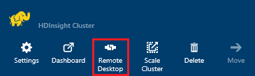
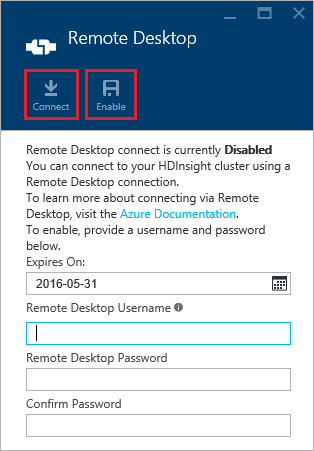
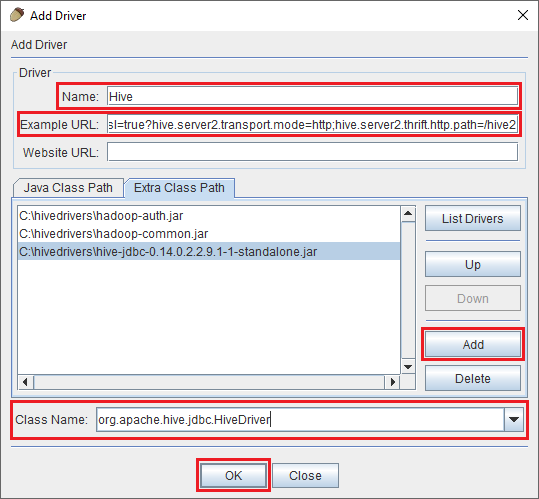
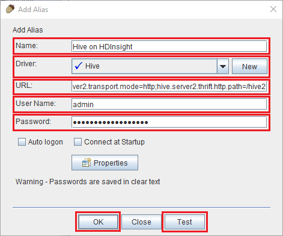
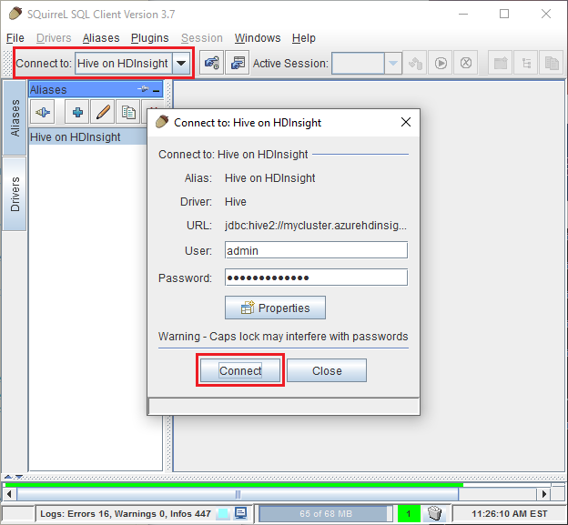

<properties
 pageTitle="Utilisent JDBC pour interroger Hive sur Azure HDInsight"
 description="Découvrez comment utiliser JDBC pour vous connecter à Hive sur Azure HDInsight et à distance d’exécuter des requêtes sur des données stockées dans le cloud."
 services="hdinsight"
 documentationCenter=""
 authors="Blackmist"
 manager="jhubbard"
 editor="cgronlun"
    tags="azure-portal"/>

<tags
 ms.service="hdinsight"
 ms.devlang="java"
 ms.topic="article"
 ms.tgt_pltfrm="na"
 ms.workload="big-data"
 ms.date="08/23/2016"
 ms.author="larryfr"/>

#Se connecter à Hive sur Azure HDInsight à l’aide du pilote JDBC ruche

[AZURE.INCLUDE [ODBC-JDBC-selector](../../includes/hdinsight-selector-odbc-jdbc.md)]

Dans ce document, vous allez apprendre à utiliser JDBC depuis une application Java pour envoyer à distance Hive requêtes à un cluster HDInsight. Vous allez apprendre comment se connecter à partir du client non SQL et comment vous connecter par programme à partir de Java.

Pour plus d’informations sur l’Interface JDBC ruche, voir [HiveJDBCInterface](https://cwiki.apache.org/confluence/display/Hive/HiveJDBCInterface).

##Conditions préalables

Pour effectuer les étapes décrites dans cet article, vous devez les éléments suivants :

* Hadoop sur cluster HDInsight. Clusters soit basé sur Linux ou fonctionnant sous Windows sont prises en charge.

* [Non SQL](http://squirrel-sql.sourceforge.net/). Non est une application cliente JDBC.

Pour créer et exécuter l’exemple d’application Java lié à partir de cet article, vous devez les éléments suivants.

* Le [Développeur Kit JDK (Java) version 7](https://www.oracle.com/technetwork/java/javase/downloads/jdk7-downloads-1880260.html) ou version ultérieure.

* [Apache Maven](https://maven.apache.org). Maven est un projet de génération système pour les projets Java qui est utilisé par le projet associé à cet article.

##Chaîne de connexion

Connexions JDBC à un cluster HDInsight sur Azure sont effectuées plus 443, et le trafic est sécurisé à l’aide de SSL. La passerelle publique les groupes assis derrière redirige le trafic vers le port HiveServer2 est en réalité en attente. Si une chaîne de connexion classique souhaite les éléments suivants :

    jdbc:hive2://CLUSTERNAME.azurehdinsight.net:443/default;ssl=true?hive.server2.transport.mode=http;hive.server2.thrift.http.path=/hive2

Remplacez __NOMDUCLUSTER__ par le nom de votre cluster HDInsight.

##Authentification

Lorsque la connexion établie, vous devez utiliser le nom de cluster HDInsight et le mot de passe s’authentifier à la passerelle cluster. Lorsque vous vous connectez à partir de clients JDBC comme non SQL, vous devez entrer le nom et le mot de passe dans Paramètres du client.

À partir d’une application Java, vous devez utiliser le nom et le mot de passe pour établir une connexion. Par exemple, le code Java suivant ouvre une nouvelle connexion à l’aide de la chaîne de connexion, nom d’administrateur et mot de passe :

    DriverManager.getConnection(connectionString,clusterAdmin,clusterPassword);

##Se connecter avec non SQL client

Non SQL est un client JDBC qui peut être utilisé pour exécuter à distance des requêtes Hive avec votre cluster HDInsight. Les étapes suivantes impliquent que vous avez déjà installé non SQL et vous guidera dans le téléchargement et la configuration des axes stratégiques pour Hive.

1. Copiez les pilotes JDBC ruche votre cluster HDInsight.

    * Pour __HDInsight basé sur Linux__, procédez comme suit pour télécharger les fichiers jar requis.

        1. Créer un nouveau répertoire contenant les fichiers. Par exemple, `mkdir hivedriver`.

        2. À partir d’une invite de commande, Bash, PowerShell ou autres invite de commande, accédez au répertoire vers le nouveau répertoire et utilisez les commandes suivantes pour copier les fichiers à partir du cluster HDInsight.

                scp USERNAME@CLUSTERNAME:/usr/hdp/current/hive-client/lib/hive-jdbc*standalone.jar .
                scp USERNAME@CLUSTERNAME:/usr/hdp/current/hadoop-client/hadoop-common.jar .
                scp USERNAME@CLUSTERNAME:/usr/hdp/current/hadoop-client/hadoop-auth.jar .

            Remplacez le __nom d’utilisateur__ par le nom de compte d’utilisateur SSH pour le cluster. Remplacez __NOMDUCLUSTER__ par le nom du cluster HDInsight.

            > [AZURE.NOTE] Les environnements Windows, vous avez besoin utiliser l’utilitaire PSCP au lieu de scp. Vous pouvez le télécharger à partir de [http://www.chiark.greenend.org.uk/~sgtatham/putty/download.html](http://www.chiark.greenend.org.uk/~sgtatham/putty/download.html).

    * Pour __HDInsight fonctionnant sous Windows__, procédez comme suit pour télécharger les fichiers jar.

        1. À partir du portail Azure, sélectionnez votre cluster HDInsight, puis l’icône de __Bureau à distance__ .

            

        2. Sur la carte de bureau à distance, utilisez le bouton __connexion__ pour vous connecter au cluster. Si le Bureau à distance n’est pas activé, utilisez le formulaire pour fournir un nom d’utilisateur et mot de passe, puis sélectionnez __Activer__ pour activer le Bureau à distance pour le cluster.

            

            Après avoir sélectionné __se connecter__, un fichier .rdp est téléchargé. Utilisez ce fichier pour lancer le client de bureau à distance. Lorsque vous y êtes invité, utilisez le nom d’utilisateur et mot de passe entré pour l’accès Bureau à distance.

        3. Une fois connecté, copiez les fichiers suivants à partir de la session Bureau à distance sur votre ordinateur local. Placez-les dans un répertoire local nommé `hivedriver`.

            * C:\apps\dist\hive-0.14.0.2.2.9.1-7\lib\hive-JDBC-0.14.0.2.2.9.1-7-Standalone.jar
            * C:\apps\dist\hadoop-2.6.0.2.2.9.1-7\share\hadoop\common\hadoop-Common-2.6.0.2.2.9.1-7.jar
            * C:\apps\dist\hadoop-2.6.0.2.2.9.1-7\share\hadoop\common\lib\hadoop-AUTH-2.6.0.2.2.9.1-7.jar

            > [AZURE.NOTE] Les numéros de version inclus dans les chemins d’accès et les noms de fichiers peuvent être différents pour votre cluster.

        4. Déconnecter la session de bureau à distance une fois que vous avez terminé de copie des fichiers.

3. Démarrez l’application non SQL. À partir de la gauche de la fenêtre, sélectionnez __pilotes__.

    

4. Dans les icônes en haut de la boîte de dialogue __pilotes__ , sélectionnez le __+__ icône pour créer un nouveau pilote.

    

5. Dans la boîte de dialogue Ajouter un pilote, ajoutez les informations suivantes.

    * __Nom__: ruche
    * __Exemple d’URL__: jdbc:hive2://localhost:443/default;ssl=true?hive.server2.transport.mode=http;hive.server2.thrift.http.path=/hive2
    * __Chemin d’accès de classe supplémentaire__: utiliser le bouton Ajouter pour ajouter les fichiers jar téléchargé précédemment
    * __Nom du cours__: org.apache.hive.jdbc.HiveDriver

    

    Cliquez sur __OK__ pour enregistrer ces paramètres.

6. À gauche de la fenêtre non SQL, sélectionnez __alias__. Puis cliquez sur le __+__ icône pour créer un nouvel alias de connexion.

    

7. Utilisez les valeurs suivantes pour la boîte de dialogue __Ajouter un Alias__ .

    * __Nom__: ruche sur HDInsight
    * __Pilote__: utilisez la liste déroulante pour sélectionner le pilote __ruche__
    * __URL__: jdbc:hive2://CLUSTERNAME.azurehdinsight.net:443/default;ssl=true?hive.server2.transport.mode=http;hive.server2.thrift.http.path=/hive2

        Remplacez __NOMDUCLUSTER__ par le nom de votre cluster HDInsight.

    * __Nom d’utilisateur__: le nom du compte de connexion cluster pour votre cluster HDInsight. La valeur par défaut est `admin`.
    * __Mot de passe__: le mot de passe pour le compte de connexion cluster. Il s’agit d’un mot de passe que vous avez fourni lors de la création du cluster HDInsight.

    

    Utilisez le bouton __Test__ pour vérifier que la connexion fonctionne. Lorsque __se connecter à : ruche sur HDInsight__ boîte de dialogue s’affiche, sélectionnez __se connecter__ pour effectuer le test. Si le test réussit, vous verrez une boîte de dialogue __connexion réussie__ .

    Utilisez le bouton __Ok__ en bas de la boîte de dialogue __Ajouter un Alias__ pour enregistrer l’alias de connexion.

8. Dans la liste déroulante __se connecter à__ dans la partie supérieure du non SQL, sélectionnez __la ruche sur HDInsight__. Lorsque vous y êtes invité, sélectionnez __se connecter__.

    

9. Une fois connecté, entrez la requête suivante dans la boîte de dialogue requête SQL, puis sélectionnez l’icône __exécuter__ . La zone des résultats doit afficher les résultats de la requête.

        select * from hivesampletable limit 10;

    

##Se connecter à partir d’un exemple application Java

Un exemple d’utilisation d’un client Java de requête Hive sur HDInsight est disponible dans [https://github.com/Azure-Samples/hdinsight-java-hive-jdbc](https://github.com/Azure-Samples/hdinsight-java-hive-jdbc). Suivez les instructions dans le référentiel pour créer et exécuter l’exemple.

##Résolution des problèmes

### Erreur inattendue s’est produite lors de l’ouverture d’une connexion SQL.

__Symptômes__: lorsque vous vous connectez à un cluster HDInsight version 3.3 ou 3.4, vous pouvez recevoir une erreur une erreur inattendue s’est produite. Les lignes suivantes au début de la trace de pile pour cette erreur :

    java.util.concurrent.ExecutionException: java.lang.RuntimeException: java.lang.NoSuchMethodError: org.apache.commons.codec.binary.Base64.<init>(I)V
    at java.util.concurrent.FutureTas...(FutureTask.java:122)
    at java.util.concurrent.FutureTask.get(FutureTask.java:206)

__Cause__: cette erreur est due à une incompatibilité de la version du fichier commons codec.jar utilisé par non et celui requis par les composants JDBC ruche téléchargés à partir du cluster HDInsight.

__Résolution__: pour corriger cette erreur, procédez comme suit.

1. Téléchargez le fichier jar commons codec à partir de votre cluster HDInsight.

        scp USERNAME@CLUSTERNAME:/usr/hdp/current/hive-client/lib/commons-codec*.jar ./commons-codec.jar

2. Quitter non, puis accédez au répertoire où non est installé sur votre système. Dans le répertoire non, sous la `lib` répertoire, remplacer la codec.jar commons existant avec celui téléchargé à partir du cluster HDInsight.

3. Redémarrez non. L’erreur doit se produit plus lorsque vous vous connectez à Hive sur HDInsight.

##Étapes suivantes

À présent que vous avez appris à utiliser JDBC avec Hive, utilisez les liens suivants pour Explorer d’autres façons de travailler avec Azure HDInsight.

* [Télécharger des données à HDInsight](hdinsight-upload-data.md)
* [Utiliser Hive avec HDInsight](hdinsight-use-hive.md)
* [Utiliser cochon avec HDInsight](hdinsight-use-pig.md)
* [Utiliser des travaux MapReduce avec HDInsight](hdinsight-use-mapreduce.md)
