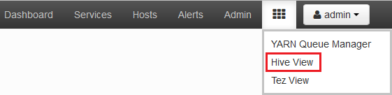
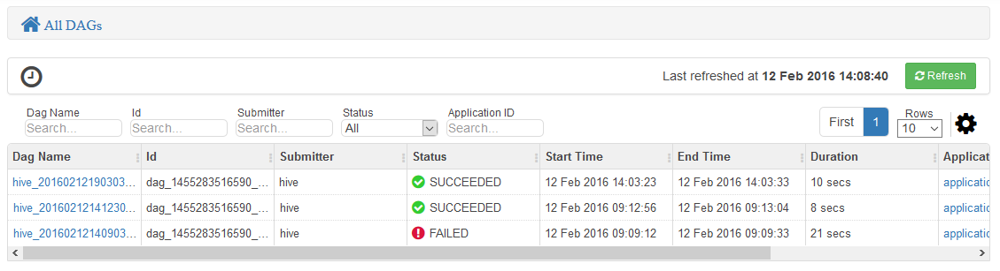
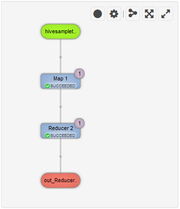

<properties
pageTitle="Utiliser le mode Tez Ambari avec HDInsight | Azure"
description="Découvrez comment utiliser le mode Ambari Tez pour déboguer Tez travaux sur HDInsight."
services="hdinsight"
documentationCenter=""
authors="Blackmist"
manager="jhubbard"
editor="cgronlun"/>

<tags
ms.service="hdinsight"
ms.devlang="na"
ms.topic="article"
ms.tgt_pltfrm="na"
ms.workload="big-data"
ms.date="10/04/2016"
ms.author="larryfr"/>

# Utiliser les affichages Ambari déboguer Tez travaux sur HDInsight

L’interface utilisateur Web Ambari pour HDInsight contient une vue Tez pouvant être utilisées pour comprendre et déboguer les travaux qui utilisent Tez en tant que le moteur d’exécution. L’affichage Tez vous permet de visualiser le travail sous forme de graphique d’éléments connectés, extraire vers chaque élément et extraire des informations de journalisation et statistiques.

> [AZURE.NOTE] Les informations de ce document sont spécifiques aux clusters HDInsight basé sur Linux. Pour plus d’informations sur le débogage des travaux Tez en utilisant HDInsight fonctionnant sous Windows, voir [utiliser l’interface utilisateur Tez pour déboguer Tez travaux sur HDInsight fonctionnant sous Windows](hdinsight-debug-tez-ui.md).

## Conditions préalables

* Un cluster basé sur Linux HDInsight. Les étapes de création d’un nouveau cluster, voir [prise en main à l’aide de HDInsight basé sur Linux](hdinsight-hadoop-linux-tutorial-get-started.md).

* Un navigateur web moderne qui prend en charge HTML5.

## Comprendre Tez

Tez est une infrastructure extensible pour traitement des données dans Hadoop fournissant plus rapidement que traitement MapReduce traditionnel. Pour les clusters basés sur Linux HDInsight, c’est le moteur par défaut pour Hive.

Lorsque le travail est soumis à Tez, il crée un dirigé acycliques Graph (DAG) qui décrit l’ordre d’exécution des actions nécessaires à la tâche. Actions individuelles sont appelées sommets et exécuter une partie de l’ensemble du travail. L’exécution réelle du travail décrite par un sommet est appelée une tâche et peut être distribuée entre plusieurs nœuds dans le cluster.

### Présentation de la vue Tez

L’affichage Tez fournit des informations sur les processus qui sont en cours d’exécution, ou que vous avez précédemment exécutaient à l’aide de Tez. Il vous permet d’afficher la DAG généré par Tez, comment il est distribué entre clusters, compteurs tels que mémoire utilisée par les tâches et les sommets et les informations d’erreur. Il peut proposer des informations utiles dans les scénarios suivants :

* Processus, affichage de l’avancement de la carte et réduire les tâches de contrôle longue.

* Analyse des données historiques pour les processus réussies ou découvrir comment traitement pourrait être amélioré ou pourquoi il a échoué.

## Générer un DAG

L’affichage Tez inclut uniquement les données si une tâche qui utilise le moteur Tez est en cours d’exécution, ou a été exécuté par le passé. Les requêtes simples Hive généralement peuvent être résolus sans utiliser Tez, des requêtes toutefois plus complexes qu’effectuer le filtrage, le regroupement, classement, jointures, etc. nécessitent généralement Tez.

Utilisez les étapes suivantes pour exécuter une requête Hive qui s’exécute à l’aide de Tez.

1. Dans un navigateur web, accédez à https://CLUSTERNAME.azurehdinsight.net, où __CLUSTERNAME__ est le nom de votre cluster HDInsight.

2. Dans le menu en haut de la page, sélectionnez l’icône __d’affichages__ . Cela ressemble à une série des carrés. Dans la liste déroulante qui apparaît, sélectionnez __Afficher la ruche__. 

    

3. Lorsque la Hive affichez charges, collez ce qui suit dans l’éditeur de requête, puis cliquez sur __exécuter__.

        select market, state, country from hivesampletable where deviceplatform='Android' group by market, country, state;
    
    Une fois la tâche terminée, vous devriez voir le résultat affiché dans la section __Résultats de processus de la requête__ . Les résultats doivent être semblables au suivant
    
        market  state       country
        en-GB   Hessen      Germany
        en-GB   Kingston    Jamaica
        
4. Sélectionnez l’onglet __journal__ . Vous verrez des informations similaires à ce qui suit :
    
        INFO : Session is already open
        INFO :

        INFO : Status: Running (Executing on YARN cluster with App id application_1454546500517_0063)

    Enregistrer la valeur __d’id de l’application__ , car il sera utilisé dans la section suivante.

## Utiliser l’affichage Tez

1. Dans le menu en haut de la page, sélectionnez l’icône __d’affichages__ . Dans la liste déroulante qui apparaît, sélectionnez __affichage Tez__.

    

2. Lors du chargement de l’affichage Tez, vous verrez une liste de DAGs qui sont en cours d’exécution, ou qui ont été exécuté sur le cluster. L’affichage par défaut inclut les Dag Name, Id, expéditeur, état, l’heure de début, heure de fin, durée, ID de l’Application et file d’attente. Autres colonnes peuvent être ajoutés à l’aide de l’icône d’engrenage à droite de la page.

    

3. Si vous avez une seule entrée, il sera pendant la requête que vous avez exécutés dans la section précédente. Si vous avez plusieurs entrées, vous pouvez rechercher en entrant l’ID de l’application dans le champ __ID de l’Application__ et appuyez sur ENTRÉE.

4. Sélectionnez le __Nom Dag__. Informations sur la DAG, ainsi que l’option pour télécharger un fichier zip de fichiers JSON qui contiennent des informations sur la DAG s’affiche.

    

5. Au-dessus des __Détails DAG__ sont plusieurs liens qui peuvent être utilisés pour afficher des informations sur la DAG.

    * __DAG compteurs__ affiche les informations des compteurs pour cette DAG.
    
    * __Représentation graphique__ affiche une représentation graphique de cette DAG.
    
    * __Tous les sommets__ affiche une liste des sommets dans cette DAG.
    
    * __Toutes les tâches__ affiche une liste des tâches pour tous les sommets dans cette DAG.
    
    * __Tous les TaskAttempts__ affiche des informations sur les tentatives d’exécuter des tâches pour cette DAG.
    
    > [AZURE.NOTE] Si vous faites défiler l’affichage des colonnes pour les sommets, tâches et TaskAttempts, vous constatez qu’il existe des liens pour afficher des __compteurs__ et __consulter ou télécharger les journaux__ pour chaque ligne.

    Si une défaillance avec le travail s’est produite, les détails DAG affiche un statut Échec, ainsi que des liens vers des informations sur la tâche qui a échoué. Informations de diagnostic seront afficheront sous les détails DAG.
    
    

7. Sélectionnez la __vue graphique__. Cela permet d’afficher une représentation graphique de la DAG. Vous pouvez placer la souris sur chaque sommet dans l’affichage pour afficher des informations à ce sujet.

    

8. En cliquant sur un sommet charge le __Sommet détails__ concernant cet élément. Cliquez sur le sommet __1 carte__ pour afficher des détails sur cet élément.

    

9. Notez que vous avez maintenant des liens en haut de la page qui sont liées aux sommets et aux tâches.

    > [AZURE.NOTE] Vous pouvez également soumis à cette page en pour revenir à __DAG détails__, en sélectionnant __Détails sommet__et en sélectionnant le sommet __1 carte__ .

    * __Sommet compteurs__ affiche les informations de compteur pour ce sommet.
    
    * __Tâches__ affiche les tâches pour ce sommet.
    
    * __Essaie de tâche__ affiche des informations sur les tentatives d’exécution des tâches pour ce sommet.
    
    * __Sources et les récepteurs__ affiche des sources de données et les récepteurs pour ce sommet.

    > [AZURE.NOTE] Comme avec le menu précédent, vous pouvez faire défiler l’affichage des colonnes pour les tâches, tâches tentatives, Sources et Sinks__ afficher des liens vers des informations supplémentaires pour chaque élément.

10. Sélectionnez __tâches__et puis sélectionnez l’élément nommé __00_000000__. Ceci affiche les __Détails de la tâche__ pour cette tâche. À partir de cet écran, vous pouvez afficher __Des compteurs de tâche__ et __Tentatives de tâche__.

    

## Étapes suivantes

À présent que vous avez appris à utiliser l’affichage Tez, apprenez-en davantage sur [L’utilisation de la ruche sur HDInsight](hdinsight-use-hive.md).

Pour plus d’informations techniques sur Tez, consultez la [page Tez en Hortonworks](http://hortonworks.com/hadoop/tez/).

Pour plus d’informations sur l’utilisation de Ambari avec HDInsight, voir [clusters HDInsight gérer à l’aide de l’interface utilisateur Web Ambari](hdinsight-hadoop-manage-ambari.md)
