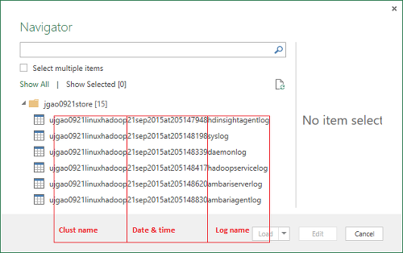

<properties
    pageTitle="Déboguer Hadoop dans HDInsight : consulter les journaux et interpréter les messages d’erreur | Microsoft Azure"
    description="Obtenir des informations sur les messages d’erreur que vous pouvez recevoir lors de l’administration HDInsight à l’aide de PowerShell et les mesures que vous pouvez utiliser pour récupérer."
    services="hdinsight"
    tags="azure-portal"
    editor="cgronlun"
    manager="jhubbard"
    authors="mumian"
    documentationCenter=""/>

<tags
    ms.service="hdinsight"
    ms.workload="big-data"
    ms.tgt_pltfrm="na"
    ms.devlang="na"
    ms.topic="article"
    ms.date="09/02/2016"
    ms.author="jgao"/>

# Analyser les journaux HDInsight

Chaque cluster Hadoop dans Azure HDInsight dispose d’un compte de stockage Azure utilisé comme le système de fichiers par défaut. Le compte de stockage est appelé le compte de stockage par défaut. Cluster utilise le stockage de Table Azure et le stockage Blob sur le compte de stockage par défaut pour stocker ses journaux.  Pour déterminer le compte de stockage par défaut pour votre cluster, voir [Hadoop gérer les groupes dans un HDInsight](hdinsight-administer-use-management-portal.md#find-the-default-storage-account). Les journaux conservent dans le compte de stockage, même une fois que le cluster est supprimé.

##Journaux écrites dans Tables Azure

Les journaux écrites dans Azure Tables fournissent un niveau de claires sur quoi de neuf avec un cluster HDInsight.

Lorsque vous créez un cluster de HDInsight, 6 tables sont automatiquement créés pour basé sur Linux des groupes dans le stockage de Table par défaut :

- hdinsightagentlog
- journal système
- démongestionnaire
- hadoopservicelog
- ambariserverlog
- ambariagentlog

3 tables sont créées pour clusters basés sur Windows :

- Setuplog : journal des événements/exceptions rencontrée dans mise en service/la configuration de clusters HDInsight.
- hadoopinstalllog : journal des événements/exceptions rencontrés lors de l’installation Hadoop sur le cluster. Ce tableau peut être utile dans le débogage des problèmes liés aux clusters créés avec des paramètres personnalisés.
- hadoopservicelog : journal des événements/exceptions enregistré par tous les services Hadoop. Ce tableau peut être utile dans le débogage des problèmes liés aux échecs des tâches sur des clusters HDInsight.

Les noms de fichier de tableau sont **u<ClusterName>DDMonYYYYatHHMMSSsss<TableName>**.

Ces tableaux contient les champs suivants :

- ClusterDnsName
- NomComposant
- EventTimestamp
- Hôte
- MALoggingHash
- Message
- N
- PreciseTimeStamp
- Rôle
- RowIndex
- Client
- HORODATAGE
- TraceLevel

### Outils pour l’accès aux journaux

Il existe de nombreux outils permettent d’accéder aux données de ces tables :

-  Visual Studio
-  Explorateur de stockage Azure
-  Power Query pour Excel

#### Utilisation de Power Query pour Excel

Power Query peut être installé à partir de [www.microsoft.com/en-us/download/details.aspx?id=39379]( http://www.microsoft.com/en-us/download/details.aspx?id=39379). Afficher la page de téléchargement pour la configuration requise

**Utiliser Power Query pour ouvrir et analyser le journal de service**

1. Ouvrez **Microsoft Excel**.
2. Dans le menu de **Power Query** , cliquez sur **à partir d’Azure**, puis cliquez sur **à partir de Microsoft Azure Table storage**.
 
    
3. Entrez le nom de compte de stockage. Cela peut être le nom court ou le nom de domaine complet.
4. Entrez la clé de compte de stockage. Vous doit afficher la liste des tables :

    
5. Avec le bouton droit de la table hadoopservicelog dans le volet **navigateur** , puis sélectionnez **Modifier**. 4 colonnes s’affiche. Vous pouvez également supprimer les colonnes de **Clé de Partition**, la **Clé de ligne**et **horodatage** en les sélectionnant, puis en cliquant sur **Supprimer les colonnes** à partir des options dans le ruban.
6. Cliquez sur l’icône Développer la colonne contenue pour choisir les colonnes que vous souhaitez importer dans la feuille de calcul Excel. Pour cette démonstration, j’ai choisi TraceLevel et NomComposant : elle me peut donner des informations de base sur laquelle les composants avaient problèmes.

    
7. Cliquez sur **OK** pour importer les données.
8. Sélectionnez les colonnes **TraceLevel**, le rôle et **NomComposant** , puis cliquez sur **Regrouper par** contrôle dans le ruban.
9. Cliquez sur **OK** dans la boîte de dialogue Regrouper par
10. Cliquez sur** appliquer et fermer**.
 
Vous pouvez maintenant utiliser Excel pour filtrer et trier comme bon vous semble. Bien entendu, vous souhaiterez peut-être inclure d’autres colonnes (par exemple, Message) pour Explorer les problèmes lorsqu’ils se produisent, mais sélectionner et à grouper les colonnes ci-dessus fournit une image de quoi de neuf avec les services Hadoop correcte. La même idée peut être appliquée aux tables setuplog et hadoopinstalllog.

#### Utilisez Visual Studio

**Utiliser Visual Studio**

1. Ouvrez Visual Studio.
2. Dans le menu **affichage** , cliquez sur **Explorateur de Cloud**. Ou cliquez simplement sur **CTRL +\, CTRL + X**.
3. **Cloud Explorer**, sélectionnez **Types de ressources**.  L’autre option disponible est **Groupes de ressources**.
4. Développez les **Comptes de stockage**, le compte de stockage par défaut pour votre cluster, puis **Tables**.
5. Double-cliquez sur **hadoopservicelog**.
6. Ajouter un filtre. Par exemple :
    
        TraceLevel eq 'ERROR'

    

    Pour plus d’informations sur la création de filtres, voir [Créer des chaînes de filtrage pour le Concepteur de tables](../vs-azure-tools-table-designer-construct-filter-strings.md).
 
##Journaux générés à Azure Blob Storage

[Les journaux écrites dans Azure Tables](#log-written-to-azure-tables) fournissent un niveau de claires sur quoi de neuf avec un cluster HDInsight. Toutefois, ces tables ne fournissent pas les journaux au niveau des tâches, qui peuvent être utiles pour extraire en problèmes lorsqu’ils se produisent. Pour fournir ce prochain niveau de détail, HDInsight clusters sont configurés pour écrire des journaux des tâches à votre compte de stockage d’objets Blob pour n’importe quelle tâche qui sera envoyé via Templeton. En pratique, cela signifie que travaux envoyé à l’aide des applets de commande Microsoft Azure PowerShell ou les API de soumission de travail .NET, pas les travaux soumis par le biais RDP/ligne de commande l’accès au cluster. 

Pour afficher les journaux, voir [application Access fils ouvre une session sur HDInsight basé sur Linux](hdinsight-hadoop-access-yarn-app-logs-linux.md).

Pour plus d’informations sur les journaux des applications, voir [Gestion des journaux d’utilisateur Simplifying et access dans fils](http://hortonworks.com/blog/simplifying-user-logs-management-and-access-in-yarn/).
 
 
## Afficher les journaux d’état et de la tâche cluster

###Interface utilisateur Access Hadoop

À partir du portail Azure, cliquez sur un nom de cluster HDInsight pour ouvrir la carte cluster. À partir de la carte cluster, cliquez sur **tableau de bord**.

Lorsque vous y êtes invité, entrez les informations d’identification administrateur de cluster. Dans la Console de requête qui s’ouvre, cliquez sur **L’interface utilisateur Hadoop**.

###Accéder à l’interface utilisateur de fils

À partir du portail Azure, cliquez sur un nom de cluster HDInsight pour ouvrir la carte cluster. À partir de la carte cluster, cliquez sur **tableau de bord**. Lorsque vous y êtes invité, entrez les informations d’identification administrateur de cluster. Dans la Console de requête qui s’ouvre, cliquez sur **L’interface utilisateur fils**.

Vous pouvez utiliser l’interface utilisateur de fils pour effectuer les opérations suivantes :

* **Obtenir l’état de cluster**. Dans le volet gauche, développez le **Cluster**, puis cliquez sur à **propos**. Cette présent cluster détails de l’état comme total alloué de la mémoire, cœurs utilisés, état du Gestionnaire de ressources cluster, cluster version etc..

    

* **Obtenir le nœud statut**. Dans le volet gauche, développez **Cluster**, puis cliquez sur **les nœuds**. Répertorie tous les nœuds du cluster, l’adresse HTTP de chaque nœud, les ressources affectées à chaque nœud, etc..

* **Surveiller l’état du travail**. Dans le volet gauche, développez **Cluster**, puis cliquez sur **Applications** pour répertorier toutes les tâches dans le cluster. Si vous souhaitez examiner les tâches dans un état spécifique (par exemple, nouveau, envoyé, en cours d’exécution, etc.), cliquez sur le lien approprié sous **Applications**. Vous pouvez plus cliquer sur le nom du travail pour en savoir plus sur la tâche tel, y compris la sortie, les journaux, etc..

###Accéder à l’interface utilisateur HBase

À partir du portail Azure, cliquez sur un nom de cluster HDInsight HBase pour ouvrir la carte cluster. À partir de la carte cluster, cliquez sur **tableau de bord**. Lorsque vous y êtes invité, entrez les informations d’identification administrateur de cluster. Dans la Console de requête qui s’ouvre, cliquez sur **L’interface utilisateur HBase**.

## Codes d’erreur HDInsight

Les messages d’erreur détaillés dans cette section sont fournies pour aider les utilisateurs de Hadoop dans Azure HDInsight les conditions d’erreur possibles que qu’ils peuvent rencontrer lors de l’administration du service à l’aide de PowerShell Azure et les conseils sur les étapes qui peuvent être prises pour récupérer l’erreur.

Certains de ces messages d’erreur pourraient également être vues dans le portail Azure lorsqu’elle est utilisée pour gérer les clusters HDInsight. Autres messages d’erreur que vous pouvez rencontrer, mais il existe moins précis en raison des contraintes sur les actions de réparation possibles dans ce contexte. Autres messages d’erreur sont fournies dans les contextes où l’atténuation est évidente. 

### AtleastOneSqlMetastoreMustBeProvided
- **Description**: Veuillez fournir des détails de base de données SQL Azure au moins un composant pour pouvoir utiliser des paramètres personnalisés pour metastores Hive et Oozie.
- **Atténuation**: l’utilisateur doit fournir un metastore SQL Azure valide et renouvelez la demande.  

### AzureRegionNotSupported
- **Description**: Impossible de créer le cluster dans la région *nameOfYourRegion*. Utiliser une région HDInsight valide et réessayer de demande.
- **Atténuation**: client doit créer la région cluster qui les prend en charge actuellement : Asie du Sud-est, Europe ouest, Europe du Nord, US Extrême-Orient ou États-Unis Ouest.  

### ClusterContainerRecordNotFound
- **Description**: le serveur n’a pas trouvé l’enregistrement cluster demandé.  
- **Atténuation**: recommencez l’opération.

### ClusterDnsNameInvalidReservedWord
- **Description**: Cluster DNS nom *yourDnsName* n’est pas valide. Vérifiez que le nom commence et se termine par alphanumérique et ne peut contenir '-' un caractère spécial  
- **Atténuation**: Assurez-vous que vous avez utilisé un nom DNS valide pour votre cluster qui démarre et se termine par alphanumérique et ne contient aucun spéciaux caractères autre que le tiret «- », puis recommencez l’opération.

### ClusterNameUnavailable
- **Description**: Cluster nom *yourClusterName* n’est pas disponible. Choisissez un autre nom.  
- **Atténuation**: l’utilisateur doit spécifier un clustername est unique et n’existe pas et réessayez. Si l’utilisateur utilise le portail, l’interface utilisateur vous indiquera les si un nom de cluster est déjà utilisé au cours des étapes de création.

### ClusterPasswordInvalid
- **Description**: mot de passe Cluster n’est pas valide. Mot de passe doit contenir au moins 10 caractères et doit contenir au moins un chiffre, majuscules, minuscules et un caractère spécial sans espace et ne doit pas contenir le nom d’utilisateur dans le cadre de celle-ci.  
- **Atténuation**: fournir un mot de passe cluster valide et recommencez l’opération.

### ClusterUserNameInvalid
- **Description**: nom d’utilisateur Cluster n’est pas valide. Vérifiez que le nom d’utilisateur ne contient des caractères spéciaux ou des espaces.  
- **Atténuation**: fournir un nom d’utilisateur cluster valide et recommencez l’opération.

### ClusterUserNameInvalidReservedWord
- **Description**: Cluster DNS nom *yourDnsClusterName* n’est pas valide. Vérifiez que le nom commence et se termine par alphanumérique et ne peut contenir '-' un caractère spécial  
- **Atténuation**: fournir un nom d’utilisateur de cluster DNS valide et recommencez l’opération.

### ContainerNameMisMatchWithDnsName
- **Description**: nom du conteneur dans URI *yourcontainerURI* et DNS nom *yourDnsName* dans le corps de la requête doivent être identique.  
- **Atténuation**: Assurez-vous que le conteneur de votre nom et votre nom de DNS sont les mêmes et recommencez l’opération.

### DataNodeDefinitionNotFound
- **Description**: configuration cluster non valide. Impossible de trouver les définitions de nœud données taille nœud.  
- **Atténuation**: recommencez l’opération.

### DeploymentDeletionFailure
- **Description**: Échec de la suppression du déploiement pour le Cluster  
- **Atténuation**: recommencez l’opération de suppression.

### DnsMappingNotFound
- **Description**: erreur de configuration du Service. Informations de mappage DNS requises non trouvées.  
- **Atténuation**: supprimez cluster et créez un nouveau cluster.

### DuplicateClusterContainerRequest
- **Description**: dupliquer tentative de création de conteneur cluster. Enregistrement n’existe pour *nameOfYourContainer* mais Etags ne correspondent pas.
- **Atténuation**: fournir un nom unique pour le conteneur et recommencez l’opération de création.

### DuplicateClusterInHostedService
- **Description**: service hébergé *nameOfYourHostedService* contient déjà un cluster. Un service hébergé ne peut pas contenir plusieurs clusters  
- **Atténuation**: héberger le cluster dans un autre service hébergé.

### FailureToUpdateDeploymentStatus
- **Description**: le serveur n’a pas pu mettre à jour l’état du déploiement cluster.  
- **Atténuation**: recommencez l’opération. Si cela se produit plusieurs fois, contactez CSS.

### HdiRestoreClusterAltered
- **Description**: Cluster *yourClusterName* a été supprimé dans le cadre de la maintenance. Recréez le cluster.
- **Atténuation**: recréer le cluster.

### HeadNodeConfigNotFound
- **Description**: configuration cluster non valide. Configuration requise nœud de tête non trouvée dans tailles nœud.
- **Atténuation**: recommencez l’opération.

### HostedServiceCreationFailure
- **Description**: Impossible de créer le service hébergé *nameOfYourHostedService*. Veuillez réessayer demande.  
- **Atténuation**: relancer la demande.

### HostedServiceHasProductionDeployment
- **Description**: Service hébergé *nameOfYourHostedService* possède déjà un déploiement de production. Un service hébergé ne peut pas contenir plusieurs déploiements de production. Relancer la demande avec un nom de cluster différent.
- **Atténuation**: utiliser un nom de cluster différent, puis retentez la demande.

### HostedServiceNotFound
- **Description**: hébergé Service *nameOfYourHostedService* pour le cluster n’a pas pu être trouvé.  
- **Atténuation**: si le cluster est dans un état d’erreur, supprimez-le et réessayez.

### HostedServiceWithNoDeployment
- **Description**: Service hébergé *nameOfYourHostedService* n’a aucun déploiement associé.  
- **Atténuation**: si le cluster est dans un état d’erreur, supprimez-le et réessayez.

### InsufficientResourcesCores
- **Description**: le SubscriptionId *yourSubscriptionId* n’a pas de cœurs gauche à créer cluster *yourClusterName*. Obligatoire : *resourcesRequired*, disponible : *resourcesAvailable*.  
- **Atténuation**: libérer des ressources dans votre abonnement ou augmenter les ressources disponibles pour l’abonnement et essayez à nouveau de créer le cluster.

### InsufficientResourcesHostedServices
- **Description**: ID de l’abonnement *yourSubscriptionId* n’a pas de quota pour un nouveau HostedService créer cluster *yourClusterName*.  
- **Atténuation**: libérer des ressources dans votre abonnement ou augmenter les ressources disponibles pour l’abonnement et essayez à nouveau de créer le cluster.

### InternalErrorRetryRequest
- **Description**: le serveur a rencontré une erreur interne. Veuillez réessayer demande.  
- **Atténuation**: relancer la demande.

### InvalidAzureStorageLocation
- **Description**: emplacement de stockage Azure *dataRegionName* n’est pas un emplacement valide. Assurez-vous que la zone est correcte et renvoyez demande.
- **Atténuation**: sélectionnez un emplacement de stockage qui prend en charge HDInsight, vérifiez que votre cluster se trouve co-création et recommencez l’opération.

### InvalidNodeSizeForDataNode
- **Description**: taille de mémoire virtuelle non valide pour les nœuds de données. Taille du 'Grande mémoire virtuelle' uniquement est pris en charge pour tous les nœuds de données.  
- **Atténuation**: spécifiez la taille de nœud pris en charge pour le nœud de données et recommencez l’opération.

### InvalidNodeSizeForHeadNode
- **Description**: taille de mémoire virtuelle non valides pour le nœud de tête. Taille du 'Extra-large XXL mémoire virtuelle' uniquement est pris en charge pour le nœud de tête.  
- **Atténuation**: spécifiez la taille de nœud pris en charge pour le nœud de tête et recommencez l’opération

### InvalidRightsForDeploymentDeletion
- **Description**: ID de l’abonnement *yourSubscriptionId* en cours d’utilisation n’a pas les autorisations suffisantes pour exécuter l’opération de suppression de cluster *yourClusterName*.  
- **Atténuation**: si le cluster est dans un état d’erreur, déposez-la, puis réessayez.  

### InvalidStorageAccountBlobContainerName
- **Description**: stockage externe compte blob conteneur nom *yourContainerName* n’est pas valide. Assurez-vous que nom commence par une lettre et contient uniquement des lettres minuscules, des nombres et des tiret.  
- **Atténuation**: attribuez un nom de conteneur de stockage valide compte blob et recommencez l’opération.

### InvalidStorageAccountConfigurationSecretKey
- **Description**: Configuration compte de stockage externe *yourStorageAccountName* est requis pour que les informations clé secrètes à définir.  
- **Atténuation**: spécifiez une clé secrète valide pour le compte de stockage et recommencez l’opération.

### InvalidVersionHeaderFormat
- **Description**: Version en-tête *yourVersionHeader* n’est pas au format valide d’aaaa-mm-jj.  
- **Atténuation**: spécifiez un format valide pour l’en-tête de version et renouvelez la demande.

### MoreThanOneHeadNode
- **Description**: configuration cluster non valide. Trouver plus d’une configuration nœud principal.  
- **Atténuation**: modifier la configuration onloy un des nœuds tête sont spécifié.

### OperationTimedOutRetryRequest
- **Description**: l’opération impossible dans le délai autorisé ou le nombre maximal de nouvelles tentatives possible. Veuillez réessayer demande.  
- **Atténuation**: relancer la demande.

### ParameterNullOrEmpty
- **Description**: paramètre *yourParameterName* ne peut pas être vide ou null.  
- **Atténuation**: spécifiez une valeur valide pour le paramètre.

### PreClusterCreationValidationFailure
- **Description**: un ou plusieurs des entrées de demande de création de cluster ne sont pas valide. Vérifiez que les valeurs d’entrée sont corrects et réessayer de demande.  
- **Atténuation**: Vérifiez que les valeurs d’entrée sont corrects et réessayer de demande.

### RegionCapabilityNotAvailable
- **Description**: fonctionnalité région non disponible pour la région *yourRegionName* et ID de l’abonnement *yourSubscriptionId*.  
- **Atténuation**: permet de spécifier une région qui prend en charge clusters HDInsight. Les zones publiquement pris en charge sont : Asie du Sud-est, Europe ouest, Europe du Nord, US Extrême-Orient ou États-Unis Ouest.

### StorageAccountNotColocated
- **Description**: stockage compte *yourStorageAccountName* se trouve dans la région *currentRegionName*. Il doit être identique à région de cluster *yourClusterRegionName*.  
- **Atténuation**: spécifiez un compte de stockage dans la même région figurant dans votre cluster ou si vos données se trouvent déjà dans le compte de stockage, créez un nouveau cluster dans la même région en tant que le compte de stockage existant. Si vous utilisez le portail, l’interface utilisateur vous avertit de ce problème à l’avance.

### SubscriptionIdNotActive
- **Description**: étant donné les ID de l’abonnement *yourSubscriptionId* n’est pas actif.  
- **Atténuation**: réactiver votre abonnement ou obtenir un nouvel abonnement valide.

### SubscriptionIdNotFound
- **Description**: ID de l’abonnement *yourSubscriptionId* n’a pas pu être trouvé.  
- **Atténuation**: Vérifiez que votre ID de l’abonnement est valide et recommencez l’opération.

### UnableToResolveDNS
- **Description**: Impossible de résoudre DNS *yourDnsUrl*. Vérifiez que l’URL du point de terminaison blob complet est fourni.  
- **Atténuation**: fournir une URL de blob valide. L’URL doit être entièrement valide, y compris commençant par *http://* et se termine par *.com*.

### UnableToVerifyLocationOfResource
- **Description**: Impossible de vérifier l’emplacement de la ressource *yourDnsUrl*. Vérifiez que l’URL du point de terminaison blob complet est fourni.  
- **Atténuation**: fournir une URL de blob valide. L’URL doit être entièrement valide, y compris commençant par *http://* et se termine par *.com*.

### VersionCapabilityNotAvailable
- **Description**: fonctionnalité Version non disponible pour la version *specifiedVersion* et ID de l’abonnement *yourSubscriptionId*.  
- **Atténuation**: choisir une version n’est disponible et recommencez l’opération.

### VersionNotSupported
- **Description**: Version *specifiedVersion* non pris en charge.
- **Atténuation**: choisir une version prise en charge et recommencez l’opération.

### VersionNotSupportedInRegion
- **Description**: Version *specifiedVersion* n’est pas disponible dans la région Azure *specifiedRegion*.  
- **Atténuation**: choisir une version prise en charge dans la zone spécifiée et recommencez l’opération.

### WasbAccountConfigNotFound
- **Description**: configuration cluster non valide. Configuration de compte WASB requis non trouvée dans comptes externes.  
- **Atténuation**: vérifier que le compte existe et est correctement spécifié dans la configuration et recommencez l’opération.

## Étapes suivantes

- [Utiliser les affichages Ambari déboguer Tez travaux sur HDInsight](hdinsight-debug-ambari-tez-view.md)
- [Activer le vidage de segment pour les services Hadoop sur HDInsight basé sur Linux](hdinsight-hadoop-collect-debug-heap-dump-linux.md)
- [Gérer les clusters HDInsight à l’aide de l’interface utilisateur Web Ambari](hdinsight-hadoop-manage-ambari.md)
