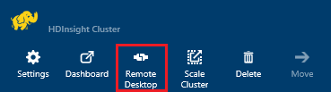
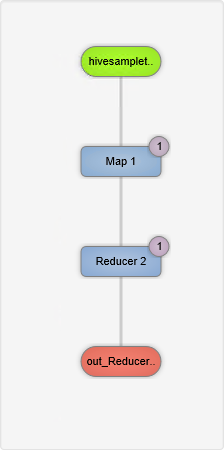

<properties
pageTitle="Utiliser l’interface utilisateur Tez avec fonctionnant sous Windows HDInsight | Azure"
description="Découvrez comment utiliser le Tez UI déboguer travaux Tez sur fonctionnant sous Windows HDInsight HDInsight."
services="hdinsight"
documentationCenter=""
authors="Blackmist"
manager="jhubbard"
editor="cgronlun"/>

<tags
ms.service="hdinsight"
ms.devlang="na"
ms.topic="article"
ms.tgt_pltfrm="na"
ms.workload="big-data"
ms.date="10/04/2016"
ms.author="larryfr"/>

# Utiliser la Tez UI pour déboguer Tez travaux sur HDInsight fonctionnant sous Windows

La Tez UI est une page web pouvant être utilisées pour comprendre et déboguer les travaux qui utilisent Tez en tant que le moteur d’exécution sur les clusters HDInsight fonctionnant sous Windows. La Tez UI vous permet de visualiser le travail sous forme de graphique d’éléments connectés, extraire vers chaque élément et récupérer des statistiques et des informations de journalisation.

> [AZURE.NOTE] Les informations de ce document sont spécifiques aux clusters HDInsight fonctionnant sous Windows. Pour plus d’informations sur l’affichage et le débogage Tez sur basé sur Linux HDInsight, voir [Utiliser les affichages Ambari déboguer Tez travaux sur HDInsight](hdinsight-debug-ambari-tez-view.md).

## Conditions préalables

* Un cluster HDInsight fonctionnant sous Windows. Les étapes de création d’un nouveau cluster, voir [prise en main à l’aide de HDInsight fonctionnant sous Windows](hdinsight-hadoop-tutorial-get-started-windows.md).

    > [AZURE.IMPORTANT] La Tez UI n’est disponible sur les clusters basés sur Windows HDInsight créés après le 8 février 2016.

* Un client de bureau à distance fonctionnant sous Windows.

## Comprendre Tez

Tez est une infrastructure extensible pour traitement des données dans Hadoop fournissant plus rapidement que traitement MapReduce traditionnel. Pour les clusters HDInsight fonctionnant sous Windows, il est un moteur facultatif que vous pouvez activer pour Hive à l’aide de la commande suivante dans le cadre de votre requête Hive :

    set hive.execution.engine=tez;

Lorsque le travail est soumis à Tez, il crée un dirigé acycliques Graph (DAG) qui décrit l’ordre d’exécution des actions nécessaires à la tâche. Actions individuelles sont appelées sommets et exécuter une partie de l’ensemble du travail. L’exécution réelle du travail décrite par un sommet est appelée une tâche et peut être distribuée entre plusieurs nœuds dans le cluster.

### Présentation de l’interface utilisateur Tez

La Tez UI est qu'une page web fournit des informations sur les processus qui sont en cours d’exécution, ou que vous avez précédemment exécutaient à l’aide de Tez. Il vous permet d’afficher la DAG généré par Tez, comment il est distribué entre clusters, compteurs tels que mémoire utilisée par les tâches et les sommets et les informations d’erreur. Il peut proposer des informations utiles dans les scénarios suivants :

* Processus, affichage de l’avancement de la carte et réduire les tâches de contrôle longue.

* Analyse des données historiques pour les processus réussies ou découvrir comment traitement pourrait être amélioré ou pourquoi il a échoué.

## Générer un DAG

La Tez UI inclut uniquement les données si une tâche qui utilise le moteur Tez est en cours d’exécution, ou a été exécuté par le passé. Les requêtes simples Hive généralement peuvent être résolus sans utiliser Tez, des requêtes toutefois plus complexes qu’effectuer le filtrage, le regroupement, classement, jointures, etc. nécessitent généralement Tez.

Utilisez les étapes suivantes pour exécuter une requête Hive qui s’exécute à l’aide de Tez.

1. Dans un navigateur web, accédez à https://CLUSTERNAME.azurehdinsight.net, où __CLUSTERNAME__ est le nom de votre cluster HDInsight.

2. Dans le menu en haut de la page, sélectionnez l' __Éditeur ruche__. Une page avec l’exemple de requête suivant s’affiche.

        Select * from hivesampletable

    Effacer l’exemple de requête et le remplacer par les éléments suivants.

        set hive.execution.engine=tez;
        select market, state, country from hivesampletable where deviceplatform='Android' group by market, country, state;

3. Sélectionnez le bouton __Envoyer__ . La section __Session de travail__ dans la partie inférieure de la page affiche l’état de la requête. Une fois que le statut devient __terminé__, sélectionnez le lien __Afficher les détails__ pour afficher les résultats. La __Sortie des tâches__ doit être semblable à ce qui suit :
        
        en-GB   Hessen      Germany
        en-GB   Kingston    Jamaica
        en-GB   Nairobi Area    Kenya

## Utilisez l’interface utilisateur Tez

> [AZURE.NOTE] La Tez UI n’est disponible à partir du bureau des nœuds de tête du cluster, vous devez utiliser Bureau à distance pour vous connecter aux nœuds de tête.

1. À partir du [portail Azure](https://portal.azure.com), sélectionnez votre cluster HDInsight. À partir du haut de la cuillère HDInsight, sélectionnez l’icône de __Bureau à distance__ . Cela permet d’afficher la carte de bureau à distance

    

2. À partir de la carte de bureau à distance, sélectionnez __se connecter__ pour vous connecter au nœud de tête cluster. Lorsque vous y êtes invité, utilisez le nom d’utilisateur cluster Bureau à distance et le mot de passe pour authentifier la connexion.

    

    > [AZURE.NOTE] Si vous n’avez pas activé la connectivité Bureau à distance, fournir un nom d’utilisateur, le mot de passe et la date d’expiration, puis sélectionnez __Activer__ pour activer le Bureau à distance. Une fois qu’il a été activé, suivez les étapes précédentes pour vous connecter.

3. Une fois connecté, ouvrez Internet Explorer sur le Bureau à distance, sélectionnez l’icône d’engrenage dans le coin supérieur droit du navigateur, puis sur __Paramètres d’affichage de compatibilité__.

4. À partir du bas de __Paramètres d’affichage de compatibilité__, désactivez la case à cocher pour __les sites intranet affichage en mode de compatibilité__ et __listes de compatibilité utilisez Microsoft__et puis sélectionnez __Fermer__.

5. Dans Internet Explorer, accédez à http://headnodehost:8188/tezui / #/. Cela permet d’afficher la Tez UI

    

    Lors du chargement de la Tez UI, vous verrez une liste de DAGs qui sont en cours d’exécution, ou qui ont été exécuté sur le cluster. L’affichage par défaut inclut les Dag Name, Id, expéditeur, état, l’heure de début, heure de fin, durée, ID de l’Application et file d’attente. Autres colonnes peuvent être ajoutés à l’aide de l’icône d’engrenage à droite de la page.

    Si vous avez une seule entrée, il sera pendant la requête que vous avez exécutés dans la section précédente. Si vous avez plusieurs entrées, vous pouvez effectuer une recherche en entrant des critères de recherche dans les champs situés au-dessus des DAGs, puis appuyez sur __entrée__.

4. Sélectionnez le __Nom Dag__ pour l’entrée DAG plus récente. Informations sur la DAG, ainsi que l’option pour télécharger un fichier zip de fichiers JSON qui contiennent des informations sur la DAG s’affiche.

    

5. Au-dessus des __Détails DAG__ sont plusieurs liens qui peuvent être utilisés pour afficher des informations sur la DAG.

    * __DAG compteurs__ affiche les informations des compteurs pour cette DAG.
    
    * __Représentation graphique__ affiche une représentation graphique de cette DAG.
    
    * __Tous les sommets__ affiche une liste des sommets dans cette DAG.
    
    * __Toutes les tâches__ affiche une liste des tâches pour tous les sommets dans cette DAG.
    
    * __Tous les TaskAttempts__ affiche des informations sur les tentatives d’exécuter des tâches pour cette DAG.
    
    > [AZURE.NOTE] Si vous faites défiler l’affichage des colonnes pour les sommets, tâches et TaskAttempts, vous constatez qu’il existe des liens pour afficher des __compteurs__ et __consulter ou télécharger les journaux__ pour chaque ligne.

    Si une défaillance avec le travail s’est produite, les détails DAG affiche un statut Échec, ainsi que des liens vers des informations sur la tâche qui a échoué. Informations de diagnostic seront afficheront sous les détails DAG.

7. Sélectionnez la __vue graphique__. Cela permet d’afficher une représentation graphique de la DAG. Vous pouvez placer la souris sur chaque sommet dans l’affichage pour afficher des informations à ce sujet.

    

8. En cliquant sur un sommet charge le __Sommet détails__ concernant cet élément. Cliquez sur le sommet __1 carte__ pour afficher des détails sur cet élément. Cliquer sur __Confirmer__ pour confirmer la navigation.

    

9. Notez que vous avez maintenant des liens en haut de la page qui sont liées aux sommets et aux tâches.

    > [AZURE.NOTE] Vous pouvez également soumis à cette page en pour revenir à __DAG détails__, en sélectionnant __Détails sommet__et en sélectionnant le sommet __1 carte__ .

    * __Sommet compteurs__ affiche les informations de compteur pour ce sommet.
    
    * __Tâches__ affiche les tâches pour ce sommet.
    
    * __Essaie de tâche__ affiche des informations sur les tentatives d’exécution des tâches pour ce sommet.
    
    * __Sources et les récepteurs__ affiche des sources de données et les récepteurs pour ce sommet.

    > [AZURE.NOTE] Comme avec le menu précédent, vous pouvez faire défiler l’affichage des colonnes pour les tâches, tâches tentatives, Sources et Sinks__ afficher des liens vers des informations supplémentaires pour chaque élément.

10. Sélectionnez __tâches__et puis sélectionnez l’élément nommé __00_000000__. Ceci affiche les __Détails de la tâche__ pour cette tâche. À partir de cet écran, vous pouvez afficher __Des compteurs de tâche__ et __Tentatives de tâche__.

    

## Étapes suivantes

À présent que vous avez appris à utiliser l’affichage Tez, apprenez-en davantage sur [L’utilisation de la ruche sur HDInsight](hdinsight-use-hive.md).

Pour plus d’informations techniques sur Tez, consultez la [page Tez en Hortonworks](http://hortonworks.com/hadoop/tez/).
