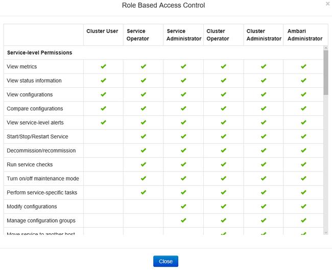

<properties
    pageTitle="Gérer les clusters à un domaine HDInsight | Microsoft Azure"
    description="Découvrez comment gérer les clusters HDInsight à un domaine"
    services="hdinsight"
    documentationCenter=""
    authors="saurinsh"
    manager="jhubbard"
    editor="cgronlun"
    tags=""/>

<tags
    ms.service="hdinsight"
    ms.devlang="na"
    ms.topic="article"
    ms.tgt_pltfrm="na"
    ms.workload="big-data"
    ms.date="10/25/2016"
    ms.author="saurinsh"/>

# Gérer les clusters HDInsight à un domaine (Preview)

Découvrez les utilisateurs et les rôles dans HDInsight à un domaine et comment gérer les clusters de HDInsight à un domaine.

## Utilisateurs de clusters HDInsight à un domaine

Un cluster de HDInsight domaine n’est pas joint comporte deux comptes d’utilisateurs créés lors de la création de cluster :

- **Administrateur Ambari**: ce compte est également connue sous *utilisateur Hadoop* ou *HTTP*. Ce compte peut être utilisé pour vous connecter à Ambari en https://&lt;nomcluster >. azurehdinsight.net. Il peut également être utilisé pour exécuter des requêtes sur les vues Ambari, exécuter des travaux à l’aide des outils externes (PowerShell, Templeton, Visual Studio) et vous authentifier avec le pilote ODBC ruche et outils de décisionnel (par exemple, Excel, PowerBI ou Tableau).

- **Utilisateur SSH**: ce compte peut être utilisé avec SSH et exécuter des commandes sudo. Il possède des privilèges racine pour les ordinateurs virtuels Linux.

Un cluster HDInsight à un domaine possède trois nouveaux utilisateurs outre Ambari administrateur et utilisateur SSH.

- **Administrateur ranger**: ce compte est le compte d’administrateur local Apache Ranger. Il n’est pas un utilisateur de domaine active directory. Ce compte peut être utilisé pour paramétrer les stratégies et n’apportez d’autres administrateurs d’utilisateurs ou les administrateurs délégués (de sorte que les utilisateurs peuvent gérer les stratégies). Par défaut, le nom d’utilisateur est *admin* et le mot de passe est le même que le mot de passe administrateur Ambari. Le mot de passe peut être mis à jour à partir de la page Paramètres dans Ranger.

- **Utilisateur de domaine administrateur cluster**: ce compte est un utilisateur de domaine active directory désigné en tant que l’administrateur de cluster Hadoop, y compris Ambari et Ranger. Vous devez fournir les informations d’identification de cet utilisateur lors de la création de cluster. Cet utilisateur dispose des autorisations suivantes :

    - Joindre des ordinateurs au domaine et placez-les dans l’unité que vous avez spécifié lors de la création de cluster.
    - Créer des identités de service au sein de l’unité d’organisation que vous avez spécifié lors de la création de cluster. 
    - Créer des entrées DNS inverses.

    Notez que les autres utilisateurs AD également posséder les privilèges. 

    Il existe quelques points de terminaison au sein du cluster (par exemple, Templeton) qui ne sont pas gérés par Ranger et par conséquent ne sont pas sécurisés. Ces points de terminaison sont verrouillés pour tous les utilisateurs à l’exception de l’utilisateur du domaine cluster d’administration. 

- **Normal**: au cours de la création d’un cluster, vous pouvez fournir plusieurs groupes active directory. Les utilisateurs de ces groupes sont synchronisés avec Ranger et Ambari. Ces utilisateurs sont des utilisateurs de domaine et auront accès aux seuls gérées Ranger points de terminaison (par exemple, Hiveserver2). Tous les stratégies RBAC et audit sera applicables à ces utilisateurs.

## Rôles de clusters HDInsight à un domaine

HDInsight à un domaine avoir les rôles suivants :

- Administrateur de cluster
- Opérateur de calcul
- Administrateur de service
- Opérateur de service
- Utilisateur

**Pour afficher les autorisations de ces rôles**

1. Ouvrez l’interface utilisateur de gestion Ambari.  Voir [ouverture de l’interface utilisateur de gestion Ambari](#open-the-ambari-management-ui).
2. Dans le menu de gauche, cliquez sur **les rôles**.
3. Cliquez sur le point d’interrogation bleu pour afficher les autorisations :

    

## Ouvrez l’interface utilisateur de gestion Ambari

1. Ouverture de session sur le [portail Azure](https://portal.azure.com).
2. Ouvrez votre cluster HDInsight dans une carte. Voir la [liste et afficher clusters](hdinsight-administer-use-management-portal.md#list-and-show-clusters).
3. Cliquez sur **tableau de bord** dans le menu supérieur pour ouvrir Ambari.
4. Connectez-vous à l’aide du nom d’utilisateur cluster administrateur domaine et le mot de passe de Ambari.
5. Cliquez sur le menu déroulant **administrateur** dans le coin supérieur droit, puis cliquez sur **Gérer les Ambari**.

    

    L’interface utilisateur ressemble à :

    

## Liste des utilisateurs de domaine synchronisés à partir de votre annuaire Active Directory

1. Ouvrez l’interface utilisateur de gestion Ambari.  Voir [ouverture de l’interface utilisateur de gestion Ambari](#open-the-ambari-management-ui).
2. Dans le menu de gauche, cliquez sur **utilisateurs**. Tous les utilisateurs synchronisés à partir d’Active Directory pour le cluster HDInsight s’affiche.

    

## Répertorier les groupes de domaine synchronisés à partir de votre annuaire Active Directory

1. Ouvrez l’interface utilisateur de gestion Ambari.  Voir [ouverture de l’interface utilisateur de gestion Ambari](#open-the-ambari-management-ui).
2. Dans le menu de gauche, cliquez sur **groupes**. Vous doit afficher tous les groupes synchronisés à partir d’Active Directory pour le cluster HDInsight.

    

## Configurer des affichages ruche autorisations

1. Ouvrez l’interface utilisateur de gestion Ambari.  Voir [ouverture de l’interface utilisateur de gestion Ambari](#open-the-ambari-management-ui).
2. Dans le menu de gauche, cliquez sur **affichages**.
3. Cliquez sur **la ruche** pour afficher les détails.

    

4. Cliquez sur le lien **d’Affichage ruche** pour configurer des affichages ruche.
5. Faites défiler jusqu'à la section **autorisations** .

    

6. Cliquez sur **Ajouter un utilisateur** ou **Ajouter un groupe**, puis spécifiez les utilisateurs ou groupes qui peuvent utiliser les affichages ruche. 

## Configurer des utilisateurs pour les rôles

 Pour afficher une liste des rôles et les autorisations, voir [clusters HDInsight rejoint rôles de domaine](#roles-of-domain---joined-hdinsight-clusters).

1. Ouvrez l’interface utilisateur de gestion Ambari.  Voir [ouverture de l’interface utilisateur de gestion Ambari](#open-the-ambari-management-ui).
2. Dans le menu de gauche, cliquez sur **les rôles**.
3. Cliquez sur **Ajouter un utilisateur** ou **Ajouter un groupe** pour affecter des utilisateurs et groupes à différents rôles.
 
## Étapes suivantes

- Pour configurer un cluster HDInsight à un domaine, consultez [clusters HDInsight configurer à un domaine](hdinsight-domain-joined-configure.md).
- Pour configurer des stratégies Hive et exécuter des requêtes Hive, consultez [configurer ruche stratégies pour les clusters HDInsight à un domaine](hdinsight-domain-joined-run-hive.md).
- Pour l’exécution des requêtes Hive à l’aide de SSH sur clusters HDInsight à un domaine, voir [Utiliser SSH avec basé sur Linux Hadoop sur HDInsight de Linux, Unix ou OS X](hdinsight-hadoop-linux-use-ssh-unix.md#connect-to-a-domain-joined-hdinsight-cluster).
