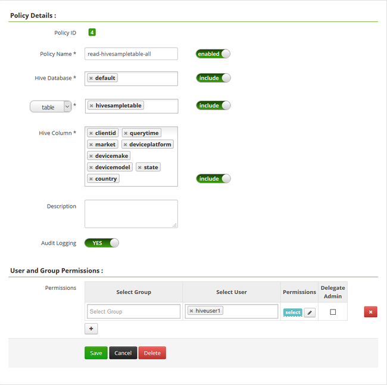

<properties
    pageTitle="Configurer des stratégies Hive dans HDInsight à un domaine | Microsoft Azure"
    description="Obtenir des informations..."
    services="hdinsight"
    documentationCenter=""
    authors="saurinsh"
    manager="jhubbard"
    editor="cgronlun"
    tags="azure-portal"/>

<tags
    ms.service="hdinsight"
    ms.devlang="na"
    ms.topic="hero-article"
    ms.tgt_pltfrm="na"
    ms.workload="big-data"
    ms.date="10/25/2016"
    ms.author="saurinsh"/>

# Configurer des stratégies Hive dans HDInsight à un domaine (Preview)

Découvrez comment configurer des stratégies de Apache Ranger pour Hive. Dans cet article, vous créez deux règles Ranger pour limiter l’accès à la hivesampletable. Le hivesampletable est fourni avec clusters HDInsight. Après avoir configuré les stratégies, vous utilisez Excel et le pilote ODBC pour vous connecter aux tables Hive dans HDInsight.

## Conditions préalables

- Un cluster HDInsight à un domaine. Consultez [clusters HDInsight configurer à un domaine](hdinsight-domain-joined-configure.md).
- Un poste de travail avec Office 2016, Office Professionnel Plus 2013, Office 365 ProPlus, version autonome d’Excel 2013 ou Office 2010 Professionnel Plus.

## Se connecter à l’interface utilisateur Apache Ranger Admin

**Pour vous connecter à l’interface utilisateur de Ranger Admin**

1. À partir d’un navigateur, vous connecter à l’interface utilisateur d’administration de Ranger. L’URL est https://&lt;nomcluster >.azurehdinsight.net/Ranger/. 

    >[AZURE.NOTE] Ranger utilise les informations d’identification différentes à cluster Hadoop. Pour empêcher les navigateurs à l’aide des informations d’identification Hadoop mis en cache, utilisez la nouvelle fenêtre de navigation inprivate pour vous connecter à l’interface utilisateur d’administration Ranger.
4. Connectez-vous en utilisant le nom d’utilisateur cluster administrateur domaine et un mot de passe :

    

    Pour l’instant, Ranger fonctionne uniquement avec fils et Hive.

## Créer des utilisateurs de domaine

Dans les [clusters HDInsight configurer à un domaine](hdinsight-domain-joined-configure.md#create-and-configure-azure-ad-ds-for-your-azure-ad), vous avez créé hiveruser1 et hiveuser2. Vous allez utiliser le compte de deux utilisateur dans ce didacticiel.

## Créer des stratégies de Ranger

Dans cette section, vous allez créer deux stratégies Ranger pour accéder à hivesampletable. Sélectionnez Autoriser sur jeu de colonnes différent. Les deux utilisateurs ont été créés dans des [clusters HDInsight configurer à un domaine](hdinsight-domain-joined-configure.md#create-and-configure-azure-ad-ds-for-your-azure-ad).  Dans la section suivante, vous allez tester les deux stratégies dans Excel.

**Pour créer des stratégies de Ranger**

1. Ouvrez l’interface utilisateur d’administration de Ranger. Voir [se connecter à l’interface utilisateur Apache Ranger d’administration](#connect-to-apache-ranager-admin-ui).
2. Cliquez sur ** &lt;nom_cluster > _hive**, sous **la ruche**. Vous doit voir deux configuration de stratégies.
3. Cliquez sur **Ajouter une nouvelle stratégie**, puis entrez les valeurs suivantes :

    - Nom de la stratégie : en lecture-hivesampletable-all
    - Ruche de base de données : par défaut
    - tableau : hivesampletable
    - Ruche colonne : *
    - Sélectionnez l’utilisateur : hiveuser1
    - Autorisations : sélectionnez

    .

    >[AZURE.NOTE] Si un utilisateur de domaine n’est pas rempli dans Sélectionner un utilisateur, attendez quelques instants pour Ranger pour le synchroniser avec DAS.

4. Cliquez sur **Ajouter** pour enregistrer la stratégie.
5. Répétez les deux dernières étapes pour créer une autre stratégie avec les propriétés suivantes :

    - Nom de la stratégie : en lecture-hivesampletable-devicemake
    - Ruche de base de données : par défaut
    - tableau : hivesampletable
    - Ruche colonne : identifiant du client, devicemake
    - Sélectionnez l’utilisateur : hiveuser2
    - Autorisations : sélectionnez

## Créer la source de données ODBC ruche

Vous trouverez les instructions dans la [source de données ODBC de ruche créer](hdinsight-connect-excel-hive-odbc-driver.md).  

    Propriété|Description
    ---|---
    Nom Source de données|Donner un nom à votre source de données
    Hôte|Entrez &lt;HDInsightClusterName >. azurehdinsight.net. Par exemple, myHDICluster.azurehdinsight.net
    Port|Utilisez <strong>443</strong>. (Ce port ont été modifié à partir de 563 443.)
    Base de données|Utiliser <strong>par défaut</strong>.
    Type de serveur Hive|Sélectionnez <strong>la ruche Server 2</strong>
    Mécanisme|Sélectionnez <strong>Azure HDInsight Service</strong>
    Chemin d’accès HTTP|Laissez ce champ vide.
    Nom d’utilisateur|Entrez hiveuser1@contoso158.onmicrosoft.com. Mettre à jour le nom de domaine s’il est différent.
    Mot de passe|Entrez le mot de passe pour hiveuser1.
    </table>

Veillez à cliquer sur **Test** avant d’enregistrer la source de données.

##Importer des données dans Excel à partir de HDInsight

Dans la dernière section, vous avez configuré deux stratégies.  hiveuser1 a l’autorisation select sur toutes les colonnes et hiveuser2 a l’autorisation select sur deux colonnes. Dans cette section, vous imiter les deux utilisateurs pour importer des données dans Excel.

1. Ouvrez un classeur existant ou nouveau dans Excel.
2. Sous l’onglet **données** , cliquez sur **à partir d’autres Sources de données**, puis cliquez sur **Provenance : Assistant connexion de données** pour lancer l' **Assistant connexion de données**.

    ! [Assistant connexion de données ouverte] [img-hdi-simbahiveodbc.excel.dataconnection]

3. Sélectionnez **DSN ODBC** comme source de données, puis cliquez sur **suivant**.
4. À partir de sources de données ODBC, sélectionnez le nom de source de données que vous avez créé à l’étape précédente, puis cliquez sur **suivant**.
5. Retapez le mot de passe pour le cluster dans l’Assistant, puis cliquez sur **OK**. Attendez que la boîte de dialogue **Sélectionner une base de données et de Table** pour l’ouvrir. Cela peut prendre quelques secondes.
8. Sélectionnez **hivesampletable**, puis cliquez sur **suivant**. 
8. Cliquez sur **Terminer**.
9. Dans la boîte de dialogue **Importer des données** , vous pouvez modifier ou spécifier la requête. Pour ce faire, cliquez sur **Propriétés**. Cela peut prendre quelques secondes. 
10. Cliquez sur l’onglet **définition** . Le texte de la commande est la suivante :

        SELECT * FROM "HIVE"."default"."hivesampletable"

    Par les stratégies de Ranger que vous avez défini, hiveuser1 a l’autorisation select sur toutes les colonnes.  Si cette requête fonctionne avec les informations d’identification de hiveuser1, mais pas cette requête ne fonctionne pas avec les informations d’identification de hiveuser2.

    ! [Propriétés de connexion] [img-hdi-simbahiveodbc-excel-connectionproperties]

11. Cliquez sur **OK** pour fermer la boîte de dialogue Propriétés de connexion.
12. Cliquez sur **OK** pour fermer la boîte de dialogue **Importer des données** .  
13. Retapez le mot de passe hiveuser1, puis cliquez sur **OK**. Il faut quelques secondes avant de données obtient importées dans Excel. Lorsqu’il est terminé, vous sont voir 11 colonnes de données.

Pour tester la stratégie deuxième (lecture-hivesampletable-devicemake) que vous avez créé dans la dernière section

1. Ajouter une nouvelle feuille dans Excel.
2. Suivez la procédure dernier pour importer les données.  La seule modification que vous effectuerez consiste à utiliser les informations d’identification de hiveuser2 au lieu de hiveuser1. Une erreur se produit car hiveuser2 a uniquement l’autorisation pour afficher deux colonnes. Pouvez-vous est l’erreur suivante :

        [Microsoft][HiveODBC] (35) Error from Hive: error code: '40000' error message: 'Error while compiling statement: FAILED: HiveAccessControlException Permission denied: user [hiveuser2] does not have [SELECT] privilege on [default/hivesampletable/clientid,country ...]'.

3. Suivez la procédure pour importer des données. Cette fois-ci, utilisez les informations d’identification de hiveuser2 et également modifier l’instruction select à partir de :

        SELECT * FROM "HIVE"."default"."hivesampletable"

    À :

        SELECT clientid, devicemake FROM "HIVE"."default"."hivesampletable"

    Lorsqu’il est terminé, vous doit afficher deux colonnes de données importées.

## Étapes suivantes

- Pour configurer un cluster HDInsight à un domaine, consultez [clusters HDInsight configurer à un domaine](hdinsight-domain-joined-configure.md).
- Pour gérer un clusters HDInsight à un domaine, voir [clusters HDInsight gérer à un domaine](hdinsight-domain-joined-manage.md).
- Pour l’exécution des requêtes Hive à l’aide de SSH sur clusters HDInsight à un domaine, voir [Utiliser SSH avec basé sur Linux Hadoop sur HDInsight de Linux, Unix ou OS X](hdinsight-hadoop-linux-use-ssh-unix.md#connect-to-a-domain-joined-hdinsight-cluster).
- Pour connecter la ruche à l’aide de la ruche JDBC, voir [se connecter à Hive sur Azure HDInsight à l’aide du pilote JDBC ruche](hdinsight-connect-hive-jdbc-driver.md)
- Pour vous connecter Excel à Hadoop à l’aide de la ruche ODBC, voir [Connecter Excel à Hadoop avec le lecteur Microsoft ruche ODBC](hdinsight-connect-excel-hive-odbc-driver.md)
- Pour vous connecter Excel à Hadoop à l’aide de Power Query, voir [Connecter Excel à Hadoop à l’aide de Power Query](hdinsight-connect-excel-power-query.md)