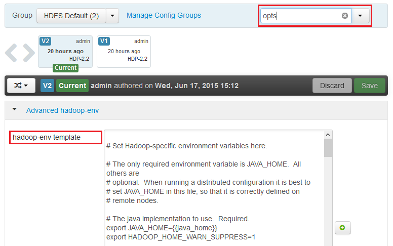
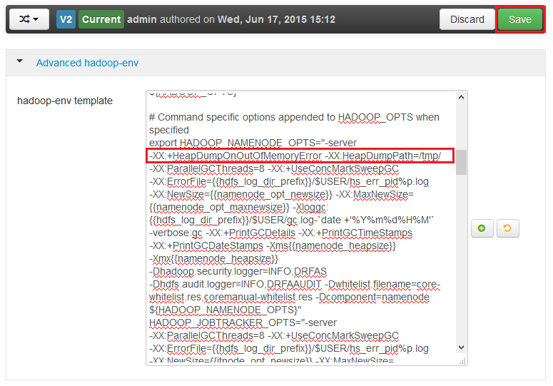

<properties
    pageTitle="Activer le vidage de segment pour les services Hadoop sur HDInsight | Microsoft Azure"
    description="Activer le vidage de segment pour les services Hadoop d’HDInsight basé sur Linux cluster pour débogage et d’analyse."
    services="hdinsight"
    documentationCenter=""
    authors="Blackmist"
    manager="jhubbard"
    editor="cgronlun"
    tags="azure-portal"/>

<tags
    ms.service="hdinsight"
    ms.workload="big-data"
    ms.tgt_pltfrm="na"
    ms.devlang="na"
    ms.topic="article"
    ms.date="09/27/2016"
    ms.author="larryfr"/>

#Activer le vidage de segment pour les services Hadoop sur basé sur Linux HDInsight (Preview)

[AZURE.INCLUDE [heapdump-selector](../../includes/hdinsight-selector-heap-dump.md)]

Les images de segment contenir un instantané de la mémoire de l’application, y compris les valeurs de variables au moment de que la création de l’image. Pour qu’ils soient très utiles pour diagnostiquer les problèmes se produisant au moment de l’exécution.

> [AZURE.NOTE] Les informations contenues dans cet article s’applique uniquement à HDInsight basé sur Linux. Pour plus d’informations sur HDInsight fonctionnant sous Windows, voir [Activer le vidage de segment pour les services Hadoop sur HDInsight fonctionnant sous Windows](hdinsight-hadoop-collect-debug-heap-dumps.md)

## Services

Vous pouvez activer le vidage de segment pour les services suivants :

*  **hcatalog** - tempelton
*  **hive** - hiveserver2, metastore, derbyserver
*  **mapreduce** - jobhistoryserver
*  **fils** - resourcemanager, nodemanager, timelineserver
*  **Hadoop** - datanode, secondarynamenode, namenode

Vous pouvez également activer le vidage de segment pour la carte et réduire les processus s’est exécuté en HDInsight.

## Configuration de vidage compréhension segment

Segment images complètes sont activées par passer des options (parfois appelés opte, ou les paramètres) pour la machine virtuelle Java quand un service est démarré. Pour la plupart des services Hadoop, cela peut se faire en modifiant le script shell utilisé pour démarrer le service.

Dans chaque script, vous trouverez une exportation pour ** \* \_se**, qui contient les options passées à la machine virtuelle Java. Par exemple, dans le script **hadoop env.sh** , la ligne qui commence par `export HADOOP_NAMENODE_OPTS=` contient les options pour le service NameNode.

Mapper et réduire les processus sont légèrement différentes, comme il s’agit d’un processus enfant du service MapReduce. Chaque mappage ou réduire processus est exécuté dans un conteneur enfant, et il existe deux entrées qui contiennent les options de la machine virtuelle Java pour ces. Les deux contient dans **mapred site.xml**:

* **MapReduce.Admin.Map.Child.Java.OPTS**
* **MapReduce.Admin.reduce.Child.Java.OPTS**

> [AZURE.NOTE] Nous vous recommandons d’utilisant Ambari pour modifier les scripts et les paramètres mapred site.xml, comme Ambari gérera réplication des modifications entre les nœuds du cluster. Consultez la section [Ambari à l’aide](#using-ambari) des étapes spécifiques.

###Activer le vidage du segment

L’option suivante permet d’images de segment lorsqu’un OutOfMemoryError se produit :

    -XX:+HeapDumpOnOutOfMemoryError

La **+** indique que cette option est activée. La valeur par défaut est désactivé.

> [AZURE.WARNING] Vidage de segment n’est pas activés pour les services Hadoop sur HDInsight par défaut, comme les fichiers de vidage peuvent être volumineux. Si vous activez les de résoudre les problèmes, n’oubliez pas de les désactiver une fois que vous avez reproduit le problème et avez recueilli des fichiers de l’image.

###Emplacement d’image

L’emplacement par défaut pour le fichier d’image est le répertoire de travail en cours. Vous pouvez contrôler l’emplacement dans lequel est stocké le fichier à l’aide de l’option suivante :

    -XX:HeapDumpPath=/path

Par exemple, à l’aide de `-XX:HeapDumpPath=/tmp` entraînera le vidage stocké dans le répertoire /tmp.

###Scripts

Vous pouvez également déclencher un script lorsqu’un **OutOfMemoryError** se produit. Par exemple, pour déclencher une notification afin de déterminer que l’erreur s’est produite. Cette opération est contrôlée à l’aide de l’option suivante :

    -XX:OnOutOfMemoryError=/path/to/script

> [AZURE.NOTE] Dans la mesure où Hadoop est un système distribué, n’importe quel script utilisé doit être placé sur tous les nœuds du cluster le service s’exécute sur.
>
> Le script doivent également être dans un emplacement accessible par le compte s’exécute en tant que le service et doit fournir les autorisations d’exécution. Par exemple, vous souhaiterez peut-être stocker les scripts de `/usr/local/bin` et utiliser `chmod go+rx /usr/local/bin/filename.sh` pour accorder en lecture et les autorisations d’exécution.

##À l’aide de Ambari

Pour modifier la configuration d’un service, procédez comme suit :

1. Ouvrez le site web Ambari l’interface utilisateur pour votre cluster. L’URL sera https://YOURCLUSTERNAME.azurehdinsight.net.

    Lorsque vous y êtes invité, s’authentifier sur le site en utilisant le nom du compte HTTP (par défaut : administrateur,) et mot de passe pour votre cluster.

    > [AZURE.NOTE] Vous devrez peut-être utiliser une deuxième fois par Ambari le nom d’utilisateur et mot de passe. Si c’est le cas, simplement retaper le même nom de compte et le mot de passe

2. À l’aide de la liste de gauche, sélectionnez la zone de service que vous souhaitez modifier. Par exemple, **HDFS**. Dans la zone centrale, sélectionnez l’onglet **configurations** .

    

3. À l’aide de l’entrée de **filtre** , entrez **opte**. Filtrer la liste d’éléments de configuration uniquement à ceux contenant le texte suivant et est un moyen rapide pour rechercher le script shell, ou le **modèle** qui peut être utilisé pour définir ces options.

    

4. Trouver la ** \* \_se** entrée pour le service que vous souhaitez activer le vidage de segment pour et ajouter les options que vous souhaitez activer. Dans l’image suivante, j’ai ajouté `-XX:+HeapDumpOnOutOfMemoryError -XX:HeapDumpPath=/tmp/` à la **HADOOP\_NAMENODE\_se** entrée :

    

    > [AZURE.NOTE] Lorsque l’activation segment vide de la carte ou réduire les processus enfant, vous ressemble à la place pour les champs étiquetées **mapreduce.admin.map.child.java.opts** et **mapreduce.admin.reduce.child.java.opts**.

    Utilisez le bouton **Enregistrer** pour enregistrer les modifications. Vous pourrez entrer une note brève décrivant les modifications apportées.

5. Une fois que les modifications ont été appliquées, l’icône **redémarrage requis** s’affiche à côté d’un ou plusieurs services.

    

6. Sélectionnez chaque service nécessitant un redémarrage, puis utilisez le bouton **Actions de Service** à **Activer sur Mode Maintenance**. Alertes cela empêche la génération de ce service lors du redémarrage.

    

7. Une fois que vous avez activé le mode de maintenance, utilisez le bouton **redémarrer** service pour **Redémarrer tous les impacté**

    

    > [AZURE.NOTE] les entrées pour le bouton **redémarrer** peuvent être différentes pour d’autres services.

8. Une fois que les services ont été redémarré, utilisez le bouton **Actions de Service** à **Activer en Mode Maintenance**. Cette Ambari pour reprendre l’analyse des alertes pour le service.
