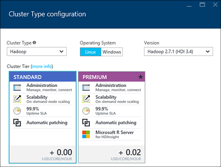

<properties
    pageTitle="Créer des clusters Hadoop, HBase, vague d’ou explosion sur Linux dans HDInsight à l’aide du portail | Microsoft Azure"
    description="Apprenez à créer des clusters Hadoop, HBase, vague d’ou explosion sous Linux pour HDInsight à l’aide d’un navigateur web et le portail Azure preview."
    services="hdinsight"
    documentationCenter=""
    authors="nitinme"
    manager="jhubbard"
    editor="cgronlun"
    tags="azure-portal"/>

<tags
    ms.service="hdinsight"
    ms.devlang="na"
    ms.topic="article"
    ms.tgt_pltfrm="na"
    ms.workload="big-data"
    ms.date="10/05/2016"
    ms.author="nitinme"/>

#Créer des clusters basés sur Linux dans HDInsight à l’aide du portail Azure

[AZURE.INCLUDE [selector](../../includes/hdinsight-selector-create-clusters.md)]

Le portail Azure est un outil de gestion basée sur le web pour les services et ressources hébergées dans le cloud Microsoft Azure. Dans cet article, vous allez apprendre à créer des clusters basés sur Linux HDInsight à l’aide du portail.

## Conditions préalables

[AZURE.INCLUDE [delete-cluster-warning](../../includes/hdinsight-delete-cluster-warning.md)]

- **Azure un abonnement**. Voir [Azure obtenir la version d’évaluation gratuite](https://azure.microsoft.com/documentation/videos/get-azure-free-trial-for-testing-hadoop-in-hdinsight/).
- __Un navigateur web moderne__. Le portail Azure utilise HTML5 et Javascript et peut ne pas fonctionner correctement dans les navigateurs web plus anciens.

### Exigences de contrôle d’accès

[AZURE.INCLUDE [access-control](../../includes/hdinsight-access-control-requirements.md)]

##Créer des clusters

Le portail Azure expose la plupart des propriétés cluster. À l’aide du modèle Azure le Gestionnaire de ressources, vous pouvez masquer un grand nombre de détails. Pour plus d’informations, voir [Hadoop basé sur Linux créer clusters dans HDInsight à l’aide de modèles Azure le Gestionnaire de ressources](hdinsight-hadoop-create-linux-clusters-arm-templates.md).

1. Connectez-vous au [portail Azure](https://portal.azure.com).

2. Cliquez sur **Nouveau**et cliquez sur **Données Analytique**, puis cliquez sur **HDInsight**.

    ![Création d’un nouveau cluster dans le portail Azure] (./media/hdinsight-hadoop-create-linux-cluster-portal/HDI.CreateCluster.1.png "Création d’un nouveau cluster dans le portail Azure")
3. Entrez le **Nom de Cluster**: ce nom doit être unique.
4. Cliquez sur **Sélectionner cluster Type**, puis sélectionnez :

    - **Type de cluster**: Si vous ne savez pas quelle solution choisir, sélectionnez **Hadoop**. Il s’agit du type de cluster les plus populaires.

        > [AZURE.IMPORTANT] HDInsight clusters se présentent sous divers types, qui correspondent à la charge de travail ou la technologie réglé pour le cluster. Il n’est pas pris en charge de la méthode pour créer un cluster qui combine plusieurs types, tels que vague d’et HBase sur un cluster. 

    - **Système d’exploitation**: sélectionnez **Linux**.
    - **Version**: utiliser la version par défaut si vous ne savez pas quelle solution choisir. Pour plus d’informations, voir [les versions cluster HDInsight](hdinsight-component-versioning.md).
    - **Cluster de niveau**: Azure HDInsight fournit les offres de cloud données volumineuses dans deux catégories : couches Standard et Premium. Pour plus d’informations, voir [niveaux Cluster](hdinsight-hadoop-provision-linux-clusters.md#cluster-tiers).
    
    

4. Cliquez sur l' **abonnement** pour sélectionner l’abonnement Azure qui sera utilisé pour le cluster.

5. Cliquez sur un **Groupe de ressources** pour sélectionner un groupe de ressources existant, ou cliquez sur **Nouveau** pour créer un nouveau groupe de ressources

    > [AZURE.NOTE] Cette entrée par défaut à un de vos groupes de ressources existants, si elles sont disponibles.

6. Cliquez sur **informations d’identification** , puis entrez un mot de passe pour l’utilisateur d’administration. Vous devez également entrer un **Nom d’utilisateur SSH** et un **mot de passe** ou **Clé publique**, qui sera utilisé pour authentifier l’utilisateur SSH. Il est recommandé à l’aide d’une clé publique. Cliquez sur **Sélectionner** dans la partie inférieure pour enregistrer la configuration des informations d’identification.

    ![Fournir les informations d’identification cluster] (./media/hdinsight-hadoop-create-linux-cluster-portal/HDI.CreateCluster.3.png "Fournir les informations d’identification cluster")

    Pour plus d’informations sur l’utilisation de SSH avec HDInsight, voir un des articles suivants :

    * [Utiliser le protocole SSH avec basé sur Linux Hadoop sur HDInsight de Linux, Unix ou OS X](hdinsight-hadoop-linux-use-ssh-unix.md)
    * [Utiliser le protocole SSH avec basé sur Linux Hadoop sur HDInsight à partir de Windows](hdinsight-hadoop-linux-use-ssh-windows.md)

7. Cliquez sur la **Source de données** pour choisir une source de données existante pour le cluster ou créez-en une.

    ![Carte de source de données] (./media/hdinsight-hadoop-create-linux-cluster-portal/HDI.CreateCluster.4.png "Fournissez des données de configuration de source")

    Pour le moment, vous pouvez sélectionner un compte de stockage Azure comme source de données pour un cluster HDInsight. Utilisez ce qui suit pour comprendre les entrées dans la carte de **Source de données** .

    - **Méthode de sélection**: configuré ces sur **à partir de tous les abonnements pour** activer l’exploration des comptes de stockage de tous vos abonnements. Définir de **Touche d’accès rapide** si vous voulez entrer le **Nom de stockage** et la **Touche d’accès rapide** d’un compte de stockage existant.

    - **Sélectionnez compte de stockage / nouveau**: cliquez sur **Sélectionnez compte de stockage** pour rechercher et sélectionner un compte de stockage existant que vous voulez associer avec le cluster. Ou, cliquez sur **Nouveau** pour créer un nouveau compte de stockage. Utiliser le champ qui s’affiche pour entrer le nom du compte de stockage. Une coche verte s’affichent si le nom n’est disponible.

    - **Choisissez le conteneur par défaut**: utilisez cette option pour entrer le nom du conteneur par défaut à utiliser pour le cluster. Bien que vous pouvez taper n’importe quel nom ici, nous vous recommandons d’utilisant le même nom que le cluster de sorte que vous pouvez facilement reconnaître que le conteneur est utilisé pour ce cluster spécifique.

    - **Emplacement**: la région géographique du compte de stockage dans ou est créé dans.

        > [AZURE.IMPORTANT] Sélectionner l’emplacement pour la source de données par défaut sera également définir l’emplacement du cluster HDInsight. La source de données par défaut et cluster doit se trouver dans la même région.
        
    - **Cluster AAD identité**: en configurant il, vous rendre le cluster accessible aux magasins Azure données Lake basées sur la configuration DAS.

    Cliquez sur **Sélectionner** pour enregistrer la configuration de source de données.

8. Cliquez sur **Niveaux de prix nœud** afin d’afficher des informations sur les nœuds qui seront créés pour ce cluster. Définir le nombre de nœuds de travail dont vous avez besoin pour le cluster. La valeur estimée du cluster est affichée dans la carte.

    ![Carte de niveaux de prix nœud] (./media/hdinsight-hadoop-create-linux-cluster-portal/HDI.CreateCluster.5.png "Spécifiez le numéro des nœuds de cluster")
    
    > [AZURE.IMPORTANT] Si vous prévoyez de plus de 32 nœuds de travail, lors de la création de cluster ou en redimensionnant le cluster après sa création, vous devez sélectionner une taille de nœud de tête au moins 8 cœurs et 14 Go de ram.
    >
    > Pour plus d’informations sur les tailles de nœud et les coûts associés, voir [HDInsight tarifs](https://azure.microsoft.com/pricing/details/hdinsight/).

    Cliquez sur **Sélectionner** pour enregistrer la configuration de tarification nœud.

9. Cliquez sur **Configuration facultatives** pour sélectionner la version cluster, ainsi que configurer d’autres paramètres facultatifs tels que la participation à un **Réseau virtuel**, la configuration d’un **Metastore externes** pour conserver les données pour Hive et Oozie, utiliser les Actions de Script pour personnaliser un cluster pour installer des composants personnalisés, ou utiliser des comptes d’espace de stockage supplémentaire avec le cluster.

    * **Réseau virtuel**: sélectionnez un réseau virtuel Azure et le sous-réseau si vous souhaitez placer le cluster dans un réseau virtuel.  

        ![Carte de réseau virtuelle] (./media/hdinsight-hadoop-create-linux-cluster-portal/HDI.CreateCluster.6.png "Spécifier les détails de réseau virtuel")

        Pour plus d’informations sur l’utilisation de HDInsight avec un réseau virtuel, y compris les besoins spécifiques de configuration du réseau virtuel, voir [fonctionnalités d’étendre HDInsight à l’aide d’un réseau virtuel Azure](hdinsight-extend-hadoop-virtual-network.md).

    * Cliquez sur **Metastores externes** pour spécifier une base de données SQL que vous souhaitez utiliser pour enregistrer les métadonnées Hive et Oozie associée au cluster.
    
        > [AZURE.NOTE] Configuration Metastore n’est pas disponible pour les types de cluster HBase.

        ![Carte de metastores personnalisé] (./media/hdinsight-hadoop-create-linux-cluster-portal/HDI.CreateCluster.7.png "Spécifier les metastores externes")

        Pour **utiliser une base de données SQL existante pour Hive** les métadonnées, cliquez sur **Oui**et sélectionnez une base de données SQL, puis indiquez le nom d’utilisateur/mot de passe pour la base de données. Répétez ces étapes si vous voulez **utiliser une base de données SQL existante pour les métadonnées Oozie**. Cliquez sur **Sélectionner** jusqu'à ce que vous êtes dans la carte de **Configuration facultatives** .

        >[AZURE.NOTE] La base de données SQL Azure utilisé pour la metastore doivent avoir autorisé connectivité à d’autres services Azure, y compris Azure HDInsight. Dans le tableau de bord SQL Azure de base de données sur le côté droit, cliquez sur le nom du serveur. C’est le serveur sur lequel s’exécute l’instance de base de données SQL. Une fois que vous sont dans l’affichage du serveur, cliquez sur **configurer**, puis cliquez sur **Oui**pour les **Services Azure**, puis cliquez sur **Enregistrer**.

        &nbsp;

        > [AZURE.IMPORTANT] Lorsque vous créez un metastore, n’utilisez pas un nom de base de données qui contient des tirets ou des traits d’union, cela peut entraîner le processus de création de cluster échec.

    * **Actions de script** si vous souhaitez utiliser un script personnalisé pour personnaliser un cluster que le cluster est créée. Pour plus d’informations sur les actions de script, voir [clusters HDInsight personnaliser à l’aide de Script Action](hdinsight-hadoop-customize-cluster-linux.md). Dans la carte Actions de Script Indiquez les détails comme le montre la capture d’écran.

        ![Carte d’action de script] (./media/hdinsight-hadoop-create-linux-cluster-portal/HDI.CreateCluster.8.png "Action de script spécifier")

    * Cliquez sur **Comptes de stockage liés** pour spécifier des comptes d’espace de stockage supplémentaire à associer avec le cluster. Dans la carte de **Clés de stockage Azure** , cliquez sur **Ajouter une clé de stockage**, puis sélectionnez un compte de stockage existant ou créer un nouveau compte.

        ![Carte d’espace de stockage supplémentaire] (./media/hdinsight-hadoop-create-linux-cluster-portal/HDI.CreateCluster.9.png "Spécifier les comptes de stockage supplémentaire")

        Vous pouvez également ajouter des comptes d’espace de stockage supplémentaire après la création d’un cluster.  Voir [clusters HDInsight basé sur Linux personnaliser à l’aide de Script Action](hdinsight-hadoop-customize-cluster-linux.md).

        Cliquez sur **Sélectionner** jusqu'à ce que vous êtes sur la carte **cluster HDInsight nouveau** .
        
        En plus de compte de stockage Blob, vous pouvez également lier Azure données Lake stores. La configuration peut être par configurer DAS à partir de la Source de données dans lequel vous avez configuré le compte de stockage par défaut et le conteneur par défaut.

10. Dans la carte de **Nouveau HDInsight Cluster** , vérifiez que l’option **attacher aux Startboard** est sélectionnée, puis cliquez sur **créer**. Cela crée le cluster et ajouter une vignette pour qu’elle à la Startboard de votre portail Azure. L’icône indique que le cluster est mise en service et modifiera pour afficher l’icône HDInsight une fois mise en service terminé.

  	| Lors de la mise en service | Mise en service complète |
  	| ------------------ | --------------------- |
  	|  |  |

    > [AZURE.NOTE] Il prend un certain temps pour le cluster doit être créée, généralement environ 15 minutes. Utiliser la vignette sur la Startboard ou l’entrée de **Notifications** à gauche de la page pour vérifier le processus de configuration.

11. Une fois le processus de création terminée, cliquez sur la vignette pour le cluster à partir de la Startboard pour lancer la carte cluster. La carte cluster fournit des informations essentielles concernant le cluster telles que le nom, le groupe de ressources qu'auquel il appartient, l’emplacement et le système d’exploitation, URL pour le tableau de bord cluster, etc..

    ![Carte cluster] (./media/hdinsight-hadoop-create-linux-cluster-portal/HDI.Cluster.Blade.png "Propriétés du cluster")

    Pour mieux comprendre les icônes situées en haut de cette carte, puis dans la section **Essentials** , utilisez ce qui suit :

    * **Paramètres** et **Tous les paramètres**: affiche la carte de **paramètres** pour le cluster, qui permet d’accéder aux informations de configuration détaillées pour le cluster.

    * **Tableau de bord**, **Tableau de bord Cluster**et **l’URL**: il s’agit des toutes les manières d’accéder au tableau de bord cluster, qui est un portail Web à l’exécution des tâches sur le cluster.

    * **Secure Shell**: informations nécessaires pour accéder au cluster à l’aide de SSH.

    * **Supprimer**: supprime le cluster HDInsight.

    * **Démarrage rapide** () : affiche les informations qui vous aidera à commencer à utiliser HDInsight.

    * **Utilisateurs** () : permet de définir des autorisations pour la _gestion du portail_ de ce cluster pour d’autres utilisateurs sur votre abonnement Azure.

        > [AZURE.IMPORTANT] Cette _uniquement_ affecte accès et les autorisations pour ce cluster dans le portail Azure et n’a aucun effet sur qui peut se connecter à ou soumettre des tâches au cluster HDInsight.

    * **Balises** () : marqueurs permet de définir des paires clé/valeur pour définir une classification personnalisée de vos services cloud. Par exemple, vous pouvez créer une clé nommée __project__et ensuite utiliser une valeur commune pour tous les services associés à un projet spécifique.

##Personnaliser les clusters

- Voir [clusters HDInsight personnaliser à l’aide de démarrage](hdinsight-hadoop-customize-cluster-bootstrap.md).
- Voir [clusters HDInsight basé sur Linux personnaliser à l’aide de Script Action](hdinsight-hadoop-customize-cluster-linux.md).

##Supprimer le cluster

[AZURE.INCLUDE [delete-cluster-warning](../../includes/hdinsight-delete-cluster-warning.md)]

##Étapes suivantes

À présent que vous avez créé un cluster de HDInsight, utilisez ce qui suit pour apprendre à utiliser avec votre cluster :

###Hadoop clusters

* [Utiliser Hive avec HDInsight](hdinsight-use-hive.md)
* [Utiliser cochon avec HDInsight](hdinsight-use-pig.md)
* [Utiliser MapReduce avec HDInsight](hdinsight-use-mapreduce.md)

###Clusters HBase

* [Prise en main HBase sur HDInsight](hdinsight-hbase-tutorial-get-started-linux.md)
* [Développement d’applications Java HBase sur HDInsight](hdinsight-hbase-build-java-maven-linux.md)

###Clusters vague

* [Développer des topologies Java pour vague d’HDInsight](hdinsight-storm-develop-java-topology.md)
* [Utiliser des composants Python dans vague d’HDInsight](hdinsight-storm-develop-python-topology.md)
* [Déployer et surveiller topologies avec vague d’HDInsight](hdinsight-storm-deploy-monitor-topology-linux.md)

###Clusters d’explosion

* [Créer une application autonome à l’aide de Scala](hdinsight-apache-spark-create-standalone-application.md)
* [Exécution de tâches à distance sur un cluster explosion à l’aide de Livy](hdinsight-apache-spark-livy-rest-interface.md)
* [Explosion avec BI : effectuer une analyse de données interactives à l’aide d’explosion dans HDInsight avec les outils de décisionnel](hdinsight-apache-spark-use-bi-tools.md)
* [Explosion avec apprentissage automatique : utilisation explosion dans HDInsight pour prévoir des résultats de l’inspection alimentaires](hdinsight-apache-spark-machine-learning-mllib-ipython.md)
* [Diffusion en continu explosion : Utilisation explosion dans HDInsight pour la création d’applications en continu en temps réel](hdinsight-apache-spark-eventhub-streaming.md)
