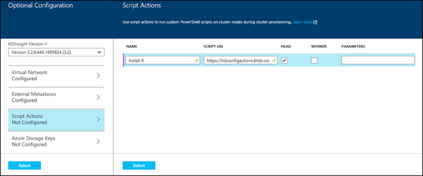

<properties
   pageTitle="Créer des clusters Hadoop dans HDInsight | Microsoft Azure"
    description="Apprenez à créer des clusters pour Azure HDInsight à l’aide du portail Azure."
   services="hdinsight"
   documentationCenter=""
   tags="azure-portal"
   authors="mumian"
   manager="jhubbard"
   editor="cgronlun"/>

<tags
   ms.service="hdinsight"
   ms.devlang="na"
   ms.topic="article"
   ms.tgt_pltfrm="na"
   ms.workload="big-data"
   ms.date="09/02/2016"
   ms.author="jgao"/>

# Créer des clusters Hadoop fonctionnant sous Windows dans HDInsight à l’aide du portail Azure

[AZURE.INCLUDE [selector](../../includes/hdinsight-selector-create-clusters.md)]

Apprenez à créer un cluster Hadoop dans HDInsight à l’aide du portail Azure. Microsoft [Azure portal](../azure-portal-overview.md) est un emplacement centralisé où vous pouvez configurer et gérer vos ressources Azure. Portail Azure est un des outils que vous pouvez utiliser pour créer soit basé sur Linux ou fonctionnant sous Windows cluster Hadoop dans HDInsight. Pour d’autres création d’un cluster les fonctionnalités et outils cliquez sur l’onglet, sélectionnez en haut de cette page ou consultez [méthodes de création de Cluster](hdinsight-provision-clusters.md#cluster-creation-methods).

##Conditions requises :

[AZURE.INCLUDE [delete-cluster-warning](../../includes/hdinsight-delete-cluster-warning.md)]

Avant de commencer les instructions fournies dans cet article, vous devez disposer des éléments suivants :

- Un abonnement Azure. Voir [Azure obtenir la version d’évaluation gratuite](https://azure.microsoft.com/documentation/videos/get-azure-free-trial-for-testing-hadoop-in-hdinsight/).

### Exigences de contrôle d’accès

[AZURE.INCLUDE [access-control](../../includes/hdinsight-access-control-requirements.md)]

## Créer des clusters

**Pour créer un cluster HDInsight**

1. Connectez-vous au [portail Azure](https://portal.azure.com).
2. Cliquez sur **Nouveau**et cliquez sur **Données Analytique**, puis cliquez sur **HDInsight**.

    ![Création d’un nouveau cluster dans le portail Azure] (./media/hdinsight-provision-clusters/HDI.CreateCluster.1.png "Création d’un nouveau cluster dans le portail Azure")

3. Tapez ou sélectionnez les valeurs suivantes :

    * **Nom de cluster**: entrez un nom pour le cluster. Une coche verte apparaît en regard du nom de cluster si le nom n’est disponible.

    * **Type de cluster**: sélectionnez **Hadoop**. Autres options inclue **HBase**et **vague** **d’explosion**.

        > [AZURE.IMPORTANT] HDInsight clusters se présentent sous divers types, qui correspondent à la charge de travail ou la technologie réglé pour le cluster. Il n’est pas pris en charge de la méthode pour créer un cluster qui combine plusieurs types, tels que vague d’et HBase sur un cluster.

    * **Système d’exploitation cluster**: sélectionnez **Windows**. Pour créer un cluster de base Linux, sélectionnez **Linux**.
    * **Version**: voir [versions HDInsight](hdinsight-component-versioning.md).
    * **Abonnement**: sélectionnez l’abonnement Azure qui est utilisé pour la création de ce groupe.
    * **Groupe de ressources**: sélectionnez une existante ou créer un nouveau groupe de ressources. Cette entrée par défaut à un de vos groupes de ressources existants, si elles sont disponibles.
    * **Informations d’identification**: configurer le nom d’utilisateur et le mot de passe pour l’utilisateur Hadoop (utilisateur HTTP). Si vous activez Bureau à distance pour le cluster, vous devrez configurer le nom d’utilisateur de l’utilisateur de bureau à distance et mot de passe et une date d’expiration du compte. Dans la partie inférieure pour enregistrer les modifications, cliquez sur **Sélectionner** .

        ![Fournir les informations d’identification cluster] (./media/hdinsight-provision-clusters/HDI.CreateCluster.3.png "Fournir les informations d’identification cluster")

    * **Source de données**: créer un nouveau ou sélectionnez un compte de stockage Azure existant à utiliser comme le système de fichiers par défaut pour le cluster.

        ![Carte de source de données] (./media/hdinsight-provision-clusters/HDI.CreateCluster.4.png "Fournissez des données de configuration de source")

        * **Méthode de sélection**: configuré ces sur **à partir de tous les abonnements pour** activer l’exploration des comptes de stockage de tous vos abonnements. Définir de **Touche d’accès rapide** si vous voulez entrer le **Nom de stockage** et la **Touche d’accès rapide** d’un compte de stockage existant.
        * **Sélectionnez compte de stockage / créer de nouveaux**: cliquez sur **Sélectionnez compte de stockage** pour rechercher et sélectionner un compte de stockage existant que vous voulez associer avec le cluster. Ou, cliquez sur **Créer un nouveau** pour créer un nouveau compte de stockage. Utiliser le champ qui s’affiche pour entrer le nom du compte de stockage. Une coche verte s’affichent si le nom n’est disponible.
        * **Choisissez le conteneur par défaut**: utilisez cette option pour entrer le nom du conteneur par défaut à utiliser pour le cluster. Bien que vous pouvez taper n’importe quel nom ici, nous vous recommandons d’utilisant le même nom que le cluster de sorte que vous pouvez facilement reconnaître que le conteneur est utilisé pour ce cluster spécifique.
        * **Emplacement**: la région géographique du compte de stockage dans ou est créé dans. Cet emplacement déterminera l’emplacement cluster.  Le cluster et son compte de stockage par défaut doivent co-création recherchez dans le centre de données Azure même.
    
    * **Nœud tarifs niveaux**: définissez le nombre de nœuds de travail dont vous avez besoin pour le cluster. La valeur estimée du cluster est affichée dans la carte.
  

        ![Carte de niveaux de prix nœud] (./media/hdinsight-provision-clusters/HDI.CreateCluster.5.png "Spécifiez le numéro des nœuds de cluster")

    * **Configuration facultatif** à sélectionner la version cluster, ainsi que configurer d’autres paramètres facultatifs tels que la participation à un **Réseau virtuel**, la configuration d’un **Metastore externes** pour conserver les données pour Hive et Oozie, utiliser les Actions de Script pour personnaliser un cluster pour installer des composants personnalisés, ou utilisez des comptes de stockage supplémentaire avec le cluster.

    * **HDInsight Version**: sélectionnez la version que vous voulez utiliser pour le cluster. Pour plus d’informations, voir [les versions cluster HDInsight](hdinsight-component-versioning.md).
    * **Réseau virtuel**: sélectionnez un réseau virtuel Azure et le sous-réseau si vous souhaitez placer le cluster dans un réseau virtuel.  

        ![Carte de réseau virtuelle] (./media/hdinsight-provision-clusters/HDI.CreateCluster.6.png "Spécifier les détails de réseau virtuel")

        Pour plus d’informations sur l’utilisation de HDInsight avec un réseau virtuel, y compris les besoins spécifiques de configuration du réseau virtuel, voir [capbilities HDInsight étendre à l’aide d’un réseau virtuel Azure](hdinsight-extend-hadoop-virtual-network.md).
  

        
    * **Metastores externes**: spécifiez une base de données SQL Azure pour stocker les métadonnées Hive et Oozie associée au cluster.
 
        > [AZURE.NOTE] Configuration Metastore n’est pas disponible pour les types de cluster HBase.

    ![Carte de metastores personnalisé] (./media/hdinsight-provision-clusters/HDI.CreateCluster.7.png "Spécifier les metastores externes")

    Pour **utiliser une base de données SQL existante pour Hive** les métadonnées, cliquez sur **Oui**et sélectionnez une base de données SQL, puis indiquez le nom d’utilisateur/mot de passe pour la base de données. Répétez ces étapes si vous voulez **utiliser une base de données SQL existante pour les métadonnées Oozie**. Cliquez sur **Sélectionner** jusqu'à ce que vous êtes dans la carte de **Configuration facultatives** .

    >[AZURE.NOTE] La base de données SQL Azure utilisé pour la metastore doivent avoir autorisé connectivité à d’autres services Azure, y compris Azure HDInsight. Dans le tableau de bord SQL Azure de base de données sur le côté droit, cliquez sur le nom du serveur. C’est le serveur sur lequel s’exécute l’instance de base de données SQL. Une fois que vous sont dans l’affichage du serveur, cliquez sur **configurer**, puis cliquez sur **Oui**pour les **Services Azure**, puis cliquez sur **Enregistrer**.

            &nbsp;

            > [AZURE.IMPORTANT] Lorsque vous créez un metastore, n’utilisez pas un nom de base de données qui contient des tirets ou des traits d’union, cela peut entraîner le processus de création de cluster échec.
        
        * **Script Actions** if you want to use a custom script to customize a cluster, as the cluster is being created. For more information about script actions, see [Customize HDInsight clusters using Script Action](hdinsight-hadoop-customize-cluster.md). On the Script Actions blade provide the details as shown in the screen capture.
    

            

        * **Azure Storage Keys**: Specify additional storage accounts to associate with the cluster. In the **Azure Storage Keys** blade, click **Add a storage key**, and then select an existing storage account or create a new account.
    

            

4. Cliquez sur **créer**. Sélection de **code confidentiel pour Startboard** ajoute une vignette pour cluster à la Startboard de votre portail. L’icône indique que le cluster est créé et modifiera pour afficher l’icône HDInsight une fois terminée la création.
    
    Il prend un certain temps pour le cluster doit être créée, généralement environ 15 minutes. Utiliser la vignette sur la Startboard ou l’entrée de **Notifications** à gauche de la page pour vérifier le processus de configuration.
    

5. Une fois la création terminée, cliquez sur la vignette pour le cluster à partir de la Startboard pour lancer la carte cluster. La carte cluster fournit des informations essentielles concernant le cluster telles que le nom, le groupe de ressources qu'auquel il appartient, l’emplacement et le système d’exploitation, URL pour le tableau de bord cluster, etc..

    ![Carte cluster] (./media/hdinsight-provision-clusters/HDI.Cluster.Blade.png "Propriétés du cluster")

    Pour mieux comprendre les icônes situées en haut de cette carte, puis dans la section **Essentials** , utilisez ce qui suit :

    * **Paramètres** et **Tous les paramètres**: affiche la carte de **paramètres** pour le cluster, qui permet d’accéder aux informations de configuration détaillées pour le cluster.
    * **Tableau de bord**, **Tableau de bord Cluster**et **l’URL**: il s’agit des toutes les manières d’accéder au tableau de bord cluster, qui est un portail Web à l’exécution des tâches sur le cluster.
    * **Bureau à distance**: vous permet d’activer/désactiver le Bureau à distance sur les nœuds du cluster.
    * **Échelle Cluster**: permet de modifier le nombre de nœuds de travail pour ce cluster.
    * **Supprimer**: supprime le cluster HDInsight.
    * **Démarrage rapide** () : affiche les informations qui vous aidera à commencer à utiliser HDInsight.
    * **Utilisateurs** () : permet de définir des autorisations pour la _gestion du portail_ de ce cluster pour d’autres utilisateurs sur votre abonnement Azure.
    

        > [AZURE.IMPORTANT] Cette _uniquement_ affecte accès et les autorisations pour ce cluster dans le portail et n’a aucun effet sur qui peut se connecter à ou soumettre des tâches au cluster HDInsight.
        
    * **Balises** () : marqueurs permet de définir des paires clé/valeur pour définir une classification personnalisée de vos services cloud. Par exemple, vous pouvez créer une clé nommée __project__et ensuite utiliser une valeur commune pour tous les services associés à un projet spécifique.

##Personnaliser les clusters

- Voir [clusters HDInsight personnaliser à l’aide de démarrage](hdinsight-hadoop-customize-cluster-bootstrap.md).
- Voir [clusters HDInsight fonctionnant sous Windows personnaliser à l’aide de Script Action](hdinsight-hadoop-customize-cluster.md).

##Étapes suivantes
Dans cet article, vous avez appris différentes façons pour créer un cluster HDInsight. Pour plus d’informations, consultez les articles suivants :

* [Prise en main Azure HDInsight](hdinsight-hadoop-linux-tutorial-get-started.md) - Apprenez à commencer à travailler avec votre cluster HDInsight
* [Hadoop soumettre des travaux par programme](hdinsight-submit-hadoop-jobs-programmatically.md) - Apprenez à soumettre des tâches à HDInsight par programme
* [Gérer les groupes Hadoop dans un HDInsight à l’aide du portail Azure](hdinsight-administer-use-management-portal.md)

