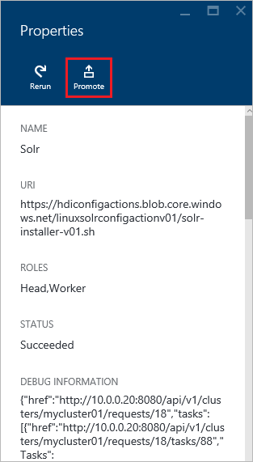
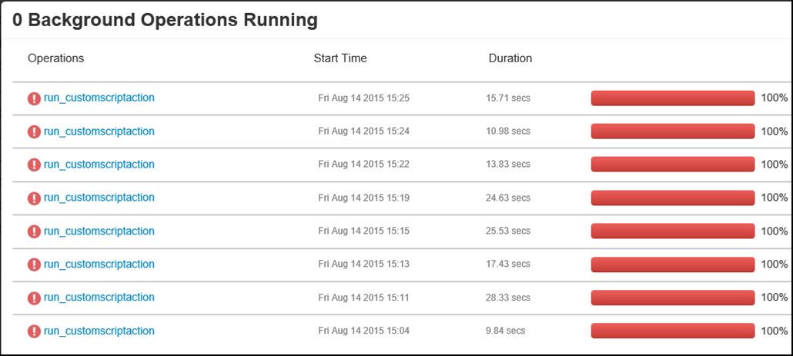

<properties
    pageTitle="Personnaliser les HDInsight à l’aide des actions de script | Microsoft Azure"
    description="Découvrez comment ajouter des composants personnalisés aux clusters basés sur Linux HDInsight à l’aide des Actions de Script. Actions de script sont Bash scripts que sur les nœuds de cluster et peut être utilisé pour personnaliser la configuration du cluster ou ajouter des services supplémentaires et utilitaires comme teinte, mode série sur LAN.r ou R."
    services="hdinsight"
    documentationCenter=""
    authors="Blackmist"
    manager="jhubbard"
    editor="cgronlun"
    tags="azure-portal"/>

<tags
    ms.service="hdinsight"
    ms.workload="big-data"
    ms.tgt_pltfrm="na"
    ms.devlang="na"
    ms.topic="article"
    ms.date="09/06/2016"
    ms.author="larryfr"/>

# Personnaliser les basé sur Linux HDInsight à l’aide de Script Action

HDInsight fournit une option de configuration appelée **Script Action** qui appelle les scripts personnalisés que personnaliser le cluster. Ces scripts peuvent être utilisés lors de la création de cluster ou sur un cluster déjà en cours d’exécution et sont utilisés pour installer d’autres composants ou modifier les paramètres de configuration.

> [AZURE.NOTE] La fonctionnalité permettant d’utiliser les actions de script sur un cluster déjà en cours d’exécution est disponible uniquement pour les clusters basés sur Linux HDInsight. Pour plus d’informations sur l’utilisation des actions de script avec clusters fonctionnant sous Windows, voir [clusters HDInsight personnaliser à l’aide de Script Action (Windows)](hdinsight-hadoop-customize-cluster.md).

Actions de script peuvent également être publiées à la place de marché Azure comme une application HDInsight. Parmi les exemples dans ce document afficher comment vous pouvez l’installer une application HDInsight à l’aide des commandes action script PowerShell et .NET SDK. Pour plus d’informations sur les applications HDInsight, voir [HDInsight publier des applications dans le Azure Marketplace](hdinsight-apps-publish-applications.md). 

## Comprendre les Actions de Script

Une Action de Script est simplement une Bash script que vous fournir une URL vers et paramètres, et il est alors exécuté sur les nœuds du cluster HDInsight. Voici les caractéristiques et fonctionnalités des actions de script.

* Doivent être stockés sur un URI est accessible à partir du cluster HDInsight. Emplacements de stockage possibles sont les suivantes :

    * Un compte de stockage blob qui est le principal ou supplémentaire compte de stockage pour le cluster HDInsight. Dans la mesure où HDInsight a accès à ces deux types de comptes de stockage au cours de la création d’un cluster, ces permettent d’utiliser une action de script non public.
    
    * URI lisible publiquement comme un Blob Azure GitHub, OneDrive, Dropbox, etc..
    
    Pour obtenir des exemples d’URI de scripts stockés dans le conteneur blob (lisible publiquement), consultez la section [exemples de scripts action script](#example-script-action-scripts) .

* Peut être limité à __exécuter sur uniquement certains types de nœud__, par exemple têtes nœuds ou collaborateur.

    > [AZURE.NOTE] Lorsqu’il est utilisé avec HDInsight Premium, vous pouvez spécifier que le script doit être utilisé sur le nœud de bord.

* Peuvent être __conservées__ ou __ad hoc__.

    Les scripts __PERSISTED__ sont des scripts qui sont appliquées à des nœuds de travail et seront exécuté automatiquement sur les nouveaux nœuds créés lors de la mise à l’échelle d’un cluster.

    Un script persistant peut-être également appliquer des modifications à un autre type de nœud, par exemple un nœud de tête, mais du point de vue de la fonctionnalité n’est la seule raison pour conserver un script afin qu’il s’applique aux nouveaux nœuds de travail créés lorsqu’il est un cluster est étendu.

    > [AZURE.IMPORTANT] Actions de script persistante doivent avoir un nom unique.

    __Ad hoc__ scripts ne sont pas conservées ; Toutefois, vous pouvez ensuite promouvoir un script ad hoc à un script persistant ou abaisser un script persistant à un script ad hoc.

    > [AZURE.IMPORTANT] Actions de script utilisées lors de la création de cluster sont conservées automatiquement.
    >
    > Scripts fail ne sont pas conservés, même si vous indiquez spécifiquement qu’ils doivent être.

* Accepte des __paramètres__ qui sont utilisées par le script lors de l’exécution.

* Exécuté avec __des privilèges au niveau de racine__ dans les nœuds de cluster.

* Peut être utilisée via le __portail Azure__, __Azure PowerShell__, __Azure infrastructure du langage commun__ou __HDInsight.NET SDK__

    [AZURE.INCLUDE [upgrade-powershell](../../includes/hdinsight-use-latest-powershell-cli-and-dotnet-sdk.md)]

Pour vous aider à comprendre les scripts ont été appliqués à un cluster et pour déterminer que l’ID de scripts pour promotion ou régression, le cluster conserve un historique de tous les scripts qui ont été exécuté.

> [AZURE.IMPORTANT] Il n’existe aucun moyen automatique pour annuler les modifications apportées par une action de script. Si vous avez besoin annuler l’effet d’un script, vous devez comprendre les modifications apportées et manuellement les inverser (ou fournir une action de script qui inverse les.)

### Action de script dans le processus de création de cluster

Actions de script utilisées lors de la création de cluster sont légèrement différentes de script actions exécutées sur un cluster existant :

* Le script est __automatiquement conservées__.

* Une __erreur__ dans le script peut entraîner le processus de création de cluster échec.

Le diagramme suivant illustre lors de l’Action de Script est exécutée pendant le processus de création :

![Étapes de création d’un cluster et de personnalisation de cluster HDInsight][img-hdi-cluster-states]

Le script est exécuté pendant la configuration de HDInsight. À ce stade, le script est exécuté en parallèle sur tous les nœuds spécifiés dans le cluster et est exécuté avec des privilèges racine sur les nœuds.

> [AZURE.NOTE] Étant donné que le script est exécuté avec des privilèges de niveau racine sur les nœuds de cluster, vous pouvez effectuer les opérations, telles que l’arrêt et démarrage des services, y compris les services Hadoop liés. Si vous cessez services, vous devez vous assurer que le service Ambari et autres services Hadoop sont en cours d’exécution avant la fin du script en cours d’exécution. Ces services sont nécessaires pour déterminer correctement l’état et l’état du cluster alors qu’il est en cours de création.

Lors de la création de cluster, vous pouvez spécifier plusieurs actions de script qui sont appelées dans l’ordre dans lequel elles ont été définies.

> [AZURE.IMPORTANT] Actions de script doivent se terminer dans 60 minutes ou qu’ils n’expire. Lors de la configuration de cluster, le script est exécuté en même temps que d’autres processus d’installation et de configuration. Concurrence pour les ressources telles que la bande passante réseau ou de temps processeur peut entraîner le script de prendre plus de temps que c’est le cas dans votre environnement de développement.
>
> Pour réduire la durée que nécessaire pour exécuter le script, éviter les tâches telles que le téléchargement et la compilation d’applications à partir de la source. À la place, préalablement compiler l’application et stocker le fichier binaire dans le stockage Blob Azure afin qu’il peut être téléchargé rapidement au cluster.

###Action de script sur un cluster en cours d’exécution

Contrairement à script actions utilisées lors de la création de cluster, une erreur dans un script exécutées sur un cluster déjà en cours d’exécution n’entraîne pas automatiquement le cluster passer à un état a échoué. Une fois un script terminé, le cluster doit retourner à un état « en cours d’exécution ».

> [AZURE.IMPORTANT] Cela ne signifie pas que votre cluster en cours d’exécution est à l’abri pour les scripts s’effectuer les actions incorrectes. Par exemple, un script peut supprimer des fichiers requis par le cluster, modifier la configuration afin que les services échouent, etc..
>
> Actions de scripts s’exécutent avec des privilèges racine, afin que vous devez vous assurer que vous comprenez qu’un script avant d’appliquer à votre cluster.

Lorsque vous appliquez un script à un cluster, l’état du cluster sera passez __en cours d’exécution__ __accepté__, puis __configuration HDInsight__et avant de revenir à __l’exécution__ des scripts réussies. Le statut du script est enregistré dans l’historique des actions de script, et vous pouvez l’utiliser pour déterminer si le script a réussi ou a échoué. Par exemple, le `Get-AzureRmHDInsightScriptActionHistory` applet de commande PowerShell peut être utilisé pour afficher l’état d’un script. Il renvoie des informations semblables à ce qui suit :

    ScriptExecutionId : 635918532516474303
    StartTime         : 2/23/2016 7:40:55 PM
    EndTime           : 2/23/2016 7:41:05 PM
    Status            : Succeeded

> [AZURE.NOTE] Si vous avez modifié le mot de passe utilisateur (administrateur) une fois que le cluster a été créé, cela peut entraîner le script actions exécutées ce cluster échec. Si vous avez les actions de script persistante que nœuds de travail cible, il peuvent échouer lorsque vous ajoutez des nœuds au cluster via redimensionnement opérations.

## Exemples de scripts Action de Script

Scripts d’Action de script peuvent être utilisés à partir du portail Azure, Azure PowerShell, Azure infrastructure du langage commun ou le Kit de développement .NET HDInsight. HDInsight propose des scripts pour installer les composants suivants sur les clusters HDInsight :

Nom | Script
----- | -----
**Ajouter un compte de stockage Azure** | https://hdiconfigactions.BLOB.Core.Windows.NET/linuxaddstorageaccountv01/Add-Storage-Account-v01.sh. Voir [appliquer une Action de Script vers un cluster en cours d’exécution](#apply-a-script-action-to-a-running-cluster).
**Installer teinte** | https://hdiconfigactions.BLOB.Core.Windows.NET/linuxhueconfigactionv02/Install-hue-uber-v02.sh. Voir [installer et utiliser des clusters teinte sur HDInsight](hdinsight-hadoop-hue-linux.md).
**Installer R** | https://hdiconfigactions.BLOB.Core.Windows.NET/linuxrconfigactionv01/r-installer-v01.sh. Voir [installer et utiliser R sur clusters HDInsight](hdinsight-hadoop-r-scripts-linux.md).
**Installer mode série sur LAN.r** | https://hdiconfigactions.BLOB.Core.Windows.NET/linuxsolrconfigactionv01/solr-installer-v01.sh. Voir [installer et utiliser le mode série sur LAN.r sur HDInsight clusters](hdinsight-hadoop-solr-install-linux.md).
**Installer Giraph** | https://hdiconfigactions.BLOB.Core.Windows.NET/linuxgiraphconfigactionv01/giraph-installer-v01.sh. Voir [installer et utiliser des clusters Giraph sur HDInsight](hdinsight-hadoop-giraph-install-linux.md).
| **Chargez au préalable les bibliothèques Hive** | https://hdiconfigactions.BLOB.Core.Windows.NET/linuxsetupcustomhivelibsv01/Setup-customhivelibs-v01.sh. Consultez [Ajouter ruche des bibliothèques sur des clusters HDInsight](hdinsight-hadoop-add-hive-libraries.md) |

## Utiliser une Action de Script pendant la création d’un cluster

Cette section fournit des exemples sur les différentes façons, que vous pouvez utiliser des actions de script lorsque vous créez un cluster HDInsight - à partir du portail Azure, à l’aide d’un modèle de gestionnaire de ressources Azure, à l’aide de PowerShell CMDlets et utilisation du Kit de développement .NET.

### Utiliser une Action de Script pendant la création d’un cluster à partir du portail Azure

1. Commencer à créer un cluster tels que décrits sur [Hadoop créer des groupes dans un HDInsight](hdinsight-provision-clusters.md#portal).

2. Sous __Configuration facultatives__, pour la carte de **Script Actions** , cliquez sur **Ajouter une action de script** pour fournir des détails sur l’action script, comme indiqué ci-dessous :

    

  	| Propriété | Valeur |
  	| -------- | ----- |
  	| Nom | Attribuez un nom à l’action de script. |
  	| Script URI | Spécifiez l’URI pour le script qui est appelé pour personnaliser le cluster. |
  	| Tête/collaborateur | Spécifier les nœuds (**tête**, **travail**ou **soigneur**) sur lequel s’exécute le script de personnalisation. |
  	| Paramètres | Spécifier les paramètres, le cas échéant par le script. |

    Appuyez sur ENTRÉE pour ajouter plusieurs actions de script pour installer plusieurs composants sur le cluster.

3. Cliquez sur **Sélectionner** pour enregistrer la configuration et poursuivre la création d’un cluster.

### Utiliser une Action de Script à partir de modèles Azure le Gestionnaire de ressources

Dans cette section, nous utilisons le Gestionnaire de ressources Azure modèles pour créer un cluster HDInsight et également utiliser une action de script pour installer des composants personnalisés (dans cet exemple, R) sur le cluster. Cette section fournit un exemple de modèle pour créer un cluster utilisant l’action de script.

> [AZURE.NOTE] Les étapes décrites dans cette section décrivent comment créer un cluster à l’aide d’une action de script. Pour obtenir un exemple de création d’un cluster à partir d’un modèle à l’aide d’une application HDInsight, voir [installer des applications personnalisées HDInsight](hdinsight-apps-install-custom-applications.md).

#### Avant de commencer

* Pour plus d’informations sur la configuration d’un poste de travail pour exécuter les applets de commande HDInsight Powershell, consultez [installer et configurer Azure PowerShell](../powershell-install-configure.md).
* Pour obtenir des instructions sur la façon de créer des modèles, voir [Gestionnaire de ressources Azure de création de modèles](../resource-group-authoring-templates.md).
* Si vous n'avez pas déjà utilisé Azure PowerShell avec le Gestionnaire de ressources, voir [Utilisation de PowerShell Azure avec le Gestionnaire de ressources Azure](../powershell-azure-resource-manager.md).

#### Créer des clusters à l’aide de Script Action

1. Copiez le modèle suivant dans un emplacement sur votre ordinateur. Ce modèle installe Giraph sur la headnodes ainsi que des nœuds de travail dans le cluster. Vous pouvez également vérifier si le modèle JSON est valide. Coller le contenu de votre modèle dans [JSONLint](http://jsonlint.com/), un outil de validation JSON en ligne.

            {
            "$schema": "http://schema.management.azure.com/schemas/2015-01-01/deploymentTemplate.json#",
            "contentVersion": "1.0.0.0",
            "parameters": {
                "clusterLocation": {
                    "type": "string",
                    "defaultValue": "West US",
                    "allowedValues": [ "West US" ]
                },
                "clusterName": {
                    "type": "string"
                },
                "clusterUserName": {
                    "type": "string",
                    "defaultValue": "admin"
                },
                "clusterUserPassword": {
                    "type": "securestring"
                },
                "sshUserName": {
                    "type": "string",
                    "defaultValue": "username"
                },
                "sshPassword": {
                    "type": "securestring"
                },
                "clusterStorageAccountName": {
                    "type": "string"
                },
                "clusterStorageAccountResourceGroup": {
                    "type": "string"
                },
                "clusterStorageType": {
                    "type": "string",
                    "defaultValue": "Standard_LRS",
                    "allowedValues": [
                        "Standard_LRS",
                        "Standard_GRS",
                        "Standard_ZRS"
                    ]
                },
                "clusterStorageAccountContainer": {
                    "type": "string"
                },
                "clusterHeadNodeCount": {
                    "type": "int",
                    "defaultValue": 1
                },
                "clusterWorkerNodeCount": {
                    "type": "int",
                    "defaultValue": 2
                }
            },
            "variables": {
            },
            "resources": [
                {
                    "name": "[parameters('clusterStorageAccountName')]",
                    "type": "Microsoft.Storage/storageAccounts",
                    "location": "[parameters('clusterLocation')]",
                    "apiVersion": "2015-05-01-preview",
                    "dependsOn": [ ],
                    "tags": { },
                    "properties": {
                        "accountType": "[parameters('clusterStorageType')]"
                    }
                },
                {
                    "name": "[parameters('clusterName')]",
                    "type": "Microsoft.HDInsight/clusters",
                    "location": "[parameters('clusterLocation')]",
                    "apiVersion": "2015-03-01-preview",
                    "dependsOn": [
                        "[concat('Microsoft.Storage/storageAccounts/', parameters('clusterStorageAccountName'))]"
                    ],
                    "tags": { },
                    "properties": {
                        "clusterVersion": "3.2",
                        "osType": "Linux",
                        "clusterDefinition": {
                            "kind": "hadoop",
                            "configurations": {
                                "gateway": {
                                    "restAuthCredential.isEnabled": true,
                                    "restAuthCredential.username": "[parameters('clusterUserName')]",
                                    "restAuthCredential.password": "[parameters('clusterUserPassword')]"
                                }
                            }
                        },
                        "storageProfile": {
                            "storageaccounts": [
                                {
                                    "name": "[concat(parameters('clusterStorageAccountName'),'.blob.core.windows.net')]",
                                    "isDefault": true,
                                    "container": "[parameters('clusterStorageAccountContainer')]",
                                    "key": "[listKeys(resourceId('Microsoft.Storage/storageAccounts', parameters('clusterStorageAccountName')), '2015-05-01-preview').key1]"
                                }
                            ]
                        },
                        "computeProfile": {
                            "roles": [
                                {
                                    "name": "headnode",
                                    "targetInstanceCount": "[parameters('clusterHeadNodeCount')]",
                                    "hardwareProfile": {
                                        "vmSize": "Large"
                                    },
                                    "osProfile": {
                                        "linuxOperatingSystemProfile": {
                                            "username": "[parameters('sshUserName')]",
                                            "password": "[parameters('sshPassword')]"
                                        }
                                    },
                                    "scriptActions": [
                                        {
                                            "name": "installGiraph",
                                            "uri": "https://hdiconfigactions.blob.core.windows.net/linuxgiraphconfigactionv01/giraph-installer-v01.sh",
                                            "parameters": ""
                                        }
                                    ]
                                },
                                {
                                    "name": "workernode",
                                    "targetInstanceCount": "[parameters('clusterWorkerNodeCount')]",
                                    "hardwareProfile": {
                                        "vmSize": "Large"
                                    },
                                    "osProfile": {
                                        "linuxOperatingSystemProfile": {
                                            "username": "[parameters('sshUserName')]",
                                            "password": "[parameters('sshPassword')]"
                                        }
                                    },
                                    "scriptActions": [
                                        {
                                            "name": "installR",
                                            "uri": "https://hdiconfigactions.blob.core.windows.net/linuxrconfigactionv01/r-installer-v01.sh",
                                            "parameters": ""
                                        }
                                    ]
                                }
                            ]
                        }
                    }
                }
            ],
            "outputs": {
                "cluster":{
                    "type" : "object",
                    "value" : "[reference(resourceId('Microsoft.HDInsight/clusters',parameters('clusterName')))]"
                }
            }
        }

2. Démarrez Azure PowerShell et connectez-vous à votre compte Azure. Après avoir fourni vos informations d’identification, la commande renvoie des informations sur votre compte.

        Add-AzureRmAccount

        Id                             Type       ...
        --                             ----
        someone@example.com            User       ...

3. Si vous avez plusieurs abonnements, fournissent l’id de l’abonnement que vous souhaitez utiliser pour le déploiement.

        Select-AzureRmSubscription -SubscriptionID <YourSubscriptionId>

    > [AZURE.NOTE] Vous pouvez utiliser `Get-AzureRmSubscription` pour obtenir une liste de tous les abonnements associés à votre compte, qui inclut l’Id de l’abonnement pour chacun d'entre eux.

5. Si vous ne disposez pas d’un groupe de ressources existant, créez un nouveau groupe de ressources. Indiquez le nom du groupe de ressources et emplacement dont vous avez besoin pour votre solution. Un résumé du nouveau groupe de ressources est renvoyé.

        New-AzureRmResourceGroup -Name myresourcegroup -Location "West US"

        ResourceGroupName : myresourcegroup
        Location          : westus
        ProvisioningState : Succeeded
        Tags              :
        Permissions       :
                            Actions  NotActions
                            =======  ==========
                            *
        ResourceId        : /subscriptions/######/resourceGroups/ExampleResourceGroup

6. Pour créer un nouveau déploiement pour votre groupe de ressources, exécutez la commande **New-AzureRmResourceGroupDeployment** et fournissez les paramètres nécessaires. Les paramètres doit inclure un nom pour votre déploiement, le nom de votre groupe de ressources et le chemin d’accès ou l’URL pour le modèle que vous avez créé. Si votre modèle requiert tous les paramètres, vous devez passer également ces paramètres. Dans ce cas, l’action de script à installer R sur le cluster ne nécessite pas tous les paramètres.

        New-AzureRmResourceGroupDeployment -Name mydeployment -ResourceGroupName myresourcegroup -TemplateFile <PathOrLinkToTemplate>

    Vous devrez fournir des valeurs pour les paramètres définis dans le modèle.

7. Lorsque le groupe de ressources a été déployé, vous verrez une synthèse du déploiement.

          DeploymentName    : mydeployment
          ResourceGroupName : myresourcegroup
          ProvisioningState : Succeeded
          Timestamp         : 8/17/2015 7:00:27 PM
          Mode              : Incremental
          ...

8. Si votre déploiement échoue, vous pouvez utiliser les applets de commande suivantes pour obtenir des informations sur les échecs.

        Get-AzureRmResourceGroupDeployment -ResourceGroupName myresourcegroup -ProvisioningState Failed

### Utiliser une Action de Script pendant la création d’un cluster à partir de PowerShell Azure

Dans cette section, nous utilisons l’applet de commande [Add-AzureRmHDInsightScriptAction](https://msdn.microsoft.com/library/mt603527.aspx) pour appeler des scripts à l’aide d’Action de Script pour personnaliser un cluster. Avant de commencer, vérifiez que vous avez installé et configuré Azure PowerShell. Pour plus d’informations sur la configuration d’un poste de travail pour exécuter les applets de commande HDInsight PowerShell, consultez [installer et configurer Azure PowerShell](../powershell-install-configure.md).

Effectuez les opérations suivantes :

1. Ouvrez la console PowerShell Azure et utilisez la commande suivante pour vous connecter à votre abonnement Azure et déclarer des variables PowerShell :

        # LOGIN TO ZURE
        Login-AzureRmAccount

        # PROVIDE VALUES FOR THESE VARIABLES
        $subscriptionId = "<SubscriptionId>"        # ID of the Azure subscription
        $clusterName = "<HDInsightClusterName>"         # HDInsight cluster name
        $storageAccountName = "<StorageAccountName>"    # Azure storage account that hosts the default container
        $storageAccountKey = "<StorageAccountKey>"      # Key for the storage account
        $containerName = $clusterName
        $location = "<MicrosoftDataCenter>"             # Location of the HDInsight cluster. It must be in the same data center as the storage account.
        $clusterNodes = <ClusterSizeInNumbers>          # The number of nodes in the HDInsight cluster.
        $resourceGroupName = "<ResourceGroupName>"      # The resource group that the HDInsight cluster will be created in

2. Spécifier les valeurs de configuration (par exemple, les nœuds du cluster) et le stockage par défaut à utiliser.

        # SPECIFY THE CONFIGURATION OPTIONS
        Select-AzureRmSubscription -SubscriptionId $subscriptionId
        $config = New-AzureRmHDInsightClusterConfig
        $config.DefaultStorageAccountName="$storageAccountName.blob.core.windows.net"
        $config.DefaultStorageAccountKey=$storageAccountKey

3. Applet de commande **Add-AzureRmHDInsightScriptAction** permet d’appeler le script. L’exemple suivant utilise un script qui installe Giraph sur le cluster :

        # INVOKE THE SCRIPT USING THE SCRIPT ACTION FOR HEADNODE AND WORKERNODE
        $config = Add-AzureRmHDInsightScriptAction -Config $config -Name "Install Giraph"  -NodeType HeadNode -Uri https://hdiconfigactions.blob.core.windows.net/linuxgiraphconfigactionv01/giraph-installer-v01.sh
        $config = Add-AzureRmHDInsightScriptAction -Config $config -Name "Install Giraph"  -NodeType WorkerNode -Uri https://hdiconfigactions.blob.core.windows.net/linuxgiraphconfigactionv01/giraph-installer-v01.sh

    L’applet de commande **Add-AzureRmHDInsightScriptAction** accepte les paramètres suivants :

  	| Paramètre | Définition |
  	| --------- | ---------- |
  	| Configuration de la | Objet de configuration pour le script d’informations sur l’action sont ajoutées. |
  	| Nom | Nom de l’action de script. |
  	| NodeType | Spécifie le nœud sur lequel s’exécute le script de personnalisation. Les valeurs valides sont **HeadNode** (pour l’installer sur le nœud de tête), **WorkerNode** (pour une installation sur tous les nœuds de données), ou **ZookeeperNode** (pour l’installer sur le nœud soigneur). |
  	| Paramètres | Paramètres requis par le script. |
  	| URI | Spécifie l’URI pour le script qui s’exécute. |

4. Définir l’utilisateur d’administration/HTTPS pour le cluster :

        $httpCreds = get-credential

    Lorsque vous y êtes invité, entrez « admin » comme nom et un mot de passe.

5. Définir les informations d’identification SSH :

        $sshCreds = get-credential

    Lorsque vous y êtes invité, entrez le nom d’utilisateur SSH et le mot de passe. Si vous voulez sécuriser le compte SSH avec un certificat au lieu d’un mot de passe, utilisez un mot de passe vide et définissez `$sshPublicKey` au contenu de la clé publique de certificat que vous souhaitez utiliser. Par exemple :

        $sshPublicKey = Get-Content .\path\to\public.key -Raw

4. Enfin, créez le cluster :

        New-AzureRmHDInsightCluster -config $config -clustername $clusterName -DefaultStorageContainer $containerName -Location $location -ResourceGroupName $resourceGroupName -ClusterSizeInNodes $clusterNodes -HttpCredential $httpCreds -SshCredential $sshCreds -OSType Linux

    Si vous utilisez une clé publique pour votre compte SSH, vous devez également spécifier `-SshPublicKey $sshPublicKey` en tant que paramètre.

Il peut prendre plusieurs minutes avant que le cluster est créé.

### Utiliser une Action de Script pendant la création d’un cluster à partir de HDInsight .NET SDK

Le Kit de développement .NET HDInsight fournit des bibliothèques de client qui facilite le travail avec HDInsight à partir d’une application .NET. Pour obtenir un exemple de code, voir [basé sur Linux créer des groupes dans un HDInsight à l’aide du Kit de développement .NET](hdinsight-hadoop-create-linux-clusters-dotnet-sdk.md#use-script-action).

## Appliquer une Action de Script vers un cluster en cours d’exécution

Cette section fournit des exemples sur les différentes façons, que vous pouvez appliquer des actions de script à un cluster de HDInsight en cours d’exécution. à partir du portail Azure, à l’aide de PowerShell CMDlets, à l’aide de l’infrastructure du langage commun Azure disponibilité sur plusieurs plateformes et en utilisant le Kit de développement .NET. L’action de script persistante utilisée dans cette section ajoute un compte de stockage Azure existant vers un cluster en cours d’exécution. Vous pouvez également utiliser d’autres actions de script, voir [scripts d’exemple de Script Action](#example-script-action-scripts).

### Appliquer une Action de Script vers un cluster en cours d’exécution à partir du portail Azure

1. À partir du [portail Azure](https://portal.azure.com), sélectionnez votre cluster HDInsight.

2. À partir de la carte de cluster HDInsight, sélectionnez la vignette __Actions de Script__ .

    

    > [AZURE.NOTE] Vous pouvez également sélectionner __tous les paramètres__ , puis sélectionnez les __Actions de Script__ à partir de la carte de paramètres.

4. À partir du haut de la cuillère Script Actions, sélectionnez __Envoyer nouveau__.

    

5. À partir de la carte ajouter une Action de Script, entrez les informations suivantes.

    * __Nom__: le nom convivial à utiliser pour cette Action de Script. Dans cet exemple, `Add Storage account`.
    * __SCRIPT URI__: URI pour le script. Dans cet exemple,`https://hdiconfigactions.blob.core.windows.net/linuxaddstorageaccountv01/add-storage-account-v01.sh`
    * __Tête__, __collaborateur__et __soigneur__: vérifier les nœuds ce script doit être appliqué à. Dans cet exemple, tête, collaborateur et soigneur sont activées.
    * __Paramètres__: si le script accepte les paramètres, entrez-les ici. Dans cet exemple, entrez le nom de compte de stockage et la clé de compte de stockage :

        

        Dans la capture d’écran, `contosodata` est un compte de stockage Azure existant, la deuxième ligne est la clé de compte de stockage.
    * __PERSISTED__: Cochez cette entrée si vous souhaitez conserver le script afin il sera appliqué aux nouveaux nœuds de travail lorsque vous faites évoluer le cluster.

6. Enfin, utilisez le bouton __créer__ pour appliquer le script vers le cluster.

### Appliquer une Action de Script vers un cluster en cours d’exécution de PowerShell Azure

Avant de commencer, vérifiez que vous avez installé et configuré Azure PowerShell. Pour plus d’informations sur la configuration d’un poste de travail pour exécuter les applets de commande HDInsight PowerShell, consultez [installer et configurer Azure PowerShell](../powershell-install-configure.md).

1. Ouvrez la console PowerShell Azure et utilisez la commande suivante pour vous connecter à votre abonnement Azure et déclarer des variables PowerShell :

        # LOGIN TO ZURE
        Login-AzureRmAccount

        # PROVIDE VALUES FOR THESE VARIABLES
        $clusterName = "<HDInsightClusterName>"         # HDInsight cluster name
        $saName = "<ScriptActionName>"                  # Name of the script action
        $saURI = "<URI to the script>"                  # The URI where the script is located
        $nodeTypes = "headnode", "workernode"
        
    > [AZURE.NOTE] Si vous utilisez un cluster HDInsight Premium, vous pouvez utiliser un type du `"edgenode"` pour exécuter le script sur le nœud de bord.

2. Pour appliquer le script vers le cluster, utilisez la commande suivante :

        Submit-AzureRmHDInsightScriptAction -ClusterName $clusterName -Name $saName -Uri $saURI -NodeTypes $nodeTypes -PersistOnSuccess

    Une fois que la tâche est terminée, vous recevrez des informations similaires à ce qui suit :

        OperationState  : Succeeded
        ErrorMessage    :
        Name            : Giraph
        Uri             : https://hdiconfigactions.blob.core.windows.net/linuxgiraphconfigactionv01/giraph-installer-v01.sh
        Parameters      :
        NodeTypes       : {HeadNode, WorkerNode}

### Appliquer une Action de Script vers un cluster en cours d’exécution depuis l’interface Azure

Avant de commencer, vérifiez que vous avez installé et configuré le Azure infrastructure du langage commun. Pour plus d’informations, voir [installer l’infrastructure du langage commun Azure](../xplat-cli-install.md).

    [AZURE.INCLUDE [use-latest-version](../../includes/hdinsight-use-latest-cli.md)] 

1. Ouvrir une session shell, terminal, invite de commandes ou une autre ligne de commande pour votre système et utilisez la commande suivante pour passer au mode Azure le Gestionnaire de ressources.

        azure config mode arm

2. Utilisez ce qui suit s’authentifier à votre abonnement Azure.

        azure login

3. Utilisez la commande suivante pour appliquer une action de script à un cluster en cours d’exécution

        azure hdinsight script-action create <clustername> -g <resourcegroupname> -n <scriptname> -u <scriptURI> -t <nodetypes>

    Si vous omettez paramètres pour cette commande, vous devra pour eux. Si le script que vous spécifiez avec `-u` accepte les paramètres, vous pouvez les spécifier à l’aide de la `-p` paramètre.

    Valide __nodetypes__ sont __headnode__, __workernode__et __soigneur__. Si le script doit être appliqué à plusieurs types de nœud, spécifiez les types séparés par un « ; ». Par exemple, `-n headnode;workernode`.

    Pour conserver le script, ajoutez la `--persistOnSuccess`. Vous pouvez également conserver le script à une date ultérieure à l’aide de `azure hdinsight script-action persisted set`.
    
    Une fois que la tâche est terminée, vous recevrez une sortie similaire à ce qui suit.
    
        info:    Executing command hdinsight script-action create
        + Executing Script Action on HDInsight cluster
        data:    Operation Info
        data:    ---------------
        data:    Operation status:
        data:    Operation ID:  b707b10e-e633-45c0-baa9-8aed3d348c13
        info:    hdinsight script-action create command OK

### Appliquer une Action de Script vers un cluster en cours d’exécution à l’aide de l’API REST

Voir [Exécuter des Actions de Script sur un cluster en cours d’exécution](https://msdn.microsoft.com/library/azure/mt668441.aspx).
### Appliquer une Action de Script à un cluster en cours d’exécution via le Kit de développement .NET HDInsight

Pour obtenir un exemple d’utilisation le Kit de développement .NET pour appliquer des scripts vers un cluster, voir [https://github.com/Azure-Samples/hdinsight-dotnet-script-action](https://github.com/Azure-Samples/hdinsight-dotnet-script-action).

## Afficher l’historique, promouvoir et abaisser Actions de Script

### À l’aide du portail Azure

1. À partir du [portail Azure](https://portal.azure.com), sélectionnez votre cluster HDInsight.

2. À partir de la carte de cluster HDInsight, sélectionnez __paramètres__.

    

3. À partir de la carte de paramètres, sélectionnez __Les Actions de Script__.

    

4. Liste des scripts persistantes, ainsi que l’historique des scripts appliqués au cluster, s’affiche dans la carte Actions de Script. Dans la capture d’écran ci-dessous, vous pouvez voir que le mode série sur LAN.r script a été exécuté sur ce cluster, mais qu’aucune action de script n’ont été conservées.

    

5. Activer un script à partir de l’historique permet d’afficher la carte de propriétés pour ce script. À partir du haut de la cuillère, vous pouvez réexécuter le script ou le promouvoir.

    

6. Vous pouvez également utiliser le bouton __...__ vers la droite des entrées de la carte de Script Actions à effectuer des actions telles que réexécuter persistent ou (pour les actions, persistantes) supprimer.

    

### À l’aide de PowerShell Azure

| Utilisez la commande suivante... | À... |
| ----- | ----- |
| Get-AzureRmHDInsightPersistedScriptAction | Récupérer des informations sur les actions de script persistante |
| Get-AzureRmHDInsightScriptActionHistory | Récupérer un historique des actions de script appliqué le cluster, ou les informations d’un script spécifique |
| Jeu de AzureRmHDInsightPersistedScriptAction | Promeut une action de script ad hoc dans une action de script persistante |
| Supprimer AzureRmHDInsightPersistedScriptAction | Abaisser une action de script persistante à une action ad hoc |

> [AZURE.IMPORTANT] À l’aide de `Remove-AzureRmHDInsightPersistedScriptAction` ne pas annuler les actions exécutées par un script, il supprime uniquement l’indicateur persistante afin que le script ne sera pas être exécuté sur nouveaux nœuds de travail ajoutés au cluster.

L’exemple de script suivant montre comment utiliser les applets de commande pour promouvoir, puis rétrograder un script.

    # Get a history of scripts
    Get-AzureRmHDInsightScriptActionHistory -ClusterName mycluster

    # From the list, we want to get information on a specific script
    Get-AzureRmHDInsightScriptActionHistory -ClusterName mycluster -ScriptExecutionId 635920937765978529

    # Promote this to a persisted script
    # Note: the script must have a unique name to be promoted
    # if the name is not unique, you will receive an error
    Set-AzureRmHDInsightPersistedScriptAction -ClusterName mycluster -ScriptExecutionId 635920937765978529

    # Demote the script back to ad hoc
    # Note that demotion uses the unique script name instead of
    # execution ID.
    Remove-AzureRmHDInsightPersistedScriptAction -ClusterName mycluster -Name "Install Giraph"

### À l’aide de l’infrastructure du langage commun Azure

| Utilisez la commande suivante... | À... |
| ----- | ----- |
| `azure hdinsight script-action persisted list <clustername>` | Récupérer une liste des actions de script persistante |
| `azure hdinsight script-action persisted show <clustername> <scriptname>` | Récupérer des informations sur une action de script persistante spécifique |
| `azure hdinsight script-action history list <clustername>` | Récupérer un historique des actions de script appliqué au cluster |
| `azure hdinsight script-action history show <clustername> <scriptname>` | Récupérer des informations sur une action de script spécifique |
| `azure hdinsight script action persisted set <clustername> <scriptexecutionid>` | Promeut une action de script ad hoc dans une action de script persistante |
| `azure hdinsight script-action persisted delete <clustername> <scriptname>` | Abaisser une action de script persistante à une action ad hoc |

> [AZURE.IMPORTANT] À l’aide de `azure hdinsight script-action persisted delete` ne pas annuler les actions exécutées par un script, il supprime uniquement l’indicateur persistante afin que le script ne sera pas être exécuté sur nouveaux nœuds de travail ajoutés au cluster.

### Utilisation du SDK .NET HDInsight

Pour obtenir un exemple de l’utilisation du Kit de développement .NET pour récupérer l’historique de script à partir d’un cluster, promouvoir ou abaisser des scripts, voir [https://github.com/Azure-Samples/hdinsight-dotnet-script-action](https://github.com/Azure-Samples/hdinsight-dotnet-script-action).

> [AZURE.NOTE] Cet exemple montre également comment installer une application HDInsight en utilisant le Kit de développement .NET.

## Résolution des problèmes

Vous pouvez utiliser l’interface utilisateur Ambari web pour afficher des informations enregistrées par les actions de script. Si le script a été utilisé lors de la création de cluster et création du cluster a échoué en raison d’une erreur dans le script, les journaux sont également disponibles dans le compte de stockage par défaut associé au cluster. Cette section fournit des informations sur la façon de récupérer les journaux à l’aide de ces deux options.

### À l’aide de l’interface utilisateur de Ambari Web

1. Dans votre navigateur, accédez à https://CLUSTERNAME.azurehdinsight.net. Remplacez NOMDUCLUSTER par le nom de votre cluster HDInsight.

    Lorsque vous y êtes invité, entrez le nom du compte d’administrateur (administrateur) et le mot de passe pour le cluster. Vous devrez entrer à nouveau les informations d’identification d’administration dans un formulaire web.

2. Dans la barre en haut de la page, sélectionnez l’entrée __d’opérations__ . Cela affiche une liste des actuelles et précédentes opérations effectuées sur le cluster via Ambari.

    

3. Rechercher les entrées ayant __exécuter\_customscriptaction__ dans la colonne __Operations__ . Ils sont créés lors de l’exécution les Actions de Script.

    

    Sélectionnez cette entrée, puis descendre dans les liens pour afficher la sortie STDOUT et STDERR générée lorsque le script a été exécuté sur le cluster.

### Journaux d’accès à partir du compte de stockage par défaut

Si la création d’un cluster a échoué en raison d’une erreur dans l’action de script, les journaux d’action script toujours sont accessibles directement à partir du compte de stockage par défaut associé au cluster.

* Les journaux de stockage sont disponibles dans la page `\STORAGE_ACOCUNT_NAME\DEFAULT_CONTAINER_NAME\custom-scriptaction-logs\CLUSTER_NAME\DATE`.

    

    En dessous, les journaux sont organisés en dehors de nœuds soigneur, workernode et headnode. Quelques exemples sont :
    * **Headnode** - `<uniqueidentifier>AmbariDb-hn0-<generated_value>.cloudapp.net`
    * **Nœud de travail** - `<uniqueidentifier>AmbariDb-wn0-<generated_value>.cloudapp.net`
    * **Nœud soigneur** - `<uniqueidentifier>AmbariDb-zk0-<generated_value>.cloudapp.net`

* Tous les stdout et stderr de l’hôte correspondant est téléchargé sur le compte de stockage. Il y a un **sortie -\*.txt** et **erreurs -\*.txt** pour chaque action de script. Le fichier de sortie *.txt contient des informations sur l’URI du script que vous avez exécuté sur l’hôte. Par exemple

        'Start downloading script locally: ', u'https://hdiconfigactions.blob.core.windows.net/linuxrconfigactionv01/r-installer-v01.sh'

* Il est possible que vous créez un cluster action script à plusieurs reprises portant le même nom. Dans ce cas, vous pouvez distinguer les journaux pertinents basés sur le nom du dossier DATE. Par exemple, l’arborescence pour un cluster (mon_cluster) créé sur différentes dates seront :
    * `\STORAGE_ACOCUNT_NAME\DEFAULT_CONTAINER_NAME\custom-scriptaction-logs\mycluster\2015-10-04`
    * `\STORAGE_ACOCUNT_NAME\DEFAULT_CONTAINER_NAME\custom-scriptaction-logs\mycluster\2015-10-05`

* Si vous créez un cluster action script portant le même nom dans le même jour, vous pouvez utiliser le préfixe unique pour identifier les fichiers journaux pertinents.

* Si vous créez un cluster à la fin de la journée, il est possible que les fichiers journaux s’étalent sur deux jours. Dans ce cas, vous verrez deux dossiers date différente pour le même cluster.

* Téléchargement de fichiers journaux dans le conteneur par défaut peut prendre jusqu'à 5 minutes, en particulier pour les clusters de grande taille. Par conséquent, si vous voulez accéder aux journaux, vous ne devez pas immédiatement supprimer le cluster si une action de script échoue.

## Prise en charge des logiciels open source utilisés sur clusters HDInsight

Le service Microsoft Azure HDInsight est une plateforme flexible qui vous permet de créer des applications de données volumineuses dans le cloud à l’aide d’un réseau de technologies open source formé autour d’Hadoop. Microsoft Azure fournit un niveau général de prise en charge pour les technologies open source, comme indiqué dans la section de **Prise en charge étendue** du [site Web du Forum aux questions sur Azure prend en charge](https://azure.microsoft.com/support/faq/). Le service HDInsight fournit un niveau supplémentaire de prise en charge pour certains composants, comme décrit ci-dessous.

Il existe deux types de composants open source qui sont disponibles dans le service HDInsight :

- **Composants intégrés** - ces composants sont préinstallés sur clusters HDInsight et fournir des fonctionnalités de base du cluster. Par exemple, fils ResourceManager, le langage de requête Hive (HiveQL) et la bibliothèque Mahout appartiennent à cette catégorie. Une liste complète des composants de cluster n’est disponible dans [Quelles sont les nouveautés dans les versions de cluster Hadoop fournies par HDInsight ?](hdinsight-component-versioning.md).

- **Composants personnalisés** - vous, en tant qu’utilisateur du cluster, installez ou utiliser dans votre charge de travail n’importe quel composant disponible dans la Communauté ou créé par vous.

> [AZURE.WARNING] Composants fournis avec le cluster HDInsight entièrement prises en charge et Support Microsoft aidera à identifier et résoudre les problèmes liés à ces composants.
>
> Composants personnalisés recevront RCSI prise en charge pour vous aider à résoudre le problème. Cela peut provoquer de résoudre le problème ou vous demandant de s’engager canaux disponibles pour les technologies d’ouvrir la source où se trouve une grande expertise pour que la technologie. Par exemple, de nombreux sites communautaires qui peuvent être utilisés, comme : [forum MSDN pour HDInsight](https://social.msdn.microsoft.com/Forums/azure/en-US/home?forum=hdinsight), [http://stackoverflow.com](http://stackoverflow.com). Projets Apache contient des sites de projet sur [http://apache.org](http://apache.org), par exemple : [Hadoop](http://hadoop.apache.org/).

Le service HDInsight fournit plusieurs méthodes pour utiliser des composants personnalisés. Quelle que soit comment un composant est utilisé ou installé sur le cluster, le même niveau de prise en charge s’applique. Voici une liste des façons plus courantes que les composants personnalisés peuvent être utilisés sur les clusters HDInsight :

1. Soumission de la tâche - Hadoop ou autres types de travaux qui exécuter ou utilise des composants personnalisés peut être soumise au cluster.

2. Personnalisation de cluster - lors de la création de cluster, vous pouvez spécifier des paramètres supplémentaires et des composants personnalisés qui seront installés sur les nœuds du cluster.

3. Exemples - pour les composants personnalisés, Microsoft et d’autres personnes peuvent fournir des exemples de la façon dont ces composants peuvent être utilisés dans les groupes HDInsight. Ces exemples sont fournis sans prise en charge.

##Résolution des problèmes

###Historique ne s’affiche pas utilisés lors de la création de cluster des scripts

Si votre cluster a été créé avant le 15 mars 2016, vous pouvez voir pas une entrée dans l’historique de Script Action pour tous les scripts utilisé lors de la création de cluster. Toutefois, si vous redimensionnez le cluster après le 15 mars 2016, les scripts à l’aide lors de la création de cluster seront affichent dans l’historique dans lequel ils sont appliqués à de nouveaux nœuds dans le cluster dans le cadre de l’opération de redimensionnement.

Il existe deux exceptions près :

* Si votre cluster a été créé avant le 1er septembre 2015. Il s’agit lorsque Actions de Script ont été introduites, afin de n’importe quel cluster créé avant cette date n’aurait pas utilisé Actions de Script pour la création de cluster.

* Si vous avez utilisé plusieurs Actions de Script lors de la création de cluster et utilisé le même nom pour plusieurs scripts, ou le même nom, même URI, mais des paramètres différents pour plusieurs scripts. Dans ce cas, vous recevrez l’erreur suivante.

    Aucune nouvelle action script ne peut être exécutée sur ce cluster en raison de noms de script en conflit dans des scripts existants. Noms de script fournis au cluster créer doivent être uniques. Les scripts existants s’exécutera toujours lors du redimensionnement.

## Étapes suivantes

Consultez la rubrique suivante pour des informations et des exemples sur la création et l’utilisation des scripts pour personnaliser un cluster :

- [Développer des scripts d’Action de Script pour HDInsight](hdinsight-hadoop-script-actions-linux.md)
- [Installer et utiliser le mode série sur LAN.r sur clusters HDInsight](hdinsight-hadoop-solr-install-linux.md)
- [Installer et utiliser Giraph sur clusters HDInsight](hdinsight-hadoop-giraph-install-linux.md)

[img-hdi-cluster-states]: ./media/hdinsight-hadoop-customize-cluster-linux/HDI-Cluster-state.png "Étapes de création d’un cluster"
