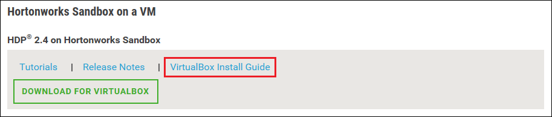
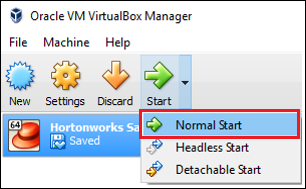

<properties
    pageTitle="Utiliser un bac à sable Hadoop pour en savoir plus sur Hadoop | Microsoft Azure"
    description="Pour obtenir une présentation sur l’utilisation du réseau Hadoop, vous pouvez configurer un bac à sable Hadoop de Hortonworks sur une machine virtuelle Azure. "
    keywords="émulateur Hadoop, hadoop sandbox"
    editor="cgronlun"
    manager="jhubbard"
    services="hdinsight"
    authors="nitinme"
    documentationCenter=""
    tags="azure-portal"/>

<tags
    ms.service="hdinsight"
    ms.workload="big-data"
    ms.tgt_pltfrm="na"
    ms.devlang="na"
    ms.topic="article"
    ms.date="08/24/2016"
    ms.author="nitinme"/>

# Prise en main dans le réseau Hadoop avec un bac à sable Hadoop sur une machine virtuelle

Découvrez comment installer le bac à sable Hadoop à partir de Hortonworks sur un ordinateur virtuel pour en savoir plus sur le réseau Hadoop. Le bac à sable fournit un environnement de développement local pour en savoir plus sur Hadoop, système de fichier distribué Hadoop (HDFS) et soumission de la tâche.

## Conditions préalables

* [VirtualBox Oracle](https://www.virtualbox.org/)

Une fois que vous êtes habitué à Hadoop, vous pouvez commencer à utiliser Hadoop sur Azure en créant un cluster HDInsight. Pour plus d’informations sur la mise en route, voir [prise en main Hadoop sur HDInsight](hdinsight-hadoop-linux-tutorial-get-started.md).

## Téléchargez et installez la machine virtuelle

1. Dans [http://hortonworks.com/downloads/#sandbox](http://hortonworks.com/downloads/#sandbox), cliquez sur __Télécharger pour VIRTUALBOX__ pour 2.4 HDP sur Hortonworks Sandbox. Vous devrez enregistrer avec Hortonworks avant le téléchargement commence.

    

2. À partir de la même page web, sélectionnez le __Guide d’installation VirtualBox__ pour 2.4 HDP sur Hortonworks Sandbox. Cela va télécharger un fichier PDF contenant les instructions d’installation de la machine virtuelle.

    

## Démarrer la machine virtuelle

1. Démarrer VirtualBox, sélectionnez le bac à sable Hortonworks, sélectionnez __Démarrer__, puis __Démarrer Normal__.

    

2. Une fois que la machine virtuelle a terminé le processus de démarrage, il affiche les instructions de connexion. Ouvrez un navigateur web et accédez à l’URL affichée (généralement http://127.0.0.1:8888).

## Mots de passe

1. À partir de l’étape __prise en main__ de la page Hortonworks Sandbox, sélectionnez __Options d’affichage avancés__. Utilisez les informations sur cette page pour vous connecter à l’aide de SSH bac à sable. Utilisez le nom et le mot de passe.

    > [AZURE.NOTE] Si vous n’avez pas un clientSSH installé, vous pouvez utiliser le SSH-based fournie à par la machine virtuelle en __http://localhost:4200 /__.

    La première fois que vous vous connectez à l’aide de SSH, vous devrez modifier le mot de passe du compte racine. Entrez un nouveau mot de passe, qui sera utilisé lorsque vous vous connectez à l’aide de SSH à l’avenir.

2. Une fois connecté, entrez la commande suivante :

        ambari-admin-password-reset
    
    Lorsque vous y êtes invité, fournir un mot de passe du compte d’administrateur Ambari. Il sera utilisé lorsque vous accédez à l’interface utilisateur Web Ambari.

## Utilisez la commande hive

1. À partir d’une connexion SSH au sandbox, utilisez la commande suivante pour démarrer le shell Hive :

        hive

2. Une fois que le shell a déjà commencé, utilisez ce qui suit pour afficher les tables qui sont fournies avec le bac à sable :

        show tables;

3. Utilisez ce qui suit pour récupérer les 10 lignes à partir de la `sample_07` table :

        select * from sample_07 limit 10;

## Étapes suivantes

* [Découvrez comment utiliser Visual Studio avec le bac à sable Hortonworks](hdinsight-hadoop-emulator-visual-studio.md)
* [Les câbles du Hortonworks Sandbox d’apprentissage](http://hortonworks.com/hadoop-tutorial/learning-the-ropes-of-the-hortonworks-sandbox/)
* [Hadoop didacticiel : prise en main HDP](http://hortonworks.com/hadoop-tutorial/hello-world-an-introduction-to-hadoop-hcatalog-hive-and-pig/)