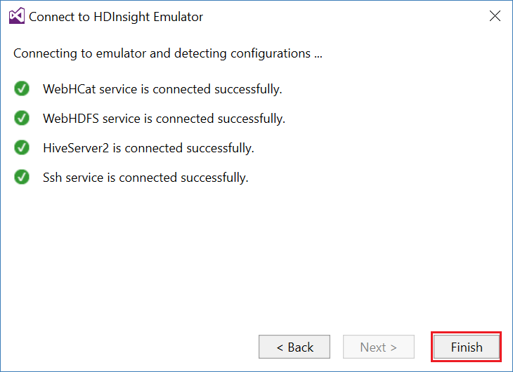
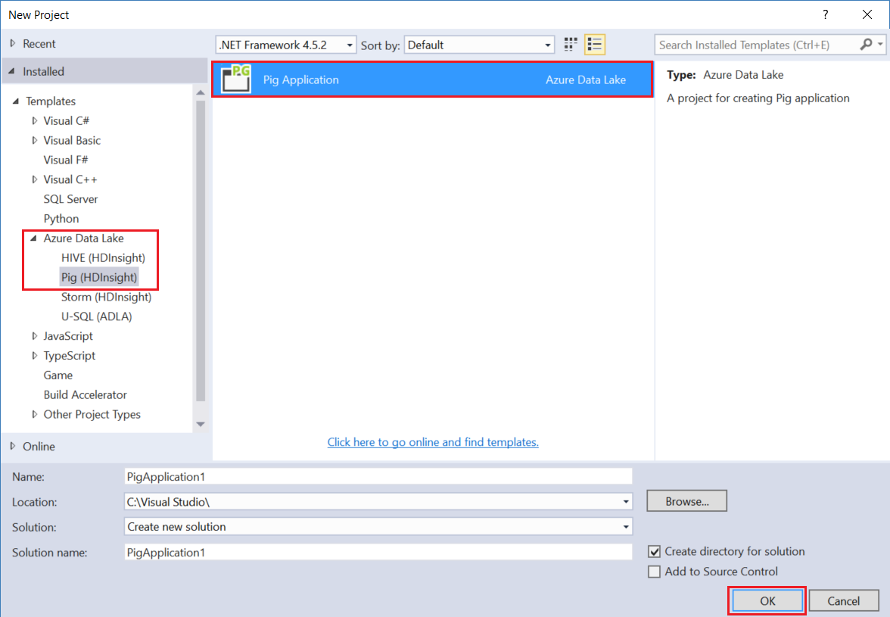

<properties
pageTitle="Utiliser les outils de Microsoft Azure données Lake pour Visual Studio avec le bac à sable Hortonworks | Microsoft Azure"
description="Découvrez comment utiliser les outils de Lake données Azure pour VIsual Studio avec le bac à sable Hortonworks (exécuté sur un ordinateur local virtuel.) Grâce à ces outils, vous pouvez créer et exécuter des tâches Hive et cochon sur la sortie sandbox et affichage des tâches et historique."
services="hdinsight"
documentationCenter=""
authors="Blackmist"
manager="paulettm"
editor="cgronlun"/>

<tags
ms.service="hdinsight"
ms.devlang="na"
ms.topic="article"
ms.tgt_pltfrm="na"
ms.workload="big-data"
ms.date="08/26/2016"
ms.author="larryfr"/>

# Utiliser les outils de Lake données Azure pour Visual Studio avec le bac à sable Hortonworks

Les outils Lake de données Azure pour Visual Studio incluent des outils pour l’utilisation de génériques clusters Hadoop, en plus des outils pour travailler avec Azure données Lake et HDInsight. Ce document fournit les étapes nécessaires pour utiliser les outils Azure données Lake avec le bac à sable Hortonworks en cours d’exécution sur un ordinateur virtuel local.

À l’aide de la Hortonworks Sandbox vous permet de travailler avec Hadoop localement sur votre environnement de développement. Une fois que vous avez développé une solution et que vous voulez déployer à l’échelle, vous pouvez ensuite déplacer vers un cluster HDInsight.

## Conditions préalables

* Le bac à sable Hortonworks en cours d’exécution sur une machine virtuelle dans votre environnement de développement. Ce document a été écrit et testé avec le bac à sable en cours d’exécution dans Oracle VirtualBox, qui a été configuré à l’aide des informations dans le document de [prise en main dans le réseau Hadoop](hdinsight-hadoop-emulator-get-started.md) .

* Visual Studio 2013 ou 2015, n’importe quelle édition.

* Le [Kit de développement logiciel Azure pour .NET](https://azure.microsoft.com/downloads/) 2.7.1 ou une version ultérieure

* [Données Azure Lake Tools pour Visual Studio](https://www.microsoft.com/download/details.aspx?id=49504)

## Configurer les mots de passe pour le bac à sable

Assurez-vous que le bac à sable Hortonworks est en cours d’exécution, puis suivez les étapes de [mise en route dans le réseau Hadoop](hdinsight-hadoop-emulator-get-started.md#set-passwords) pour configurer le mot de passe pour le SSH `root` compte et le Ambari `admin` compte. Ces mots de passe seront utilisés lors de la connexion au sandbox de Visual Studio.

## Connecter les outils pour le bac à sable

1. Ouvrir Visual Studio, puis sélectionnez __affichage__, puis sur __Explorateur de serveur__.

2. Dans l' __Explorateur de serveurs__, cliquez avec le bouton droit sur l’entrée __HDInsight__ , puis sur __se connecter à HDInsight émulateur__.

    

3. Dans la boîte de dialogue __se connecter à émulateur HDInsight__ , entrez le mot de passe que vous avez configuré pour Ambari.

    

    Sélectionnez __suivant__ pour continuer.

4. Le champ __mot de passe__ permet d’entrer le mot de passe que vous avez configuré pour la `root` compte. Laisser les autres champs à la valeur par défaut.

    

    Sélectionnez __suivant__ pour continuer.

5. Attendre la validation des services pour terminer. Dans certains cas, la validation peut échouer et vous invite à mettre à jour la configuration. Dans ce cas, cliquez sur le bouton __mettre à jour__ et attendez la configuration et la vérification du service terminer.

    

    > [AZURE.NOTE] Le processus de mise à jour utilise Ambari pour modifier la configuration Hortonworks Sandbox à ce qui est attendu par les outils Lake de données Azure pour Visual Studio.

    À l’issue de validation, sélectionnez __Terminer__ pour terminer la configuration.

    

    > [AZURE.NOTE] Selon la vitesse de votre environnement de développement et la quantité de mémoire allouée à la machine virtuelle, il peut prendre plusieurs minutes pour configurer et valider les services.

Après avoir suivi ces étapes, vous avez à présent une entrée « cluster local HDInsight » dans l’Explorateur de serveurs sous la section HDInsight.

## Écrire une requête Hive

Hive fournit un langage de requête de type SQL (HiveQL), pour travailler avec des données structurées. Procédez comme suit pour apprendre à exécuter des requêtes ad hoc sur le cluster local.

1. Dans l' __Explorateur de serveurs__, avec le bouton droit sur l’entrée pour le cluster local que vous avez ajoutée précédemment, puis __rédigez une requête Hive__.

    

    Cette action ouvre une nouvelle fenêtre de requête qui vous permet de taper rapidement et soumettre une requête vers le cluster local.

2. Dans la nouvelle fenêtre de requête, entrez les informations suivantes :

        select count(*) from sample_08;
    
    À partir du haut de la fenêtre de requête, assurez-vous que la configuration pour le cluster local est sélectionné et sélectionnez __Envoyer__. Conservez les autres valeurs (nom__lot__ et server), les valeurs par défaut.

    

    Notez que vous pouvez également utiliser le menu déroulant en regard __Envoyer__ pour sélectionnez __avancées__. Cette action ouvre une boîte de dialogue qui vous permet de fournir des options supplémentaires lors de l’envoi de la tâche.

    

3. Une fois que vous soumettez la requête, l’état du travail s’affichent. Fournit des informations sur la tâche comme il est traité par Hadoop. L’entrée de __l’État du travail__ fournit l’état actuel de la tâche. L’état sera mis à jour régulièrement, ou vous pouvez utiliser l’icône d’actualisation pour actualiser manuellement l’état.

    

    Une fois que l' __État du travail__ devient __terminé__, un graphique acyclique dirigé (DAG, Switched Virtual Circuit) s’affiche. Cette rubrique décrit le chemin d’exécution qui a été déterminé par Tez (la valeur par défaut moteur d’exécution pour Hive sur le cluster local.) 
    
    > [AZURE.NOTE] Tez est également la valeur par défaut lors de l’utilisation de clusters HDInsight basé sur Linux. Il n’est pas la valeur par défaut sur HDInsight fonctionnant sous Windows ; pour l’utiliser, vous devez ajouter la ligne `set hive.execution.engine = tez;` au début de votre requête Hive. 

    Cliquez sur le lien de __Sortie des tâches__ pour afficher le résultat. Dans ce cas, il est __823__; le nombre de lignes dans la table sample_08. Vous pouvez afficher des informations de diagnostic sur la tâche en utilisant les liens __Journal travaux__ et __Télécharger les journaux de fils__ .

4. Vous pouvez également exécuter Hive travaux interactive en modifiant le champ __lot__ vers __Interactive__et puis cliquez sur __exécuter__. 

    

    Il utilise le journal de résultat généré pendant le traitement de la fenêtre de __Sortie HiveServer2__ .
    
    > [AZURE.NOTE] Voici les mêmes informations qui ne sont disponibles à partir du lien __Planificateur__ après qu’une tâche est terminée.

    

## Créer un projet Hive

Vous pouvez également créer un projet qui contient plusieurs scripts Hive. Ceci est utile lorsque vous avez associées scripts que vous devez faire tenir ou mettre à jour à l’aide d’un système de contrôle de version.

1. Dans Visual Studio, sélectionnez le __fichier__, __Nouveau__, puis then__Project__.

2. Dans la liste des projets, développez __modèles__, __Lake de données Azure__ , puis sélectionnez __HIVE (HDInsight)__. Dans la liste des modèles, sélectionnez __La ruche exemple__. Entrez un nom et un emplacement, puis sélectionnez __OK__.

    

__L’Exemple ruche__ de projet contient deux scripts, __WebLogAnalysis.hql__ et __SensorDataAnalysis.hql__. Vous pouvez envoyer à l’aide du même bouton __Envoyer__ dans la partie supérieure de la fenêtre.

## Créer un projet cochon

Alors que Hive fournit un langage similaire à SQL pour travailler avec des données structurées, cochon fournit une langue (Latin cochon), qui vous permet de développer un pipeline de transformations qui s’appliquent à vos données. Procédez comme suit pour utiliser cochon avec le cluster local.

1. Ouvrez Visual Studio et sélectionnez __fichier__, __Nouveau__, puis __projet__. Dans la liste des projets, développez __modèles__, __Lake de données Azure__, puis sélectionnez __cochon (HDInsight)__. Dans la liste des modèles, sélectionnez __Application cochon__. Entrez un nom, emplacement, puis sélectionnez __OK__.

    

2. Entrez les informations suivantes en tant que le contenu du fichier __script.pig__ qui a été créé avec ce projet.

        a = LOAD '/demo/data/Website/Website-Logs' AS (
            log_id:int, 
            ip_address:chararray, 
            date:chararray, 
            time:chararray, 
            landing_page:chararray, 
            source:chararray);
        b = FILTER a BY (log_id > 100);
        c = GROUP b BY ip_address;
        DUMP c;

    Si cochon utilise une autre langue que Hive, comment vous exécutez les tâches est cohérent entre les deux langues via le bouton __Envoyer__ . Sélection de la liste déroulante vers le bas en regard de __Envoyer__ affiche une boîte de dialogue avancées d’envoi pour cochon.

    
    
3. L’état du travail et la sortie est également la même affiché sous forme de requête Hive.

    

## Afficher les tâches

Les outils de Lake données Azure permettent également vous permettent de facilement afficher des informations à propos des tâches qui ont été exécutez sur Hadoop. Procédez comme suit pour afficher les tâches qui ont été exécuté sur le cluster local.

1. Dans l' __Explorateur de serveurs__, avec le bouton droit sur le cluster local, puis sélectionnez __Afficher les tâches__. Cela affiche une liste de tâches qui ont été soumis au cluster.

    

2. Dans la liste des tâches, sélectionnez-en un pour afficher les détails d’une tâche.

    

    Les informations affichées sont similaires à ce que vous voyez après l’exécution d’une requête Hive ou cochon, avec des liens pour afficher le résultat et enregistrer les informations.

3. Vous pouvez également modifier et le soumettre à partir de là.

## Afficher les bases de données Hive

1. Dans l' __Explorateur de serveurs__, développez l’entrée __cluster local HDInsight__ , puis puis __Ruche les bases de données__. Cela permet d’afficher les bases de données __par défaut__ et __xademo__ sur le cluster local. Développement d’une base de données pour afficher les tables dans la base de données.

    

2. Développement d’une table affiche les colonnes de la table. Vous pouvez avec le bouton droit à un tableau et sélectionnez __Afficher les premières lignes 100__ pour afficher rapidement les données.

    

### Propriétés de la base de données et de Table

Vous avez peut-être remarqué que vous pouvez sélectionner pour afficher les __Propriétés__ dans un tableau ou une base de données. Ceci affiche les détails de l’élément sélectionné dans la fenêtre Propriétés.

### Créer une table

Pour créer une table, avec le bouton droit à une base de données, puis sélectionnez __Créer un tableau__.

Vous pouvez ensuite créer la table à l’aide d’un formulaire. Vous pouvez voir la HiveQL brute qui servira à créer une table en bas de cette page.

## Étapes suivantes

* [Les câbles du Hortonworks Sandbox d’apprentissage](http://hortonworks.com/hadoop-tutorial/learning-the-ropes-of-the-hortonworks-sandbox/)
* [Hadoop didacticiel : prise en main HDP](http://hortonworks.com/hadoop-tutorial/hello-world-an-introduction-to-hadoop-hcatalog-hive-and-pig/)