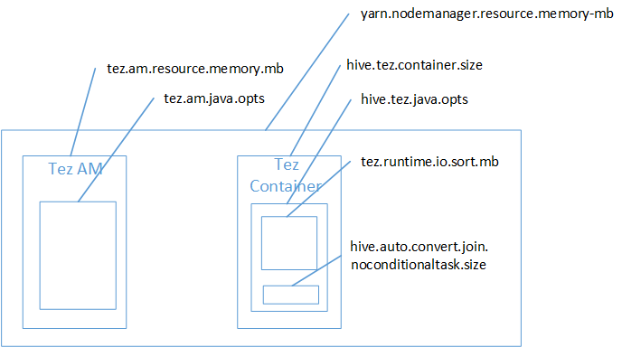

<properties
    pageTitle="Se déconnecter de l’erreur de mémoire (insuffisante) - paramètres Hive | Microsoft Azure"
    description="Corriger une erreur de mémoire insuffisante (insuffisante) à partir d’une requête Hive dans Hadoop dans HDInsight. Le scénario client est une requête sur plusieurs tables de grande taille."
    keywords="se déconnecter de paramètres de mémoire insuffisante, erreur Hive"
    services="hdinsight"
    documentationCenter=""
    authors="rashimg"
    manager="jhubbard"
    editor="cgronlun"/>

<tags
    ms.service="hdinsight"
    ms.devlang="na"
    ms.topic="article"
    ms.tgt_pltfrm="na"
    ms.workload="big-data"
    ms.date="09/02/2016"
    ms.author="rashimg;jgao"/>

# Corriger une erreur de mémoire insuffisante avec les paramètres de la mémoire Hive dans Hadoop dans Azure HDInsight

Parmi les problèmes courants face de nos clients reçoivent une erreur de mémoire insuffisante lors de l’utilisation de la ruche. Cet article décrit un scénario de client et les paramètres Hive que nous vous recommandons de résoudre le problème.

## Scénario : Requête de Hive entre les tables de grande taille

Un client exécutez la requête ci-dessous à l’aide de Hive.

    SELECT
        COUNT (T1.COLUMN1) as DisplayColumn1,
        …
        …
        ….
    FROM
        TABLE1 T1,
        TABLE2 T2,
        TABLE3 T3,
        TABLE5 T4,
        TABLE6 T5,
        TABLE7 T6
    where (T1.KEY1 = T2.KEY1….
        …
        …

Certaines nuances de cette requête :

* T1 est un alias à une table volumineux, TABLE1, c'est-à-dire un nombre important de types de colonne de chaîne.
* Autres tables pas qui sont volumineux mais disposent d’un grand nombre de colonnes.
* Toutes les tables participent à l’autre, dans certains cas, avec plusieurs colonnes de TABLE1 et d’autres personnes.

Lorsque le client exécuté la requête en utilisant Hive sur MapReduce sur un nœud 24 cluster A3, la requête s’est exécutée en environ 26 minutes. Le client remarqué des messages d’avertissement suivants lors de la requête exécution à l’aide de Hive sur MapReduce :

    Warning: Map Join MAPJOIN[428][bigTable=?] in task 'Stage-21:MAPRED' is a cross product
    Warning: Shuffle Join JOIN[8][tables = [t1933775, t1932766]] in Stage 'Stage-4:MAPRED' is a cross product

Étant donné que la requête exécution dans environ 26 minutes terminée, le client ignoré ces avertissements et à la place en main pour vous concentrer sur comment faire pour améliorer cette davantage l’efficacité de la requête.

Le client consulté [optimiser la ruche requêtes pour Hadoop dans HDInsight](hdinsight-hadoop-optimize-hive-query.md)et décidé d’utiliser Tez moteur d’exécution. Une fois que la même requête a été exécutée avec le paramètre Tez activé la requête exécuté pendant 15 minutes et puis a levé l’erreur suivante :

    Status: Failed
    Vertex failed, vertexName=Map 5, vertexId=vertex_1443634917922_0008_1_05, diagnostics=[Task failed, taskId=task_1443634917922_0008_1_05_000006, diagnostics=[TaskAttempt 0 failed, info=[Error: Failure while running task:java.lang.RuntimeException: java.lang.OutOfMemoryError: Java heap space
        at
    org.apache.hadoop.hive.ql.exec.tez.TezProcessor.initializeAndRunProcessor(TezProcessor.java:172)
        at org.apache.hadoop.hive.ql.exec.tez.TezProcessor.run(TezProcessor.java:138)
        at
    org.apache.tez.runtime.LogicalIOProcessorRuntimeTask.run(LogicalIOProcessorRuntimeTask.java:324)
        at
    org.apache.tez.runtime.task.TezTaskRunner$TaskRunnerCallable$1.run(TezTaskRunner.java:176)
        at
    org.apache.tez.runtime.task.TezTaskRunner$TaskRunnerCallable$1.run(TezTaskRunner.java:168)
        at java.security.AccessController.doPrivileged(Native Method)
        at javax.security.auth.Subject.doAs(Subject.java:415)
        at org.apache.hadoop.security.UserGroupInformation.doAs(UserGroupInformation.java:1628)
        at
    org.apache.tez.runtime.task.TezTaskRunner$TaskRunnerCallable.call(TezTaskRunner.java:168)
        at
    org.apache.tez.runtime.task.TezTaskRunner$TaskRunnerCallable.call(TezTaskRunner.java:163)
        at java.util.concurrent.FutureTask.run(FutureTask.java:262)
        at java.util.concurrent.ThreadPoolExecutor.runWorker(ThreadPoolExecutor.java:1145)
        at java.util.concurrent.ThreadPoolExecutor$Worker.run(ThreadPoolExecutor.java:615)
        at java.lang.Thread.run(Thread.java:745)
    Caused by: java.lang.OutOfMemoryError: Java heap space

Le client puis décidé d’utiliser un plus grand machine virtuelle (c'est-à-dire D12) vous envisagez une plus grande machine virtuelle aurait davantage d’espace segment. Même alors, le client suite à afficher l’erreur. Le client atteint à l’équipe HDInsight pour vous aider à déboguer ce problème.

## Déboguer l’erreur de mémoire insuffisante

Notre prise en charge et les équipes d’ingénieurs ensemble a détecté un des problèmes à l’origine de l’erreur de mémoire insuffisante a été un [problème décrit dans la JIRA Apache connu](https://issues.apache.org/jira/browse/HIVE-8306). À partir de la description dans la JIRA :

    When hive.auto.convert.join.noconditionaltask = true we check noconditionaltask.size and if the sum  of tables sizes in the map join is less than noconditionaltask.size the plan would generate a Map join, the issue with this is that the calculation doesnt take into account the overhead introduced by different HashTable implementation as results if the sum of input sizes is smaller than the noconditionaltask size by a small margin queries will hit OOM.

Nous avons confirmé que **hive.auto.convert.join.noconditionaltask** a été bien la valeur **true** en recherchant sous hive site.xml fichier :

    <property>
        <name>hive.auto.convert.join.noconditionaltask</name>
        <value>true</value>
        <description>
            Whether Hive enables the optimization about converting common join into mapjoin based on the input file size.
            If this parameter is on, and the sum of size for n-1 of the tables/partitions for a n-way join is smaller than the
            specified size, the join is directly converted to a mapjoin (there is no conditional task).
        </description>
    </property>

En fonction de l’avertissement et la JIRA, notre hypothèse était carte participer à l’origine de l’erreur Java segment espace insuffisante. Afin que nous choisit d’utiliser plus approfondie dans ce problème.

Comme indiqué dans le billet de blog [Hadoop fils les paramètres de mémoire dans HDInsight](http://blogs.msdn.com/b/shanyu/archive/2014/07/31/hadoop-yarn-memory-settings-in-hdinsigh.aspx), lorsque Tez moteur d’exécution est utilisé l’espace de segment utilisé vous appartient réellement le conteneur Tez. Voir l’image ci-dessous décrivant la mémoire conteneur Tez.

Comme l’indique le billet de blog, les paramètres de deux mémoire suivants définissent la mémoire de conteneur pour le segment : **hive.tez.container.size** et **hive.tez.java.opts**. À partir de notre expérience, l’exception insuffisante signifie pas que la taille du conteneur est trop petite. Cela signifie que la taille de segment Java (hive.tez.java.opts) est trop petite. Pour chaque fois que vous voyez insuffisante, vous pouvez essayer d’augmenter **hive.tez.java.opts**. Si nécessaire vous devrez peut-être augmenter **hive.tez.container.size**. Le paramètre **java.opts** doit être environ 80 % de **container.size**.

> [AZURE.NOTE]  Le paramètre **hive.tez.java.opts** doit toujours être inférieure à **hive.tez.container.size**.

Depuis un ordinateur D12 a 28 Go de mémoire, nous avons décidé d’utiliser une taille de conteneur de 10 Go (10240 Mo) et affecter 80 % à java.opts. Cela a été effectué sur la console Hive en utilisant le paramètre ci-dessous :

    SET hive.tez.container.size=10240
    SET hive.tez.java.opts=-Xmx8192m

En fonction de ces paramètres, la requête a réussi sous 10 minutes.

## Conclusion : Erreurs insuffisante et la taille du conteneur

Vous obtenez une erreur insuffisante ne signifie pas nécessairement que la taille du conteneur est trop petite. À la place, vous devez configurer les paramètres de mémoire afin que la taille du segment est augmentée et au moins 80 % de la taille de la mémoire conteneur.
