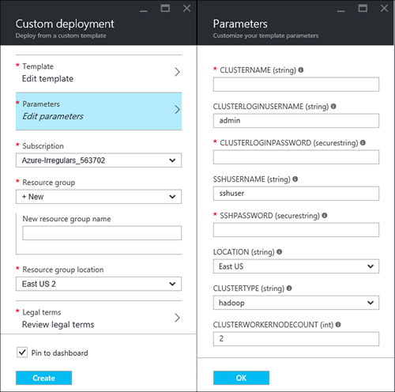

<properties
    pageTitle="Didacticiel Linux : prise en main Hadoop et Hive | Microsoft Azure"
    description="Suivez ce didacticiel Linux pour commencer à utiliser Hadoop dans HDInsight. Apprenez à mettre en service clusters Linux et interroger des données avec Hive."
    services="hdinsight"
    documentationCenter=""
    authors="mumian"
    manager="jhubbard"
    editor="cgronlun"
    tags="azure-portal"/>

<tags
    ms.service="hdinsight"
    ms.devlang="na"
    ms.topic="hero-article"
    ms.tgt_pltfrm="na"
    ms.workload="big-data"
    ms.date="09/14/2016"
    ms.author="jgao"/>

# Didacticiel Hadoop : commencer à utiliser Hadoop basé sur Linux dans HDInsight

> [AZURE.SELECTOR]
- [Basé sur Linux](hdinsight-hadoop-linux-tutorial-get-started.md)
- [Fonctionnant sous Windows](hdinsight-hadoop-tutorial-get-started-windows.md)

Découvrez comment créer des clusters basés sur Linux [Hadoop](http://hadoop.apache.org/) dans HDInsight et l’exécution des travaux Hive dans HDInsight. [Apache ruche](https://hive.apache.org/) est le composant les plus populaires dans le réseau Hadoop. Actuellement HDInsight est fourni avec 4 types cluster différent : [Hadoop](hdinsight-hadoop-introduction.md), [explosion](hdinsight-apache-spark-overview.md), [HBase](hdinsight-hbase-overview.md) et [vague de](hdinsight-storm-overview.md).  Chaque type de cluster prend en charge un jeu de composants différent. Tous les types de cluster 4 prend en charge Hive. Pour une liste des composants pris en charge dans HDInsight, voir [Quelles sont les nouveautés dans les versions de cluster Hadoop fournies par HDInsight ?](hdinsight-component-versioning.md)  

[AZURE.INCLUDE [delete-cluster-warning](../../includes/hdinsight-delete-cluster-warning.md)]

## Conditions préalables

Avant de commencer ce didacticiel, vous devez :

- **Abonnement Azure**: pour créer un compte d’évaluation un mois gratuit, accédez à [azure.microsoft.com/free](https://azure.microsoft.com/free).

### Exigences de contrôle d’accès

[AZURE.INCLUDE [access-control](../../includes/hdinsight-access-control-requirements.md)]

## Créer le cluster

La plupart des travaux Hadoop sont par lots. Vous créez un cluster, exécutez certaines tâches et puis supprimez le cluster. Dans cette section, vous allez créer un cluster Hadoop basé sur Linux dans HDInsight à l’aide du [Gestionnaire de ressources Azure modèle](../resource-group-template-deploy.md). Gestionnaire de ressources du modèle est entièrement personnalisable ; Il est facile de créer des ressources Azure comme HDInsight. Expérience de modèle Gestionnaire de ressources n’est pas nécessaire de suivre ce didacticiel. Pour les autres méthodes de création de cluster et comprendre les propriétés utilisées dans ce didacticiel, consultez [créer HDInsight clusters](hdinsight-hadoop-provision-linux-clusters.md). Le modèle de gestionnaire de ressources utilisé dans ce didacticiel se trouve dans un conteneur blob publique, [https://hditutorialdata.blob.core.windows.net/armtemplates/create-linux-based-hadoop-cluster-in-hdinsight.json](https://hditutorialdata.blob.core.windows.net/armtemplates/create-linux-based-hadoop-cluster-in-hdinsight.json). 

1. Cliquez sur l’image suivante pour se connecter à Azure et ouvrez le modèle de gestionnaire de ressources dans le portail Azure. 

    

2. À partir de la carte de **paramètres** , entrez les informations suivantes :

    .

    - **Nomducluster**: entrez un nom pour le cluster Hadoop que vous allez créer.
    - **Mot de passe et le nom de connexion cluster**: le nom de connexion par défaut est **admin**.
    - **Mot de passe et nom d’utilisateur SSH**: le nom d’utilisateur par défaut est **sshuser**.  Vous pouvez la renommer. 
    
    Autres paramètres sont facultatifs pour suivre ce didacticiel. Vous pouvez laisser les qu’ils sont. 
    
    Chaque cluster a une dépendance de compte de stockage Blob Azure. Il est généralement appelé le compte de stockage par défaut. HDInsight cluster et son compte de stockage par défaut doivent se trouver co-création dans la même région Azure. Suppression de clusters ne supprime pas le compte de stockage. Dans le modèle, le nom de compte de stockage par défaut est défini comme le nom du cluster avec « store » ajouté. 
    
3. Cliquez sur **OK** pour enregistrer les paramètres.
4. À partir de la carte de **déploiement personnalisée** , entrez le **nom du nouveau groupe de ressources** pour créer un nouveau groupe de ressources.  Le groupe de ressources est un conteneur qui regroupe cluster, le compte de stockage dépendantes et autres applications Web. L’emplacement de groupe de ressources peut être différent de l’emplacement de cluster.
5. Cliquez sur les **conditions juridiques**, puis cliquez sur **créer**.
6. Vérifiez que la case à cocher **Ajouter au tableau de bord** est activée, puis cliquez sur **créer**. Vous verrez une vignette intitulée **déploiement de déploiement d’un modèle**. Il est nécessaire à environ 20 minutes pour créer un cluster. 
7.  Une fois que le cluster est créé, la légende de la vignette est remplacée par le nom du groupe de ressources que vous avez spécifié. Et le portail s’ouvre automatiquement deux cartes avec le cluster et les paramètres de cluster. 

    .

    Il existe deux ressources répertoriées, le cluster et le compte de stockage par défaut.

##Exécuter des requêtes Hive

[Apache ruche](hdinsight-use-hive.md) est le composant les plus populaires utilisé dans HDInsight. Il existe de nombreux moyens d’exécuter des travaux Hive dans HDInsight. Dans ce didacticiel, vous allez utiliser la vue Ambari Hive à partir du portail pour exécuter certaines tâches Hive. Pour d’autres méthodes de soumission de travaux Hive, voir [Utiliser la ruche dans HDInsight](hdinsight-use-hive.md).

1. Accédez à **https://&lt;nomcluster >. azurehdinsight.net**, où &lt;nomcluster > est le cluster vous avez créé dans la section précédente pour ouvrir Ambari.
2. Entrez le nom d’utilisateur Hadoop et mot de passe que vous avez spécifié dans la section précédente. Le nom d’utilisateur par défaut est **admin**.
3. Ouvrir **La ruche affichage** comme le montre la capture d’écran suivante :

    .
4. Dans la section de __L’éditeur de requête__ de la page, collez les instructions HiveQL suivantes dans la feuille de calcul :

        SHOW TABLES;

    >[AZURE.NOTE] Point-virgule est requis par Hive.       
        
5. Cliquez sur __exécuter__. Une section de __Résultats de la requête processus__ devant apparaître en dessous de l’éditeur de requête et afficher des informations sur la tâche. 

    Une fois la requête terminée, la section __Requête processus résultats__ affiche les résultats de l’opération. Vous doit afficher une table, appelé **hivesampletable**. Cet exemple de table Hive est fourni avec tous les groupes de HDInsight.

    .

6. Répétez les étapes 4 et 5 pour exécuter la requête suivante :

        SELECT * FROM hivesampletable;

    > [AZURE.TIP] Remarque la liste déroulante __Enregistrer les résultats__ dans le coin supérieur gauche de la section __Résultats de processus de la requête__ ; Vous pouvez l’utiliser à télécharger les résultats ou les enregistrer dans HDInsight stockage dans un fichier CSV.

7. Cliquez sur **historique** pour obtenir une liste des tâches.

Une fois que vous avez terminé une tâche Hive, vous pouvez [Exporter les résultats de la base de données SQL Azure ou base de données SQL Server](hdinsight-use-sqoop-mac-linux.md), vous pouvez également [visualiser les résultats à l’aide d’Excel](hdinsight-connect-excel-power-query.md). Pour plus d’informations sur l’utilisation de Hive dans HDInsight, voir [utiliser ruche et HiveQL avec Hadoop dans HDInsight pour analyser un exemple de fichier log4j Apache](hdinsight-use-hive.md).

##Nettoyer le didacticiel

Après avoir terminé le didacticiel, vous souhaiterez peut-être supprimer le cluster. Avec HDInsight, vos données sont stockées dans le stockage Azure, afin de supprimer en toute sécurité un cluster lorsqu’elle n’est pas en cours d’utilisation. Vous êtes également chargé pour un cluster de HDInsight, même lorsqu’elle n’est pas en cours d’utilisation. Dans la mesure où les frais pour le cluster sont plus autant de fois que les frais de stockage, il est préférable économique de supprimer clusters lorsqu’ils ne sont pas en cours d’utilisation. 

>[AZURE.NOTE] À l’aide de [Azure Data Factory](hdinsight-hadoop-create-linux-clusters-adf.md), vous pouvez créer des clusters HDInsight à la demande et configurer un paramètre de la propriété TimeToLive et supprimer automatiquement les groupes. 

**Pour supprimer le cluster et/ou le compte de stockage par défaut**

1. Connectez-vous au [portail Azure](https://portal.azure.com).
2. Dans le tableau de bord du portail, cliquez sur la vignette avec le nom du groupe de ressources que vous avez utilisé lorsque vous avez créé le cluster.
3. Cliquez sur **Supprimer** dans la carte de ressources pour supprimer le groupe de ressources qui contient le cluster et le compte de stockage par défaut ; ou cliquez sur le nom du cluster sur la vignette de **ressources** , puis sur **Supprimer** sur la carte cluster. Remarque, la suppression du groupe de ressources sera supprimez le compte de stockage. Si vous souhaitez conserver le compte de stockage, choisissez de supprimer le cluster uniquement.

## Étapes suivantes

Dans ce didacticiel, vous avez appris comment créer un cluster basé sur Linux HDInsight à l’aide d’un modèle de gestionnaire de ressources et comment effectuer des requêtes de base Hive.

Pour en savoir plus sur l’analyse des données avec HDInsight, voir les rubriques suivantes :

- Pour plus d’informations sur l’utilisation de Hive avec HDInsight, y compris comment effectuer des requêtes Hive à partir de Visual Studio, voir [Utiliser la ruche avec HDInsight][hdinsight-use-hive].

- Pour en savoir plus sur cochon, un langage utilisé pour transformer les données, voir [Utiliser cochon avec HDInsight][hdinsight-use-pig].

- Pour en savoir plus sur MapReduce, un moyen d’écrire des programmes qui traitent des données sur Hadoop, voir [Utiliser MapReduce avec HDInsight][hdinsight-use-mapreduce].

- Pour en savoir plus sur l’aide des outils HDInsight pour Visual Studio pour analyser des données sur HDInsight, voir [commencer à utiliser les outils de Visual Studio Hadoop pour HDInsight](hdinsight-hadoop-visual-studio-tools-get-started.md).

Si vous êtes prêt à commencer à travailler avec vos propres données et avez besoin d’en savoir plus sur comment HDInsight stocke les données ou comment obtenir des données dans HDInsight, voir les rubriques suivantes :

- Pour plus d’informations sur la façon dont HDInsight utilise le stockage blob Azure, voir [utiliser Azure Blob storage avec HDInsight](hdinsight-hadoop-use-blob-storage.md).

- Pour plus d’informations sur la façon de télécharger des données à HDInsight, voir [télécharger les données à HDInsight][hdinsight-upload-data].

Si vous voulez en savoir plus sur la création et gestion d’un cluster de HDInsight, voir les rubriques suivantes :

- Pour en savoir plus sur la gestion de votre cluster basé sur Linux HDInsight, voir [clusters HDInsight gérer à l’aide de Ambari](hdinsight-hadoop-manage-ambari.md).

- Pour en savoir plus sur les options que vous pouvez sélectionner lorsque vous créez un cluster de HDInsight, voir [Création d’HDInsight sous Linux à l’aide des options personnalisées](hdinsight-hadoop-provision-linux-clusters.md).

- Si vous êtes habitué à Linux et Hadoop, mais pour en savoir caractéristiques d’Hadoop sur la HDInsight, voir [utiliser HDInsight sous Linux](hdinsight-hadoop-linux-information.md). Il fournit des informations telles que :

    * URL des services hébergés sur le cluster, tels que Ambari et WebHCat
    * L’emplacement des fichiers Hadoop et d’exemples sur le système de fichiers local
    * Stocker de l’utilisation de Azure stockage (WASB) au lieu de HADOOP comme les données par défaut

[1]: ../HDInsight/hdinsight-hadoop-visual-studio-tools-get-started.md

[hdinsight-provision]: hdinsight-provision-clusters.md
[hdinsight-admin-powershell]: hdinsight-administer-use-powershell.md
[hdinsight-upload-data]: hdinsight-upload-data.md
[hdinsight-use-mapreduce]: hdinsight-use-mapreduce.md
[hdinsight-use-hive]: hdinsight-use-hive.md
[hdinsight-use-pig]: hdinsight-use-pig.md

[powershell-download]: http://go.microsoft.com/fwlink/p/?linkid=320376&clcid=0x409
[powershell-install-configure]: powershell-install-configure.md
[powershell-open]: powershell-install-configure.md#Install

[img-hdi-dashboard]: ./media/hdinsight-hadoop-tutorial-get-started-windows/HDI.dashboard.png
[img-hdi-dashboard-query-select]: ./media/hdinsight-hadoop-tutorial-get-started-windows/HDI.dashboard.query.select.png
[img-hdi-dashboard-query-select-result]: ./media/hdinsight-hadoop-tutorial-get-started-windows/HDI.dashboard.query.select.result.png
[img-hdi-dashboard-query-select-result-output]: ./media/hdinsight-hadoop-tutorial-get-started-windows/HDI.dashboard.query.select.result.output.png
[img-hdi-dashboard-query-browse-output]: ./media/hdinsight-hadoop-tutorial-get-started-windows/HDI.dashboard.query.browse.output.png
[image-hdi-clusterstatus]: ./media/hdinsight-hadoop-tutorial-get-started-windows/HDI.ClusterStatus.png
[image-hdi-gettingstarted-powerquery-importdata]: ./media/hdinsight-hadoop-tutorial-get-started-windows/HDI.GettingStarted.PowerQuery.ImportData.png
[image-hdi-gettingstarted-powerquery-importdata2]: ./media/hdinsight-hadoop-tutorial-get-started-windows/HDI.GettingStarted.PowerQuery.ImportData2.png
