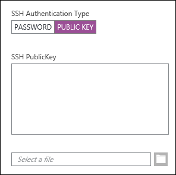
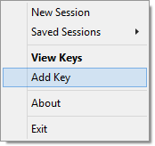

<properties
   pageTitle="Utiliser les touches SSH avec Hadoop sur clusters basés sur Linux à partir de Windows | Microsoft Azure"
   description="Découvrez comment créer et utiliser des clés SSH s’authentifier à clusters HDInsight basé sur Linux. Se connecter clusters à partir de clients Windows en utilisant le client PuTTY SSH."
   services="hdinsight"
   documentationCenter=""
   authors="Blackmist"
   manager="jhubbard"
   editor="cgronlun"
    tags="azure-portal"/>

<tags
   ms.service="hdinsight"
   ms.devlang="na"
   ms.topic="get-started-article"
   ms.tgt_pltfrm="na"
   ms.workload="big-data"
   ms.date="08/30/2016"
   ms.author="larryfr"/>

#Utiliser le protocole SSH avec basé sur Linux Hadoop sur HDInsight à partir de Windows

> [AZURE.SELECTOR]
- [Windows](hdinsight-hadoop-linux-use-ssh-windows.md)
- [Linux, Unix OS X](hdinsight-hadoop-linux-use-ssh-unix.md)

[SSH (Secure Shell)](https://en.wikipedia.org/wiki/Secure_Shell) vous permet d’effectuer des opérations sur vos clusters basés sur Linux HDInsight à l’aide d’une interface de ligne de commande à distance. Ce document fournit des informations sur la connexion à HDInsight à partir de clients Windows en utilisant le client PuTTY SSH.

> [AZURE.NOTE] Les étapes décrites dans cet article part du principe que vous utilisez un client fonctionnant sous Windows. Si vous utilisez un client Linux, Unix ou OS X, voir [Utiliser SSH avec basé sur Linux Hadoop sur HDInsight de Linux, Unix ou OS X](hdinsight-hadoop-linux-use-ssh-unix.md).
>
> Si vous avez Windows 10 et utilisez [Bash sur Ubuntu sous Windows](https://msdn.microsoft.com/commandline/wsl/about), vous pouvez utiliser les étapes décrites dans le document [Utiliser SSH avec basé sur Linux Hadoop sur HDInsight de Linux, Unix ou OS X](hdinsight-hadoop-linux-use-ssh-unix.md) .

##Conditions préalables

* **PuTTY** et **PuTTYGen** pour les clients basés sur Windows. Ces utilitaires sont disponibles à partir de [http://www.chiark.greenend.org.uk/~sgtatham/putty/download.html](http://www.chiark.greenend.org.uk/~sgtatham/putty/download.html).

* Un navigateur web moderne qui prend en charge HTML5.

OR

* [Azure infrastructure du langage commun](../xplat-cli-install.md).

    [AZURE.INCLUDE [use-latest-version](../../includes/hdinsight-use-latest-cli.md)] 

##Qu’est SSH ?

SSH est un utilitaire de connexion et à distance en cours d’exécution, commandes sur un serveur distant. Avec basé sur Linux HDInsight, SSH établit une connexion chiffrée pour le nœud de tête cluster et fournit une ligne de commande qui vous permet de taper dans les commandes. Commandes sont ensuite exécutées directement sur le serveur.

###Nom d’utilisateur SSH

Un nom d’utilisateur SSH est le nom que vous utilisez pour l’authentification pour le cluster HDInsight. Lorsque vous spécifiez un nom d’utilisateur SSH lors de la création de cluster, cet utilisateur est créé sur tous les nœuds du cluster. Une fois que le cluster est créé, vous pouvez utiliser ce nom d’utilisateur pour se connecter aux nœuds de tête du cluster HDInsight. Dans les nœuds de tête, vous pouvez ensuite connecter les nœuds de travail individuels.

###Mot de passe SSH ou clé publique

Un utilisateur SSH peut utiliser une clé publique ou un mot de passe pour l’authentification. Un mot de passe est simplement une chaîne de texte que vous le composent pendant une clé publique fait partie d’une paire de clé de chiffrement générée pour vous identifier de façon unique.

Une clé est plus sécurisée qu’un mot de passe, mais il nécessite des étapes supplémentaires pour générer la clé et vous devez mettre à jour les fichiers contenant la clé dans un emplacement sécurisé. Si tout le monde peut accéder aux fichiers de clés, ils ont accès à votre compte. Ou, si vous perdez les fichiers de clés, vous ne serez pas en mesure de vous connecter à votre compte.

Une paire de clés se compose d’une clé publique (qui est envoyée au serveur HDInsight) et une clé privée (qui est conservée sur votre ordinateur client.) Lorsque vous vous connectez au serveur HDInsight à l’aide de SSH, le client SSH va utiliser la clé privée sur votre ordinateur pour vous authentifier avec le serveur.

##Créer un code SSH

Utilisez les informations ci-dessous si vous prévoyez de l’aide du clavier SSH avec votre cluster. Si vous prévoyez d’utiliser un mot de passe, vous pouvez ignorer cette section.

1. Ouvrez PuTTYGen.

2. Pour **Type de clé pour générer**, sélectionnez **RSA SSH-2**, puis cliquez sur **Générer**.

    

3. Déplacer la souris dans la zone sous la barre de progression jusqu'à ce que la barre de remplissage. Déplacement de la souris génère des données aléatoires qui sont utilisées pour générer la clé.

    

    Une fois que la clé a été générée, la clé publique s’affichera.

4. Pour une sécurité accrue, vous pouvez entrer un mot de passe dans le champ **mot de passe de clé** , puis tapez la même valeur dans le champ **Confirmer le mot de passe** .

    

    > [AZURE.NOTE] Nous vous recommandons vivement d’utiliser un mot de passe sécurisé pour la clé. Toutefois, si vous avez oublié le mot de passe, il est inutile de le récupérer.

5. Cliquez sur **Enregistrer la clé privée** pour enregistrer la clé dans un fichier **.ppk** . Cette clé permet de s’authentifier à votre cluster HDInsight basé sur Linux.

    > [AZURE.NOTE] Vous devez stocker cette clé dans un emplacement sécurisé, tel qu’il peut être utilisé pour accéder à votre cluster HDInsight basé sur Linux.

6. Cliquez sur **Enregistrer la clé publique** pour enregistrer la clé dans un fichier **.txt** . Cela vous permet de réutiliser la clé publique à l’avenir lorsque vous créez clusters basés sur Linux HDInsight supplémentaires.

    > [AZURE.NOTE] La clé publique est également affichée dans la partie supérieure du PuTTYGen. Vous pouvez droit sur ce champ, copiez la valeur et puis collez-les dans un formulaire lorsque vous créez un cluster à l’aide du portail Azure.

##Créer un cluster basé sur Linux HDInsight

Lorsque vous créez un cluster basé sur Linux HDInsight, vous devez fournir la clé publique créée précédemment. À partir de clients Windows, il existe deux façons de créer un cluster basé sur Linux HDInsight :

* **Portail azure** - utilise un portail web pour créer le cluster.

* **Infrastructure du langage commun pour Mac, Linux et Windows azure** - utilise des commandes de ligne de commande pour créer le cluster.

Chacune de ces méthodes nécessite la clé publique. Pour plus d’informations sur la création d’un cluster basé sur Linux HDInsight, voir [clusters HDInsight basé sur Linux de mise en service](hdinsight-hadoop-provision-linux-clusters.md).

###Portail Azure

Lorsque vous utilisez le [Portail Azure] [ preview-portal] pour créer un cluster basé sur Linux HDInsight, vous devez entrer un **Nom d’utilisateur SSH**et sélectionnez cette option pour entrer un **mot de passe** ou la **Clé publique SSH**.

Si vous sélectionnez **Clé publique SSH**, vous pouvez soit coller la clé publique (affiché dans la __clé publique puis le coller dans OpenSSH autorisé\_fichier touches__ PuttyGen, champ) dans le champ __SSH clé publique__ , ou sélectionnez __Sélectionner un fichier__ pour parcourir et sélectionnez le fichier qui contient la clé publique.

Cela crée une connexion pour l’utilisateur spécifié et permet à l’authentification de mot de passe ou l’authentification par clé SSH.

###Azure Interface de ligne de commande pour Mac, Linux et Windows

Vous pouvez utiliser l' [Infrastructure du langage commun pour Mac, Linux et Windows Azure](../xplat-cli-install.md) pour créer un nouveau cluster à l’aide de la `azure hdinsight cluster create` commande.

Pour plus d’informations sur l’utilisation de cette commande, voir [groupes de mise en service Hadoop Linux dans un HDInsight à l’aide des options personnalisées](hdinsight-hadoop-provision-linux-clusters.md).

##Se connecter à un cluster basé sur Linux HDInsight

1. Ouvrez PuTTY.

    

2. Si vous avez fourni un code SSH lorsque vous avez créé votre compte d’utilisateur, vous devez effectuer l’opération suivante pour sélectionner la clé privée à utiliser lors de l’authentification pour le cluster :

    Dans **catégorie**, développez **connexion**, développez **SSH**, puis sélectionnez **Auth**. Enfin, cliquez sur **Parcourir** et sélectionnez le fichier .ppk qui contient votre clé privée.

    

3. Dans **catégorie**, sélectionnez **la Session**. Dans l’écran **options de base pour votre session mastic** , entrez l’adresse SSH de votre serveur HDInsight dans le champ **nom d’hôte (ou l’adresse IP)** . Il existe deux adresses SSH possibles, que vous pouvez utiliser lorsque vous vous connectez à un cluster :

    * __Adresse de nœud de tête__: pour vous connecter pour le nœud de tête du cluster, utilisez votre nom de cluster, puis **-ssh.azurehdinsight.net**. Par exemple, **mon_cluster ssh.azurehdinsight.net**.
    
    * __Adresse du nœud bord__: Si vous vous connectez à un serveur R sur cluster HDInsight, vous pouvez vous connecter au nœud edge Server R à l’aide de l’adresse __RServer.CLUSTERNAME.ssh.azurehdinsight.net__, où CLUSTERNAME est le nom de votre cluster. Par exemple, __RServer.mycluster.ssh.azurehdinsight.net__.

    

4. Pour enregistrer les informations de connexion pour une utilisation ultérieure, entrez un nom pour cette connexion sous **Sessions enregistré**, puis cliquez sur **Enregistrer**. La connexion est ajoutée à la liste des sessions enregistrées.

5. Cliquez sur **Ouvrir** pour vous connecter au cluster.

    > [AZURE.NOTE] Si c’est la première fois que vous avez connectés au cluster, vous recevrez une alerte de sécurité. Ceci est normal. Sélectionnez **Oui** pour mettre en cache la clé du serveur RSA2 pour continuer.

6. Lorsque vous y êtes invité, entrez l’utilisateur que vous avez entré lorsque vous avez créé le cluster. Si vous avez fourni un mot de passe pour l’utilisateur, vous devrez entrer également.

> [AZURE.NOTE] Les étapes ci-dessus part du principe que vous utilisez le port 22, ce qui se connecteront à l’headnode primaire sur le cluster HDInsight. Si vous utilisez le port 23, vous connecterez sur le site secondaire. Pour plus d’informations sur les nœuds de tête, voir [la disponibilité et la fiabilité des groupes Hadoop dans un HDInsight](hdinsight-high-availability-linux.md).

###Se connecter à des nœuds de travail

Les nœuds de travail ne sont pas directement accessibles en dehors du centre de données Azure, mais ils sont accessibles à partir du nœud principal de cluster viaSSH.

Si vous avez fourni un code SSH lorsque vous avez créé votre compte d’utilisateur, vous devez effectuer les étapes suivantes pour utiliser la clé privée lors de l’authentification pour le cluster si vous voulez vous connecter les nœuds de travail.

1. Installez Fête costumée à partir de [http://www.chiark.greenend.org.uk/~sgtatham/putty/download.html](http://www.chiark.greenend.org.uk/~sgtatham/putty/download.html). Cet utilitaire est utilisé pour mettre en cache SSH clés pour PuTTY.

2. Exécutez Fête costumée. Il permet de minimiser à une icône dans la barre d’état. Cliquez sur l’icône, puis sélectionnez **Ajouter une clé**.

    

3. Lorsque la boîte de dialogue Parcourir s’affiche, sélectionnez le fichier .ppk qui contient la clé, puis cliquez sur **Ouvrir**. La clé est ajoutée à Fête costumée, qui va l’assurer à PuTTY lors de la connexion au cluster.

    > [AZURE.IMPORTANT] Si vous avez utilisé un code SSH pour votre compte, vous devez effectuer les étapes précédentes avant que vous ne pourrez pas vous connecter à des nœuds de travail.

4. Ouvrez PuTTY.

5. Si vous utilisez un code SSH s’authentifier, dans la section **catégorie** , développez **connexion**, développez **SSH**et puis sélectionnez **Auth**.

    Dans la section **paramètres d’authentification** , activez **Autoriser l’agent de transfert**. Cela permet de PuTTY à passer automatiquement l’authentification par certificat via une connexion pour le nœud de tête cluster lors de la connexion à des nœuds de travail.

    

6. Connectez-vous au cluster en procédant comme décrit plus haut. Si vous utilisez un code SSH pour l’authentification, vous n’avez pas besoin de sélectionner la clé - le SSH ajouté à la Fête costumée est utilisé pour l’authentification pour le cluster.

7. Une fois la connexion établie, utilisez ce qui suit pour récupérer une liste des nœuds dans votre cluster. Remplacez *ADMINPASSWORD* par mot de passe de votre compte d’administrateur de cluster. Remplacez *NOMDUCLUSTER* par le nom de votre cluster.

        curl --user admin:ADMINPASSWORD https://CLUSTERNAME.azurehdinsight.net/api/v1/hosts

    Ceci renvoie des informations au format JSON pour les nœuds dans le cluster, y compris `host_name`, qui contient le nom de domaine complet (FQDN) pour chaque nœud. Voici un exemple d’un `host_name` entrée renvoyée par la commande **coin** :

        "host_name" : "workernode0.workernode-0-e2f35e63355b4f15a31c460b6d4e1230.j1.internal.cloudapp.net"

8. Une fois que vous avez une liste des nœuds de travail que vous voulez vous connecter, utilisez la commande suivante à partir de la session mastic pour ouvrir une connexion à un nœud de travail :

        ssh USERNAME@FQDN

    Remplacez *nom_utilisateur* par votre nom d’utilisateur SSH et le *nom de domaine complet* avec le nom de domaine complet pour le nœud de travail. Par exemple, `workernode0.workernode-0-e2f35e63355b4f15a31c460b6d4e1230.j1.internal.cloudapp.net`.

    > [AZURE.NOTE] Si vous utilisez un mot de passe pour l’authentification votre session SSH, vous devrez entrer à nouveau le mot de passe. Si vous utilisez un code SSH, la connexion doit se terminer sans les invites.

9. Une fois la session établie, l’invite pour votre session mastic pourra `username@hn#-clustername` à `username@wn#-clustername` pour indiquer que vous êtes connecté au nœud concerné. Les commandes que vous exécutez à ce stade seront exécutent sur le nœud concerné.

10. Une fois que vous avez terminé d’effectuer des actions sur le nœud concerné, utilisez la `exit` commande Fermer la session sur le nœud concerné. Retour à la `username@hn#-clustername` invite de commandes.

##Ajouter d’autres comptes

Si vous voulez ajouter d’autres comptes à votre cluster, procédez comme suit :

1. Générer une nouvelle clé publique et la clé privée pour le nouveau compte d’utilisateur comme décrit plus haut.

2. À partir d’une session SSH pour le cluster, ajouter le nouvel utilisateur avec la commande suivante :

        sudo adduser --disabled-password <username>

    Cela crée un nouveau compte d’utilisateur, mais vous permet de désactiver l’authentification de mot de passe.

3. Créer le répertoire et les fichiers, maintenez la touche à l’aide des commandes suivantes :

        sudo mkdir -p /home/<username>/.ssh
        sudo touch /home/<username>/.ssh/authorized_keys
        sudo nano /home/<username>/.ssh/authorized_keys

4. Ouverture de l’éditeur nano, copier et coller dans le contenu de la clé publique pour le nouveau compte d’utilisateur. Enfin, utilisez **Ctrl X** pour enregistrer le fichier et quitter l’éditeur.

    

5. Utilisez la commande suivante pour modifier la propriété du dossier .ssh et du contenu vers le nouveau compte d’utilisateur :

        sudo chown -hR <username>:<username> /home/<username>/.ssh

6. Vous devriez maintenant pouvoir s’authentifier au serveur avec le nouveau compte d’utilisateur et la clé privée.

##SSH tunnel

SSH peut servir à tunnel demandes locales, telles que les requêtes web, vers le cluster HDInsight. La demande puis doivent être routée à la ressource demandée comme s’il avait a été créée dans le nœud de tête cluster HDInsight.

> [AZURE.IMPORTANT] Un tunnel SSH est nécessaire pour accéder à l’interface utilisateur web pour certains services Hadoop. Par exemple, l’interface utilisateur de l’historique de travail ou l’interface utilisateur du Gestionnaire de ressources uniquement est accessible à l’aide d’un tunnel SSH.

Pour plus d’informations sur la création et à l’aide d’un tunnel SSH, voir [Utiliser SSH tunnel pour accéder à l’interface utilisateur Ambari web, ResourceManager, JobHistory, NameNode, Oozie et autres web l’interface utilisateur](hdinsight-linux-ambari-ssh-tunnel.md).

##Étapes suivantes

Maintenant que vous savez s’authentifier à l’aide d’un code SSH, découvrez comment utiliser MapReduce avec Hadoop sur HDInsight.

* [Utiliser Hive avec HDInsight](hdinsight-use-hive.md)

* [Utiliser cochon avec HDInsight](hdinsight-use-pig.md)

* [Utiliser des travaux MapReduce avec HDInsight](hdinsight-use-mapreduce.md)

[preview-portal]: https://portal.azure.com/
