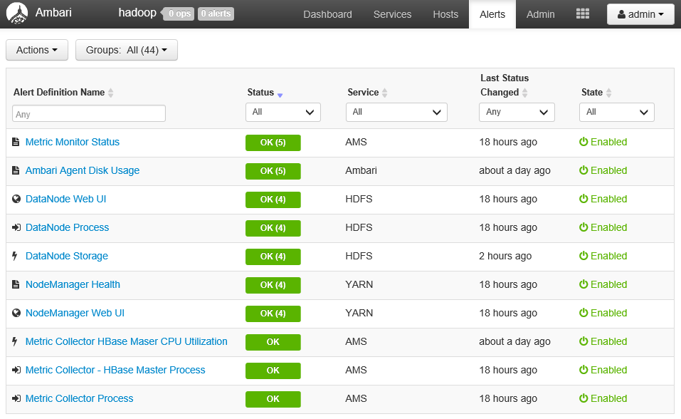
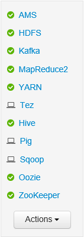

<properties
   pageTitle="Surveiller et gérer les HDInsight à l’aide de l’interface utilisateur Web Apache Ambari | Microsoft Azure"
   description="Découvrez comment utiliser Ambari pour surveiller et gérer des clusters HDInsight basé sur Linux. Dans ce document, vous allez apprendre à utiliser l’interface utilisateur Web Ambari inclus avec clusters HDInsight."
   services="hdinsight"
   documentationCenter=""
   authors="Blackmist"
   manager="jhubbard"
   editor="cgronlun"
    tags="azure-portal"/>

<tags
   ms.service="hdinsight"
   ms.devlang="na"
   ms.topic="article"
   ms.tgt_pltfrm="na"
   ms.workload="big-data"
   ms.date="09/27/2016"
   ms.author="larryfr"/>

#Gérer les clusters HDInsight à l’aide de l’interface utilisateur Web Ambari

[AZURE.INCLUDE [ambari-selector](../../includes/hdinsight-ambari-selector.md)]

Apache Ambari simplifie la gestion et la surveillance d’un cluster Hadoop en fournissant un facile à utiliser l’interface utilisateur web et des API REST. Ambari est inclus sur les clusters basés sur Linux HDInsight et sert à surveiller le cluster et apporter des modifications de configuration.

Dans ce document, vous allez apprendre à utiliser l’interface utilisateur Web Ambari avec un cluster HDInsight.

##Quelles sont les Ambari ?

<a href="http://ambari.apache.org" target="_blank">Apache Ambari</a> simplifie la gestion des Hadoop grâce à un site web facile à utiliser l’interface utilisateur pouvant être utilisées pour la mise en service, gérer et analyser les clusters Hadoop. Les développeurs peuvent intégrer ces fonctions dans leurs applications à l’aide de l' <a href="https://github.com/apache/ambari/blob/trunk/ambari-server/docs/api/v1/index.md" target="_blank">API REST de Ambari</a>.

L’interface utilisateur Web Ambari est fourni par défaut avec clusters HDInsight basé sur Linux. 

##Connectivité

L’interface utilisateur Web Ambari est disponible sur votre cluster HDInsight en HTTPS://CLUSTERNAME.azurehdidnsight.net, où __CLUSTERNAME__ est le nom de votre cluster. 

> [AZURE.IMPORTANT] Connexion à Ambari sur HDInsight nécessite HTTPS. Vous devez également vous authentifier à Ambari en utilisant le nom du compte d’administrateur (la valeur par défaut est __admin__) et mot de passe fourni lorsque le cluster a été créé.

##Proxy SSH

> [AZURE.NOTE] Si Ambari pour votre cluster est accessible directement via Internet, certains liens à partir de l’interface utilisateur Web Ambari (telle que la JobTracker) ne sont pas exposé sur internet. Vous recevrez donc erreurs « serveur non trouvé » lorsque vous tentez d’accéder à ces fonctionnalités, sauf si vous utilisez un tunnel SSH (Secure Shell) pour le trafic web de proxy vers le nœud de tête cluster.

Pour plus d’informations sur la création d’un tunnel SSH pour l’utiliser avec Ambari, voir [Utiliser SSH tunnel pour accéder à l’interface utilisateur Ambari web, ResourceManager, JobHistory, NameNode, Oozie et autres web l’interface utilisateur](hdinsight-linux-ambari-ssh-tunnel.md).

##Interface utilisateur Ambari Web

Lors de la connexion à l’interface utilisateur Web Ambari, vous devrez s’authentifier à la page. Utilisez le cluster administrateur utilisateur (par défaut d’administration) et mot de passe utilisé lors de la création de cluster.

Lorsque la page s’ouvre, notez la barre en haut. Ceci contient les contrôles et les informations suivantes :

* **Logo Ambari** - ouvre le tableau de bord, qui peut servir à surveiller le cluster.

* **Opérations de # nom cluster** - affiche le nombre d’opérations Ambari en cours. Sélectionnez le nom de cluster ou **opérations #** affiche une liste des opérations d’arrière-plan.

* **alertes #** - avertissements ou des alertes critiques, le cas échéant, pour le cluster. Si vous sélectionnez cette affiche une liste des alertes.

* **Tableau de bord** - affiche le tableau de bord.

* **Services** - informations et configuration des paramètres pour les services dans le cluster.

* **Hôtes** - informations et configuration des paramètres pour les nœuds dans le cluster.

* **Alertes** - un journal d’informations, avertissements et les alertes critiques.

* **Administrateur** - pile/services logiciels qui sont installés sur le cluster, les informations de compte de service et la sécurité Kerberos.

* **Bouton d’administration** - Ambari gestion des paramètres utilisateur et se déconnecter.

##Surveillance des mots clés

###Alertes

Ambari fournit de nombreuses alertes, qui auront une des opérations suivantes en tant que l’état :

* **Bien**

* **Avertissement**

* **CRITIQUE**

* **INCONNU**

Alertes autre que **OK** va entraîner l’entrée **alertes #** en haut de la page pour afficher le nombre d’alertes. Activer cette entrée permet d’afficher les alertes et leur statut.

Alertes sont organisées en plusieurs groupes par défaut, ce qui peuvent être affichés dans la page **d’alertes** .

Vous pouvez gérer les groupes en utilisant le menu **Actions** et en sélectionnant **Gérer les groupes d’alertes**. Cela vous permet de modifier des groupes existants, ou créer de nouveaux groupes.

Vous pouvez également créer des notifications d’alerte dans le menu **Actions** . Cela vous permet de créer des déclencheurs qui envoient des notifications par **courrier électronique** ou **SNMP** lorsque des combinaisons d’alerte/gravité spécifique se produisent. Par exemple, vous pouvez envoyer une alerte quand un des alertes dans le groupe **Fils par défaut** est définie sur **critique**.

###Cluster

L’onglet **indicateurs** du tableau de bord contient une série de widgets qui permettent de contrôler le statut de votre cluster en un clin de œil. Widgets plusieurs, telles **L’UC**, fournissent des informations supplémentaires lorsque vous cliquez dessus.

L’onglet **Heatmaps** affiche les mesures sous la forme heatmaps coloré, allant de vert en rouge.

Pour plus d’informations sur les nœuds au sein du cluster, sélectionnez **Hosts**, puis le nœud spécifique qui vous intéresse.

###Services

L’encadré de **Services** du tableau de bord fournit un aperçu rapide de l’état des services en cours d’exécution sur le cluster. Icônes différentes sont utilisées pour indiquer les actions devant être effectuées, comme un symbole jaune Corbeille Si un service doit être suppression initiale ou l’état.

Sélection d’un service affiche plus d’informations sur le service.

####Liens rapides

Certains services affichent un lien de **Liens rapides** dans la partie supérieure de la page. Cela peut servir à accéder aux spécifiques au service web interfaces utilisateur, tels que :

* **Historique des travaux** - historique du travail MapReduce.

* **Gestionnaire de ressources** - fils ResourceManager interface utilisateur.

* **NameNode** - Hadoop Distributed fichier système (HDFS) NameNode l’interface utilisateur.

* **Interface utilisateur Oozie Web** - Oozie l’interface utilisateur.

Sélectionnez une de ces liens s’ouvre un nouvel onglet dans votre navigateur, qui affiche la page sélectionnée.

> [AZURE.NOTE] Sélection d’un lien **Liens rapides** pour n’importe quel service provoquera une erreur « serveur non trouvé », sauf si vous utilisez un tunnel Secure Sockets Layer (SSL) pour le trafic web proxy pour le cluster. C’est parce que les applications web permettant d’afficher ces informations ne sont pas exposées sur internet.
>
> Pour plus d’informations sur l’utilisation d’un tunnel SSL avec HDInsight, voir [Utiliser SSH tunnel pour accéder à l’interface utilisateur Ambari web, ResourceManager, JobHistory, NameNode, Oozie et autres web l’interface utilisateur](hdinsight-linux-ambari-ssh-tunnel.md)

##Gestion des

###Autorisations, les groupes et les utilisateurs Ambari

Gestion des utilisateurs, les groupes et les autorisations ne doit pas être utilisée avec les clusters HDInsight.

###Hosts

La page **hôtes** répertorie tous les hôtes dans le cluster. Pour gérer les hôtes, procédez comme suit.

> [AZURE.NOTE] Ajout, la désactivation ou recommissioning un hôte ne doit pas être utilisée avec les clusters HDInsight.

1. Sélectionnez l’ou les hôtes que vous souhaitez gérer.

2. Utilisez le menu **Actions** pour sélectionner l’action que vous souhaitez effectuer :

    * **Démarrez tous les composants** - démarrer tous les composants sur l’hôte.

    * **Arrêter tous les composants** - arrêter tous les composants sur l’hôte.

    * **Redémarrez tous les composants** : arrêter et commencer à tous les composants sur l’hôte.

    * **Activer le mode maintenance** - supprime des alertes pour l’hôte. Il doit être activé si vous effectuez des actions qui généreront des alertes, telles que le redémarrage d’un service qui dépendent des services en cours d’exécution.

    * **Désactiver le mode maintenance** - renvoie l’hôte d’alerte normal.

    * **Arrêter** - taquets DataNode ou NodeManagers sur l’hôte.

    * **Démarrer** - DataNode démarre ou NodeManagers sur l’hôte.

    * **Redémarrez** - arrêts et démarrages DataNode ou NodeManagers sur l’hôte.

    * **Désactiver** - supprime un hôte du cluster.

        > [AZURE.NOTE] N’utilisez pas cette action sur des clusters HDInsight.

    * **Recommission** - ajoute un hôte au cluster précédemment désactivé.

        > [AZURE.NOTE] N’utilisez pas cette action sur des clusters HDInsight.

###Services

Dans la page **tableau de bord** ou les **Services** , utilisez le bouton **Actions** en bas de la liste des services, démarrez tous les services.

> [AZURE.WARNING] Tandis que __Ajouter un Service__ est répertorié dans ce menu, il ne doit pas être utilisé pour ajouter des services pour le cluster HDInsight. Nouveaux services doivent être ajoutés à l’aide d’une Action de Script pendant la mise en service de cluster. Pour plus d’informations sur l’utilisation des Actions de Script, voir [Personnaliser HDInsight clusters à l’aide des Actions de Script](hdinsight-hadoop-customize-cluster-linux.md).

Tandis que le bouton **Actions** redémarrez tous les services, fréquence à laquelle vous souhaitez démarrer, arrêter ou redémarrer un service spécifique. Suivez les étapes suivantes pour effectuer des actions sur un service :

1. Dans la page **tableau de bord** ou **Services** , sélectionnez un service.

2. Dans la partie supérieure de l’onglet **Résumé** , utilisez le bouton **Actions de Service** et sélectionnez l’action à effectuer. Cela va redémarrer le service sur tous les nœuds.

    

    > [AZURE.NOTE] Le redémarrage de certains services pendant l’exécution d’un cluster peut générer des alertes. Pour éviter ce problème, vous pouvez utiliser le bouton **Actions de Service** pour activer le **mode Maintenance** pour le service avant d’effectuer le redémarrage.

3. Une fois qu’une action a été sélectionnée, l’entrée **d’opérations #** en haut de la page incrémente pour indiquer qu’une opération d’arrière-plan est en cours. Si configuré pour afficher, la liste des opérations d’arrière-plan est affichée.

    > [AZURE.NOTE] Si vous activée **en mode Maintenance** pour le service, n’oubliez pas de désactiver en utilisant le bouton **Actions de Service** une fois l’opération terminée.

Pour configurer un service, procédez comme suit :

1. Dans la page **tableau de bord** ou **Services** , sélectionnez un service.

2. Sélectionnez l’onglet **configurations** . La configuration en cours s’affiche. Une liste de configurations précédentes est également affichée.

    

3. Utiliser les champs affichés pour modifier la configuration et sélectionnez **Enregistrer**. Ou sélectionnez une configuration précédente, puis sélectionnez **rendre actif** à revenir aux paramètres précédents.

##Vues Ambari

Affichages Ambari permet aux développeurs Branchez des éléments d’interface utilisateur dans l’interface utilisateur Web Ambari à l’aide de l' [Infrastructure d’affichages Ambari](https://cwiki.apache.org/confluence/display/AMBARI/Views). HDInsight propose plusieurs affichages avec des types de cluster Hadoop :

* Gestionnaire de file d’attente fils : le Gestionnaire de file d’attente fournit une interface utilisateur simple pour l’affichage et modification des files d’attente fils.
* Hive affichage : L’affichage ruche vous permet d’exécuter des requêtes de Hive directement à partir de votre navigateur web. Vous pouvez enregistrer des requêtes, afficher les résultats, enregistrer les résultats dans le stockage de cluster ou télécharger les résultats à votre système local. Pour plus d’informations sur l’utilisation d’affichages ruche, voir [Utiliser les affichages ruche avec HDInsight](hdinsight-hadoop-use-hive-ambari-view.md).
* Tez View : Le Tez affichage vous permet de mieux comprendre et optimiser travaux en affichant des informations sur l’exécution des travaux Tez et les ressources sont utilisées par la tâche.
