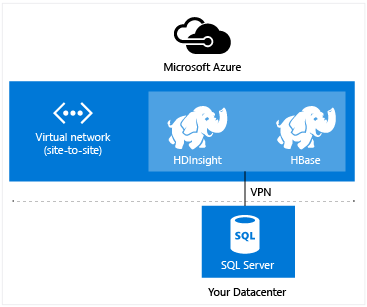

<properties
    pageTitle="Créer des clusters Hadoop, HBase, vague d’ou explosion sur Linux dans HDInsight | Microsoft Azure"
    description="Apprenez à créer Hadoop, HBase, vague d’ou au service pour HDInsight à l’aide d’un navigateur, l’infrastructure du langage commun Azure, Azure PowerShell, reste, ou via un kit de développement de clusters sur Linux."
    services="hdinsight"
    documentationCenter=""
    authors="mumian"
    manager="jhubbard"
    editor="cgronlun"
    tags="azure-portal"/>

<tags
    ms.service="hdinsight"
    ms.devlang="na"
    ms.topic="article"
    ms.tgt_pltfrm="na"
    ms.workload="big-data"
    ms.date="10/18/2016"
    ms.author="jgao"/>

# Créer des clusters Hadoop basé sur Linux dans HDInsight

[AZURE.INCLUDE [selector](../../includes/hdinsight-selector-create-clusters.md)]

Un cluster Hadoop se compose de plusieurs machines virtuelles (nœuds) qui sont utilisés pour le traitement des tâches sur le cluster distribué. Azure résume les détails d’implémentation d’installation et la configuration des nœuds individuels, il vous suffit de fournir des informations de configuration générales donc. Dans cet article, vous en savoir plus sur ces paramètres de configuration.

## Exigences de contrôle d’accès

[AZURE.INCLUDE [access-control](../../includes/hdinsight-access-control-requirements.md)]

## Types de cluster

Pour l’instant, Azure HDInsight offre cinq types différents de clusters, chacune avec un ensemble de composants pour fournir certaines fonctionnalités.

| Type de cluster | Fonctionnalités |
| ------------ | ----------------------------- |
| Hadoop       | Requêtes et les analyses (lots)     |
| HBase        | Stockage des données NoSQL            |
| Vague d'        | Traitement des événements en temps réel |
| Explosion        | Traitement en mémoire, des requêtes interactifs, traitement par lots micro flux |
| [Interactif Hive (Preview)](hdinsight-hadoop-use-interactive-hive.md) | La mise en cache en mémoire pour les requêtes Hive plus rapides et interactifs|
| Serveur R sur explosion (Preview) | Une variété de statistiques de données volumineux, modélisation prédictive et machine fonctionnalités d’apprentissage |

Chaque type de cluster possède son propre numéro de nœuds au sein du cluster, terminologie des nœuds au sein du cluster et taille de mémoire virtuelle par défaut pour chaque type de nœud. Dans le tableau suivant, le nombre de nœuds pour chaque type de nœud est entre parenthèses.

| Type| Nœuds | Diagramme|
|-----|------|--------|
|Hadoop| Serveur de nœud (2), le nœud de données (1 +)||
|HBase|Tête serveur (2), région (1 +), le nœud de masque/soigneur (3)||
|Vague d'|Nimbus nœud (2), serveur responsable (1 +) soigneur (3)||
|Explosion|Tête nœud (2), nœud de travail (1 +) soigneur (3) (Free pour la taille de mémoire virtuelle envieront A1)||

Le tableau suivant répertorie les tailles de mémoire virtuelle par défaut pour HDInsight :

- Régions à l’exception du Brésil Sud et Ouest Japon pris en charge :

  	|Type de cluster                     | Hadoop               | HBase                | Vague d'                | Explosion                                                                 | Serveur R |
  	|---------------------------------|----------------------|----------------------|----------------------|-----------------------------------------------------------------------|-----------------------------------------------------------------------|
  	|Par défaut de tête – taille de mémoire virtuelle           | V2 D3                | V2 D3                | A3                   | D12 v2                                                                | D12 v2                                                                |
  	|Tête – machine virtuelle taille recommandée      | V2 D3, D4 v2, D12 v2 | V2 D3, D4 v2, D12 v2 | A3, A4, A5           | D12 v2, v2 D13, D14 v2                                                | D12 v2, v2 D13, D14 v2                                                |
  	|Opérateur – par défaut taille de mémoire virtuelle         | V2 D3                | V2 D3                | V2 D3                | Windows : D12 v2 ; Linux : D4 v2                                         | Windows : D12 v2 ; Linux : D4 v2                                         |
  	|Opérateur – machine virtuelle taille recommandée    | V2 D3, D4 v2, D12 v2 | V2 D3, D4 v2, D12 v2 | V2 D3, D4 v2, D12 v2 | Windows : D12 v2, v2 D13, D14 v2 ; Linux : D4 v2, D12 v2, v2 D13, D14 v2 | Windows : D12 v2, v2 D13, D14 v2 ; Linux : D4 v2, D12 v2, v2 D13, D14 v2 |
  	|Soigneur – par défaut taille de mémoire virtuelle      |                      | A3                   | A2                   |                                                                       |
  	|Soigneur – machine virtuelle taille recommandée |                      | A3, A4, A5           | A2, A3, A4           |                                                                       |
  	|Contour - par défaut taille de mémoire virtuelle           |                      |                      |                      |                                                                       | Windows : D12 v2 ; Linux : D4 v2                                         |
  	|Bord - recommandé de taille de mémoire virtuelle       |                      |                      |                      |                                                                       | Windows : D12 v2, v2 D13, D14 v2 ; Linux : D4 v2, D12 v2, v2 D13, D14 v2 |

- Brésil Sud et Ouest Japon uniquement (aucune v2 tailles ici) :

  	|Type de cluster                     | Hadoop      | HBase       | Vague d'      | Explosion                                          |Serveur R|
  	|---------------------------------|-------------|-------------|------------|------------------------------------------------|--------|
  	|Par défaut de tête – taille de mémoire virtuelle           | D3          | D3          | A3         | D12                                            | D12|
  	|Tête – machine virtuelle taille recommandée      | D12 D3, D4, | D12 D3, D4, | A3, A4, A5 | D12, D13, D14                                  | D12, D13, D14|
  	|Opérateur – par défaut taille de mémoire virtuelle         | D3          | D3          | D3         | Windows : D12 ; Linux : D4                        | Windows : D12 ; Linux : D4|
  	|Opérateur – machine virtuelle taille recommandée    | D12 D3, D4, | D12 D3, D4, | D12 D3, D4,| Windows : D12, D13, D14 ; Linux : D4, D12, D13, D14| Windows : D12, D13, D14 ; Linux : D4, D12, D13, D14|
  	|Soigneur – par défaut taille de mémoire virtuelle      |             | A2          | A2         |                                                | |
  	|Soigneur – machine virtuelle taille recommandée |             | A2, A3, A4  | A2, A3, A4 |                                                | |
  	|Edge – par défaut tailles machine virtuelle          |             |             |            |                                                | Windows : D12 ; Linux : D4 |
  	|Bord – machine virtuelle taille recommandée      |             |             |            |                                                | Windows : D12, D13, D14 ; Linux : D4, D12, D13, D14 |

Notez que tête est appelé *Nimbus* pour le type de cluster vague. Employé consultant est connu comme *région* pour le type de cluster HBase et en tant que *responsable* pour le type de cluster vague.

> [AZURE.IMPORTANT] Si vous prévoyez d’avoir plus de 32 nœuds de travail, lors de la création de cluster ou en redimensionnant le cluster après sa création, vous devez sélectionner une taille de nœud de tête au moins 8 cœurs et 14 Go de RAM.

Vous pouvez ajouter d’autres composants tels que teinte ou R à ces types de base à l’aide des [Actions de Script](#customize-clusters-using-script-action).

> [AZURE.IMPORTANT] HDInsight clusters se présentent sous divers types, qui correspondent à la charge de travail ou la technologie réglé pour le cluster. Il n’est pas pris en charge de la méthode pour créer un cluster qui combine plusieurs types, tels que vague d’et HBase sur un cluster. 

Si votre solution requiert des technologies d’assistance qui sont réparties sur plusieurs types de cluster HDInsight, vous devez créer un réseau virtuel Azure et créer les types de cluster requis au sein du réseau virtuel. Ainsi, les groupes, ainsi que le code que vous déployez à ces directement communiquer avec eux.

Pour plus d’informations sur l’utilisation d’un réseau virtuel Azure avec HDInsight, voir [Étendre HDInsight réseaux virtuels Azure](hdinsight-extend-hadoop-virtual-network.md).

Pour obtenir un exemple de l’utilisation de deux types de cluster au sein d’un réseau virtuel Azure, voir [analyse des données capteur avec vague d’et HBase](hdinsight-storm-sensor-data-analysis.md).

## Niveaux de cluster

Azure HDInsight fournit les offres de cloud données volumineuses dans deux catégories : Standard et [Premium](hdinsight-component-versioning.md#hdinsight-standard-and-hdinsight-premium). HDInsight Premium comprend R et autres composants. HDInsight Premium est pris en charge uniquement sur HDInsight version 3.4.

Le tableau suivant répertorie le type de cluster HDInsight et la matrice de support HDInsight Premium.

| Type de cluster | Standard | Premium  |
|--------------|---------------|--------------|
| Hadoop       | Oui           | Oui          |
| Explosion        | Oui           | Oui          |
| HBase        | Oui           | N°           |
| Vague d'        | Oui           | N°           |
| Serveur R sur explosion | N° | Oui |

Ce tableau est mise à jour comme plusieurs types de cluster sont inclus dans HDInsight Premium. La capture d’écran suivante montre les informations du portail Azure pour le choix des types de cluster.

## Options de configuration de base

Voici les options de configuration de base utilisées pour créer un cluster HDInsight.

### Nom du cluster ###

Nom de cluster est utilisé pour identifier un cluster. Cluster nom doit être unique, et il doit respecter les instructions d’appellation suivantes :

- Le champ doit être une chaîne qui contient entre 3 et 63 caractères.
- Le champ peut contenir uniquement des lettres, des chiffres et des traits d’union.

### Type de cluster###

Afficher les [types de Cluster](#cluster-types) et [les niveaux de Cluster](#cluster-tiers).

### Système d'exploitation ###

Vous pouvez créer HDInsight clusters sur l’un des deux systèmes d’exploitation suivants :

- HDInsight sous Linux.  HDInsight offre la possibilité de configurer les clusters Linux sur Azure. Configurer un cluster Linux si vous êtes habitué à Linux ou Unix, migration à partir d’une solution Hadoop basé sur Linux existante, ou choix facilite l’intégration avec les composants de réseau Hadoop générés pour Linux. Pour plus d’informations, voir [prise en main Hadoop sur Linux dans HDInsight](hdinsight-hadoop-linux-tutorial-get-started.md).
- HDInsight sur Windows (Windows Server 2012 R2 centre de données).

### Version HDInsight###

Il est utilisé pour déterminer la version de HDInsight nécessaire pour ce cluster. Pour plus d’informations, voir [les versions cluster Hadoop et composants d’HDInsight](https://go.microsoft.com/fwLink/?LinkID=320896&clcid=0x409).

### Nom de l’abonnement###

Chaque cluster HDInsight est lié à un abonnement Azure.

### Nom de groupe de ressources ###

[Gestionnaire de ressources Azure](../azure-resource-manager/resource-group-overview.md) vous permet de travailler avec les ressources dans votre application comme un groupe, appelé à un groupe de ressources Azure. Vous pouvez déployer, mettre à jour, surveiller ou supprimer toutes les ressources pour votre application dans une seule opération coordonnée.

### Informations d’identification###

Avec les clusters HDInsight, vous pouvez configurer deux comptes d’utilisateur lors de la création de cluster :

- Utilisateur HTTP. Le nom d’utilisateur par défaut est *administrateur* à l’aide de la configuration de base dans le portail Azure. Parfois, il est appelée « Cluster utilisateur ».
- Utilisateur SSH (Linux clusters). Ceci est utilisé pour la connexion au cluster à l’aide de SSH. Vous pouvez créer des comptes d’utilisateur SSH supplémentaires après que le cluster est créé en suivant les étapes décrites dans [Utiliser SSH avec basé sur Linux Hadoop sur HDInsight de Linux, Unix ou OS X](hdinsight-hadoop-linux-use-ssh-unix.md) ou [Utiliser SSH avec basé sur Linux Hadoop sur HDInsight à partir de Windows](hdinsight-hadoop-linux-use-ssh-unix.md).

    >[AZURE.NOTE] Pour les clusters fonctionnant sous Windows, vous pouvez créer un utilisateur RDP pour vous connecter au cluster à l’aide de RDP.

### Source de données###

Le système de fichiers Hadoop distribué d’origine (HDFS) utilise plusieurs disques locaux sur le cluster. HDInsight utilise le stockage Blob Azure pour stocker les données. Stockage d’objets Blob Azure est une solution de stockage robuste, universel qui s’intègre avec HDInsight. Grâce à une interface HADOOP, l’ensemble des composants de HDInsight peut fonctionner directement sur des données structurées ou dans le stockage Blob. Le stockage de données dans le stockage Blob vous permet de supprimer en toute sécurité les groupes HDInsight qui sont utilisés pour le calcul sans perte de données de l’utilisateur.

Lors de la configuration, vous devez spécifier un compte de stockage Azure et un conteneur de stockage Blob Azure sur le compte de stockage Azure. Certains processus de création nécessitent le compte de stockage Azure et le conteneur de stockage Blob créé préalablement. Le conteneur de stockage Blob est utilisé comme emplacement de stockage par défaut par le cluster. Si vous le souhaitez, vous pouvez spécifier le stockage Azure des comptes supplémentaires (stockage lié) qui seront accessibles par le cluster. Le cluster peut également accéder à n’importe quel conteneurs de stockage Blob qui sont configurés avec un accès en lecture publique complète ou public accès en lecture pour les objets BLOB uniquement.  Pour plus d’informations, voir [Gérer l’accès aux ressources de stockage Azure](../storage/storage-manage-access-to-resources.md).

>[AZURE.NOTE] Un conteneur de stockage Blob fournit un regroupement d’un ensemble d’objets BLOB comme le montre l’image suivante.

Nous ne recommandons pas à l’aide du conteneur de stockage Blob par défaut pour le stockage de données métiers. Supprimer le conteneur de stockage Blob par défaut après que chaque utilisation pour réduire les coûts de stockage est une bonne pratique. Notez que le conteneur par défaut contienne des applications et du système les journaux. Veillez à récupérer les journaux avant de supprimer le conteneur.

>[AZURE.WARNING] Partage d’un seul conteneur de stockage Blob de plusieurs clusters n’est pas pris en charge.

Pour plus d’informations sur l’utilisation du stockage Blob secondaire, voir [Utilisation du stockage Blob Azure avec HDInsight](hdinsight-hadoop-use-blob-storage.md).

En plus de stockage d’objets Blob Azure, vous pouvez également utiliser [Azure données Lake Store](../data-lake-store/data-lake-store-overview.md) comme un compte de stockage par défaut pour le cluster HBase dans HDInsight et stockage liée pour tous les types de cluster HDInsight quatre. Pour plus d’informations, voir [créer un cluster HDInsight avec données Lake Store à l’aide de portail Azure](../data-lake-store/data-lake-store-hdinsight-hadoop-use-portal.md).

### Emplacement (région) ###

Le cluster HDInsight et son compte de stockage par défaut doivent se trouver dans le même emplacement Azure.

Pour obtenir la liste des régions pris en charge, cliquez sur la liste déroulante **région** [HDInsight tarifs](https://go.microsoft.com/fwLink/?LinkID=282635&clcid=0x409).

### Nœud tarifs niveaux###

Les clients sont facturés pour l’utilisation de ces nœuds pendant la durée de vie du cluster. Facturation commence lorsqu’un cluster est créé et s’arrête lorsque le cluster est supprimé. Clusters ne peuvent pas être annulées ou mettre en attente.

Cluster différents types ont différents types de nœud, un nombre de nœuds et tailles de nœud. Par exemple, un type de cluster Hadoop comporte deux _nœuds de tête_ et une valeur par défaut de quatre _nœuds de données_, un type de cluster vague propose deux _nœuds nimbus_, trois _nœuds soigneur_et une valeur par défaut de quatre _nœuds responsable_. Le coût des clusters HDInsight est déterminé par le nombre de nœuds et les tailles de machines virtuelles pour les nœuds. Par exemple, si vous savez que vous exécutez opérations nécessitant une grande quantité de mémoire, vous souhaiterez peut-être sélectionner une ressource cluster avec plus de mémoire. Pour apprendre à utiliser à des fins, il est recommandé d’utiliser un nœud de données. Pour plus d’informations sur les tarifs de HDInsight, voir [HDInsight tarifs](https://go.microsoft.com/fwLink/?LinkID=282635&clcid=0x409).

>[AZURE.NOTE] La limite de taille cluster varie selon les abonnements Azure. Contactez le support de facturation pour augmenter la limite.

>Les nœuds utilisées par votre cluster ne sont pas en tant que machines virtuelles, car les images de machine virtuelle utilisées pour les nœuds sont un détail d’implémentation du service HDInsight. Les cœurs cluster utilisés par les nœuds imputés le nombre total de cœurs cluster disponibles pour votre abonnement. Vous pouvez voir le nombre de cœurs disponibles et cœurs qui seront utilisées par le cluster dans la section Résumé de la cuillère nœud tarifs niveaux lorsque vous créez un cluster HDInsight.

Lorsque vous utilisez le portail Azure pour configurer le cluster, la taille du nœud est disponible via le __Nœud tarifs couche__ carte. Vous pouvez également voir le coût associé à la taille des nœuds différents. La capture d’écran suivante montre les choix disponibles pour un cluster Hadoop base Linux.

Les tableaux suivants présentent les tailles pris en charge par HDInsight clusters et les capacités qu’ils fournissent.

#### Couche standard : A-série####

Dans le modèle de déploiement classique, certaines tailles machine virtuelle sont légèrement différents dans PowerShell et infrastructure du langage commun.
* Standard_A3 est grande
* Standard_A4 est ExtraLarge

|Taille |Cœurs de processeur|Mémoire|Cartes réseau (Max)|Max. taille du disque|Max. disques de données (Go 1023 chaque)|Max. Sorties par (500 par disque)|
|---|---|---|---|---|---|---|
|Standard_A3\Large|4|7 GO|2|Temporaire = 285 Go |8|8 x 500|
|Standard_A4\ExtraLarge|8|14 GO|4|Temporaire = 605 Go |16|16 x 500|
|Standard_A6|4|28 GO|2|Temporaire = 285 Go |8|8 x 500|
|Standard_A7|8|56 GO|4|Temporaire = 605 Go |16|16 x 500|

#### Couche standard : série D####

|Taille |Cœurs de processeur|Mémoire|Cartes réseau (Max)|Max. taille du disque|Max. disques de données (Go 1023 chaque)|Max. Sorties par (500 par disque)|
|---|---|---|---|---|---|---|
|Standard_D3 |4|14 GO|4|Temporaire (SSD) = 200 Go |8|8 x 500|
|Standard_D4 |8|28 GO|8|Temporaire (SSD) = 400 Go |16|16 x 500|
|Standard_D12 |4|28 GO|4|Temporaire (SSD) = 200 Go |8|8 x 500|
|Standard_D13 |8|56 GO|8|Temporaire (SSD) = 400 Go |16|16 x 500|
|Standard_D14 |16|112 GO|8|Temporaire (SSD) = 800 Go |32|32 x 500|

#### Couche standard : Dv2 série####

|Taille |Cœurs de processeur|Mémoire|Cartes réseau (Max)|Max. taille du disque|Max. disques de données (Go 1023 chaque)|Max. Sorties par (500 par disque)|
|---|---|---|---|---|---|---|
|Standard_D3_v2 |4|14 GO|4|Temporaire (SSD) = 200 Go |8|8 x 500|
|Standard_D4_v2 |8|28 GO|8|Temporaire (SSD) = 400 Go |16|16 x 500|
|Standard_D12_v2 |4|28 GO|4|Temporaire (SSD) = 200 Go |8|8 x 500|
|Standard_D13_v2 |8|56 GO|8|Temporaire (SSD) = 400 Go |16|16 x 500|
|Standard_D14_v2 |16|112 GO|8|Temporaire (SSD) = 800 Go |32|32 x 500|    

Pour des raisons de déploiement importants lorsque vous envisagez d’utiliser ces ressources, voir [formats pour les machines virtuelles](../virtual-machines/virtual-machines-windows-sizes.md). Pour plus d’informations sur les tarifs des différentes tailles, consultez [HDInsight tarification](https://azure.microsoft.com/pricing/details/hdinsight).   

> [AZURE.IMPORTANT] Si vous prévoyez d’avoir plus de 32 nœuds de travail, lors de la création de cluster ou en redimensionnant le cluster après sa création, vous devez sélectionner une taille de nœud de tête au moins 8 cœurs et 14 Go de RAM.

Facturation démarre lorsqu’un cluster est créé et s’arrête lorsque le cluster est supprimé. Pour plus d’informations sur les prix, voir [HDInsight pour plus d’informations](https://azure.microsoft.com/pricing/details/hdinsight/).

## Utiliser l’espace de stockage supplémentaire

Dans certains cas, vous souhaiterez peut-être ajouter l’espace de stockage supplémentaire pour le cluster. Par exemple, vous pouvez avoir plusieurs comptes de stockage Azure pour différentes régions géographiques ou les différents services, mais que vous voulez analyser les tout avec HDInsight.

Vous pouvez ajouter des comptes de stockage lorsque vous créez un cluster HDInsight ou après la création d’un cluster.  Voir [clusters HDInsight basé sur Linux personnaliser à l’aide de Script Action](hdinsight-hadoop-customize-cluster-linux.md).

Pour plus d’informations sur le stockage Blob secondaire, voir [stockage à l’aide des objets Blob Azure HDInsight](hdinsight-hadoop-use-blob-storage.md). Pour plus d’informations sur le stockage de Lake de données secondaire, consultez [créer HDInsight clusters avec données Lake Store à l’aide du portail Azure](../data-lake-store/data-lake-store-hdinsight-hadoop-use-portal.md).

## Utiliser Hive/Oozie metastore

Nous vous recommandons vivement que vous utilisez un metastore personnalisé si vous souhaitez conserver vos tables Hive après avoir supprimé votre cluster HDInsight. Vous ne pourrez pas joindre ce metastore à un autre cluster HDInsight.

> [AZURE.IMPORTANT] Metastore HDInsight créé pour une version de cluster HDInsight, ne peut pas être partagé entre différentes versions de cluster HDInsight. Pour une liste des versions de HDInsight, voir [versions HDInsight pris en charge](hdinsight-component-versioning.md#supported-hdinsight-versions).

La metastore contient des métadonnées Hive et Oozie, tels que tableaux Hive, partitions, schémas et colonnes. La metastore vous permet de conserver les métadonnées de votre Hive et Oozie, afin que vous n’avez pas besoin de recréer des tables Hive ou travaux Oozie lorsque vous créez un nouveau cluster. Par défaut, Hive utilise une base de données SQL Azure incorporé pour stocker ces informations. La base de données incorporé ne peut pas conserver les métadonnées lorsque le cluster est supprimé. Lorsque vous créez table Hive dans un cluster HDInsight avec un metastore Hive configuré, ces tables sont conservés lorsque vous recréez le cluster à l’aide de la même metastore Hive.

Configuration Metastore n’est pas disponible pour les types de cluster HBase.

> [AZURE.IMPORTANT] Lorsque vous créez un metastore personnalisé, n’utilisez pas un nom de base de données qui contient des tirets ou des traits d’union. Cela peut entraîner le processus de création de cluster échec.

## Utiliser des réseaux virtuels Azure

Avec un [réseau virtuel Azure](https://azure.microsoft.com/documentation/services/virtual-network/), vous pouvez créer un réseau sécurisé, permanent contenant les ressources que nécessaires pour votre solution. Avec un réseau virtuel, vous pouvez :

* Se connecter cloud des ressources dans un réseau privé (cloud uniquement).

    

* Se connecter à vos ressources cloud à votre réseau local centre de données (site à ou point-à-site) à l’aide d’un réseau privé virtuel (VPN).

| Configuration de site à | Configuration d’un point de site |
| -------------------------- | --------------------------- |
| Avec la configuration de site à site, vous pouvez vous connecter plusieurs ressources à partir de votre centre de données au réseau virtuel Azure en utilisant un matériel VPN ou le routage et le Service d’accès à distance.  | Avec point-à-site configuration, vous pouvez vous connecter une ressource spécifique au réseau virtuel Azure à l’aide d’un logiciel VPN.  |

Clusters basés sur Windows nécessitent un v1 réseau virtuel (standard), tandis que clusters basés sur Linux requièrent réseau virtuel v2 (Azure responsable de ressources). Si vous n’avez pas le type correct d’un réseau, il ne sera pas utilisable lorsque vous créez le cluster.

Pour plus d’informations sur l’utilisation de HDInsight avec un réseau virtuel, y compris les besoins spécifiques de configuration du réseau virtuel, voir [fonctionnalités d’étendre HDInsight à l’aide d’un réseau virtuel Azure](hdinsight-extend-hadoop-virtual-network.md).

## Personnaliser les clusters à l’aide de la personnalisation de cluster HDInsight (démarrage)

Parfois, vous souhaitez configurer les fichiers de configuration suivants :

- clusterIdentity.xml
- Core site.xml
- Gateway.Xml
- hbase env.xml
- hbase site.xml
- Hadoop site.xml
- Hive env.xml
- Hive site.xml
- mapred-site
- oozie site.xml
- oozie env.xml
- vague de site.xml
- tez site.xml
- webhcat site.xml
- fils site.xml

Pour conserver les modifications apportées à la durée de vie d’un cluster, vous pouvez utiliser la personnalisation de cluster HDInsight pendant le processus de création, ou vous pouvez utiliser Ambari dans clusters basés sur Linux. Pour plus d’informations, voir [clusters HDInsight personnaliser à l’aide de démarrage](hdinsight-hadoop-customize-cluster-bootstrap.md).

>[AZURE.NOTE] Les groupes fonctionnant sous Windows ne peut pas conserver les modifications en raison de la nouvelle image. Pour plus d’informations, voir [Rôle Instance redémarre en raison de mises à niveau du système d’exploitation](http://blogs.msdn.com/b/kwill/archive/2012/09/19/role-instance-restarts-due-to-os-upgrades.aspx).  Pour conserver les modifications apportées à la durée de vie des groupes, vous devez utiliser la personnalisation de cluster HDInsight pendant le processus de création.

## Personnaliser les clusters à l’aide d’Action de Script

Vous pouvez installer d’autres composants ou personnaliser la configuration de cluster à l’aide des scripts lors de la création. Ces scripts sont appelés via l' **Action de Script**, qui est une option de configuration qui peut servir à partir du portail Azure, applets de commande HDInsight Windows PowerShell ou le Kit de développement .NET HDInsight. Pour plus d’informations, voir [cluster HDInsight personnaliser à l’aide de Script Action](hdinsight-hadoop-customize-cluster-linux.md).

Certains composants Java natives, tels que Mahout et en cascade, peuvent être exécutés sur le cluster en tant que fichiers JAR (Java Archive). Ces fichiers JAR peuvent être distribués à Azure Blob storage et envoyées à HDInsight clusters via mécanismes de soumission Hadoop travail. Pour plus d’informations, voir [Soumettre Hadoop travaux par programme](hdinsight-submit-hadoop-jobs-programmatically.md).

>[AZURE.NOTE] Si vous rencontrez des problèmes déployer fichiersJAR HDInsight clusters ou appel fichiersJAR sur clusters HDInsight, contactez le [Support Microsoft](https://azure.microsoft.com/support/options/).

> Cascade n’est pas pris en charge par HDInsight et n’est pas éligible pour le Support Microsoft. Pour les listes de composants pris en charge, voir [Quelles sont les nouveautés dans les versions cluster fournies par HDInsight ?](hdinsight-component-versioning.md)

## Utilisez le nœud de bord

 Un nœud bord vide est une machine virtuelle Linux avec les outils clients même installé et configuré comme dans l’headnodes. Vous pouvez utiliser le nœud de bord pour accéder au cluster, test de vos applications clientes et l’hébergement de vos applications clientes. Pour plus d’informations, voir [utiliser des nœuds de bord vide dans HDInsight](hdinsight-apps-use-edge-node.md).
 
## Méthodes de création de cluster

Dans cet article, vous avez appris des informations de base sur la création d’un cluster basé sur Linux HDInsight. Utilisez le tableau suivant pour trouver des informations spécifiques sur la création d’un cluster à l’aide d’une méthode qui correspond le mieux à vos besoins.

| Clusters créés avec | Navigateur Web | Ligne de commande | API REST | KIT DE DÉVELOPPEMENT | Linux, Mac OS X ou Unix | Windows |
| ------------------------------- |:----------------------:|:--------------------:|:------------------:|:------------:|:-----------------------------:|:------------:|
| [Le portail Azure](hdinsight-hadoop-create-linux-clusters-portal.md) | ✔     | &nbsp; | &nbsp; | &nbsp; | ✔      | ✔ |
| [Données Azure usine](hdinsight-hadoop-create-linux-clusters-adf.md) | ✔     | ✔  | ✔  |✔  | ✔      | ✔ |
| [Azure infrastructure du langage commun](hdinsight-hadoop-create-linux-clusters-azure-cli.md)         | &nbsp; | ✔     | &nbsp; | &nbsp; | ✔      | ✔ |
| [PowerShell Azure](hdinsight-hadoop-create-linux-clusters-azure-powershell.md) | &nbsp; | ✔     | &nbsp; | &nbsp; | ✔ | ✔ |
| [Coin](hdinsight-hadoop-create-linux-clusters-curl-rest.md) | &nbsp; | ✔     | ✔ | &nbsp; | ✔      | ✔ |
| [KIT DE DÉVELOPPEMENT .NET](hdinsight-hadoop-create-linux-clusters-dotnet-sdk.md) | &nbsp; | &nbsp; | &nbsp; | ✔ | ✔      | ✔ |
| [Modèles de gestionnaire de ressources Azure](hdinsight-hadoop-create-linux-clusters-arm-templates.md) | &nbsp; | ✔     | &nbsp; | &nbsp; | ✔      | ✔ |
