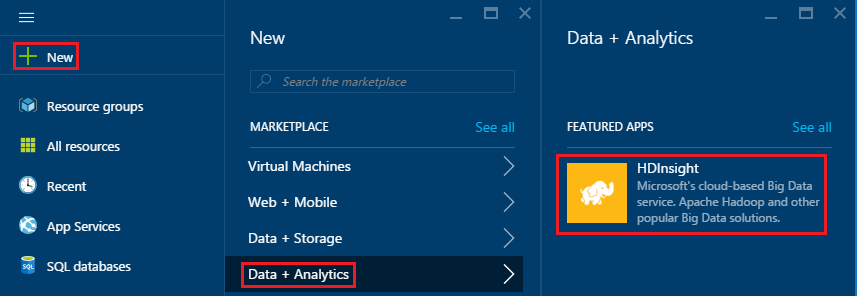
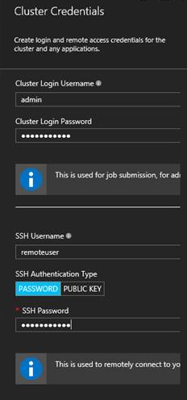
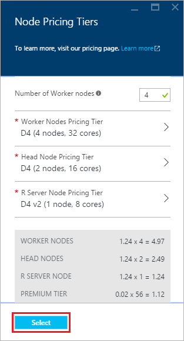

<properties
   pageTitle="Prise en main serveur R sur HDInsight (preview) | Azure"
   description="Apprenez à créer une explosion Apache sur cluster HDInsight (Hadoop) comprenant R Server (preview) et envoyer un script R sur le cluster."
   services="HDInsight"
   documentationCenter=""
   authors="jeffstokes72"
   manager="jhubbard"
   editor="cgronlun"
/>

<tags
   ms.service="HDInsight"
   ms.devlang="R"
   ms.topic="article"
   ms.tgt_pltfrm="na"
   ms.workload="data-services"
   ms.date="08/19/2016"
   ms.author="jeffstok"
/>

# Commencer à utiliser serveur R de HDInsight (preview)

Le niveau premium offrant pour HDInsight comprend serveur R dans le cadre de votre cluster HDInsight (preview). Cela permet aux scripts R permet d’exécuter des calculs distribués MapReduce et explosion. Dans ce document, vous allez apprendre à créer un nouveau serveur R sur HDInsight, puis exécuter un script R qui illustre l’utilisation d’explosion pour les calculs R distribués.

## Conditions préalables

* __Abonnement un Azure__: avant de commencer ce didacticiel, vous devez posséder un abonnement Azure. Pour plus d’informations, consultez [Azure obtenir la version d’évaluation gratuite](https://azure.microsoft.com/documentation/videos/get-azure-free-trial-for-testing-hadoop-in-hdinsight/) .

* __Client A Secure Shell (SSH)__: SSH un client est utilisé pour se connecter au cluster HDInsight et exécuter des commandes directement sur le cluster à distance. Les systèmes Linux, Unix et OS X fournissent un clientSSH via la `ssh` commande. Pour les systèmes Windows, nous vous recommandons de [PuTTY](http://www.chiark.greenend.org.uk/~sgtatham/putty/download.html).

    * __Touches SSH (facultatifs)__: vous pouvez sécuriser le compte SSH utilisé pour la connexion au cluster à l’aide d’un mot de passe ou une clé publique. À l’aide d’un mot de passe est plus facile et permet de vous familiariser sans avoir à créer une paire de clés publique/privée ; Toutefois, en utilisant une clé est plus sécurisé.
    
        Les étapes décrites dans ce document part du principe que vous utilisez un mot de passe. Pour plus d’informations sur la façon de créer et utiliser des clés SSH avec HDInsight, voir les documents suivants :
        
        * [Utiliser le protocole SSH avec HDInsight à partir de clients Linux, Unix ou OS X](hdinsight-hadoop-linux-use-ssh-unix.md)
        
        * [Utiliser le protocole SSH avec HDInsight à partir de clients Windows](hdinsight-hadoop-linux-use-ssh-windows.md)

### Exigences de contrôle d’accès

[AZURE.INCLUDE [access-control](../../includes/hdinsight-access-control-requirements.md)]

## Créer le cluster

> [AZURE.NOTE] Les étapes décrites dans ce document créent un serveur R sur HDInsight en utilisant les informations de configuration de base. Pour d’autres paramètres de configuration cluster (par exemple, l’ajout de comptes d’espace de stockage supplémentaire, à l’aide d’un réseau virtuel Azure ou en créant un metastore pour Hive), voir [clusters basés sur Linux créer HDInsight](hdinsight-hadoop-provision-linux-clusters.md).

1. Connectez-vous au [portail Azure](https://portal.azure.com).

2. Sélectionnez __Nouveau__, __données + Analytique__, puis __HDInsight__.

    

3. Entrez un nom pour le cluster dans le champ __Nom de Cluster__ . Si vous avez plusieurs abonnements Azure, utilisez l’entrée __d’abonnement__ pour sélectionner l’option que vous voulez utiliser.

    

4. Sélectionner le __Type de Cluster__. Sur la carte __Cluster Type__ , sélectionnez les options suivantes :

    * __Type de cluster__: serveur R sur explosion
    
    * __Cluster de niveau__: Premium

    Les autres options, conservez les valeurs par défaut, puis utilisez le bouton __Sélectionner__ pour enregistrer le type de cluster.
    
    
    
    > [AZURE.NOTE] Vous pouvez également ajouter serveur R à d’autres types de cluster HDInsight (par exemple, Hadoop ou HBase,) en sélectionnant le type de cluster, puis en sélectionnant __Premium__.

5. Sélectionnez le **Groupe de ressources** pour afficher la liste des groupes de ressources existant, puis sélectionnez l’option pour créer le cluster dans. Ou bien, vous pouvez sélectionnez **Créer un nouveau** , puis entrez le nom du nouveau groupe de ressources. Une coche verte apparaît pour indiquer que le nouveau nom de groupe est disponible.

    > [AZURE.NOTE] Cette entrée par défaut à un de vos groupes de ressources existants, si elles sont disponibles.
    
    Utilisez le bouton __Sélectionner__ pour enregistrer le groupe de ressources.

6. Sélectionnez les **informations d’identification**, puis entrez un **Nom de connexion Cluster** et **Cluster mot de passe**.

    Entrez un __nom d’utilisateur SSH__.  SSH est utilisé pour se connecter à distance pour le cluster à l’aide d’un client __SSH (Secure Shell)__ . Vous pouvez spécifier l’utilisateur SSH dans cette boîte de dialogue ou après que le cluster a été créé (onglet Configuration pour le cluster). R serveur est configuré pour attendre un __nom d’utilisateur SSH__ de « UtilisateurDistant ».  Si vous utilisez un autre nom d’utilisateur, vous devrez effectuer une étape supplémentaire après que le cluster est créé.
    
    

    __Type d’authentification SSH__: sélectionnez __mot de passe__ en tant que le type d’authentification, sauf si vous préférez utiliser une clé publique.  Vous devez une paire de clés public/privé si vous souhaitez accéder R Server sur le cluster via un client à distance, par exemple, RTV, RStudio ou un autre bureau IDE.   

    Pour créer et utiliser une clé publique/privée paire sélectionnez « Clé publique », procédez comme suit.  Ces instructions part du principe que vous avez Cygwin avec ssh keygen ou équivalent installé.

    -    Générer une paire de clés public/privé à partir de l’invite de commandes sur votre ordinateur portable :
      
            SSH keygen - t rsa -b 2048 – f < privé-clé-nom de fichier >
      
    -    Cela créera un fichier de clé privée et un fichier de clé publique sous le nom < privé-clé-nom de fichier > .pub, par exemple :  davec et davec.pub.  Puis spécifiez le fichier de clé publique (* .pub) lors de l’affectation des informations d’identification de cluster HDI :
      
          
      
    -    Modifier les autorisations sur le fichier de clé privée sur votre ordinateur portable
      
            chmod 600 < privé-clé-nom de fichier >
      
    -    Utiliser le fichier de clé privée avec SSH pour une connexion à distance, par exemple :
      
            SSH – i < privé-clé-nom de fichier >remoteuser@<hostname public ip>
      
      ou dans la définition de votre contexte cluster Hadoop Spark pour R Server sur le client (voir Using Microsoft R Server comme un Hadoop Client dans la section [Création d’un contexte calculer pour explosion](https://msdn.microsoft.com/microsoft-r/scaler-spark-getting-started#creating-a-compute-context-for-spark) online [guide RevoScaleR Hadoop explosion prise en main](https://msdn.microsoft.com/microsoft-r/scaler-spark-getting-started)de).

7. Sélectionner la **Source de données** pour sélectionner une source de données pour le cluster. Sélectionnez un compte de stockage existant en sélectionnant __Sélectionnez compte de stockage__ , puis en sélectionnant le compte, ou créer un nouveau compte en utilisant le lien __Nouveau__ dans la section __Sélectionnez compte de stockage__ .

    Si vous sélectionnez __Nouveau__, vous devez entrer un nom pour le nouveau compte de stockage. Une coche verte s’affichent si le nom est accepté.

    Le nom du cluster par défaut est le __Conteneur par défaut__ . Laissez cette comme valeur.
    
    Sélectionnez l' __emplacement__ pour sélectionner la zone pour créer le compte de stockage dans.
    
    > [AZURE.IMPORTANT] Sélectionner l’emplacement pour la source de données par défaut sera également définir l’emplacement du cluster HDInsight. La source de données par défaut et cluster doit se trouver dans la même région.

    Utilisez le bouton **Sélectionner** pour enregistrer la configuration de source de données.
    
    

8. Sélectionnez le **Nœud tarifs niveaux** pour afficher des informations sur les nœuds qui seront créés pour ce cluster. Sauf si vous savez que vous devez un cluster supérieur, laissez le nombre de nœuds de travail par défaut à `4`. La valeur estimée du cluster est affichée dans la carte.

    > [AZURE.NOTE] Si nécessaire, vous pouvez redimensionner votre cluster ultérieurement par le biais du portail (Cluster -> Paramètres -> échelle Cluster) pour augmenter ou diminuer le nombre de nœuds de travail.  Cela peut être utile pour ralenti vers le bas le cluster lorsqu’elles pas en cours d’utilisation, ou pour augmenter la capacité à répondre aux besoins de tâches plus complexes.

    Quelques facteurs à prendre en compte lors de redimensionnement votre cluster, les nœuds de données et le nœud de bord sont les suivantes :  
   
    - Les performances des analyses R serveur distribués sur explosion sont proportionnel au nombre de nœuds de travail lorsque les données sont volumineuses.  
    - Les performances des analyses de serveur R sont linéaire dans la taille des données en cours d’analyse. Par exemple :  
        - Pour les petites et légère données, les performances seront meilleures lors de l’analyse dans un contexte cluster local sur le nœud de bord.  Pour plus d’informations sur les scénarios dans lesquelles les locaux et contextes de cluster explosion fonctionnent mieux voir les options de contexte cluster pour serveur R sur HDInsight. 
        - Si vous vous connectez dans le nœud de bord et exécutez votre script R Il puis tous, mais les fonctions de réception ScaleR exécutera <strong>localement</strong> sur le nœud de bord donc la mémoire et le nombre de cœurs du nœud bord doivent être dimensionnés en conséquence. Ces conditions s’appliquent si vous utilisez R Server sur HDI comme un contexte cluster à distance à partir de votre ordinateur portable.
    
    

    Utilisez le bouton **Sélectionner** pour enregistrer le nœud tarifs configuration.
    
9. Dans la carte de **Nouveau HDInsight Cluster** , assurez-vous que le **code confidentiel pour Startboard** est activée et puis cliquez sur **créer**. Cela crée le cluster et ajouter une vignette pour qu’elle à la Startboard de votre portail Azure. L’icône indique que le cluster consiste à créer et modifiera pour afficher l’icône HDInsight une fois terminée la création.

  	| Lors de la création | Création terminée |
  	| ------------------ | --------------------- |
  	|  |  |

    > [AZURE.NOTE] Il prend un certain temps pour le cluster doit être créée, généralement environ 15 minutes. Utiliser la vignette sur la Startboard ou l’entrée de **Notifications** à gauche de la page pour vérifier le processus de création.

## Connectez-vous au nœud R serveur edge

Se connecter à nœud de bord R Server du cluster HDInsight à l’aide de SSH :

    ssh USERNAME@r-server.CLUSTERNAME-ssh.azurehdinsight.net
    
> [AZURE.NOTE] Vous pouvez également trouver la `R-Server.CLUSTERNAME-ssh.azurehdinsight.net` adresse dans le portail Azure en sélectionnant votre cluster, puis __Tous les paramètres__, __applications__et __RServer__. Ceci affiche les informations de point de terminaison SSH pour le nœud de bord.
>
> 
    
Si vous avez utilisé un mot de passe pour votre compte d’utilisateur SSH, vous devrez entrer. Si vous avez utilisé une clé publique, vous devrez peut-être utiliser les `-i` paramètre pour spécifier la clé privée correspondante. Par exemple, `ssh -i ~/.ssh/id_rsa USERNAME@R-Server.CLUSTERNAME-ssh.azurehdinsight.net`.
    
Pour plus d’informations sur l’utilisation de SSH avec basé sur Linux HDInsight, voir les articles suivants :

* [Utiliser le protocole SSH avec basé sur Linux Hadoop sur HDInsight de Linux, Unix ou OS X](hdinsight-hadoop-linux-use-ssh-unix.md)

* [Utiliser le protocole SSH avec basé sur Linux Hadoop sur HDInsight à partir de Windows](hdinsight-hadoop-linux-use-ssh-windows.md)

Une fois connecté, vous arrivera à l’invite de semblable au suivant.

    username@ed00-myrser:~$

## Utilisation de la console R

1. À partir de la session SSH, utilisez la commande suivante pour démarrer la console R.

        R
    
    Vous verrez sortie similaire à ce qui suit.
    
        R version 3.2.2 (2015-08-14) -- "Fire Safety"
        Copyright (C) 2015 The R Foundation for Statistical Computing
        Platform: x86_64-pc-linux-gnu (64-bit)

        R is free software and comes with ABSOLUTELY NO WARRANTY.
        You are welcome to redistribute it under certain conditions.
        Type 'license()' or 'licence()' for distribution details.

        Natural language support but running in an English locale

        R is a collaborative project with many contributors.
        Type 'contributors()' for more information and
        'citation()' on how to cite R or R packages in publications.

        Type 'demo()' for some demos, 'help()' for on-line help, or
        'help.start()' for an HTML browser interface to help.
        Type 'q()' to quit R.

        Microsoft R Server version 8.0: an enhanced distribution of R
        Microsoft packages Copyright (C) 2016 Microsoft Corporation

        Type 'readme()' for release notes.

        >

2. À partir de la `>` invite de commandes, vous pouvez entrer code R. Serveur R inclut packages qui vous permettent de facilement interagir avec Hadoop et exécuter des calculs distribués. Par exemple, utilisez la commande suivante pour afficher la racine du système de fichiers par défaut pour le cluster HDInsight.

        rxHadoopListFiles("/")
    
    Vous pouvez également utiliser l’adressage de style WASB.
    
        rxHadoopListFiles("wasbs:///")

## Utilisez R Server sur HDI à partir d’une instance distante de Microsoft R Server ou d’un Client Microsoft R

Par la section ci-dessus concernant l’utilisation du public/privé des paires de clés pour accéder au cluster, il est possible d’installer access au contexte cluster HDI Hadoop explosion à partir d’une instance distante de Microsoft R Server ou d’un Client Microsoft R en cours d’exécution sur un ordinateur de bureau ou portable (voir Using Microsoft R Server comme un Hadoop Client dans la section [Création d’un contexte calculer pour explosion](https://msdn.microsoft.com/microsoft-r/scaler-spark-getting-started#creating-a-compute-context-for-spark) du [guide RevoScaleR Hadoop explosion mise en route](https://msdn.microsoft.com/microsoft-r/scaler-spark-getting-started)en ligne).  Pour cela, vous devez spécifier les options suivantes lorsque vous définissez la RxSpark calculent contexte sur votre ordinateur portable : hdfsShareDir, shareDir, sshUsername, sshHostname, sshSwitches et sshProfileScript. Par exemple :

    
    myNameNode <- "default"
    myPort <- 0 
 
    mySshHostname  <- 'rkrrehdi1-ssh.azurehdinsight.net'  # HDI secure shell hostname
    mySshUsername  <- 'remoteuser'# HDI SSH username
    mySshSwitches  <- '-i /cygdrive/c/Data/R/davec'   # HDI SSH private key
 
    myhdfsShareDir <- paste("/user/RevoShare", mySshUsername, sep="/")
    myShareDir <- paste("/var/RevoShare" , mySshUsername, sep="/")
 
    mySparkCluster <- RxSpark(
      hdfsShareDir = myhdfsShareDir,
      shareDir     = myShareDir,
      sshUsername  = mySshUsername,
      sshHostname  = mySshHostname,
      sshSwitches  = mySshSwitches,
      sshProfileScript = '/etc/profile',
      nameNode     = myNameNode,
      port         = myPort,
      consoleOutput= TRUE
    )

    
 
## Utiliser un contexte de calcul

Un contexte cluster permet de contrôler si calcul est exécutée localement sur le nœud de bord, ou si elle sera distribué sur les nœuds du cluster HDInsight.
        
1. À partir de la console R, utilisez ce qui suit pour charger les données d’exemple dans l’espace de stockage par défaut pour HDInsight.

        # Set the HDFS (WASB) location of example data
        bigDataDirRoot <- "/example/data"
        # create a local folder for storaging data temporarily
        source <- "/tmp/AirOnTimeCSV2012"
        dir.create(source)
        # Download data to the tmp folder
        remoteDir <- "http://packages.revolutionanalytics.com/datasets/AirOnTimeCSV2012"
        download.file(file.path(remoteDir, "airOT201201.csv"), file.path(source, "airOT201201.csv"))
        download.file(file.path(remoteDir, "airOT201202.csv"), file.path(source, "airOT201202.csv"))
        download.file(file.path(remoteDir, "airOT201203.csv"), file.path(source, "airOT201203.csv"))
        download.file(file.path(remoteDir, "airOT201204.csv"), file.path(source, "airOT201204.csv"))
        download.file(file.path(remoteDir, "airOT201205.csv"), file.path(source, "airOT201205.csv"))
        download.file(file.path(remoteDir, "airOT201206.csv"), file.path(source, "airOT201206.csv"))
        download.file(file.path(remoteDir, "airOT201207.csv"), file.path(source, "airOT201207.csv"))
        download.file(file.path(remoteDir, "airOT201208.csv"), file.path(source, "airOT201208.csv"))
        download.file(file.path(remoteDir, "airOT201209.csv"), file.path(source, "airOT201209.csv"))
        download.file(file.path(remoteDir, "airOT201210.csv"), file.path(source, "airOT201210.csv"))
        download.file(file.path(remoteDir, "airOT201211.csv"), file.path(source, "airOT201211.csv"))
        download.file(file.path(remoteDir, "airOT201212.csv"), file.path(source, "airOT201212.csv"))
        # Set directory in bigDataDirRoot to load the data into
        inputDir <- file.path(bigDataDirRoot,"AirOnTimeCSV2012") 
        # Make the directory
        rxHadoopMakeDir(inputDir)
        # Copy the data from source to input
        rxHadoopCopyFromLocal(source, bigDataDirRoot)

2. Ensuite, nous allons créer des informations de données et définir des deux sources de données afin que nous puissions travailler avec les données.

        # Define the HDFS (WASB) file system
        hdfsFS <- RxHdfsFileSystem()
        # Create info list for the airline data
        airlineColInfo <- list(
            DAY_OF_WEEK = list(type = "factor"),
            ORIGIN = list(type = "factor"),
            DEST = list(type = "factor"),
            DEP_TIME = list(type = "integer"),
            ARR_DEL15 = list(type = "logical"))

        # get all the column names
        varNames <- names(airlineColInfo)

        # Define the text data source in hdfs
        airOnTimeData <- RxTextData(inputDir, colInfo = airlineColInfo, varsToKeep = varNames, fileSystem = hdfsFS)
        # Define the text data source in local system
        airOnTimeDataLocal <- RxTextData(source, colInfo = airlineColInfo, varsToKeep = varNames)

        # formula to use
        formula = "ARR_DEL15 ~ ORIGIN + DAY_OF_WEEK + DEP_TIME + DEST"

3. Nous allons exécuter une régression logistique sur les données à l’aide de l’ordinateur local calculer contexte.

        # Set a local compute context
        rxSetComputeContext("local")
        # Run a logistic regression
        system.time(
            modelLocal <- rxLogit(formula, data = airOnTimeDataLocal)
        )
        # Display a summary 
        summary(modelLocal)

    Vous devriez voir le résultat qui se termine par lignes semblables au suivant.

        Data: airOnTimeDataLocal (RxTextData Data Source)
        File name: /tmp/AirOnTimeCSV2012
        Dependent variable(s): ARR_DEL15
        Total independent variables: 634 (Including number dropped: 3)
        Number of valid observations: 6005381
        Number of missing observations: 91381
        -2*LogLikelihood: 5143814.1504 (Residual deviance on 6004750 degrees of freedom)

        Coefficients:
                        Estimate Std. Error z value Pr(>|z|)
        (Intercept)   -3.370e+00  1.051e+00  -3.208  0.00134 **
        ORIGIN=JFK     4.549e-01  7.915e-01   0.575  0.56548
        ORIGIN=LAX     5.265e-01  7.915e-01   0.665  0.50590
        ......
        DEST=SHD       5.975e-01  9.371e-01   0.638  0.52377
        DEST=TTN       4.563e-01  9.520e-01   0.479  0.63172
        DEST=LAR      -1.270e+00  7.575e-01  -1.676  0.09364 .
        DEST=BPT         Dropped    Dropped Dropped  Dropped
        ---
        Signif. codes:  0 ‘***’ 0.001 ‘**’ 0.01 ‘*’ 0.05 ‘.’ 0.1 ‘ ’ 1

        Condition number of final variance-covariance matrix: 11904202
        Number of iterations: 7

4. Ensuite, nous allons exécuter la même régression logistique en utilisant le contexte d’explosion. Le contexte explosion distribue le traitement sur tous les nœuds de travail dans le cluster HDInsight.

        # Define the Spark compute context 
        mySparkCluster <- RxSpark()
        # Set the compute context 
        rxSetComputeContext(mySparkCluster)
        # Run a logistic regression 
        system.time(  
            modelSpark <- rxLogit(formula, data = airOnTimeData)
        )
        # Display a summary
        summary(modelSpark)

    > [AZURE.NOTE] Vous pouvez également utiliser MapReduce répartir calcul entre les nœuds de cluster. Pour plus d’informations sur cluster contexte, consultez [calculer les options de contexte pour le serveur R sur HDInsight premium](hdinsight-hadoop-r-server-compute-contexts.md).

## Distribuer le code R à plusieurs nœuds

Avec serveur R, vous pouvez facilement prendre code R existant et exécutez entre plusieurs nœuds dans le cluster en utilisant `rxExec`. Ceci est utile lorsque vous effectuez un balayage de paramètre ou simulations. Voici un exemple d’utilisation `rxExec`.

    rxExec( function() {Sys.info()["nodename"]}, timesToRun = 4 )
    
Si vous utilisez toujours le contexte explosion ou MapReduce, cela renvoie la valeur nodename pour les nœuds de travail qui le code (`Sys.info()["nodename"]`) est exécuté sur. Par exemple, sur un cluster de quatre nœuds, vous pouvez recevoir un résultat semblable à ce qui suit.

    $rxElem1
        nodename
    "wn3-myrser"

    $rxElem2
        nodename
    "wn0-myrser"

    $rxElem3
        nodename
    "wn3-myrser"

    $rxElem4
        nodename
    "wn3-myrser"

## Installer des packages R

Si vous voulez installer des packages R supplémentaires sur le nœud de bord, vous pouvez utiliser `install.packages()` directement à partir de dans la R console lorsque connectés au bord nœud via SSH. Toutefois, si vous avez besoin installer les packages R sur les nœuds du travail du cluster, vous devez utiliser une Action de Script.

Actions de script sont des scripts Bash qui sont utilisés pour apporter des modifications au cluster HDInsight, ou pour installer des logiciels supplémentaires. Dans ce cas, installer R supplémentaire packages. Pour installer des packages supplémentaires à l’aide d’une Action de Script, procédez comme suit.

> [AZURE.IMPORTANT] Utiliser les Actions de Script pour installer des packages R supplémentaires peut être utilisé uniquement une fois que le cluster a été créé. Il ne doit pas être utilisé lors de la création de cluster, car le script repose sur serveur R en cours complètement installé et configuré.

1. À partir du [portail Azure](https://portal.azure.com), sélectionnez votre serveur R cluster HDInsight.

2. À partir de la carte cluster, sélectionnez __Tous les paramètres__, puis sur __Actions de Script__. À partir de la carte de __Script Actions__ , sélectionnez __Nouveau soumettre__ soumettre une nouvelle Action de Script.

    

3. À partir de la carte __action script d’envoi__ , indiquez les informations suivantes.

  - __Nom__: un nom convivial pour identifier ce script
  - __Bash script URI__:`http://mrsactionscripts.blob.core.windows.net/rpackages-v01/InstallRPackages.sh`
  - __Tête__: cela doit être __désactivée__
  - __Employé consultant__: elle doit être __activée__
  - __Soigneur__: cela doit être __désactivée__
  - __Paramètres__: packages R le doit être installé. Par exemple,`bitops stringr arules`
  - __Maintenir ce script..__: elle doit être __activé__  

    > [AZURE.NOTE] 1. par défaut, tous les packages R sont installés à partir d’un instantané du référentiel Microsoft MRAN cohérent avec la version de serveur R qui a été installé.  Si vous voulez installer des versions plus récentes des packages il y a des risques d’incompatibilité, cependant cela est possible en spécifiant `useCRAN` comme le premier élément du package de liste, par exemple :  `useCRAN bitops, stringr, arules`.  
    > 2. Certains packages R nécessite des bibliothèques système Linux supplémentaires. Pour faciliter la tâche, nous avons préinstallés les dépendances requises par les 100 premières packages R les plus populaires. Toutefois, si l’ou les modules R que vous installez besoin de bibliothèques plus de ceux-ci, vous devez télécharger le script base utilisé ici et ajoutez des étapes pour installer les bibliothèques système. Vous devez ensuite télécharger le script modifié dans un conteneur blob publique dans le stockage Azure et utilisez le script modifié pour installer les packages.
    > Pour plus d’informations sur le développement d’Actions de Script, consultez [développement Action de Script](hdinsight-hadoop-script-actions-linux.md).  

    

4. Sélectionnez __créer__ pour exécuter le script. Une fois le script terminé, les packages R sont disponibles sur tous les nœuds de travail.
    
## Étapes suivantes

Maintenant que vous connaissez la création d’un nouveau cluster HDInsight incluant R serveur et les bases de l’utilisation de la console de R à partir d’une session SSH, utilisez ce qui suit pour découvrir d’autres façons de travailler avec les serveur R sur HDInsight.

- [Ajouter RStudio serveur à HDInsight premium](hdinsight-hadoop-r-server-install-r-studio.md)

- [Calculer les options de contexte pour R Server sur HDInsight premium](hdinsight-hadoop-r-server-compute-contexts.md)

- [Azure options de stockage pour serveur R HDInsight premium](hdinsight-hadoop-r-server-storage.md)

### Modèles de gestionnaire de ressources Azure

Si vous êtes intéressé automatisation de la création du serveur R sur HDInsight à l’aide de modèles Azure le Gestionnaire de ressources, voir les exemples de modèles suivants.

* [Création d’un serveur R sur cluster HDInsight à l’aide d’une clé publique SSH](http://go.microsoft.com/fwlink/p/?LinkID=780809)
* [Création d’un serveur R sur cluster HDInsight à l’aide d’un mot de passe SSH](http://go.microsoft.com/fwlink/p/?LinkID=780810)

Les deux modèles de créer un nouveau cluster HDInsight et un compte de stockage associé et peuvent être utilisés à partir de l’infrastructure du langage commun Azure, PowerShell Azure ou le portail Azure.

Pour générique d’informations sur l’utilisation de modèles Azure le Gestionnaire de ressources, voir [Hadoop basé sur Linux créer des clusters dans HDInsight à l’aide de modèles Azure le Gestionnaire de ressources](hdinsight-hadoop-create-linux-clusters-arm-templates.md).
