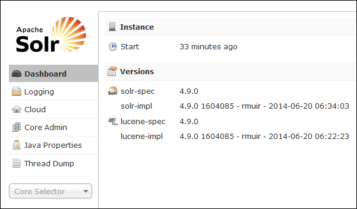

<properties
    pageTitle="Action de Script permet d’installer mode série sur LAN.r sur basé sur Linux HDInsight | Microsoft Azure"
    description="Découvrez comment installer mode série sur LAN.r sur clusters basés sur Linux HDInsight Hadoop à l’aide des Actions de Script."
    services="hdinsight"
    documentationCenter=""
    authors="Blackmist"
    manager="jhubbard"
    editor="cgronlun"
    tags="azure-portal"/>

<tags
    ms.service="hdinsight"
    ms.workload="big-data"
    ms.tgt_pltfrm="na"
    ms.devlang="na"
    ms.topic="article"
    ms.date="10/03/2016"
    ms.author="larryfr"/>

# Installer et utiliser le mode série sur LAN.r sur HDInsight Hadoop clusters

Dans cette rubrique, vous allez apprendre à installer mode série sur LAN.r sur Azure HDInsight à l’aide de Script Action. Mode série sur LAN.r est une plateforme de recherche puissant et fournit des fonctions de recherche au niveau de l’entreprise sur données gérées par Hadoop. Une fois que vous avez installé mode série sur LAN.r sur cluster HDInsight, vous allez également découvrir comment rechercher des données à l’aide de mode série sur LAN.r.

> [AZURE.NOTE] Les étapes décrites dans ce document nécessitent un cluster basé sur Linux HDInsight. Pour plus d’informations sur l’utilisation du mode série sur LAN.r avec un cluster de Windows, voir [installer et utiliser mode série sur LAN.r sur HDinsight Hadoop clusters (Windows)](hdinsight-hadoop-solr-install.md)

L’exemple de script utilisé dans cette rubrique crée un cluster mode série sur LAN.r avec une configuration spécifique. Si vous souhaitez configurer le cluster mode série sur LAN.r avec différentes collections, milieu des fragments, schémas, réplicas, etc., vous devez modifier le script et le mode série sur LAN.r binaires en conséquence.

## Quel est le mode série sur LAN.r ?

[Mode série sur LAN.r Apache](http://lucene.apache.org/solr/features.html) est une plateforme de recherche d’entreprise qui permet de puissante recherche en texte intégral sur des données. Tandis que Hadoop permet de stocker et gérer de grandes quantités de données, mode série sur LAN.r Apache fournit les fonctionnalités de recherche pour récupérer rapidement les données. Cette rubrique fournit des instructions sur la personnalisation d’un cluster HDInsight pour installer le mode série sur LAN.r.

> [AZURE.WARNING] Composants fournis avec le cluster HDInsight entièrement prises en charge et Support Microsoft aidera à identifier et résoudre les problèmes liés à ces composants.
>
> Composants personnalisés, tels que mode série sur LAN.r, recevront RCSI prise en charge pour vous aider à résoudre le problème. Cela peut provoquer de résoudre le problème ou vous demandant de s’engager canaux disponibles pour les technologies d’ouvrir la source où se trouve une grande expertise pour que la technologie. Par exemple, de nombreux sites communautaires qui peuvent être utilisés, comme : [forum MSDN pour HDInsight](https://social.msdn.microsoft.com/Forums/azure/en-US/home?forum=hdinsight), [http://stackoverflow.com](http://stackoverflow.com). Projets Apache contient des sites de projet sur [http://apache.org](http://apache.org), par exemple : [Hadoop](http://hadoop.apache.org/).

## Que signifie le script

Ce script effectue les modifications suivantes au cluster HDInsight :

* Mode série sur LAN.r installations dans`/usr/hdp/current/solr`
* Crée un nouvel utilisateur, __solrusr__, qui est utilisé pour exécuter le service mode série sur LAN.r
* Définit __solruser__ en tant que le propriétaire du`/usr/hdp/current/solr`
* Ajoute une configuration [Upstart](http://upstart.ubuntu.com/) qui lancera mode série sur LAN.r si un nœud de cluster redémarre. Mode série sur LAN.r est démarré automatiquement sur les nœuds de cluster après l’installation

## Installer mode série sur LAN.r à l’aide des Actions de Script

Un exemple de script pour installer le mode série sur LAN.r sur un cluster HDInsight est disponible à l’emplacement suivant.

    https://hdiconfigactions.blob.core.windows.net/linuxsolrconfigactionv01/solr-installer-v01.sh

Cette section fournit des instructions sur l’utilisation de l’exemple de script lorsque vous créez un nouveau cluster à l’aide du portail Azure. 

> [AZURE.NOTE] PowerShell Azure, l’infrastructure du langage commun Azure, le Kit de développement .NET HDInsight ou modèles Azure le Gestionnaire de ressources peuvent également être utilisés pour appliquer des actions de script. Vous pouvez également appliquer des actions de script à clusters en cours d’exécution. Pour plus d’informations, voir [Personnaliser HDInsight clusters avec les Actions de Script](hdinsight-hadoop-customize-cluster-linux.md).

1. Démarrer un cluster de mise en service à l’aide de la procédure dans [clusters HDInsight basé sur Linux de mise en service](hdinsight-hadoop-create-linux-clusters-portal.md), mais ne se terminent pas mise en service.

2. Dans la carte de **Configuration facultatives** , sélectionnez les **Actions de Script**et fournir les informations ci-dessous :

    * __Nom__: entrez un nom convivial pour l’action de script.
    * __SCRIPT URI__: https://hdiconfigactions.blob.core.windows.net/linuxsolrconfigactionv01/solr-installer-v01.sh
    * __Tête__: Activez cette option
    * __Employé CONSULTANT__: Activez cette option
    * __SOIGNEUR__: Activez cette option pour installer sur le nœud soigneur
    * __Paramètres__: laissez ce champ vide

3. En bas des **Actions de Script**, utilisez le bouton **Sélectionner** pour enregistrer la configuration. Enfin, utilisez le bouton **Sélectionner** en bas de la cuillère **Configuration facultatives** pour enregistrer les informations de configuration facultatif.

4. Continuez à mise en service le cluster comme décrit dans les [clusters HDInsight basé sur Linux de mise en service](hdinsight-hadoop-create-linux-clusters-portal.md).

## Comment utiliser le mode série sur LAN.r dans HDInsight ?

### Données d’indexation

Vous devez commencer par l’indexation mode série sur LAN.r avec certains fichiers de données. Vous pouvez ensuite utiliser mode série sur LAN.r pour exécuter des requêtes de recherche sur les données indexées. Procédez comme suit pour ajouter des données d’exemple à mode série sur LAN.r et puis de la requête :

1. Connectez-vous au cluster HDInsight à l’aide de SSH :

        ssh USERNAME@CLUSTERNAME-ssh.azurehdinsight.net

    Pour plus d’informations sur l’utilisation de SSH avec HDInsight, voir les rubriques suivantes :

    * [Utiliser le protocole SSH avec basé sur Linux Hadoop sur HDInsight de Linux, Unix ou OS X](hdinsight-hadoop-linux-use-ssh-unix.md)

    * [Utiliser le protocole SSH avec basé sur Linux Hadoop sur HDInsight à partir de Windows](hdinsight-hadoop-linux-use-ssh-windows.md)

    > [AZURE.IMPORTANT] Étapes plus loin dans cette Vérifiez document utilisent d’un tunnel SSL pour se connecter à l’interface utilisateur du mode série sur LAN.r web. Pour pouvoir utiliser ces étapes, vous devez établir un tunnel SSL, puis configurez votre navigateur pour l’utiliser.
    >
    > Pour plus d’informations, voir [Utiliser SSH tunnel pour accéder à l’interface utilisateur Ambari web, ResourceManager, JobHistory, NameNode, Oozie et autres web l’interface utilisateur](hdinsight-linux-ambari-ssh-tunnel.md)

2. Pour obtenir des données d’exemple mode série sur LAN.r index, utilisez les commandes suivantes :

        cd /usr/hdp/current/solr/example/exampledocs
        java -jar post.jar solr.xml monitor.xml

    Vous verrez le résultat suivant sur la console :

        POSTing file solr.xml
        POSTing file monitor.xml
        2 files indexed.
        COMMITting Solr index changes to http://localhost:8983/solr/update..
        Time spent: 0:00:01.624

    L’utilitaire post.jar index mode série sur LAN.r avec des documents de deux échantillons, **solr.xml** et **monitor.xml**. Ils seront trouveront __collection1__ au sein de mode série sur LAN.r.

3. Utilisez les éléments suivants à l’API REST exposé par mode série sur LAN.r de la requête :

        curl "http://localhost:8983/solr/collection1/select?q=*%3A*&wt=json&indent=true"

    Cela émet une requête sur __collection1__ les documents correspondant à __ \*:\* __ (codée sous la forme \*3 %\* dans la chaîne de requête) et que la réponse doit être retournée en tant que JSON. La réponse doit ressembler à ce qui suit :

            "response": {
                "numFound": 2,
                "start": 0,
                "maxScore": 1,
                "docs": [
                  {
                    "id": "SOLR1000",
                    "name": "Solr, the Enterprise Search Server",
                    "manu": "Apache Software Foundation",
                    "cat": [
                      "software",
                      "search"
                    ],
                    "features": [
                      "Advanced Full-Text Search Capabilities using Lucene",
                      "Optimized for High Volume Web Traffic",
                      "Standards Based Open Interfaces - XML and HTTP",
                      "Comprehensive HTML Administration Interfaces",
                      "Scalability - Efficient Replication to other Solr Search Servers",
                      "Flexible and Adaptable with XML configuration and Schema",
                      "Good unicode support: héllo (hello with an accent over the e)"
                    ],
                    "price": 0,
                    "price_c": "0,USD",
                    "popularity": 10,
                    "inStock": true,
                    "incubationdate_dt": "2006-01-17T00:00:00Z",
                    "_version_": 1486960636996878300
                  },
                  {
                    "id": "3007WFP",
                    "name": "Dell Widescreen UltraSharp 3007WFP",
                    "manu": "Dell, Inc.",
                    "manu_id_s": "dell",
                    "cat": [
                      "electronics and computer1"
                    ],
                    "features": [
                      "30\" TFT active matrix LCD, 2560 x 1600, .25mm dot pitch, 700:1 contrast"
                    ],
                    "includes": "USB cable",
                    "weight": 401.6,
                    "price": 2199,
                    "price_c": "2199,USD",
                    "popularity": 6,
                    "inStock": true,
                    "store": "43.17614,-90.57341",
                    "_version_": 1486960637584081000
                  }
                ]
              }

### Le tableau de bord mode série sur LAN.r

Le tableau de bord mode série sur LAN.r est une interface utilisateur qui permet de travailler avec mode série sur LAN.r via votre navigateur web. Le tableau de bord mode série sur LAN.r n’est pas exposé directement sur Internet à partir de votre cluster HDInsight, mais doit être accessibles à l’aide d’un tunnel SSH. Pour plus d’informations sur l’utilisation d’un tunnel SSH, voir [Utiliser SSH tunnel pour accéder à l’interface utilisateur Ambari web, ResourceManager, JobHistory, NameNode, Oozie et autres web l’interface utilisateur](hdinsight-linux-ambari-ssh-tunnel.md)

Une fois que vous avez établi un tunnel SSH, procédez comme suit pour utiliser le tableau de bord mode série sur LAN.r :

1. Déterminer le nom d’hôte pour la headnode principal :

    1. Utiliser le protocole SSH pour vous connecter au cluster sur le port 22. Par exemple, `ssh USERNAME@CLUSTERNAME-ssh.azurehdinsight.net` où __NomUtilisateur__ représente votre nom d’utilisateur SSH et __CLUSTERNAME__ est le nom de votre cluster.

        Pour plus d’informations sur l’utilisation de SSH, voir les documents suivants :

        * [Utiliser le protocole SSH avec basé sur Linux HDInsight à partir d’un client Linux, Unix ou Mac OS X](hdinsight-hadoop-linux-use-ssh-unix.md)

        * [Utiliser le protocole SSH avec basé sur Linux HDInsight à partir d’un client Windows](hdinsight-hadoop-linux-use-ssh-windows.md)
    
    3. Utilisez la commande suivante pour obtenir le nom d’hôte complet :

            hostname -f

        Ceci renverra un nom semblable à ce qui suit :

            hn0-myhdi-nfebtpfdv1nubcidphpap2eq2b.ex.internal.cloudapp.net
    
        Il s’agit du nom d’hôte qui doit être utilisé dans les étapes suivantes.
    
1. Dans votre navigateur, connectez-vous à __http://HOSTNAME:8983/mode série sur LAN.r / #/__, où __HOSTNAME__ est le nom que vous avez déterminé lors des étapes précédentes. 

    La requête doit être routée via le tunnel SSH vers le nœud principal pour votre cluster HDInsight. Vous devriez voir une page semblable à ce qui suit :

    

2. Dans le volet gauche, utilisez le **Sélecteur de base** de liste déroulante pour sélectionner **collection1**. Plusieurs entrées si les devraient apparaître sous __collection1__.

3. À partir des entrées ci-dessous __collection1__, sélectionnez __la requête__. Pour remplir la page de recherche, utilisez les valeurs suivantes :

    * Dans la zone de texte **q** , entrez ** \*:**\*. Ceci renvoie tous les documents qui sont indexés dans mode série sur LAN.r. Si vous souhaitez effectuer une recherche dans une chaîne spécifique dans les documents, vous pouvez entrer cette chaîne ici.

    * Dans la zone de texte **wt** , sélectionnez le format de sortie. Valeur par défaut est **json**.

    Enfin, sélectionnez le bouton **Exécuter la requête** en bas de la pate de recherche.

    

    La sortie renvoie les deux documents que nous avons utilisé pour l’indexation mode série sur LAN.r. La sortie ressemble à ceci :

            "response": {
                "numFound": 2,
                "start": 0,
                "maxScore": 1,
                "docs": [
                  {
                    "id": "SOLR1000",
                    "name": "Solr, the Enterprise Search Server",
                    "manu": "Apache Software Foundation",
                    "cat": [
                      "software",
                      "search"
                    ],
                    "features": [
                      "Advanced Full-Text Search Capabilities using Lucene",
                      "Optimized for High Volume Web Traffic",
                      "Standards Based Open Interfaces - XML and HTTP",
                      "Comprehensive HTML Administration Interfaces",
                      "Scalability - Efficient Replication to other Solr Search Servers",
                      "Flexible and Adaptable with XML configuration and Schema",
                      "Good unicode support: héllo (hello with an accent over the e)"
                    ],
                    "price": 0,
                    "price_c": "0,USD",
                    "popularity": 10,
                    "inStock": true,
                    "incubationdate_dt": "2006-01-17T00:00:00Z",
                    "_version_": 1486960636996878300
                  },
                  {
                    "id": "3007WFP",
                    "name": "Dell Widescreen UltraSharp 3007WFP",
                    "manu": "Dell, Inc.",
                    "manu_id_s": "dell",
                    "cat": [
                      "electronics and computer1"
                    ],
                    "features": [
                      "30\" TFT active matrix LCD, 2560 x 1600, .25mm dot pitch, 700:1 contrast"
                    ],
                    "includes": "USB cable",
                    "weight": 401.6,
                    "price": 2199,
                    "price_c": "2199,USD",
                    "popularity": 6,
                    "inStock": true,
                    "store": "43.17614,-90.57341",
                    "_version_": 1486960637584081000
                  }
                ]
              }

### Démarrer et arrêter le mode série sur LAN.r

Si vous devez manuellement démarrer ou arrêter solaires, utilisez les commandes suivantes :

    sudo stop solr

    sudo start solr

## Données indexées sauvegarde

Comme une bonne pratique, vous devez sauvegarder les données indexées mode série sur LAN.r des nœuds de cluster sur stockage d’objets Blob Azure. Effectuez les opérations suivantes pour ce faire :

1. Se connecter au cluster à l’aide de SSH, puis utilisez la commande suivante pour obtenir le nom d’hôte pour le nœud de tête :

        hostname -f
        
2. Utilisez ce qui suit pour créer une capture instantanée des données indexées. Remplacez le __nom d’hôte__ par le nom retourné par la commande précédente :

        curl http://HOSTNAME:8983/solr/replication?command=backup

    Vous devriez voir une réponse à ceci :

        <?xml version="1.0" encoding="UTF-8"?>
        <response>
          <lst name="responseHeader">
            <int name="status">0</int>
            <int name="QTime">9</int>
          </lst>
          <str name="status">OK</str>
        </response>

2. Ensuite, accédez au __/usr/hdp/current/solr/example/solr__. Il y a un sous-répertoire ici pour chaque collection de sites. Chaque répertoire de collection de sites contient un répertoire de __données__ , ce qui correspond à l’endroit où la capture instantanée de cette collection de sites est situé.

    Par exemple, si vous avez utilisé les étapes décrites précédemment à indexer les exemples de documents, le répertoire __/usr/hdp/current/solr/example/solr/collection1/data__ doit maintenant contenir un répertoire nommé __instantané. ###__ où le n° de sont la date et l’heure de l’instantané.

3. Créer une archive compressée du dossier instantané à l’aide d’une commande semblable à ce qui suit :

        tar -zcf snapshot.20150806185338855.tgz snapshot.20150806185338855

    Cela créera un nouveau fichier d’archives nommé __snapshot.20150806185338855.tgz__, qui contient le contenu du répertoire __snapshot.20150806185338855__ .

3. Vous pouvez ensuite stocker l’archive vers le stockage principal du cluster à l’aide de la commande suivante :

    Hadoop fs - copyFromLocal snapshot.20150806185338855.tgz/exemple et de données

    > [AZURE.NOTE] Vous souhaiterez peut-être créer un répertoire de stockage des instantanés mode série sur LAN.r dédié. Par exemple, `hadoop fs -mkdir /solrbackup`.

Pour plus d’informations sur l’utilisation des mode série sur LAN.r sauvegarde et la restauration, voir [Création et restauration de sauvegardes de SolrCores](https://cwiki.apache.org/confluence/display/solr/Making+and+Restoring+Backups+of+SolrCores).

## Voir aussi

- [Installer et utiliser les clusters teinte sur HDInsight](hdinsight-hadoop-hue-linux.md). La nuance est une interface utilisateur qui vous permettent de créer, exécuter et enregistrer des travaux cochon et Hive, ainsi que de parcourir le stockage par défaut pour votre HDInsight cluster web.

- [Installer R sur clusters HDInsight][hdinsight-install-r]. Personnalisation de cluster permet d’installer R sur HDInsight Hadoop clusters. R est un environnement pour calculer des statistiques et langue open source. Il propose des centaines de fonctions statistiques intégrées et sa propre langage de programmation qui combine les aspects de la programmation orientée objet et fonctionnelle. Il fournit également des fonctions graphiques étendues.

- [Installer Giraph sur les clusters HDInsight](hdinsight-hadoop-giraph-install-linux.md). Personnalisation de cluster permet d’installer Giraph sur HDInsight Hadoop clusters. Giraph, vous pouvez exécuter graph traitement à l’aide Hadoop et peut être utilisé avec Azure HDInsight.

- [Installer teinte sur clusters HDInsight](hdinsight-hadoop-hue-linux.md). Personnalisation de cluster permet d’installer teinte sur HDInsight Hadoop clusters. Teinte est un ensemble d’applications Web utilisé pour interagir avec un cluster Hadoop.

[hdinsight-install-r]: hdinsight-hadoop-r-scripts-linux.md
[hdinsight-cluster-customize]: hdinsight-hadoop-customize-cluster-linux.md
