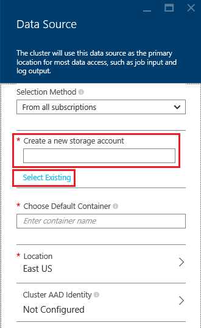

<properties
    pageTitle="Interroger des données depuis le stockage Blob HADOOP compatible | Microsoft Azure"
    description="HDInsight le stockage Blob Azure utilise le magasin de données volumineux pour HADOOP. Découvrez comment interroger des données depuis le stockage Blob et stocker les résultats de votre analyse."
    keywords="BLOB storage, Hadoop, des données structurées, données non structurées"
    services="hdinsight,storage"
    documentationCenter=""
    tags="azure-portal"
    authors="mumian"
    manager="jhubbard"
    editor="cgronlun"/>

<tags
    ms.service="hdinsight"
    ms.workload="big-data"
    ms.tgt_pltfrm="na"
    ms.devlang="na"
    ms.topic="get-started-article"
    ms.date="09/06/2016"
    ms.author="jgao"/>

# Utiliser le stockage d’objets Blob Azure HADOOP compatible avec Hadoop dans HDInsight

Découvrez comment utiliser le stockage d’objets Blob Azure économique avec HDInsight, création compte de stockage Azure et conteneur de stockage Blob, puis les données à l’intérieur.

Stockage d’objets Blob Azure est une solution de stockage robuste, universel qui s’intègre avec HDInsight. Via une interface de système (HDFS) de fichiers DFS Hadoop, l’ensemble des composants de HDInsight peut fonctionner directement sur des données structurées ou dans le stockage Blob.

Le stockage de données dans le stockage Blob vous permet de supprimer en toute sécurité les groupes HDInsight qui sont utilisés pour le calcul sans perte de données de l’utilisateur.

> [AZURE.IMPORTANT] HDInsight prend uniquement en charge des objets BLOB bloc. Il ne pas en charge page ou ajouter des objets BLOB.

Pour plus d’informations sur la création d’un cluster de HDInsight, voir [Prise en main HDInsight] [ hdinsight-get-started] ou [groupes HDInsight créer][hdinsight-creation].

## Architecture de stockage HDInsight
Le diagramme suivant fournit une vue de l’architecture de stockage HDInsight résumée :

![Hadoop clusters utilisent l’API HADOOP pour accéder et stocker des données structurées et dans le stockage Blob.] (./media/hdinsight-hadoop-use-blob-storage/HDI.WASB.Arch.png "Architecture de stockage HDInsight")

HDInsight permet d’accéder au système de fichiers distribué reliée localement aux nœuds de calcul. Ce système de fichiers sont accessibles à l’aide de l’URI complet, par exemple :

    hdfs://<namenodehost>/<path>

En outre, HDInsight offre la possibilité d’accéder aux données qui sont stockées dans le stockage Blob Azure. La syntaxe est la suivante :

    wasb[s]://<containername>@<accountname>.blob.core.windows.net/<path>

> [AZURE.NOTE] Dans les versions antérieures à 3.0, de HDInsight `asv://` a été utilisée au lieu de `wasb://`. `asv://`n’a pas doit être utilisée avec clusters HDInsight 3.0 ou version ultérieure, car elle entraîne une erreur.

Hadoop prend en charge une notion du système de fichiers par défaut. Le système de fichiers par défaut implique une autorité et schéma par défaut. Il peut également être utilisé pour résoudre les chemins d’accès relatifs. Pendant le processus de création de HDInsight, un compte de stockage Azure et un stockage d’objets Blob Azure spécifique conteneur de ce compte est désigné comme le système de fichiers par défaut.

En plus de ce compte de stockage, vous pouvez ajouter des comptes d’espace de stockage supplémentaire à partir du même abonnement Azure ou les différents abonnements Azure pendant le processus de création ou après la création d’un cluster. Pour des instructions sur l’ajout de comptes d’espace de stockage supplémentaire, voir [créer HDInsight clusters][hdinsight-creation].

- **Conteneurs dans les comptes de stockage qui sont connectés à un cluster :** Comme le nom du compte et la clé sont associés au cluster lors de la création, vous avez un accès intégral aux objets BLOB dans ces conteneurs.

- **Conteneurs publics ou des objets BLOB publics dans les comptes de stockage n’êtes pas connectés à un cluster :** Vous disposez des autorisations en lecture seule pour les objets BLOB dans les conteneurs.

    > [AZURE.NOTE]
        > Conteneurs publics permettent d’obtenir une liste de tous les objets BLOB qui sont disponibles dans ce conteneur et obtenir des métadonnées conteneur. Objets BLOB publics autoriser afin d’accéder aux objets BLOB uniquement si vous connaissez l’URL exacte. Pour plus d’informations, voir <a href="http://msdn.microsoft.com/library/windowsazure/dd179354.aspx">restreindre l’accès à des conteneurs et des objets BLOB</a>.

- **Privés conteneurs dans les comptes de stockage n’êtes pas connectés à un cluster :** Impossible d’accéder les objets BLOB dans les conteneurs sauf si vous définissez le compte de stockage lorsque vous envoyez les tâches WebHCat. Cela est expliqué plus loin dans cet article.

Les comptes de stockage qui sont définis dans le processus de création et de leurs clés sont stockés dans %HADOOP_HOME%/conf/core-site.xml sur les nœuds du cluster. Le comportement par défaut de HDInsight consiste à utiliser les comptes de stockage définis dans le fichier core site.xml. Il n’est pas recommandé pour modifier le fichier core site.xml parce que la node(master) de tête cluster pouvant être qu’ou migré à tout moment, et toute modification apportée à ces fichiers seront perdues.

Plusieurs tâches WebHCat, y compris Hive, MapReduce, Hadoop diffusion en continu et cochon, peuvent comporter une description des comptes de stockage et des métadonnées avec eux. (Cela travaille actuellement pour cochon avec des comptes de stockage, mais pas pour les métadonnées.) Dans la section [des objets BLOB Access à l’aide de PowerShell Azure](#powershell) de cet article, il existe un échantillon de cette fonctionnalité. Pour plus d’informations, voir [l’utilisation d’un HDInsight Cluster avec d’autres comptes de stockage et Metastores](http://social.technet.microsoft.com/wiki/contents/articles/23256.using-an-hdinsight-cluster-with-alternate-storage-accounts-and-metastores.aspx).

Stockage d’objets BLOB peut être utilisée pour les données structurées et non structurées. Conteneurs de stockage BLOB stockent les données sous forme de paires clé/valeur, et il n’existe aucune hiérarchie de répertoire. Cependant le caractère barre oblique (/) peut être utilisé dans le nom de la clé pour le faire apparaître comme si un fichier est stocké dans une structure de répertoire. Par exemple, clé d’un blob est peut-être *input/log1.txt*. Aucun répertoire réel *d’entrée* n’existe, mais en raison de la présence du caractère barre oblique dans le nom de clé, il a l’apparence d’un chemin d’accès.

###Avantages du stockage d’objets Blob
Le coût des performances implicite de ne pas la localisation calculer clusters et ressources de stockage est réduit par la manière dont les groupes de cluster créés près les ressources de compte de stockage à l’intérieur de la région Azure, où le réseau haut débit rend très efficace pour les nœuds de calcul à accéder aux données à l’intérieur de stockage d’objets Blob Azure.

Il existe plusieurs avantages liés à stocker les données dans le stockage Blob Azure au lieu de HADOOP :

* **Partage et réutilisation des données :** Les données d’HADOOP sont trouve dans le cluster de calcul. Seules les applications qui ont accès au cluster de calcul peuvent utiliser les données en utilisant des API HADOOP. Les données dans le stockage Blob Azure sont accessibles via les API HADOOP ou via les [API REST de stockage Blob][blob-storage-restAPI]. Par conséquent, un ensemble élargi d’applications (y compris l’autre cluster HDInsight) et les outils peut servir à générer et d’utiliser les données.
* **L’archivage des données :** Stocker des données dans le stockage Blob Azure permet les groupes HDInsight utilisés pour le calcul à supprimer en toute sécurité sans perte de données de l’utilisateur.
* **Coût de stockage de données :** Le stockage de données dans DFS sur le long terme est plus coûteux que le stockage des données dans le stockage Blob Azure, car le coût d’un cluster de calcul est supérieur à celui d’un conteneur de stockage Blob Azure. En outre, étant donné que les données n’ayant pas à recharger pour chaque génération de cluster de calcul, vous enregistrez également les coûts de chargement des données.
* **Horizontale élastique :** Bien que HADOOP vous fournit un système de fichiers plus grande échelle, l’échelle est déterminée par le nombre de nœuds que vous créez pour votre cluster. Modification de l’échelle peut devenir un processus plus complexe que la l’élastique mise à l’échelle des fonctionnalités qui s’affiche automatiquement dans le stockage Blob Azure.
* **Geo réplication :** Les conteneurs de stockage Blob Azure peuvent être répliquées geo. Bien que vous donne récupération géographique et redondance des données, un basculement vers l’emplacement répliquées geo strictement a un impact sur les performances, et il peut être payantes. Afin que nous vous recommandons consiste à choisir la réplication geo de manière judicieuse et uniquement si la valeur des données vaut la peine supplémentaire.

Certaines tâches MapReduce et packages peuvent créer des résultats intermédiaires que vous ne voulez vraiment stocker dans le stockage Blob Azure. Dans ce cas, vous pouvez choisir de stocker les données dans le HADOOP local. En fait, HDInsight utilise DFS pour plusieurs de ces résultats intermédiaires dans Hive travaux et d’autres processus.

> [AZURE.NOTE] La plupart des commandes HADOOP (par exemple, <b>!</b>, <b>copyFromLocal</b> et <b>mkdir</b>) continuent-ils de fonctionner comme prévu. Seules les commandes qui sont spécifiques à l’HADOOP implémentation native (qui est appelée DFS), tels que <b>fschk</b> et <b>dfsadmin</b>, seront affichent différemment dans stockage d’objets Blob Azure.

## Créer des conteneurs Blob

Pour utiliser des objets BLOB, vous créez tout d’abord un [compte de stockage Azure][azure-storage-create]. Dans le cadre du présent, vous spécifiez une région Azure qui stockera les objets que vous créez à l’aide de ce compte. Le cluster et le compte de stockage doivent être hébergées dans la même région. La base de données SQL Server Hive metastore et la base de données SQL Server Oozie metastore doivent également se trouver dans la même région.

À l’endroit où il réside, chaque blob que vous créez un conteneur dans votre compte de stockage Azure auquel appartient. Ce conteneur peut être un blob existant qui a été créé en dehors de HDInsight, ou il peut être un conteneur est créé pour un cluster HDInsight.

Le conteneur Blob par défaut stocke cluster des informations spécifiques telles que l’historique des travaux et les journaux. Ne pas partager un conteneur Blob par défaut avec plusieurs clusters HDInsight. Cela peut endommager l’historique du travail, puis le cluster sera sont peu consciencieux. Il est recommandé d’utiliser un autre conteneur pour chaque cluster et placer les données partagées sur un compte de stockage lié spécifié dans le déploiement de tous les clusters pertinents plutôt que le compte de stockage par défaut. Pour plus d’informations sur la configuration des comptes de stockage liées, consultez [créer HDInsight clusters][hdinsight-creation]. Toutefois, vous pouvez réutiliser un conteneur de stockage par défaut après que le cluster HDInsight d’origine a été supprimé. Pour les clusters HBase, vous pouvez conserver réellement le schéma de table HBase et des données en créer un nouveau cluster HBase à l’aide du conteneur de stockage blob par défaut qui est utilisé par un cluster HBase qui a été supprimé.

### À l’aide du portail Azure

Lorsque vous créez un cluster HDInsight à partir du portail, vous disposez des options pour utiliser un compte de stockage existant ou en créer un nouveau compte de stockage :

###À l’aide d’Azure infrastructure du langage commun

[AZURE.INCLUDE [use-latest-version](../../includes/hdinsight-use-latest-cli.md)]

Si vous avez [installé et configuré l’infrastructure du langage commun Azure](../xplat-cli-install.md), la commande suivante peut être utilisé à un compte de stockage et le conteneur.

    azure storage account create <storageaccountname> --type LRS

> [AZURE.NOTE] La `--type` paramètre indique comment le compte de stockage sera répliqué. Pour plus d’informations, voir [La réplication du stockage Azure](../storage/storage-redundancy.md). N’utilisez pas ZRS comme ZRS non prises en charge blob de page, un fichier, tableau ou file d’attente.

Vous devrez spécifier la région géographique du compte de stockage est situé dans. Vous devez créer le compte de stockage dans la même région que vous prévoyez sur la création de votre cluster HDInsight.

Une fois le compte de stockage est créé, utilisez la commande suivante pour récupérer les clés de compte de stockage :

    azure storage account keys list <storageaccountname>

Pour créer un conteneur, utilisez la commande suivante :

    azure storage container create <containername> --account-name <storageaccountname> --account-key <storageaccountkey>

### À l’aide de PowerShell Azure

Si vous avez [installé et configuré Azure PowerShell][powershell-install], vous pouvez utiliser les éléments suivants dans l’invite PowerShell Azure pour créer un compte de stockage et le conteneur :

[AZURE.INCLUDE [upgrade-powershell](../../includes/hdinsight-use-latest-powershell.md)]

    $SubscriptionID = "<Your Azure Subscription ID>"
    $ResourceGroupName = "<New Azure Resource Group Name>"
    $Location = "EAST US 2"
    
    $StorageAccountName = "<New Azure Storage Account Name>"
    $containerName = "<New Azure Blob Container Name>"
    
    Add-AzureRmAccount
    Select-AzureRmSubscription -SubscriptionId $SubscriptionID
    
    # Create resource group
    New-AzureRmResourceGroup -name $ResourceGroupName -Location $Location
    
    # Create default storage account
    New-AzureRmStorageAccount -ResourceGroupName $ResourceGroupName -Name $StorageAccountName -Location $Location -Type Standard_LRS 
    
    # Create default blob containers
    $storageAccountKey = (Get-AzureRmStorageAccountKey -ResourceGroupName $resourceGroupName -StorageAccountName $StorageAccountName)[0].Value
    $destContext = New-AzureStorageContext -StorageAccountName $storageAccountName -StorageAccountKey $storageAccountKey  
    New-AzureStorageContainer -Name $containerName -Context $destContext

## Fichiers adresse dans le stockage Blob

Le modèle URI pour accéder aux fichiers dans le stockage Blob à partir de HDInsight est la suivante :

    wasb[s]://<BlobStorageContainerName>@<StorageAccountName>.blob.core.windows.net/<path>

Le modèle URI offre un accès non chiffré (avec la *wasb :* préfixe) et SSL chiffré access (avec *wasbs*). Nous recommandons d’utiliser *wasbs* autant que possible, même lorsque l’accès aux données qui se trouve à l’intérieur de la même région dans Azure.

La &lt;BlobStorageContainerName&gt; identifie le nom du conteneur dans le stockage Blob Azure.
La &lt;StorageAccountName&gt; identifie le nom de compte de stockage Azure. Un nom de domaine complet (FQDN) est requis.

Cas tous les autres &lt;BlobStorageContainerName&gt; ni &lt;StorageAccountName&gt; a été spécifié, le système de fichier par défaut est utilisé. Pour les fichiers sur le système de fichiers par défaut, vous pouvez utiliser un chemin d’accès relatif ou un chemin d’accès absolu. Par exemple, le fichier *hadoop-mapreduce-examples.jar* qui est fourni avec clusters HDInsight peut faire référence à en utilisant une des opérations suivantes :

    wasbs://mycontainer@myaccount.blob.core.windows.net/example/jars/hadoop-mapreduce-examples.jar
    wasbs:///example/jars/hadoop-mapreduce-examples.jar
    /example/jars/hadoop-mapreduce-examples.jar

> [AZURE.NOTE] Le nom du fichier est <i>hadoop examples.jar</i> dans les clusters de versions 2.1 et 1,6 HDInsight.

La &lt;chemin d’accès&gt; est le nom de chemin d’accès au fichier ou au répertoire HADOOP. Comme conteneurs dans le stockage Blob Azure sont simplement clé-valeur de stockage, il n’existe aucun système de fichiers hiérarchiques true. Une barre oblique (/) à l’intérieur d’une clé d’objets blob est interprétée comme un séparateur de répertoire. Par exemple, le nom blob *hadoop-mapreduce-examples.jar* est :

    example/jars/hadoop-mapreduce-examples.jar

> [AZURE.NOTE] Lorsque vous travaillez avec des objets BLOB en dehors de HDInsight, la plupart des utilitaires ne reconnaît pas le format WASB et à la place attendre un format de chemin d’accès de base, telles que `example/jars/hadoop-mapreduce-examples.jar`.

## Objets BLOB Access à l’aide d’infrastructure du langage commun Azure

La commande suivante permet de répertorier les commandes d’objets blob :

    azure storage blob

**Exemple d’utilisation Azure infrastructure du langage commun pour télécharger un fichier**

    azure storage blob upload <sourcefilename> <containername> <blobname> --account-name <storageaccountname> --account-key <storageaccountkey>

**Exemple d’utilisation Azure infrastructure du langage commun pour télécharger un fichier**

    azure storage blob download <containername> <blobname> <destinationfilename> --account-name <storageaccountname> --account-key <storageaccountkey>

**Exemple d’utilisation Azure infrastructure du langage commun pour supprimer un fichier**

    azure storage blob delete <containername> <blobname> --account-name <storageaccountname> --account-key <storageaccountkey>

**Exemple d’utilisation Azure infrastructure du langage commun pour répertorier les fichiers**

    azure storage blob list <containername> <blobname|prefix> --account-name <storageaccountname> --account-key <storageaccountkey>

## Objets BLOB Access à l’aide de PowerShell Azure

> [AZURE.NOTE] Les commandes de cette section fournissent un exemple de base de l’utilisation de PowerShell pour accéder aux données stockées dans des objets BLOB. Pour obtenir un exemple plus complet qui est utilisé pour l’utilisation de HDInsight, voir les [Outils HDInsight](https://github.com/Blackmist/hdinsight-tools).

La commande suivante permet de répertorier les applets de commande d’objets blob :

    Get-Command *blob*

![Liste des applets de commande PowerShell liés blob.][img-hdi-powershell-blobcommands]

###Télécharger des fichiers

Voir [télécharger des données à HDInsight][hdinsight-upload-data].

###Télécharger des fichiers

Le script suivant télécharge un blob bloc sur le dossier actif. Avant d’exécuter le script, placez-vous à un dossier dans lequel vous disposez des autorisations d’écriture.

    $resourceGroupName = "<AzureResourceGroupName>"
    $storageAccountName = "<AzureStorageAccountName>"   # The storage account used for the default file system specified at creation.
    $containerName = "<BlobStorageContainerName>"  # The default file system container has the same name as the cluster.
    $blob = "example/data/sample.log" # The name of the blob to be downloaded.
    
    # Use Add-AzureAccount if you haven't connected to your Azure subscription
    Login-AzureRmAccount 
    Select-AzureRmSubscription -SubscriptionID "<Your Azure Subscription ID>"
    
    Write-Host "Create a context object ... " -ForegroundColor Green
    $storageAccountKey = (Get-AzureRmStorageAccountKey -ResourceGroupName $resourceGroupName -Name $storageAccountName)[0].Value
    $storageContext = New-AzureStorageContext -StorageAccountName $storageAccountName -StorageAccountKey $storageAccountKey  
    
    Write-Host "Download the blob ..." -ForegroundColor Green
    Get-AzureStorageBlobContent -Container $ContainerName -Blob $blob -Context $storageContext -Force
    
    Write-Host "List the downloaded file ..." -ForegroundColor Green
    cat "./$blob"

Fournir le nom de groupe de ressources et le nom du cluster, vous pouvez utiliser le code suivant :

    $resourceGroupName = "<AzureResourceGroupName>"
    $clusterName = "<HDInsightClusterName>"
    $blob = "example/data/sample.log" # The name of the blob to be downloaded.
    
    $cluster = Get-AzureRmHDInsightCluster -ResourceGroupName $resourceGroupName -ClusterName $clusterName
    $defaultStorageAccount = $cluster.DefaultStorageAccount -replace '.blob.core.windows.net'
    $defaultStorageAccountKey = (Get-AzureRmStorageAccountKey -ResourceGroupName $resourceGroupName -Name $defaultStorageAccount)[0].Value
    $defaultStorageContainer = $cluster.DefaultStorageContainer
    $storageContext = New-AzureStorageContext -StorageAccountName $defaultStorageAccount -StorageAccountKey $defaultStorageAccountKey 
    
    Write-Host "Download the blob ..." -ForegroundColor Green
    Get-AzureStorageBlobContent -Container $defaultStorageContainer -Blob $blob -Context $storageContext -Force

###Supprimer des fichiers

    Remove-AzureStorageBlob -Container $containerName -Context $storageContext -blob $blob

###Liste des fichiers

    Get-AzureStorageBlob -Container $containerName -Context $storageContext -prefix "example/data/"

###Exécuter des requêtes Hive à l’aide d’un compte de stockage non défini

Cet exemple montre comment un dossier de compte de stockage qui n’est pas définie au cours du processus de création de la liste.
$clusterName = «<HDInsightClusterName>»

    $undefinedStorageAccount = "<UnboundedStorageAccountUnderTheSameSubscription>"
    $undefinedContainer = "<UnboundedBlobContainerAssociatedWithTheStorageAccount>"

    $undefinedStorageKey = Get-AzureStorageKey $undefinedStorageAccount | %{ $_.Primary }

    Use-AzureRmHDInsightCluster $clusterName

    $defines = @{}
    $defines.Add("fs.azure.account.key.$undefinedStorageAccount.blob.core.windows.net", $undefinedStorageKey)

    Invoke-AzureRmHDInsightHiveJob -Defines $defines -Query "dfs -ls wasbs://$undefinedContainer@$undefinedStorageAccount.blob.core.windows.net/;"

## Étapes suivantes

Dans cet article, vous avez appris comment utiliser le stockage d’objets Blob Azure HADOOP compatible avec HDInsight, et vous avez appris que stockage d’objets Blob Azure est un composant fondamentaux de HDInsight. Ainsi, vous pouvez créer des solutions d’acquisition de données format SVG, à long terme d’archivage avec stockage d’objets Blob Azure et utiliser HDInsight pour déverrouiller les informations contenues dans les données structurées et stockées.

Pour plus d’informations, voir :

* [Prise en main Azure HDInsight][hdinsight-get-started]
* [Télécharger des données à HDInsight][hdinsight-upload-data]
* [Utiliser Hive avec HDInsight][hdinsight-use-hive]
* [Utiliser cochon avec HDInsight][hdinsight-use-pig]
* [Permet de limiter l’accès aux données avec HDInsight Azure stockage partagés accès Signatures][hdinsight-use-sas]

[hdinsight-use-sas]: hdinsight-storage-sharedaccesssignature-permissions.md
[powershell-install]: ../powershell-install-configure.md
[hdinsight-creation]: hdinsight-provision-clusters.md
[hdinsight-get-started]: hdinsight-hadoop-tutorial-get-started-windows.md
[hdinsight-upload-data]: hdinsight-upload-data.md
[hdinsight-use-hive]: hdinsight-use-hive.md
[hdinsight-use-pig]: hdinsight-use-pig.md

[blob-storage-restAPI]: http://msdn.microsoft.com/library/windowsazure/dd135733.aspx
[azure-storage-create]: ../storage/storage-create-storage-account.md

[img-hdi-powershell-blobcommands]: ./media/hdinsight-hadoop-use-blob-storage/HDI.PowerShell.BlobCommands.png
[img-hdi-quick-create]: ./media/hdinsight-hadoop-use-blob-storage/HDI.QuickCreateCluster.png
[img-hdi-custom-create-storage-account]: ./media/hdinsight-hadoop-use-blob-storage/HDI.CustomCreateStorageAccount.png  
