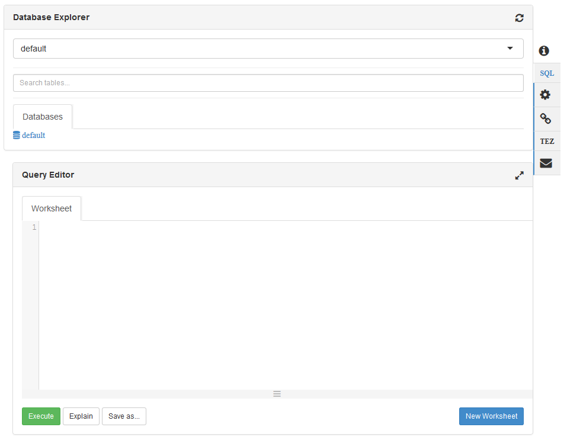

<properties
   pageTitle="Utiliser les affichages Ambari avec Hive sur HDInsight (Hadoop) | Microsoft Azure"
   description="Découvrez comment utiliser le mode ruche depuis votre navigateur web pour soumettre des requêtes Hive. L’affichage ruche fait partie de l’interface utilisateur Web Ambari fourni avec votre cluster HDInsight basé sur Linux."
   services="hdinsight"
   documentationCenter=""
   authors="Blackmist"
   manager="jhubbard"
   editor="cgronlun"
    tags="azure-portal"/>

<tags
   ms.service="hdinsight"
   ms.devlang="na"
   ms.topic="article"
   ms.tgt_pltfrm="na"
   ms.workload="big-data"
   ms.date="10/28/2016"
   ms.author="larryfr"/>

#Utilisez l’affichage Hive avec Hadoop dans HDInsight

[AZURE.INCLUDE [hive-selector](../../includes/hdinsight-selector-use-hive.md)]

Ambari est une gestion et l’utilitaire de surveillance fournis avec clusters HDInsight basé sur Linux. Un des fonctionnalités fournies par le biais Ambari est une interface utilisateur Web pouvant être utilisées pour exécuter des requêtes Hive. Il s’agit de l' __Affichage ruche__, composant des vues Ambari fourni avec votre cluster HDInsight.

> [AZURE.NOTE] Ambari contient un grand nombre de fonctionnalités qui ne sont pas traitées dans ce document. Pour plus d’informations, consultez [Gérer HDInsight clusters à l’aide de l’interface utilisateur Web Ambari](hdinsight-hadoop-manage-ambari.md).

##Conditions préalables

- Un cluster basé sur Linux HDInsight. Pour plus d’informations sur la création d’un nouveau cluster, voir [prise en main HDInsight basé sur Linux](hdinsight-hadoop-linux-tutorial-get-started.md).

##Ouvrir le mode Hive

Vous pouvez Ambari vues à partir du portail Azure ; Sélectionnez votre cluster HDInsight, puis sélectionnez __Ambari affichages__ dans la section __Liens rapides__ .

Vous pouvez également accéder directement au Ambari en accédant à https://CLUSTERNAME.azurehdinsight.net dans un navigateur web (où __CLUSTERNAME__ est le nom de votre cluster HDInsight) et sélectionnez l’ensemble des carrés à partir du menu de la page (à côté du bouton gauche de la page et un lien __d’administration__ ) des affichages liste disponible. Sélectionnez l' __affichage de la ruche__.

.

> [AZURE.NOTE] Lorsque vous accédez à Ambari, vous devrez s’authentifier sur le site. Entrez l’administrateur (par défaut `admin`,) nom de compte et mot de passe utilisé lors de la création du cluster.

Vous devriez voir une page semblable à ce qui suit :

##Afficher les tables

Dans la section __Explorer de base de données__ de la page, sélectionnez l’entrée __par défaut__ sous l’onglet __bases de données__ . Ceci affiche une liste de tables dans la base de données par défaut. Pour un nouveau cluster HDInsight, qu’une seule table doit exister ; __hivesampletable__.

Lorsque des tables sont ajoutés via les étapes décrites dans ce document, vous pouvez utiliser l’icône d’actualisation dans le coin supérieur droit de l’Explorateur de base de données pour actualiser la liste des tables disponibles.

##Éditeur de requête

Procédez comme suit dans l’affichage Hive pour exécuter une requête Hive par rapport aux données incluses avec le cluster.

1. Dans la section de __L’éditeur de requête__ de la page, collez les instructions HiveQL suivantes dans la feuille de calcul :

        DROP TABLE log4jLogs;
        CREATE EXTERNAL TABLE log4jLogs(t1 string, t2 string, t3 string, t4 string, t5 string, t6 string, t7 string)
        ROW FORMAT DELIMITED FIELDS TERMINATED BY ' '
        STORED AS TEXTFILE LOCATION 'wasbs:///example/data/';
        SELECT t4 AS sev, COUNT(*) AS cnt FROM log4jLogs WHERE t4 = '[ERROR]' GROUP BY t4;

    Ces instructions effectuent les opérations suivantes :

    - **DROP TABLE** - supprime la table et le fichier de données, au cas où la table existe déjà.
    - **Créer une TABLE externe** - crée une nouvelle table « externe » dans Hive. Tables externes stockent uniquement la définition de table dans Hive ; les données restent dans l’emplacement d’origine.
    - **FORMAT de ligne** indique la ruche mise en forme les données. Dans ce cas, les champs dans chaque journal sont séparées par un espace.
    - **Stockées en tant que fichier texte emplacement** - indique la ruche où les données sont stockées (le répertoire de données d’exemple), et qu’il est stocké en tant que texte.
    - **Sélectionnez** - sélectionne un compteur de toutes les lignes dont la colonne t4 contient la valeur [erreur].

    >[AZURE.NOTE] Tables externes doivent être utilisés lorsque vous pensez que les données sous-jacentes à mettre à jour par une source externe, par exemple, un processus de téléchargement automatique des données, ou par une autre opération MapReduce, mais vous voulez toujours Hive requêtes à utiliser les données les plus récentes. Suppression d’une table externe signifie *pas* supprimer les données, la définition de la table.

2. Utiliser le bouton __exécuter__ en bas de l’éditeur de requête pour démarrer la requête. Il doit devenir orange et le texte changera pour __Arrêter l’exécution__. Une section de __Résultats de la requête processus__ devant apparaître en dessous de l’éditeur de requête et afficher des informations sur la tâche.

    > [AZURE.IMPORTANT] Certains navigateurs peut être actualisée pas correctement les informations de journal ou les résultats. Si vous exécutez une tâche et il semble exécuter indéfiniment sans mettre à jour le journal ou retourner des résultats, essayez d’utiliser à la place Mozilla FireFox ou Google Chrome.

3. Une fois la requête terminée, la section __Requête processus résultats__ affiche les résultats de l’opération. Le bouton __Arrêter l’exécution__ modifiera également revenir à un bouton __Execute__ vert. L’onglet __résultats__ doit contenir les informations suivantes :

        sev       cnt
        [ERROR]   3

    L’onglet __journaux__ peut être utilisé pour afficher les informations de journalisation créées par la tâche. Vous pouvez utiliser ce de résoudre les problèmes s’il existe des problèmes avec une requête.

    > [AZURE.TIP] Remarque la boîte de dialogue déroulante __Enregistrer les résultats__ dans le coin supérieur gauche de la section __Résultats de processus de la requête__ ; Vous pouvez l’utiliser à télécharger les résultats ou les enregistrer dans HDInsight stockage dans un fichier CSV.

3. Sélectionnez les quatre premières lignes de cette requête, puis cliquez sur __exécuter__. Notez qu’il n’y a aucun résultat lorsque la tâche se termine. C’est parce que l’aide du bouton __Execute__ lors de la partie de la requête est activée ne s’exécute que les relevés sélectionnés. Dans ce cas, la sélection n’a pas été inclure l’instruction finale qui Récupère les lignes de la table. Si vous sélectionnez simplement cette ligne et utilisez __Execute__, normalement les résultats attendus.

3. Utilisez le bouton __Nouvelle feuille de calcul__ en bas de l' __Éditeur de requête__ pour créer une nouvelle feuille de calcul. Dans la nouvelle feuille de calcul, entrez les instructions HiveQL suivantes :

        CREATE TABLE IF NOT EXISTS errorLogs (t1 string, t2 string, t3 string, t4 string, t5 string, t6 string, t7 string) STORED AS ORC;
        INSERT OVERWRITE TABLE errorLogs SELECT t1, t2, t3, t4, t5, t6, t7 FROM log4jLogs WHERE t4 = '[ERROR]';

    Ces instructions effectuent les opérations suivantes :

    - **Créer tableau IF NOT EXISTS** - crée une table, s’il n’existe pas déjà. Dans la mesure où le mot-clé **externes** n’est pas utilisé, il s’agit d’une table interne, qui est stockée dans le data warehouse Hive et est gérée complètement par Hive. Contrairement aux tables externes, vous supprimez une table interne pour supprimer ainsi que les données sous-jacentes.
    - **Stockées en tant que ORC** - stocke les données au format optimisé ligne en colonnes (ORC). Il s’agit d’un format hautement optimisé et efficace pour le stockage de données Hive.
    - REMPLACER **Insertion... Sélectionnez** - sélectionne les lignes dans la table **log4jLogs** qui contiennent [erreur] et puis insère les données dans la table des **journaux d’erreurs** .

    Utiliser le bouton __exécuter__ pour exécuter cette requête. L’onglet __résultats__ contiendra pas toutes les informations qu’aucune ligne n’est retournés par cette requête, mais l’état doit afficher en tant que __a réussi__.

###Paramètres Hive

Sélectionnez l’icône __paramètres__ à droite de l’éditeur.

Paramètres peuvent être utilisés pour modifier différents paramètres Hive, telles que la modification du moteur d’exécution pour Hive de Tez (par défaut,) pour MapReduce.

###Expliquez Visual

Sélectionnez l’icône __Visuelle expliquer__ à droite de l’éditeur.

Il s’agit de l’affichage __Expliquer visuelle__ de la requête, qui peut être utile de comprendre le flux des requêtes complexes. Vous pouvez afficher un équivalent textuel de cet affichage à l’aide du bouton __expliquer__ dans l’éditeur de requête.

###Tez

Sélectionnez l’icône __Tez__ à droite de l’éditeur.

Ceci affiche les dirigé acycliques Graph (DAG) utilisé par Tez pour cette requête, si elle est disponible. Si vous voulez afficher le DAG pour les requêtes vous avez exécuté l’utilisation passé, ou déboguer le processus Tez, l' [Affichage Tez](hdinsight-debug-ambari-tez-view.md) à la place.

###Notifications

Sélectionnez l’icône de __Notifications__ à droite de l’éditeur.

Notifications sont des messages qui sont générés lors de l’exécution des requêtes. Par exemple, vous recevrez une notification lorsqu’une requête est envoyée, ou lorsqu’une erreur se produit.

##Requêtes enregistrées

1. À partir de l’éditeur de requête, créez une feuille de calcul et entrez la requête suivante :

        SELECT * from errorLogs;

    Exécutez la requête pour vérifier qu’il fonctionne. Les résultats seront comme suit :

        errorlogs.t1    errorlogs.t2    errorlogs.t3    errorlogs.t4    errorlogs.t5    errorlogs.t6    errorlogs.t7
        2012-02-03  18:35:34    SampleClass0    [ERROR]     incorrect   id  
        2012-02-03  18:55:54    SampleClass1    [ERROR]     incorrect   id  
        2012-02-03  19:25:27    SampleClass4    [ERROR]     incorrect   id

2. Utilisez le bouton __Enregistrer en tant__ qu’en bas de l’éditeur. Nommer cette requête __journaux d’erreurs__ , puis sélectionnez __OK__. Notez que le nom de la feuille de calcul est remplacée par les __journaux d’erreurs__.

3. Sélectionnez l’onglet __Requêtes enregistrées__ en haut de la page ruche l’affichage. Notez que les __journaux d’erreurs__ est désormais répertorié comme une requête enregistrée. Il reste dans la liste jusqu'à ce que vous supprimiez. Sélectionnez le nom pour ouvrir la requête dans l’éditeur de requête.

##Historique des requêtes

Le bouton __historique__ en haut de la vue ruche permet de vous permet d’afficher les requêtes que vous avez exécutez précédemment. Utiliser maintenant et sélectionnez certaines des requêtes que vous avez exécuté précédemment. Lorsque vous sélectionnez une requête, s’ouvre dans l’éditeur de requête.

##Définies par l’utilisateur (UDF), fonctions

Hive peut également être étendu via des **fonctions définies par l’utilisateur (UDF)**. Un fichier UDF vous permet d’implémenter des fonctionnalités ou la logique qui n’est pas facilement appuient sur dans HiveQL.

Vous pouvez ajouter un fichier UDF dans le cadre des instructions HiveQL dans votre requête, l’onglet UDF en haut de la vue ruche permet de déclarer et enregistrer un ensemble d’UDF qui peuvent être utilisés avec l' __Éditeur de requête__.

Une fois que vous avez ajouté un fichier UDF à l’affichage ruche, un bouton permettant __d’Insérer UDF__ s’affichent en bas de l' __Éditeur de requête__. Si vous sélectionnez cette affiche une liste déroulante des UDF définis dans l’affichage de la ruche. Sélection d’un fichier UDF ajoutera HiveQL instructions à votre requête pour activer le fichier UDF.

Par exemple, si vous avez défini un UDF avec les propriétés suivantes :

* Nom de la ressource : myudfs
* Chemin de la ressource : wasbs:///myudfs.jar
* Nom du fichier UDF : myawesomeudf
* Nom de la classe UDF : com.myudfs.Awesome

Utilisation du bouton __Insérer UDF__ affiche une entrée nommée __myudfs__, avec le menu déroulant d’une autre pour chaque UDF défini pour cette ressource. Dans ce cas, __myawesomeudf__. Sélection de cette entrée ajoutera ce qui suit au début de la requête :

    add jar wasbs:///myudfs.jar;

    create temporary function myawesomeudf as 'com.myudfs.Awesome';

Vous pouvez ensuite utiliser le fichier UDF dans votre requête. Par exemple, `SELECT myawesomeudf(name) FROM people;`.

Pour plus d’informations sur l’utilisation des UDF avec Hive sur HDInsight, voir les rubriques suivantes :

* [Utilisation de Python avec Hive et cochon dans HDInsight](hdinsight-python.md)

* [Comment ajouter un fichier UDF ruche personnalisé à HDInsight](http://blogs.msdn.com/b/bigdatasupport/archive/2014/01/14/how-to-add-custom-hive-udfs-to-hdinsight.aspx)

##Étapes suivantes

Pour obtenir des informations générales sur Hive dans HDInsight :

* [Utiliser Hive avec Hadoop sur HDInsight](hdinsight-use-hive.md)

Pour plus d’informations sur les autres façons, vous pouvez travailler avec Hadoop sur HDInsight :

* [Utiliser cochon avec Hadoop sur HDInsight](hdinsight-use-pig.md)

* [Utiliser MapReduce avec Hadoop sur HDInsight](hdinsight-use-mapreduce.md)
