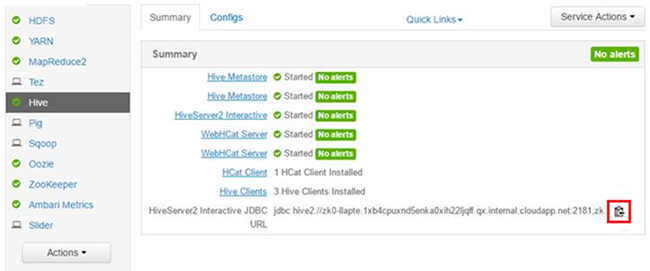

<properties
    pageTitle="Utiliser Hive interactif dans HDInsight | Microsoft Azure"
    description="Découvrez comment utiliser Interactive ruche (Hive sur LLAP) dans HDInsight."
    keywords=""
    services="hdinsight"
    documentationCenter=""
    tags="azure-portal"
    authors="mumian" 
    manager="jhubbard"
    editor="cgronlun"/>

<tags
    ms.service="hdinsight"
    ms.workload="big-data"
    ms.tgt_pltfrm="na"
    ms.devlang="na"
    ms.topic="article"
    ms.date="10/27/2016"
    ms.author="jgao"/>

# Utiliser Hive interactif dans HDInsight (Preview)

Interactif ruche (également appelé [Live Long et processus]( https://cwiki.apache.org/confluence/display/Hive/LLAP)) est un nouveau [type de cluster]( hdinsight-hadoop-provision-linux-clusters.md#cluster-types)d' HDInsight.  Hive interactif permet en mémoire cache qui rend les requêtes Hive beaucoup plus interactifs et plus rapide. Cette nouvelle fonctionnalité effectue une HDInsight de la planète plus performantes, flexible et ouvrir une solution Big Data sur le nuage en mémoire met en cache (à l’aide de Hive et explosion) et avancé analytique via l’intégration approfondie avec les Services R. 

Le cluster ruche interactif est différent du cluster Hadoop. Il ne contient que le service Hive. 

> [AZURE.NOTE] MapReduce cochon, Sqoop, Oozie et autres services sont été supprimés de ce type de cluster plus rapidement.
Le service Hive dans le cluster ruche interactifs n’est accessible via la vue Ambari Hive, Beeline et ruche ODBC. Il ne sont pas accessibles via la console Hive, Templeton, Azure infrastructure du langage commun et Azure PowerShell. 

 

## Créer un cluster ruche interactifs

Interactif Hive cluster est uniquement pris en charge sur les clusters basés sur Linux. Pour plus d’informations sur la création de clusters HDInsight, voir [Hadoop basé sur Linux créer des groupes dans un HDInsight](hdinsight-hadoop-provision-linux-clusters.md).

## Exécuter Hive à partir de Hive interactif

Il existe différentes options comment vous pouvez exécuter des requêtes Hive :

- Exécuter Hive à l’aide de l’affichage Ambari Hive

    Pour plus d’informations sur l’utilisation de la vue ruche, voir [utiliser l’affichage ruche avec Hadoop dans HDInsight]( hdinsight-hadoop-use-hive-ambari-view.md).

- Exécuter Hive à l’aide de Beeline

    Pour plus d’informations sur l’utilisation de Beeline sur HDInsight, voir [Utiliser la ruche avec Hadoop dans HDInsight avec Beeline](hdinsight-hadoop-use-hive-beeline.md).

    Vous utilisez Beeline à partir de la headnode ou un nœud vide.  À l’aide de Beeline à partir d’un nœud bord vide est recommandé.  Pour plus d’informations sur la création d’un cluster HDInsight avec un edgenode vide, voir [utiliser des nœuds de bord vide dans HDInsight](hdinsight-apps-use-edge-node.md).

- Exécuter Hive à l’aide de la ruche ODBC

    Pour plus d’informations sur l’utilisation de la ruche ODBC, voir [Connecter Excel à Hadoop avec le pilote ODBC ruche Microsoft](hdinsight-connect-excel-hive-odbc-driver.md).

**Pour trouver la chaîne de connexion JDBC :**

1.  Ouvrez une session sur Ambari à l’aide de l’URL suivante : https://<ClusterName>. AzureHDInsight.net.
2.  Dans le menu de gauche, cliquez sur **la ruche** .
3.  Cliquez sur l’icône en surbrillance pour copier l’URL :

    

## Voir aussi
-   [Hadoop basé sur Linux créer des groupes dans un HDInsight](hdinsight-hadoop-provision-linux-clusters.md): Découvrez comment créer des clusters ruche interactif dans HDInsight.
-   [Utiliser la ruche avec Hadoop dans HDInsight avec Beeline](hdinsight-hadoop-use-hive-beeline.md): Découvrez comment utiliser Beeline à soumettre des requêtes Hive.
-   [Connecter Excel à Hadoop avec le pilote ODBC ruche Microsoft](hdinsight-connect-excel-hive-odbc-driver.md): Découvrez comment connecter Excel à Hive.
