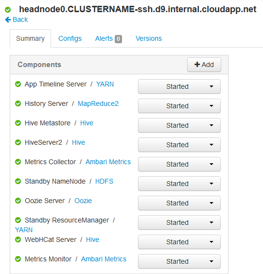

<properties
    pageTitle="Fonctionnalités haute disponibilité du basé sur Linux HDInsight (Hadoop) | Microsoft Azure"
    description="Découvrez comment basé sur Linux HDInsight clusters améliorent la fiabilité et la disponibilité à l’aide d’un nœud de tête supplémentaire. Vous allez apprendre leur impact sur la Hadoop services tels que Ambari et Hive, ainsi que de manière à vous connecter individuellement à chaque nœud de tête à l’aide de SSH."
    services="hdinsight"
    editor="cgronlun"
    manager="jhubbard"
    authors="Blackmist"
    documentationCenter=""
    tags="azure-portal"/>

<tags
    ms.service="hdinsight"
    ms.workload="big-data"
    ms.tgt_pltfrm="na"
    ms.devlang="multiple"
    ms.topic="article"
    ms.date="09/13/2016"
    ms.author="larryfr"/>

#Disponibilité et la fiabilité des groupes Hadoop dans un HDInsight

Hadoop garantit la disponibilité et la fiabilité en distribuer des copies redondantes des services et des données sur les nœuds dans un cluster. Toutefois répartitions standards de Hadoop ont généralement qu’un seul nœud de tête. Toute coupure de courant du nœud principal unique peut entraîner l’arrêt du fonctionnement du cluster.

Pour résoudre ce problème potentiel, basé sur Linux HDInsight clusters sur Azure fournissent deux nœuds têtes pour augmenter la disponibilité et la fiabilité des services Hadoop et des tâches en cours d’exécution.

> [AZURE.NOTE] Les étapes à suivre dans ce document sont spécifiques aux clusters HDInsight basé sur Linux. Si vous utilisez un cluster Windows, voir [la disponibilité et la fiabilité des groupes Hadoop fonctionnant sous Windows dans un HDInsight](hdinsight-high-availability.md) pour des informations spécifiques à Windows.

##Comprendre les nœuds

Nœuds dans un cluster HDInsight sont implémentées à l’aide de Machines virtuelles Azure. Dans le cas où un nœud échoue, il est considérée en mode hors connexion et un nouveau nœud est créé pour remplacer le nœud a échoué. Tandis que le nœud est en mode hors connexion, un autre nœud du même type est utilisé jusqu'à ce que le nouveau nœud est mis en ligne.

> [AZURE.NOTE] Si le nœud est l’analyse des données en cas d’échec, sa progression de la tâche est perdue. La tâche que le nœud défectueux travaillait sur sera à nouveau soumise à un autre nœud.

Les sections suivantes décrivent les types de nœud individuel utilisés avec HDInsight. Pas tous les types de nœud sont utilisés pour un type de cluster. Par exemple, un type de cluster Hadoop n’ont pas tous les nœuds Nimbus. Pour plus d’informations sur les nœuds utilisé par les types de cluster HDInsight, voir la section types de Cluster de [Hadoop basé sur Linux créer des groupes dans un HDInsight](hdinsight-hadoop-provision-linux-clusters.md#cluster-types).

###Nœuds de tête

Certaines mises en œuvre de Hadoop ont un nœud de tête unique qui héberge les services et composants qui gèrent l’échec des nœuds de travail de bonnes conditions. Mais les interruptions de services maîtres s’exécutant sur le nœud de tête entraînerait le cluster cessent de fonctionner.

HDInsight clusters offrent un nœud de tête secondaire, qui permet de services maîtres et les composants de continuer à s’exécuter sur le nœud secondaire en cas de panne sur le serveur principal.

> [AZURE.IMPORTANT] Les deux nœuds têtes sont actifs et en cours d’exécution au sein du cluster simultanément. Certains services, tels que HADOOP ou fils, sont uniquement « actifs » sur un nœud de tête à tout donnée moment (et secours sur le nœud de tête). D’autres services tels que HiveServer2 ou MetaStore ruche sont actifs sur les deux nœuds têtes en même temps.

Nœuds de tête (et autres nœuds dans HDInsight,) a une valeur numérique dans le cadre du nom d’hôte du nœud. Par exemple, `hn0-CLUSTERNAME` ou `hn4-CLUSTERNAME`. 

> [AZURE.IMPORTANT] Ne pas associer la valeur numérique avec fait qu’un nœud soit principal ou secondaire ; la valeur numérique est uniquement présente afin de fournir un nom unique pour chaque nœud.

###Nœuds Nimbus

Pour les clusters vague, les nœuds Nimbus fournissent une fonctionnalité similaire à la Hadoop JobTracker par distribution et de traitement de surveillance sur les nœuds de travail. HDInsight fournit 2 nœuds Nimbus pour le type de cluster vague.

###Nœuds soigneur

Nœuds [soigneur](http://zookeeper.apache.org/ ) (ZKs) sont utilisés pour des élections de points de suite des services maîtres sur des nœuds de tête et pour vous assurer que les services, les nœuds de données (collaborateur) et les passerelles savent quel nœud principal est actif sur un service maître. Par défaut, HDInsight fournit 3 nœuds soigneur.

###Nœuds de travail

Nœuds de travail effectue l’analyse de données réelles lorsqu’une tâche est soumise pour le cluster. Si un nœud de travail échoue, la tâche à laquelle il a été exécute sera envoyée vers un autre nœud de travail. Par défaut, HDInsight créera 4 nœuds de travail ; Toutefois, vous pouvez modifier ce numéro selon vos besoins pendant la création d’un cluster et après la création d’un cluster.

###Nœud de bord

Un nœud ne participe pas activement analyse des données au sein du cluster, mais sert à la place par les développeurs ou scientifiques de données lorsque vous travaillez avec Hadoop. Le nœud de bord sont situées dans le même réseau virtuel Azure que les autres nœuds dans le cluster et peut accéder directement à tous les autres nœuds. Dans la mesure où il n’est pas impliqué dans l’analyse des données pour le cluster, il peut être utilisé sans tout vous soucier de prendre des ressources en s’éloignant de services Hadoop critiques ou les tâches d’analyse.

Pour l’instant, R serveur HDInsight est le seul type de cluster fournissant un nœud de bord par défaut. Pour serveur R sur HDInsight, le nœud de bord est utilisé code test R localement sur le nœud avant de la soumettre pour le cluster pour traitement distribué.

[Créer un cluster basé sur Linux HDInsight avec teinte sur un nœud de bord](https://azure.microsoft.com/documentation/templates/hdinsight-linux-with-hue-on-edge-node/) est un exemple de modèle qui peut être utilisée pour créer un type de cluster Hadoop qui a un nœud de bord.

## Accéder à des nœuds

Accès au cluster via internet est fourni via une passerelle publique et est limité à la connexion aux nœuds de tête et (si un serveur R sur cluster HDInsight,) le nœud de bord. Accès aux services en cours d’exécution sur les nœuds de tête n’est pas impacté par avoir plusieurs nœuds de tête, comme la passerelle publique qui route les requêtes vers le nœud de tête qui héberge le service demandé. Par exemple, si Ambari est actuellement hébergé sur le nœud de tête secondaire, la passerelle achemine des demandes entrantes pour Ambari vers ce nœud.

Lorsque vous accédez au cluster en utilisant SSH, connexion via le port 22 (la valeur par défaut, les événementsSSH) doit se connecter le nœud de tête principal ; connexion via le port 23 se connecte au nœud de tête secondaire. Par exemple, `ssh username@mycluster-ssh.azurehdinsight.net` le nœud de tête principal du cluster nommé __mon_cluster__doit se connecter.

> [AZURE.NOTE] Cela s’applique également aux protocoles basés sur SSH, tels que le SSH SFTP File Transfer Protocol ().

Le nœud de bord fourni avec serveur R sur HDInsight clusters est également directement accessibles à l’aide de SSH via le port 22. Par exemple, `ssh username@RServer.mycluster.ssh.azurehdinsight.net` vous connecterez le nœud de bord pour un serveur R sur cluster HDInsight nommé __mon_cluster__. 

### Noms interne de domaine complet (FQDN)

Nœuds dans un cluster HDInsight possèdent un adresse IP interne et un nom de domaine complet qui sont accessibles à partir du cluster (par exemple, une session SSH pour le nœud de tête ou d’une tâche en cours d’exécution sur le cluster.) Lorsque vous accédez aux services sur le cluster à l’aide de l’adresse IP ou le nom de domaine complet interne, vous devez utiliser Ambari pour vérifier l’IP ou le nom de domaine complet à utiliser lors de l’accès au service.

Par exemple, le service de Oozie peut s’exécuter uniquement sur un nœud de tête et à l’aide de la `oozie` commande à partir d’une session SSH exige l’URL du service. Il peut être récupéré à partir de Ambari à l’aide de la commande suivante :

    curl -u admin:PASSWORD "https://CLUSTERNAME.azurehdinsight.net/api/v1/clusters/CLUSTERNAME/configurations?type=oozie-site&tag=TOPOLOGY_RESOLVED" | grep oozie.base.url

Cela renverra une valeur semblable à ce qui suit, qui contient l’URL interne à utiliser avec la `oozie` commande :

    "oozie.base.url": "http://hn0-CLUSTERNAME-randomcharacters.cx.internal.cloudapp.net:11000/oozie"

### Accéder à d’autres types de nœuds

Vous pouvez vous connecter à des nœuds qui ne sont pas directement accessibles via internet à l’aide des méthodes suivantes.

* __SSH__: une fois connecté à un nœud de tête à l’aide de SSH, vous pouvez ensuite utiliser SSH du nœud de tête pour vous connecter à d’autres nœuds dans le cluster.
* __SSH Tunnel__: Si vous devez accéder à un service web hébergé sur l’un des nœuds qui n’est pas visible sur internet, vous devez [utiliser un tunnel SSH](hdinsight-linux-ambari-ssh-tunnel.md).
* __Réseau virtuel Azure__: Si votre cluster HDInsight fait partie d’un réseau virtuel Azure, toutes les ressources sur le même réseau virtuel peuvent accéder directement à tous les nœuds du cluster.

## Comment faire pour vérifier dans un état du service

L’interface utilisateur Web Ambari ou l’API REST Ambari peut servir à vérifier l’état des services qui s’exécutent sur les nœuds de tête.

###Interface utilisateur Ambari Web

L’interface utilisateur Web Ambari peut être affiché en https://CLUSTERNAME.azurehdinsight.net. Remplacez **NOMDUCLUSTER** par le nom de votre cluster. Si vous y êtes invité, entrez les informations d’identification utilisateur HTTP pour votre cluster. Le nom d’utilisateur HTTP par défaut est **admin** et le mot de passe est le mot de passe que vous avez entré lors de la création du cluster.

Lorsque vous arrivez dans la page Ambari, les services installés apparaît à gauche de la page.

Il existe une série d’icônes qui s’affichent en regard d’un service pour indiquer l’état. Toutes les alertes liées à un service peuvent être affichés en utilisant le lien **alertes** dans la partie supérieure de la page. Vous pouvez sélectionner chaque service pour afficher plus d’informations sur celui-ci.

Alors que la page service fournit des informations sur l’état et la configuration de chaque service, il ne fournit pas d’informations sur le nœud de tête le service s’exécute sur. Pour afficher ces informations, cliquez sur le lien **hôtes** en haut de la page. Hôtes du cluster, y compris les nœuds têtes s’affiche.

Activer le lien pour un des nœuds têtes permet d’afficher les services et les composants qui s’exécutent sur ce nœud.

###API REST Ambari

L’API REST Ambari est disponible via internet, et la passerelle publique gère les demandes routage du nœud de tête qui héberge l’API REST.

Vous pouvez utiliser la commande suivante pour vérifier l’état d’un service à l’API REST Ambari :

    curl -u admin:PASSWORD https://CLUSTERNAME.azurehdinsight.net/api/v1/clusters/CLUSTERNAME/services/SERVICENAME?fields=ServiceInfo/state

* Remplacez le **mot de passe** par l’utilisateur HTTP (administrateur), mot de passe de compte

* Remplacez **NOMDUCLUSTER** par le nom du cluster

* Remplacez **ServiceName%** par le nom du service pour vérifier l’état de

Par exemple, pour vérifier l’état du service **HADOOP** sur un cluster nommé **mon_cluster**, avec un mot de **passe**, utilisez ce qui suit :

    curl -u admin:password https://mycluster.azurehdinsight.net/api/v1/clusters/mycluster/services/HDFS?fields=ServiceInfo/state

La réponse sera semblable à ce qui suit :

    {
      "href" : "http://hn0-CLUSTERNAME.randomcharacters.cx.internal.cloudapp.net:8080/api/v1/clusters/mycluster/services/HDFS?fields=ServiceInfo/state",
      "ServiceInfo" : {
        "cluster_name" : "mycluster",
        "service_name" : "HDFS",
        "state" : "STARTED"
      }
    }

L’URL indique que le service est en cours d’exécution sur un nœud de tête nommé __Hn0 NOMDUCLUSTER__;

L’état indique si nous le service en cours d’exécution, ou **mise en route**.

Si vous ne connaissez pas quels services sont installés sur le cluster, vous pouvez utiliser ce qui suit pour récupérer une liste :

    curl -u admin:PASSWORD https://CLUSTERNAME.azurehdinsight.net/api/v1/clusters/CLUSTERNAME/services

####Composants de service

Services peuvent inclure des composants que vous souhaitez vérifier l’état d’individuellement. Par exemple, HDFS contient le composant NameNode. Pour afficher des informations sur un composant, la commande serait le suivant :

    curl -u admin:PASSWORD https://CLUSTERNAME.azurehdinsight.net/api/v1/clusters/CLUSTERNAME/services/SERVICE/components/component

Si vous ne connaissez pas quels composants sont fournis par un service, vous pouvez utiliser ce qui suit pour récupérer une liste :

    curl -u admin:PASSWORD https://CLUSTERNAME.azurehdinsight.net/api/v1/clusters/CLUSTERNAME/services/SERVICE/components/component
    
## Comment accéder aux fichiers journaux sur les nœuds de tête

###SSH

Lorsque vous êtes connecté à un nœud de tête via SSH, vous trouverez les fichiers journaux sous **var**. Par exemple, **/var/log/hadoop-yarn/yarn** contiennent des journaux pour fils.

Chaque nœud de tête peut avoir des entrées de journal unique, afin que vous devez vérifier les journaux sur les deux.

###SFTP

Vous pouvez également vous connecter au nœud principal à l’aide du SSH File Transfer Protocol ou Secure SFTP File Transfer Protocol () et télécharger les fichiers journaux directement.

Identique à l’aide d’un clientSSH, lors de la connexion au cluster, vous devez fournir le nom du compte utilisateur SSH et l’adresse SSH du cluster. Par exemple, `sftp username@mycluster-ssh.azurehdinsight.net`. Vous devez également fournir le mot de passe du compte lorsque vous y êtes invité, ou fournir une clé publique à l’aide du `-i` paramètre.

Une fois connecté, vous voyez un `sftp>` invite de commandes. À partir de cette invite, vous pouvez modifier les répertoires, télécharger des fichiers. Par exemple, les commandes suivantes accédez au répertoire **/var/log/hadoop/hdfs** et téléchargement tous les fichiers dans le répertoire.

    cd /var/log/hadoop/hdfs
    get *

Pour obtenir la liste des commandes disponibles, entrez `help` à la `sftp>` invite de commandes.

> [AZURE.NOTE] Il existe également des interfaces graphiques qui vous permettent de visualiser le système de fichiers lorsque connecté à l’aide de SFTP. Par exemple, [MobaXTerm](http://mobaxterm.mobatek.net/) permet de parcourir le système de fichiers à l’aide d’une interface similaire à l’Explorateur Windows.

###Ambari

> [AZURE.NOTE] L’accès à des fichiers journaux via Ambari nécessite un tunnel SSH, comme les sites web pour les services individuels ne sont pas exposées publiquement sur Internet. Pour plus d’informations sur l’utilisation d’un tunnel SSH, voir [Utiliser SSH tunnel pour accéder à l’interface utilisateur Ambari web, ResourceManager, JobHistory, NameNode, Oozie et autres web l’interface utilisateur](hdinsight-linux-ambari-ssh-tunnel.md).

À partir de l’interface utilisateur de Web Ambari, sélectionnez le service que vous souhaitez afficher les journaux des (par exemple, fils) et ensuite utiliser **Des liens rapides** pour sélectionner le nœud de tête à afficher les journaux.

## Comment configurer la taille du nœud ##

La taille de l’un nœud ne peut être sélectionné lors de la création de cluster. Vous pouvez rechercher une liste des différentes tailles machine virtuelle disponibles pour HDInsight, y compris les principales, mémoire et stockage local pour chacun, dans la [page tarification HDInsight](https://azure.microsoft.com/pricing/details/hdinsight/).

Lorsque vous créez un nouveau cluster, vous pouvez spécifier la taille des nœuds. Les éléments suivants fournissent des informations sur la spécification de la taille de l’aide du [Portail Azure][preview-portal], [Azure PowerShell][azure-powershell]et l' [Infrastructure du langage commun Azure][azure-cli]:

* **Portail Azure**: lorsque vous créez un nouveau cluster, vous disposez de la possibilité de définir la taille (tarification niveau,) de la tête, collaborateur et (si utilisé par le type de cluster) nœuds soigneur pour le cluster :

    

* **Azure infrastructure du langage commun**: lorsque vous utilisez la `azure hdinsight cluster create` de commande, vous pouvez définir la taille de la tête, collaborateur et nœuds soigneur à l’aide de la `--headNodeSize`, `--workerNodeSize`, et `--zookeeperNodeSize` paramètres.

* **Azure PowerShell**: lorsque vous utilisez la `New-AzureRmHDInsightCluster` applet de commande, vous pouvez définir la taille de la tête, collaborateur et nœuds soigneur à l’aide de la `-HeadNodeVMSize`, `-WorkerNodeSize`, et `-ZookeeperNodeSize` paramètres.

##Étapes suivantes

Dans ce document, vous avez appris comment Azure HDInsight prévoit disponibilité Hadoop. Utilisez ce qui suit pour en savoir plus sur les éléments mentionnés dans ce document.

- [Ambari reste référence](https://github.com/apache/ambari/blob/trunk/ambari-server/docs/api/v1/index.md)

- [Installer et configurer l’infrastructure du langage commun Azure](../xplat-cli-install.md)

- [Installer et configurer PowerShell Azure](../powershell-install-configure.md)

- [Gérer les HDInsight à l’aide de Ambari](hdinsight-hadoop-manage-ambari.md)

- [Mise en service de clusters basés sur Linux HDInsight](hdinsight-hadoop-provision-linux-clusters.md)

[preview-portal]: https://portal.azure.com/
[azure-powershell]: ../powershell-install-configure.md
[azure-cli]: ../xplat-cli-install.md
