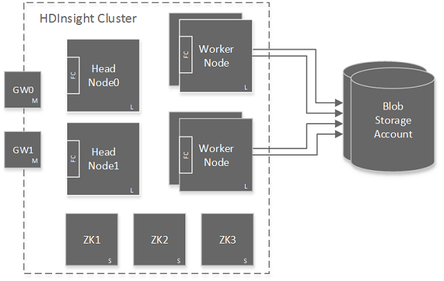

<properties
    pageTitle="Disponibilité des Hadoop clusters dans HDInsight | Microsoft Azure"
    description="HDInsight déploie clusters hautement disponibles et fiables avec un nœud de tête supplémentaire."
    services="hdinsight"
    tags="azure-portal"
    editor="cgronlun"
    manager="jhubbard"
    authors="mumian"
    documentationCenter=""/>

<tags
    ms.service="hdinsight"
    ms.workload="big-data"
    ms.tgt_pltfrm="na"
    ms.devlang="multiple"
    ms.topic="article"
    ms.date="10/21/2016"
    ms.author="jgao"/>

#Disponibilité et la fiabilité des groupes Hadoop fonctionnant sous Windows dans un HDInsight

>[AZURE.NOTE] Les étapes à suivre dans ce document sont spécifiques aux clusters HDInsight fonctionnant sous Windows. Si vous utilisez un cluster Linux, voir [la disponibilité et la fiabilité des groupes Hadoop basé sur Linux dans un HDInsight](hdinsight-high-availability-linux.md) pour des informations spécifiques à Linux.

HDInsight permet aux clients de déployer une variété de types de cluster, pour les charges de travail différentes données analytique. Types de cluster proposées aujourd'hui sont des groupes de Hadoop pour la requête et charges de travail analyse, clusters HBase pour charges de travail NoSQL et clusters vague pour charges de travail de traitement de l’événement en temps réel. Au sein d’un type de cluster donné, il existe des rôles différents pour les nœuds différents. Par exemple :

- Le déploiement des clusters Hadoop pour HDInsight avec deux rôles :
    - Serveur de nœud (2 nœuds)
    - Données nœud (au moins 1)

- Le déploiement des clusters HBase pour HDInsight avec trois rôles :
    - Serveurs de tête (2 nœuds)
    - Serveurs de la région (au moins 1 nœud)
    - Nœuds de masque/soigneur (3 nœuds)

- Le déploiement des clusters vague pour HDInsight avec trois rôles :
    - Nœuds Nimbus (2 nœuds)
    - Serveurs responsable (au moins 1 nœud)
    - Nœuds soigneur (3 nœuds)

Mises en œuvre standard de clusters Hadoop ont généralement un seul nœud de tête. HDInsight supprime ce point unique de panne grâce à l’ajout d’un nœud de tête secondaire /head nœud serveur/Nimbus pour augmenter la disponibilité et la fiabilité du service nécessaire pour gérer les charges de travail. Ces nœuds de serveurs/Nimbus tête nœuds/tête sont conçus pour gérer l’échec des nœuds de travail de bonnes conditions, mais les interruptions de services maîtres s’exécutant sur le nœud de tête entraînerait le cluster cessent de fonctionner.

Nœuds [soigneur](http://zookeeper.apache.org/ ) (ZKs) ont été ajoutés et sont utilisées pour élections points de suite des nœuds de tête et pour vous assurer que ce travail passerelles (GWs) et les nœuds savent quand basculer vers le nœud de tête secondaire (tête nœud 1) lorsque le nœud de tête actif (tête Node0) devienne inactif.

## Vérifier l’état du service nœud de tête active
Pour déterminer quel nœud principal est actif et vérifier l’état des services en cours d’exécution sur ce nœud de tête, vous devez vous connecter au cluster Hadoop à l’aide du protocole RDP (Remote Desktop). Pour les instructions RDP, voir [Hadoop gérer les groupes dans un HDInsight à l’aide du portail Azure](hdinsight-administer-use-management-portal.md#connect-to-hdinsight-clusters-by-using-rdp). Une fois que vous êtes connecté au cluster, double-cliquez sur l’icône **Hadoop Service disponible** située sur le bureau pour obtenir l’état sur le nœud de tête le Namenode, services Jobtracker, Templeton, Oozieservice, Metastore et Hiveserver2 sont en cours d’exécution, ou pour les services 3.0 HDI, Namenode, le Gestionnaire de ressources, serveur de l’historique, Templeton, Oozieservice, Metastore et Hiveserver2.

Sur la capture d’écran, le nœud de tête actif est *headnode0*.

## Fichiers journaux d’accès sur le nœud de tête secondaire

Pour accéder à travail journaux sur le nœud de tête secondaire dans le cas où il est devenu le nœud de tête actif, parcourir le JobTracker UI continue de fonctionner comme nous le faisons pour le nœud actif principal. Pour accéder à JobTracker, vous devez vous connecter au cluster Hadoop à l’aide de RDP comme décrit dans la section précédente. Une fois que vous avez distants dans le cluster, double-cliquez sur l’icône **d’État des nœuds Hadoop nom** située sur le bureau, puis sur les **journaux NameNode** pour accéder à l’annuaire de journaux sur le nœud de tête secondaire.

## Configurer la taille du nœud de tête
Les nœuds de tête ont été affectées en machines virtuelles volumineux (machines virtuelles) par défaut. Cette taille est adaptée à la gestion de la plupart des travaux Hadoop exécutés sur le cluster. Mais il existe des scénarios qui peuvent nécessiter des machines virtuelles non-prise pour les nœuds de tête. Par exemple, lorsque le cluster doit gérer un grand nombre de petites tâches Oozie.

Machines virtuelles non-prise peuvent être configurés à l’aide des applets de commande PowerShell Azure ou le SDK HDInsight.

La création et la mise en service d’un cluster à l’aide de PowerShell Azure présentées dans [administrer HDInsight à l’aide de PowerShell](hdinsight-administer-use-powershell.md). La configuration d’un nœud de tête non-prise nécessite l’ajout de la `-HeadNodeVMSize ExtraLarge` paramètre à la `New-AzureRmHDInsightcluster` applet de commande utilisée dans ce code.

    # Create a new HDInsight cluster in Azure PowerShell
    # Configured with an ExtraLarge head-node VM
    New-AzureRmHDInsightCluster `
                -ResourceGroupName $resourceGroupName `
                -ClusterName $clusterName ` 
                -Location $location `
                -HeadNodeVMSize ExtraLarge `
                -DefaultStorageAccountName "$storageAccountName.blob.core.windows.net" `
                -DefaultStorageAccountKey $storageAccountKey `
                -DefaultStorageContainerName $containerName  `
                -ClusterSizeInNodes $clusterNodes

Pour le Kit de développement, le scénario est similaire. La création et la mise en service d’un cluster à l’aide du Kit de développement présentées dans le [Kit de développement .NET HDInsight à l’aide](hdinsight-provision-clusters.md#sdk). La configuration d’un nœud de tête non-prise nécessite l’ajout de la `HeadNodeSize = NodeVMSize.ExtraLarge` paramètre à la `ClusterCreateParameters()` méthode utilisée dans ce code.

    # Create a new HDInsight cluster with the HDInsight SDK
    # Configured with an ExtraLarge head-node VM
    ClusterCreateParameters clusterInfo = new ClusterCreateParameters()
    {
        Name = clustername,
        Location = location,
        HeadNodeSize = NodeVMSize.ExtraLarge,
        DefaultStorageAccountName = storageaccountname,
        DefaultStorageAccountKey = storageaccountkey,
        DefaultStorageContainer = containername,
        UserName = username,
        Password = password,
        ClusterSizeInNodes = clustersize
    };

## Étapes suivantes

- [Apache soigneur](http://zookeeper.apache.org/ )
- [Se connecter à clusters HDInsight à l’aide de RDP](hdinsight-administer-use-management-portal.md#rdp)
- [À l’aide du Kit de développement .NET HDInsight](hdinsight-provision-clusters.md#sdk)
