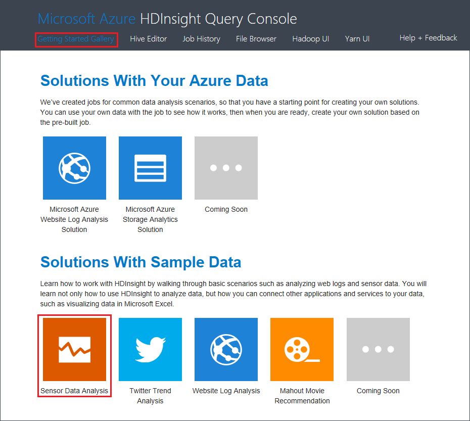

<properties
    pageTitle="Analyser des données de capteur avec Hive et Hadoop | Microsoft Azure"
    description="Apprenez à analyser des données de capteur à l’aide de la Console de requête ruche avec HDInsight (Hadoop), puis visualiser les données dans Microsoft Excel avec Power View."
    services="hdinsight"
    documentationCenter=""
    authors="Blackmist"
    manager="jhubbard"
    editor="cgronlun"
    tags="azure-portal"/>

<tags
    ms.service="hdinsight"
    ms.workload="big-data"
    ms.tgt_pltfrm="na"
    ms.devlang="na"
    ms.topic="article"
    ms.date="09/20/2016" 
    ms.author="larryfr"/>

#Analyser des données de capteur à l’aide de la Console de requête ruche sur Hadoop dans HDInsight

Apprenez à analyser des données de capteur à l’aide de la Console de requête ruche avec HDInsight (Hadoop), puis visualiser les données dans Microsoft Excel à l’aide de Power View.

> [AZURE.NOTE] Les étapes décrites dans ce document fonctionnent uniquement avec les clusters HDInsight fonctionnant sous Windows.

Dans cet exemple, vous allez utiliser Hive pour traiter les données historiques obtenues par chauffage, ventilation et les systèmes de conditionnement d’air (HVAC) pour identifier les systèmes qui ne sont pas en mesure de fiable maintenir une température de jeu. Vous allez apprendre comment :

- Créer des tables HIVE pour consulter les données stockées dans des fichiers CSV (valeurs) séparées par des virgules.
- Créer des requêtes HIVE pour analyser les données.
- Utiliser Microsoft Excel pour vous connecter à HDInsight (à l’aide de connectivité de base de données ouverte (ODBC) pour extraire les données analysées.
- Utilisez Power View pour visualiser les données.

##Conditions préalables

* Un cluster HDInsight (Hadoop) : voir [groupes de mise en service Hadoop dans HDInsight](hdinsight-provision-clusters.md) pour plus d’informations sur la création d’un cluster.

* Microsoft Excel 2013

    > [AZURE.NOTE] Microsoft Excel est utilisé pour la visualisation des données avec [Power View](https://support.office.com/Article/Power-View-Explore-visualize-and-present-your-data-98268d31-97e2-42aa-a52b-a68cf460472e?ui=en-US&rs=en-US&ad=US).

* [Pilote ODBC Hive Microsoft](http://www.microsoft.com/download/details.aspx?id=40886)

##Pour exécuter l’exemple

1. Dans votre navigateur web, accédez à l’URL suivante. Remplacer `<clustername>` avec le nom de votre cluster HDInsight.

        https://<clustername>.azurehdinsight.net

    Lorsque vous y êtes invité, s’authentifier en utilisant le nom d’utilisateur administrateur et le mot de passe utilisé lors de la configuration de ce groupe.

2. Dans la page web qui s’ouvre, cliquez sur l’onglet **Prise en main galerie** et puis, sous la catégorie **Solutions avec des exemples de données** , cliquez sur l’échantillon **Capteur analyse des données** .

    

3. Suivez les instructions fournies dans la page web pour terminer l’échantillon.
