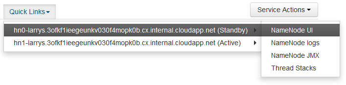

<properties
pageTitle="Utiliser SSH tunnel pour accéder à l’interface utilisateur Ambari web, ResourceManager, JobHistory, NameNode, Oozie et autres web interface utilisateur"
description="Découvrez comment utiliser un tunnel SSH pour naviguer en toute sécurité ressources web hébergés sur votre nœuds HDInsight basé sur Linux."
services="hdinsight"
documentationCenter=""
authors="Blackmist"
manager="jhubbard"
editor="cgronlun"/>

<tags
ms.service="hdinsight"
ms.devlang="na"
ms.topic="article"
ms.tgt_pltfrm="na"
ms.workload="big-data"
ms.date="10/17/2016"
ms.author="larryfr"/>

# Utiliser SSH tunnel pour accéder à l’interface utilisateur Ambari web, JobHistory, NameNode, Oozie et autres web interface utilisateur

Basé sur Linux HDInsight clusters fournissent un accès à l’interface utilisateur Ambari web sur Internet, mais certaines fonctionnalités de l’interface utilisateur ne sont pas. Par exemple, l’interface utilisateur web pour d’autres services exposé par le biais Ambari. Pour toutes les fonctionnalités de l’interface utilisateur de Ambari web, vous devez utiliser un tunnel SSH vers le début de cluster.

## Ce que nécessite un tunnel SSH ?

Plusieurs menus de Ambari pas entièrement remplit sans un tunnel SSH, qu’ils s’appuient sur les sites web et services exposés par d’autres services Hadoop s’exécutant sur le cluster. Souvent, ces sites web ne sont pas sécurisés, afin qu’il n’est pas sûr de les exposer directement sur internet. Parfois, le service exécute le site web sur un autre nœud de cluster tel qu’un nœud soigneur.

Services web Ambari l’interface utilisateur utilise, qui ne sont pas accessibles sans un tunnel SSH sont les suivantes :

* JobHistory,
* NameNode,
* Piles de thread
* Interface utilisateur Oozie web
* Interface utilisateur HBase masque et des journaux

Si vous utilisez des Actions de Script pour personnaliser votre cluster, tous les services ou utilitaires que vous installez qui exposent une interface utilisateur web nécessite un tunnel SSH. Par exemple, si vous installez teinte à l’aide d’une Action de Script, vous devez utiliser un tunnel SSH pour accéder au web teinte l’interface utilisateur.

## Qu’est un tunnel SSH ?

[SSH (Secure Shell) tunnel](https://en.wikipedia.org/wiki/Tunneling_protocol#Secure_Shell_tunneling) achemine le trafic envoyé à un port sur votre ordinateur local, via une connexion SSH à votre nœud de tête cluster HDInsight, où la demande est alors résolue comme si elle a été créée sur le nœud principal. La réponse est alors acheminée par le biais du tunnel sur votre poste de travail.

## Conditions préalables

Lorsque vous utilisez un tunnel SSH pour le trafic web, vous devez disposer des éléments suivants :

* Un clientSSH. Pour la distribution Linux et Unix ou Macintosh OS X, la `ssh` commande est fournie avec le système d’exploitation. Pour Windows, nous vous recommandons de [PuTTY](http://www.chiark.greenend.org.uk/~sgtatham/putty/download.html)

    > [AZURE.NOTE] Si vous souhaitez utiliser un clientSSH autre que `ssh` ou PuTTY, consultez la documentation de votre client comment établir un tunnel SSH.

* Un navigateur web qui peut être configuré pour utiliser un proxy SOCKS

## Créer un tunnel à l’aide de la commande SSH

Utiliser la commande suivante pour créer un SSH tunnel à l’aide de la `ssh` commande. Remplacez le __nom d’utilisateur__ avec un utilisateur SSH pour votre cluster HDInsight et __NOMDUCLUSTER__ par le nom de votre cluster HDInsight

    ssh -C2qTnNf -D 9876 USERNAME@CLUSTERNAME-ssh.azurehdinsight.net

Cela crée une connexion qui achemine le trafic au port local 9876 pour le cluster sur SSH. Les options sont :

* **D 9876** - le port local qui achemine le trafic via le tunnel.

* **C** - compresser toutes les données, le trafic web étant principalement du texte.

* **2** - forcer SSH à essayer la version 2 du protocole.

* **q** : mode silencieux.

* **T** - allocation de pseudo tty désactiver, étant donné que nous sommes simplement transfert d’un port.

* **n** - empêcher la lecture de STDIN, étant donné que nous sommes simplement transfert d’un port.

* **N** - ne s’exécutent pas une commande à distance, étant donné que nous sommes simplement transfert d’un port.

* **f** - exécuter en arrière-plan.

Si vous avez configuré le cluster avec un code SSH, vous devrez utiliser la `-i` paramètre et spécifiez le chemin d’accès à la clé privée SSH.

Une fois la commande terminée, le trafic envoyé à port 9876 sur l’ordinateur local doivent être routées sur couche SSL (Secure Sockets) pour le cluster nœud de tête et semblent provenir il.

## Créer un tunnel à l’aide de PuTTY

Procédez comme suit pour créer un tunnel SSH à l’aide de PuTTY.

1. Ouvrez PuTTY et entrez vos informations de connexion. Si vous n’êtes pas familiarisé avec PuTTY, voir [Utiliser SSH avec basé sur Linux Hadoop sur HDInsight à partir de Windows](hdinsight-hadoop-linux-use-ssh-windows.md) pour plus d’informations sur l’utilisation avec HDInsight.

2. Dans la section **catégorie** à gauche de la boîte de dialogue, développez **connexion**, développez **SSH**et puis sélectionnez **tunnel**.

3. Dans l’écran **Options de contrôle de transfert de port SSH** , fournissent les informations suivantes :

    * **Port source** : le port sur le client que vous souhaitez transférer. Par exemple, **9876**.

    * Adresse de **destination** - le SSH pour le cluster HDInsight basé sur Linux. Par exemple, **mon_cluster ssh.azurehdinsight.net**.

    * **Dynamique** - routage du proxy SOCKS dynamique vous permettent de conserver.

    

4. Cliquez sur **Ajouter** pour ajouter les paramètres, puis cliquez sur **Ouvrir** pour ouvrir une connexion SSH.

5. Lorsque vous y êtes invité, connectez-vous au serveur. Vous établissez une session SSH et activer le tunnel.

## Utiliser le tunnel à partir de votre navigateur

> [AZURE.NOTE] Les étapes décrites dans cette section utilisent le navigateur FireFox, comme c’est librement disponible pour les systèmes Linux, Unix, Macintosh OS X et Windows. D’autres navigateurs modernes qui prennent en charge à l’aide d’un proxy SOCKS fonctionneront également.

1. Configurer le navigateur pour utiliser **localhost:9876** comme un proxy **SOCKS v5** . Voici ce que les paramètres de Firefox se présentent. Si vous avez utilisé un port autre que 9876, modifiez le port à celui que vous avez utilisé :

    

    > [AZURE.NOTE] Sélection de **DNS distant** résoudra demandes de nom de domaine (DNS) à l’aide du cluster HDInsight. Si cela est désactivée, DNS seront résolu localement.

2. Vérifiez que le trafic est routé via le tunnel en vising un site tel [qu’http://www.whatismyip.com/](http://www.whatismyip.com/) avec les paramètres de proxy activé et désactivé dans Firefox. Tandis que les paramètres sont activés, l’adresse IP sera pour un ordinateur dans le centre de données Microsoft Azure.

##Vérifiez auprès de l’interface utilisateur Ambari web

Une fois que le cluster a été établi, utilisez les étapes suivantes pour vérifier que vous pouvez accéder web interfaces utilisateur du service à partir du Ambari Web :

1. Dans votre navigateur, accédez à http://headnodehost:8080. La `headnodehost` adresse seront envoyées via le tunnel au cluster et résoudre vers le headnode Ambari est en cours d’exécution. Lorsque vous y êtes invité, entrez le nom d’utilisateur admin (administrateur) et le mot de passe pour votre cluster. Vous pouvez être invité à une seconde fois par l’interface utilisateur de Ambari web. Si c’est le cas, retaper les informations.
    
    > [AZURE.NOTE] Lorsque vous utilisez l’adresse http://headnodehost:8080 pour vous connecter au cluster, vous vous connectez directement sur le tunnel vers le nœud de tête Ambari s’exécute à l’aide de HTTP et communication est sécurisée à l’aide du tunnel SSH. Lorsque vous vous connectez via internet sans l’aide d’un tunnel, communication est sécurisée à l’aide de HTTPS. Pour vous connecter via internet à l’aide de HTTPS, utilisez https://CLUSTERNAME.azurehdinsight.net, où __CLUSTERNAME__ est le nom du cluster.

2. À partir de l’interface utilisateur de Web Ambari, sélectionnez HADOOP dans la liste à gauche de la page.

    

3. Les informations du service HADOOP qui s’affiche, sélectionnez __Liens rapides__. Une liste des nœuds de tête du cluster s’affichent. Sélectionnez une des nœuds têtes et sélectionnez __L’interface utilisateur NameNode__.

    

    > [AZURE.NOTE] Si vous avez une connexion internet lente, ou le nœud de tête est très occupé, vous pouvez obtenir un indicateur d’attente au lieu d’un menu lorsque vous sélectionnez __Des liens rapides__. Si c’est le cas, attendez une ou deux minutes pour les données à être reçus à partir du serveur, puis essayez à nouveau la liste.
    >
    > Si vous avez un moniteur de résolution inférieur ou fenêtre de votre navigateur n’est pas agrandie, certaines entrées dans le menu de __Liens rapides__ peuvent être coupées par le côté droit de l’écran. Si c’est le cas, développer le menu à l’aide de la souris, puis utilisez la touche flèche droite pour faire défiler l’écran vers la droite pour voir le reste du menu.

4. Une page semblable à celui-ci doit apparaître :

    

    > [AZURE.NOTE] Notez l’URL pour cette page ; Il doit être identique à __http://hn1-CLUSTERNAME.randomcharacters.cx.internal.cloudapp.net:8088/cluster__. Cette utilise le nom de domaine complet interne (FQDN) du nœud et n’est pas accessible sans utiliser un tunnel SSH.

## Étapes suivantes

À présent que vous avez appris à créer et utiliser un tunnel SSH, consultez la rubrique suivante pour plus d’informations sur la surveillance et la gestion de votre cluster à l’aide de Ambari :

* [Gérer les clusters HDInsight à l’aide Ambari](hdinsight-hadoop-manage-ambari.md)

Pour plus d’informations sur l’utilisation de SSH avec HDInsight, voir les rubriques suivantes :

* [Utiliser le protocole SSH avec basé sur Linux Hadoop sur HDInsight de Linux, Unix ou OS X](hdinsight-hadoop-linux-use-ssh-unix.md)

* [Utiliser le protocole SSH avec basé sur Linux Hadoop sur HDInsight à partir de Windows](hdinsight-hadoop-linux-use-ssh-windows.md)
