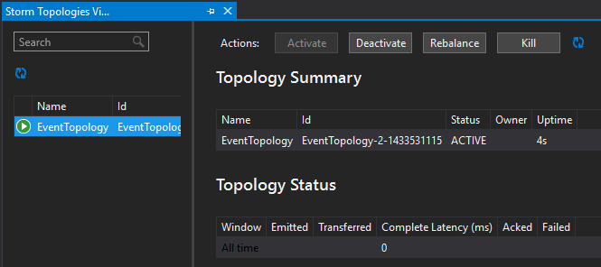

<properties
 pageTitle="Mettre en correspondance des événements au fil du temps avec vague d’et HBase sur HDInsight"
 description="Découvrez comment faire correspondre les événements qui arrivent à des moments différents à l’aide de vague d’et HBase sur HDInsight."
 services="hdinsight"
 documentationCenter=""
 authors="Blackmist"
 manager="jhubbard"
 editor="cgronlun"
 tags="azure-portal"/>

<tags
 ms.service="hdinsight"
 ms.devlang="dotnet"
 ms.topic="article"
 ms.tgt_pltfrm="na"
 ms.workload="big-data"
 ms.date="10/27/2016"
 ms.author="larryfr"/>

# Mettre en correspondance des événements au fil du temps avec vague d’et HBase sur HDInsight

En utilisant un stockage de données permanent avec vague d’Apache, vous pouvez faire correspondre les entrées de données qui arrivent à des moments différents. Par exemple, liaison d’un événement de connexion et de déconnexion d’une session de l’utilisateur calculer la durée pendant laquelle a une durée de la session.

Dans ce document, vous allez apprendre à créer une topologie c# vague simple qui effectue le suivi des événements de connexion et de déconnexion pour les sessions utilisateur et calcule la durée de la session. La topologie utilise HBase comme base de données permanente. HBase vous permet également d’exécuter des requêtes lot sur les données historiques afin d’obtenir des informations supplémentaires, telles que le nombre de sessions utilisateur ont commencé ou terminé pendant une période donnée.

## Conditions préalables

- Visual Studio et les outils de HDInsight pour Visual Studio : voir [commencer à utiliser les outils de HDInsight pour Visual Studio](../HDInsight/hdinsight-hadoop-visual-studio-tools-get-started.md) pour l’installation.

- Vague d’Apache sur HDInsight cluster (basées sur Windows). La topologie vague, qui traite les données entrantes et stocke dans HBase s’exécute.

    > [AZURE.IMPORTANT] Tandis que SCP.NET topologies sont pris en charge sur les clusters basés sur Linux vague créées après 28/10/2016, le SDK HBase package .NET disponible à partir de 28/10/2016 ne fonctionne pas correctement sous Linux.

- HBase Apache sur cluster HDInsight (Linux ou fonctionnant sous Windows). Il s’agit du magasin de données pour cet exemple.

## Architecture

Corrélation des événements nécessite un identificateur courantes pour la source d’événements. Par exemple, un ID d’utilisateur, ID de session ou autre élément de données a) uniques et b) inclus dans toutes les données envoyées à vague de. Cet exemple utilise une valeur GUID pour représenter un ID de session.

Cet exemple se compose de deux clusters HDInsight :

-   HBase : stockage de données permanent les données d’historique

-   Vague de : utilisé pour recevoir des données entrantes

Les données générées aléatoirement par la topologie vague et se compose des éléments suivants :

-   ID de session : un GUID qui identifie chaque session

-   : Un début ou fin d’événement. Dans cet exemple, démarrage se produit toujours avant la fin

-   Durée : l’heure de l’événement.

Ces données sont traitées et stockées dans HBase.

### Topologie vague

Lorsqu’une session démarre, un événement de **début** est reçu par la topologie et connecté à HBase. Lors de la réception d’un événement de **fin** , la topologie récupère l’événement de **début** et calcule la durée entre les deux événements. Cette valeur de **durée** est ensuite stockée dans HBase ainsi que des informations sur l’événement de **fin** .

> [AZURE.IMPORTANT] Tandis que cette topologie illustre le modèle de base, une solution de production doit effectuer création pour les scénarios suivants :
>
> - Événements arrivant désordre
> - Des événements en double
> - Événements supprimés

L’exemple de topologie est composée des éléments suivants :

-   Session.cs : imite une session utilisateur en créant un ID de session aléatoire, début time et combien de temps prendra la session

-   Spout.cs : crée 100 sessions, émet un événement de début, attend le délai aléatoire pour chaque session et puis émet un événement de fin. Puis recyclages termine sessions pour générer de nouvelles.

-   HBaseLookupBolt.cs : utilise l’ID de session pour rechercher des informations sur la session à partir de HBase. Lorsqu’un événement de fin est traité, il détecte que l’événement de démarrage correspondant et calcule la durée de la session.

-   HBaseBolt.cs : Stocke les informations dans HBase.

-   TypeHelper.cs : Aide à la conversion de type lors de la lecture / écriture dans HBase.

### Schéma HBase

Dans HBase, les données sont stockées dans un tableau avec le schéma/paramètres suivant :

-   Clé de ligne : la session ID est utilisé comme clé pour les lignes de ce tableau

-   Famille de colonne : le nom de famille est « trésorerie ». Colonnes stockées dans cette famille sont :

    -   événement : début ou fin

    -   heure : la durée en millisecondes qui se sont produite de l’événement

    -   Durée : la longueur entre les événements de début et de fin

-   VERSIONS : la famille « trésorerie » est définie pour conserver les 5 versions de chaque ligne

    > [AZURE.NOTE] Les versions sont un journal des valeurs précédentes stocké pour obtenir une clé de ligne spécifique. Par défaut, HBase renvoie uniquement la valeur de la version la plus récente d’une ligne. Dans ce cas, la même ligne est utilisée pour tous les événements (début, fin.) chaque version d’une ligne est identifiée par la valeur d’horodatage. Cela fournit une vue historique des événements enregistrés pour un ID spécifique.

## Télécharger le projet

L’exemple de projet peut être téléchargé à partir de [https://github.com/Azure-Samples/hdinsight-storm-dotnet-event-correlation](https://github.com/Azure-Samples/hdinsight-storm-dotnet-event-correlation).

Ce téléchargement contient les projets c# suivants :

-   CorrelationTopology : Topologie c# vague qui émet aléatoirement des événements de début et de fin pour les sessions utilisateur. Chaque session dure entre 1 et 5 minutes.

-   SessionInfo : Application console c# qui crée la table HBase et fournit des exemples de requêtes pour renvoyer des informations sur les données de session stockées.

## Créer une table

1. Ouvrez le projet **SessionInfo** dans Visual Studio.

2. Dans l' **Explorateur de solutions**, cliquez sur le projet **SessionInfo** et sélectionnez **Propriétés**.

    

3. Sélectionnez **paramètres**, puis définissez les valeurs suivantes :

    -   HBaseClusterURL : l’URL à votre cluster HBase. Par exemple, https://myhbasecluster.azurehdinsight.net

    -   HBaseClusterUserName : l’administrateur/HTTP compte d’utilisateur pour votre cluster

    -   HBaseClusterPassword : le mot de passe pour le compte d’utilisateur d’administration/HTTP

    -   HBaseTableName : le nom de la table à utiliser avec cet exemple

    -   HBaseTableColumnFamily : Le nom de famille de colonne

    

5. Exécutez la solution. Lorsque vous y êtes invité, sélectionnez la clé « c » pour créer la table sur votre cluster HBase.

## Créer et déployer la topologie vague

1.  Ouvrez la solution **CorrelationTopology** dans Visual Studio.

2.  Dans l' **Explorateur de solutions**, cliquez avec le bouton droit sur le projet **CorrelationTopology** et sélectionnez Propriétés.

3.  Dans la fenêtre Propriétés, sélectionnez **paramètres** , entrez les informations suivantes. Les 5 premiers doivent être les mêmes valeurs utilisées par le projet **SessionInfo** :

    -   HBaseClusterURL : l’URL à votre cluster HBase. Par exemple, https://myhbasecluster.azurehdinsight.net

    -   HBaseClusterUserName : l’administrateur/HTTP compte d’utilisateur pour votre cluster

    -   HBaseClusterPassword : le mot de passe pour le compte d’utilisateur d’administration/HTTP

    -   HBaseTableName : nom de la table à utiliser avec cet exemple. Ce groupe doit contenir le même nom de table que celui utilisé dans le projet SessionInfo

    -   HBaseTableColumnFamily : La colonne nom de famille. Ce groupe doit contenir le même nom de famille de colonne que celui utilisé dans le projet SessionInfo

    > [AZURE.IMPORTANT] Ne modifiez pas HBaseTableColumnNames, comme les valeurs par défaut sont les noms utilisés par **SessionInfo** pour extraire des données.

4.  Enregistrer les propriétés, puis générer le projet.

5.  Dans l' **Explorateur de solutions**, cliquez avec le bouton droit sur le projet et sélectionnez **Envoyer à vague d’HDInsight**. Si vous y êtes invité, entrez les informations d’identification pour votre abonnement Azure.

    

6.  Dans la boîte de dialogue **Envoyer la topologie** , sélectionnez le cluster vague qui continuera cette topologie.

    > [AZURE.NOTE] La première fois que vous envoyez une topologie, il peut prendre quelques secondes pour extraire le nom de vos clusters HDInsight.

7.  Une fois la topologie a été téléchargée et soumise pour le cluster, l' **Affichage de la topologie vague de** s’ouvre et affiche la topologie en cours d’exécution. Sélectionnez le **CorrelationTopology** et utilisez le bouton Actualiser dans la partie supérieure droite de la page pour actualiser les informations de topologie.

    

    Lorsque la topologie commence à générer des données, la valeur dans la colonne **EMISE** incrémente.

    > [AZURE.NOTE] Si l' **Affichage de la topologie vague de** ne s’ouvre pas automatiquement, procédez comme suit pour l’ouvrir :
    >
    > 1. Dans l' **Explorateur de solutions**, développez **Azure**, puis puis **HDInsight**.
    >
    > 2. Cliquez avec le bouton droit sur le cluster vague la topologie s’exécutant sur et sélectionnez **Topologies de vague d’affichage**

## Interroger les données

Une fois que les données a été émises, procédez comme suit pour interroger les données.

1. Revenir au projet **SessionInfo** . Si ne pas en cours d’exécution, démarrez une nouvelle instance de celle-ci.

2. Lorsque vous y êtes invité, sélectionnez **s** pour rechercher des événements de démarrage. Vous devrez entrer une heure de début et de fin pour définir un intervalle de temps - seuls les événements entre ces deux heures seront renvoyées.

    Utilisez le format suivant lorsque vous entrez les heures de début et de fin : hh : mm et « am » ou « pm ». Par exemple, 11 h 20.

    Étant donné que la topologie a déjà commencé uniquement, utilisez un démarrage heure à partir d’avant qu’il a été déployé et une heure de fin de maintenant. Cela doit capturer la plupart des événements de démarrage qui ont été générées lors de son démarrage. Lorsque la requête s’exécute, vous devriez voir une liste d’entrées semblables à ce qui suit :

        Session e6992b3e-79be-4991-afcf-5cb47dd1c81c started at 6/5/2015 6:10:15 PM. Timestamp = 1433527820737

Recherchez des événements de fin fonctionne de la même comme des événements de démarrage. Toutefois, les événements de fin sont générés de manière aléatoire compris entre 1 et 5 minutes après l’événement de démarrage. Ainsi, vous devrez peut-être essayer plusieurs plages de temps afin de rechercher les événements de fin. Événements de fin contient également la durée de la session - la différence entre les événements début et heure de fin l’événement. Voici un exemple de données pour les événements de fin :

    Session fc9fa8e6-6892-4073-93b3-a587040d892e lasted 2 minutes, and ended at 6/5/2015 6:12:15 PM

> [AZURE.NOTE] Si vous entrez les valeurs de temps sont en heure locale, l’heure retournée à partir de la requête seront UTC.

##Arrêter la topologie

Lorsque vous êtes prêt à arrêter la topologie, retournez sur le projet **CorrelationTopology** dans Visual Studio. Dans l' **Affichage de la topologie vague de**, sélectionnez la topologie, puis utilisez le bouton **Supprimer** en haut de l’affichage de la topologie.

##Supprimer votre cluster

[AZURE.INCLUDE [delete-cluster-warning](../../includes/hdinsight-delete-cluster-warning.md)]

##Étapes suivantes

Pour plus d’exemples vague, voir [exemples de topologies pour vague d’HDInsight](hdinsight-storm-example-topology.md).
 
