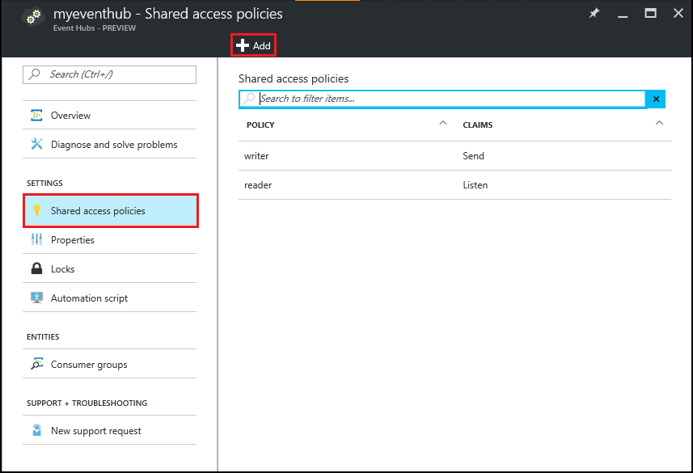

<properties
   pageTitle="Traiter les événements d’événement Hubs avec vague d’HDInsight | Microsoft Azure"
   description="Découvrez comment traiter les données de l’événement Hubs avec une topologie c# vague créée dans Visual Studio en utilisant les outils HDInsight pour Visual Studio."
   services="hdinsight,notification hubs"
   documentationCenter=""
   authors="Blackmist"
   manager="jhubbard"
   editor="cgronlun"/>

<tags
   ms.service="hdinsight"
   ms.devlang="dotnet"
   ms.topic="article"
   ms.tgt_pltfrm="na"
   ms.workload="big-data"
   ms.date="10/27/2016"
   ms.author="larryfr"/>

# Traiter les événements de Azure événement Hubs avec vague d’HDInsight (c#)

Azure événement Hubs vous permet de traitement des volumes importants de données à partir des sites Web, des applications et des appareils mobiles. Événement Hubs bec rend facile à utiliser vague d’Apache sur HDInsight pour analyser ces données en temps réel. Vous pouvez également écrire des données aux événements Hubs de vague d’à l’aide de l’événement Hubs boulons.

Dans ce didacticiel, vous allez apprendre à utiliser les modèles Visual Studio installés avec HDInsight Tools pour Visual Studio pour créer deux topologies fonctionnant avec Azure événement Hubs.

* **EventHubWriter**: génère des données et écrit aux événements Hubs de manière aléatoire

* **EventHubReader**: lit les données d’événement Hubs et enregistre les données dans les journaux vague

> [AZURE.NOTE] Alors que les étapes décrites dans ce document dépendent d’un environnement de développement Windows avec Visual Studio, le projet compilé peut être soumis à cluster une HDInsight fonctionnant sous Windows ou Linux. Clusters basés sur Linux créé uniquement après la prise en charge de 28/10/2016 SCP.NET topologies.
>
> Pour utiliser une topologie c# avec un cluster Linux, vous devez mettre à jour le package Microsoft.SCP.Net.SDK NuGet utilisé par votre projet vers la version 0.10.0.6 ou une version ultérieure. La version du package doit également correspondre à la version principale de vague d’installé sur HDInsight. Par exemple, vague d’HDInsight versions 3.3 et 3.4 utiliser vague version 0.10.x, tandis que HDInsight 3.5 utilise vague de 1.0.x.
> 
> Topologies c# clusters basés sur Linux sur doivent utiliser .NET 4.5 et Mono permet d’exécuter sur le cluster HDInsight. La plupart des éléments fonctionnent toutefois vous devez vérifier le document [Compatibilité Mono](http://www.mono-project.com/docs/about-mono/compatibility/) d’incompatibilité potentielle.
>
> Pour une version Java de ce projet, qui fonctionne également sur un cluster basée sur Windows ou Linux, voir [traiter les événements de Azure événement Hubs avec vague d’HDInsight (Java)](hdinsight-storm-develop-java-event-hub-topology.md).

## Conditions préalables

* Une [Vague d’Apache sur cluster HDInsight](hdinsight-apache-storm-tutorial-get-started.md)

* Un [concentrateur événement Azure](../event-hubs/event-hubs-csharp-ephcs-getstarted.md)

* Le [Kit de développement .NET Azure](http://azure.microsoft.com/downloads/)

* Les [Outils de HDInsight pour Visual Studio](hdinsight-hadoop-visual-studio-tools-get-started.md)

## Projet terminé

Vous pouvez télécharger une version complète du projet créé dans ce didacticiel à partir de GitHub : [eventhub-vague de-hybride](https://github.com/Azure-Samples/hdinsight-dotnet-java-storm-eventhub). Toutefois, vous devez fournir les paramètres de configuration en suivant les étapes décrites dans ce didacticiel.

## Boulons et bec de Hubs d’événement

Les Hubs événement bec et boulon sont des composants de Java qui vous permettent de travailler facilement avec Hubs événement de vague d’Apache. Bien que ces composants sont écrits en Java, les outils de HDInsight pour Visual Studio permettent de créer des topologies hybrides qui combinent c# et composants Java.

Le bec et boulons sont distribués comme un seul fichier d’archive (.jar) Java nommé **eventhubs-storm-spout-#.#-jar-with-dependencies.jar**, où #. # est la version du fichier.

### Téléchargez le fichier .jar

La version la plus récente du fichier jar est incluse dans le projet [vague d’HDInsight exemples](https://github.com/hdinsight/hdinsight-storm-examples) sous le dossier **bibliothèque/eventhubs** . Pour télécharger le fichier, utilisez une des méthodes suivantes.

> [AZURE.NOTE] Les boulons bec soumises à inclure dans le projet Apache vague. Pour plus d’informations, voir [vague de 583 : initiale archiver pour hubs vague événement](https://github.com/apache/storm/pull/336/files) dans GitHub.

* **Télécharger un fichier ZIP**: à partir du site [vague d’HDInsight exemples](https://github.com/hdinsight/hdinsight-storm-examples) , sélectionnez **ZIP de téléchargement** dans le volet droit pour télécharger un fichier .zip qui contient le projet.

    

    Une fois le fichier est téléchargé, vous pouvez extraire l’archive et le fichier se trouve dans le répertoire de **bibliothèque** .

* **Cloner le projet**: Si vous avez [Git](http://git-scm.com/) installé, utilisez la commande suivante pour cloner le référentiel localement, puis recherchez le fichier dans le répertoire de **bibliothèque** .

        git clone https://github.com/hdinsight/hdinsight-storm-examples

## Configurer événement Hubs

Événement Hubs est la source de données pour cet exemple. Utilisez les informations dans la section __créer un concentrateur événement__ du document [prise en main avec Hubs de l’événement](../event-hubs/event-hubs-csharp-ephcs-getstarted.md) .

3. Une fois que le hub de l’événement a été créé, afficher la carte EventHub dans le portail Azure et sélectionnez __stratégies d’accès partagé__. Utilisez l’entrée __+ Ajouter__ pour ajouter les stratégies suivantes :

  	| Nom | Autorisations |
  	| ----- | ----- |
  	| writer | Envoyer |
  	| Reader | Écouter |

    

5. Sélectionnez les stratégies de __lecteur__ et __writer__ . Copier et enregistrez la valeur de __Clé primaire__ pour les deux stratégies, comme elles seront utilisées ultérieurement.

## Configurer la EventHubWriter

1. Si vous n’avez pas déjà installé la dernière version des outils HDInsight pour Visual Studio, voir [prise en main de l’utilisation HDInsight Tools pour Visual Studio](hdinsight-hadoop-visual-studio-tools-get-started.md).

2. Téléchargez la solution à partir de [eventhub-vague de-hybride](https://github.com/Azure-Samples/hdinsight-dotnet-java-storm-eventhub). Ouvrez la solution et prenez quelques instants pour examiner le code pour le projet __EventHubWriter__ .

4. Dans le projet __EventHubWriter__ , ouvrez le fichier __App.config__ . Utiliser les informations à partir du Hub événement que vous avez configuré précédemment pour renseigner la valeur pour les clés suivantes :

  	| Clé | Valeur |
  	| ----- | ----- |
  	| EventHubPolicyName | Rédacteur (si vous avez utilisé un autre nom pour la stratégie avec l’autorisation _Envoyer_ , utilisez-la.) |
  	| EventHubPolicyKey | La clé de la stratégie writer |
  	| EventHubNamespace | L’espace de noms qui contient votre plateforme d’événement |
  	| EventHubName | Nom de votre événement concentrateur |
  	| EventHubPartitionCount | Le nombre de partitions dans votre plateforme d’événement |

4. Enregistrez et fermez le fichier **App.config** .

## Configurer la EventHubReader

1. Ouvrez le projet __EventHubReader__ et prendre quelques momoents pour examiner le code.

2. Ouvrez __EventHubWriter__ __App.config__ . Utiliser les informations à partir du Hub événement que vous avez configuré précédemment pour renseigner la valeur pour les clés suivantes :

  	| Clé | Valeur |
  	| ----- | ----- |
  	| EventHubPolicyName | lecteur (si vous avez utilisé un autre nom pour la stratégie avec autorisation _écouter_ , l’utiliser à la place.) |
  	| EventHubPolicyKey | La clé de la stratégie de lecture |
  	| EventHubNamespace | L’espace de noms qui contient votre plateforme d’événement |
  	| EventHubName | Nom de votre événement concentrateur |
  	| EventHubPartitionCount | Le nombre de partitions dans votre plateforme d’événement |

3. Enregistrez et fermez le fichier **App.config** .

## Déployer les topologies

1. Dans **L’Explorateur de solutions**, droit sur le projet **EventHubReader** et sélectionnez **Envoyer à vague d’HDInsight**.

    

2. Dans l’écran de la **Topologie de soumettre** , sélectionnez votre **Cluster vague de**. Développer **Les Configurations supplémentaires** **Java chemins d’accès**, sélectionnez **...** et sélectionnez le répertoire qui contient le fichier **eventhubs-storm-spout-0.9-jar-with-dependencies.jar** que vous avez téléchargé précédemment. Pour finir, cliquez sur **Envoyer**.

    

3. Lorsque la topologie a été soumise, la **Visionneuse de Topologies vague de** s’affiche. Sélectionnez la topologie **EventHubReader** dans le volet gauche pour afficher les statistiques de la topologie. Pour l’instant, doit être passe rien car aucun événement n’ont été écrites aux événements Hubs encore.

    

4. Dans **L’Explorateur de solutions**, droit sur le projet **EventHubWriter** et sélectionnez **Envoyer à vague d’HDInsight**.

2. Dans l’écran de la **Topologie de soumettre** , sélectionnez votre **Cluster vague de**. Développer **Les Configurations supplémentaires** **Java chemins d’accès**, sélectionnez **...** et sélectionnez le répertoire qui contient le fichier **eventhubs-storm-spout-0.9-jar-with-dependencies.jar** téléchargé précédemment. Pour finir, cliquez sur **Envoyer**.

5. Lorsque la topologie a été soumise, actualiser la liste de topologie dans la **Visionneuse de Topologies vague de** pour vérifier que les deux topologies sont exécutent sur le cluster.

6. Dans la **Visionneuse de Topologies vague de**, sélectionnez la topologie **EventHubReader** .

4. Dans l’affichage Graphe, double-cliquez sur le composant __LogBolt__ . La page __Résumé des composants__ pour les boulons s’ouvre.

3. Dans la section __exécuteurs__ , sélectionnez un des liens dans la colonne __Port__ . Ceci affiche les informations consignées par le composant. Les informations enregistrées sont semblables à ce qui suit :

        2016-10-20 13:26:44.186 m.s.s.b.ScpNetBolt [INFO] Processing tuple: source: com.microsoft.eventhubs.spout.EventHubSpout:7, stream: default, id: {5769732396213255808=520853934697489134}, [{"deviceId":3,"deviceValue":1379915540}]
        2016-10-20 13:26:44.234 m.s.s.b.ScpNetBolt [INFO] Processing tuple: source: com.microsoft.eventhubs.spout.EventHubSpout:7, stream: default, id: {7154038361491319965=4543766486572976404}, [{"deviceId":3,"deviceValue":459399321}]
        2016-10-20 13:26:44.335 m.s.s.b.ScpNetBolt [INFO] Processing tuple: source: com.microsoft.eventhubs.spout.EventHubSpout:6, stream: default, id: {513308780877039680=-7571211415704099042}, [{"deviceId":5,"deviceValue":845561159}]
        2016-10-20 13:26:44.445 m.s.s.b.ScpNetBolt [INFO] Processing tuple: source: com.microsoft.eventhubs.spout.EventHubSpout:7, stream: default, id: {-2409895457033895206=5479027861202203517}, [{"deviceId":8,"deviceValue":2105860655}]

## Arrêter les topologies

Pour arrêter les topologies, sélectionnez chaque topologie dans la **Visionneuse de topologie vague de**, puis cliquez sur **Supprimer**.

## Supprimer votre cluster

[AZURE.INCLUDE [delete-cluster-warning](../../includes/hdinsight-delete-cluster-warning.md)]

## Notes

### Point de contrôle

La EventHubSpout régulièrement les points de contrôle son état sur le nœud soigneur, qui enregistre le décalage en cours pour les messages lire à partir de la file d’attente. Ceci permet au composant de recevoir des messages à l’offset enregistré dans les scénarios suivants :

* L’instance du composant échoue et est redémarré.

* Vous agrandir ou réduisez le cluster en ajoutant ou en supprimant des nœuds.

* La topologie est supprimée et redémarré **avec le même nom**.

Vous pouvez également exporter et importer les points de contrôle persistantes à WASB (le stockage Azure utilisée par votre cluster HDInsight). Les scripts pour effectuer cette action sont situées sous la vague de sur cluster HDInsight, en **c:\apps\dist\storm-0.9.3.2.2.1.0-2340\zkdatatool-1.0\bin**.

>[AZURE.NOTE] Le numéro de version dans le chemin d’accès peut être différent, comme la version de vague d’installé sur le cluster peut changer à l’avenir.

Les scripts dans ce répertoire sont :

* **stormmeta_import.cmd**: importer toutes les métadonnées vague à partir du conteneur de stockage par défaut cluster dans soigneur.

* **stormmeta_export.cmd**: exporter toutes les métadonnées vague à partir de soigneur dans le conteneur de stockage de cluster par défaut.

* **stormmeta_delete.cmd**: supprime toutes les métadonnées vague soigneur.

Exporter qu'une importation permet de vous permettent de conserver les données de point de contrôle lorsque vous avez besoin de supprimer le cluster, mais souhaitez reprendre le traitement de l’offset actuel dans le hub lorsque vous ouvrez un nouveau cluster en ligne.

> [AZURE.NOTE] Dans la mesure où les données sont conservées dans le conteneur de stockage par défaut, de cluster nouveau **doit** utiliser le même compte de stockage et le conteneur que le cluster précédent.

## Étapes suivantes

Dans ce document, vous avez appris à utiliser les Java événement Hubs bec et les boulons à partir d’une topologie c# pour utiliser des données dans Azure événement Hub. Pour plus d’informations sur la création de topologies c#, consultez les rubriques suivantes.

* [Développer des topologies c# pour vague d’Apache sur HDInsight à l’aide de Visual Studio](hdinsight-storm-develop-csharp-visual-studio-topology.md)

* [Guide de programmation SCP](hdinsight-storm-scp-programming-guide.md)

* [Exemples de topologies pour vague d’HDInsight](hdinsight-storm-example-topology.md)
 
