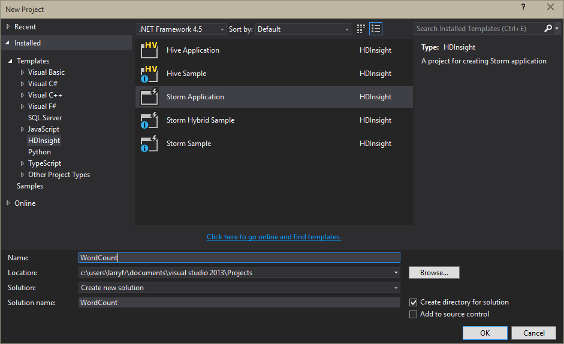

<properties
   pageTitle="Topologies Apache vague avec Visual Studio et c# | Microsoft Azure"
   description="Découvrez comment créer des topologies vague en c# en créant une topologie de comptage simple word dans Visual Studio en utilisant les outils HDInsight pour Visual Studio."
   services="hdinsight"
   documentationCenter=""
   authors="Blackmist"
   manager="jhubbard"
   editor="cgronlun"
   tags="azure-portal"/>

<tags
   ms.service="hdinsight"
   ms.devlang="java"
   ms.topic="article"
   ms.tgt_pltfrm="na"
   ms.workload="big-data"
   ms.date="10/27/2016"
   ms.author="larryfr"/>

# Développer des topologies c# pour vague d’Apache sur HDInsight avec Hadoop tools pour Visual Studio

Découvrez comment créer une topologie c# vague à l’aide des outils HDInsight pour Visual Studio. Ce didacticiel décrit le processus de création d’un projet vague dans Visual Studio, test localement et le déploiement pour une vague Apache sur cluster HDInsight.

Vous allez également apprendre à créer des topologies hybrides qui utilisent c# et composants Java.

> [AZURE.IMPORTANT] Alors que les étapes décrites dans ce document dépendent d’un environnement de développement Windows avec Visual Studio, le projet compilé peut être soumis à cluster une HDInsight fonctionnant sous Windows ou Linux. Clusters basés sur Linux créé uniquement après la prise en charge de 28/10/2016 SCP.NET topologies.
>
> Pour utiliser une topologie c# avec un cluster Linux, vous devez mettre à jour le package Microsoft.SCP.Net.SDK NuGet utilisé par votre projet vers la version 0.10.0.6 ou une version ultérieure. La version du package doit également correspondre à la version principale de vague d’installé sur HDInsight. Par exemple, vague d’HDInsight versions 3.3 et 3.4 utiliser vague version 0.10.x, tandis que HDInsight 3.5 utilise vague de 1.0.x.
> 
> Topologies c# clusters basés sur Linux sur doivent utiliser .NET 4.5 et Mono permet d’exécuter sur le cluster HDInsight. La plupart des éléments fonctionnent toutefois vous devez vérifier le document [Compatibilité Mono](http://www.mono-project.com/docs/about-mono/compatibility/) d’incompatibilité potentielle.

## Conditions préalables

- Une des versions suivantes de Visual Studio

    - Visual Studio 2012 avec la [mise à jour 4](http://www.microsoft.com/download/details.aspx?id=39305)

    - Visual Studio 2013 avec la [mise à jour 4](http://www.microsoft.com/download/details.aspx?id=44921) ou [Visual Studio 2013 Communauté](http://go.microsoft.com/fwlink/?LinkId=517284)

    - Visual Studio 2015 ou [Visual Studio 2015 Communauté](https://go.microsoft.com/fwlink/?LinkId=532606)

- Kit de développement logiciel Azure 2.9.5 ou version ultérieure

- HDInsight Tools pour Visual Studio : voir [commencer à utiliser les outils de HDInsight pour Visual Studio](hdinsight-hadoop-visual-studio-tools-get-started.md) pour installer et configurer les outils HDInsight pour Visual Studio.

    > [AZURE.NOTE] HDInsight Tools pour Visual Studio ne sont pas prises en charge dans Visual Studio Express

-   Vague d’Apache sur cluster HDInsight : voir [prise en main vague d’Apache sur HDInsight](hdinsight-apache-storm-tutorial-get-started.md) pour obtenir la procédure pour créer un cluster.

## Modèles

Les outils HDInsight pour Visual Studio fournissent des modèles suivants ::

| Type de projet | Montre |
| ------------ | ------------- |
| Application vague | Un projet de topologie vague vide |
| Exemple de Writer vague SQL Azure | Comment écrire dans la base de données SQL Azure |
| Exemple de lecteur DocumentDB vague | Comment lire à partir d’Azure DocumentDB |
| Exemple de DocumentDB Writer vague | Comment écrire dans Azure DocumentDB |
| Exemple de lecteur EventHub vague | Comment lire à partir d’Azure événement Hubs |
| Exemple de EventHub Writer vague | Comment écrire dans Azure événement Hubs |
| Exemple de lecteur HBase vague | Comment faire pour lire à partir de HBase sur HDInsight clusters |
| Exemple de HBase Writer vague | Comment faire pour écrire sur HBase HDInsight clusters |
| Vague hybrides, exemple | Comment utiliser un composant Java |
| Exemple de vague | Une topologie de nombre de base de word |

> [AZURE.NOTE] Les exemples de lecteur et writer HBase utilisent l’API REST HBase pour communiquer avec une HBase sur cluster HDInsight, pas l’API Java HBase.

Dans les étapes décrites dans ce document, vous utiliserez le type de projet Application vague base pour créer une nouvelle topologie.

## Créez une topologie c#

1. Si vous n’avez pas déjà installé la dernière version des outils HDInsight pour Visual Studio, voir [prise en main de l’utilisation HDInsight Tools pour Visual Studio](hdinsight-hadoop-visual-studio-tools-get-started.md).

2. Ouvrir Visual Studio, sélectionnez **fichier** > **Nouveau**, puis **projet**.

3. Dans l’écran **Nouveau projet** , développez **installé** > **modèles**et sélectionnez **HDInsight**. Dans la liste des modèles, sélectionnez **Vague d’Application**. Dans la partie inférieure de l’écran, entrez **WordCount** comme nom de l’application.

    

4. Une fois que le projet a été créé, vous devez avoir les fichiers suivants :

    - **Program.cs**: définit la topologie pour votre projet. Notez qu’une topologie par défaut qui consiste en un seul bec et un boulons est créée par défaut.

    - **Spout.cs**: un bec exemple qui émet des nombres aléatoires.

    - **Bolt.cs**: un boulons exemple qui conserve un compteur de nombres émise par bec.

    Dans le cadre de la création de projets, les derniers [SCP.NET packages](https://www.nuget.org/packages/Microsoft.SCP.Net.SDK/) sont téléchargés à partir de NuGet.

    [AZURE.INCLUDE [scp.net version important](../../includes/hdinsight-storm-scpdotnet-version.md)]

Dans les sections suivantes, vous allez modifier ce projet dans une application WordCount base.

### Mettre en œuvre bec

1. Ouvrez **Spout.cs**. Becs verseurs sont utilisées pour lire les données dans une topologie d’une source externe. Les principaux composants pour un bec sont :

    - **NextTuple**: appelé par vague de lorsque bec est autorisé à émettre tuples nouveau.

    - **Accusé de réception** (topologie transactions uniquement) : gère les accusés de réception initiées par d’autres composants de la topologie de tuples envoyé à partir de cette bec. Accusé de réception un uplet informe bec qu’il a été correctement traité par les composants en aval.

    - **Échouer** (topologie transactions uniquement) : les poignées de tuples qui sont fail traitement des autres composants de la topologie. Cela permet d’émettre de nouveau le tuple afin qu’elles puissent être traitées à nouveau.

2. Remplacez le contenu de la classe **goulotte** avec les éléments suivants. Cela crée un bec qui aléatoirement émet une phrase dans la topologie.

        private Context ctx;
        private Random r = new Random();
        string[] sentences = new string[] {
            "the cow jumped over the moon",
            "an apple a day keeps the doctor away",
            "four score and seven years ago",
            "snow white and the seven dwarfs",
            "i am at two with nature"
        };

        public Spout(Context ctx)
        {
            // Set the instance context
            this.ctx = ctx;

            Context.Logger.Info("Generator constructor called");

            // Declare Output schema
            Dictionary<string, List<Type>> outputSchema = new Dictionary<string, List<Type>>();
            // The schema for the default output stream is
            // a tuple that contains a string field
            outputSchema.Add("default", new List<Type>() { typeof(string) });
            this.ctx.DeclareComponentSchema(new ComponentStreamSchema(null, outputSchema));
        }

        // Get an instance of the spout
        public static Spout Get(Context ctx, Dictionary<string, Object> parms)
        {
            return new Spout(ctx);
        }

        public void NextTuple(Dictionary<string, Object> parms)
        {
            Context.Logger.Info("NextTuple enter");
            // The sentence to be emitted
            string sentence;

            // Get a random sentence
            sentence = sentences[r.Next(0, sentences.Length - 1)];
            Context.Logger.Info("Emit: {0}", sentence);
            // Emit it
            this.ctx.Emit(new Values(sentence));

            Context.Logger.Info("NextTuple exit");
        }

        public void Ack(long seqId, Dictionary<string, Object> parms)
        {
            // Only used for transactional topologies
        }

        public void Fail(long seqId, Dictionary<string, Object> parms)
        {
            // Only used for transactional topologies
        }
    
    Prenez quelques instants pour lire les commentaires à comprendre le rôle de ce code.

### Mettre en œuvre les boulons

1. Supprimez le fichier **Bolt.cs** existant à partir du projet.

2. Dans l' **Explorateur de solutions**, cliquez sur le projet, puis sélectionnez **Ajouter** > **un nouvel élément**. Dans la liste, sélectionnez **Vague de boulons**, puis entrez **Splitter.cs** comme nom. Répétez l’opération pour créer un deuxième boulon nommé **Counter.cs**.

    - **Splitter.cs**: mettent en œuvre, un boulons qui fractionne phrases en mots individuels et émet un flux de données de mots.

    - **Counter.cs**: mettent en œuvre, un boulons qui compte de chaque mot et émet un flux de données de mots et le nombre de chaque mot.

    > [AZURE.NOTE] Ces boulons simplement lire et écrire dans des flux, mais vous pouvez également utiliser un boulons de communiquer avec des sources tel qu’une base de données ou le service.

3. Ouvrez **Splitter.cs**. Notez qu’il n'a qu’une seule méthode par défaut : **Execute**. Cette option est appelée quand les boulons reçoit un uplet pour traitement. Dans ce cas, vous pouvez lire et traiter tuples entrants et émettre tuples sortant.

4. Remplacez le contenu de la classe **fractionnement** par le code suivant :

        private Context ctx;

        // Constructor
        public Splitter(Context ctx)
        {
            Context.Logger.Info("Splitter constructor called");
            this.ctx = ctx;

            // Declare Input and Output schemas
            Dictionary<string, List<Type>> inputSchema = new Dictionary<string, List<Type>>();
            // Input contains a tuple with a string field (the sentence)
            inputSchema.Add("default", new List<Type>() { typeof(string) });
            Dictionary<string, List<Type>> outputSchema = new Dictionary<string, List<Type>>();
            // Outbound contains a tuple with a string field (the word)
            outputSchema.Add("default", new List<Type>() { typeof(string) });
            this.ctx.DeclareComponentSchema(new ComponentStreamSchema(inputSchema, outputSchema));
        }

        // Get a new instance of the bolt
        public static Splitter Get(Context ctx, Dictionary<string, Object> parms)
        {
            return new Splitter(ctx);
        }

        // Called when a new tuple is available
        public void Execute(SCPTuple tuple)
        {
            Context.Logger.Info("Execute enter");

            // Get the sentence from the tuple
            string sentence = tuple.GetString(0);
            // Split at space characters
            foreach (string word in sentence.Split(' '))
            {
                Context.Logger.Info("Emit: {0}", word);
                //Emit each word
                this.ctx.Emit(new Values(word));
            }

            Context.Logger.Info("Execute exit");
        }

    Prenez quelques instants pour lire les commentaires à comprendre le rôle de ce code.

5. Ouvrez **Counter.cs** et remplacez le contenu de classe avec les éléments suivants :

        private Context ctx;

        // Dictionary for holding words and counts
        private Dictionary<string, int> counts = new Dictionary<string, int>();

        // Constructor
        public Counter(Context ctx)
        {
            Context.Logger.Info("Counter constructor called");
            // Set instance context
            this.ctx = ctx;

            // Declare Input and Output schemas
            Dictionary<string, List<Type>> inputSchema = new Dictionary<string, List<Type>>();
            // A tuple containing a string field - the word
            inputSchema.Add("default", new List<Type>() { typeof(string) });

            Dictionary<string, List<Type>> outputSchema = new Dictionary<string, List<Type>>();
            // A tuple containing a string and integer field - the word and the word count
            outputSchema.Add("default", new List<Type>() { typeof(string), typeof(int) });
            this.ctx.DeclareComponentSchema(new ComponentStreamSchema(inputSchema, outputSchema));
        }

        // Get a new instance
        public static Counter Get(Context ctx, Dictionary<string, Object> parms)
        {
            return new Counter(ctx);
        }

        // Called when a new tuple is available
        public void Execute(SCPTuple tuple)
        {
            Context.Logger.Info("Execute enter");

            // Get the word from the tuple
            string word = tuple.GetString(0);
            // Do we already have an entry for the word in the dictionary?
            // If no, create one with a count of 0
            int count = counts.ContainsKey(word) ? counts[word] : 0;
            // Increment the count
            count++;
            // Update the count in the dictionary
            counts[word] = count;

            Context.Logger.Info("Emit: {0}, count: {1}", word, count);
            // Emit the word and count information
            this.ctx.Emit(Constants.DEFAULT_STREAM_ID, new List<SCPTuple> { tuple }, new Values(word, count));
            Context.Logger.Info("Execute exit");
        }

    Prenez quelques instants pour lire les commentaires à comprendre le rôle de ce code.

### Définir la topologie

Becs verseurs et boulons sont organisés dans un graphique, qui définit le flux de données entre les composants. Dans cette topologie, le graphique est la suivante :

Phrases sont émises par bec, qui sont distribué sur des instances de le boulons fractionnement. Les boulons fractionnement divise les phrases en mots, qui leur sont attribuées les boulons Compteur.

Étant donné que les statistiques est conservée localement dans l’instance de compteur, nous voulons pour vous assurer que des mots spécifiques se déplace vers la même instance de boulons Compteur, ce qui nous n'avoir qu’une seule instance suivi d’un mot spécifique. Mais pour les boulons fractionnement, vraiment peu importe quelles boulons reçoit la phrase, nous voulons simplement phrases solde de la charge sur ces instances.

Ouvrez **Program.cs**. La méthode importante est **GetTopologyBuilder**, qui est utilisé pour définir la topologie qui est soumise à vague de. Remplacez le contenu de **GetTopologyBuilder** par le code suivant pour mettre en œuvre la topologie décrite précédemment :

        // Create a new topology named 'WordCount'
        TopologyBuilder topologyBuilder = new TopologyBuilder("WordCount" + DateTime.Now.ToString("yyyyMMddHHmmss"));

        // Add the spout to the topology.
        // Name the component 'sentences'
        // Name the field that is emitted as 'sentence'
        topologyBuilder.SetSpout(
            "sentences",
            Spout.Get,
            new Dictionary<string, List<string>>()
            {
                {Constants.DEFAULT_STREAM_ID, new List<string>(){"sentence"}}
            },
            1);
        // Add the splitter bolt to the topology.
        // Name the component 'splitter'
        // Name the field that is emitted 'word'
        // Use suffleGrouping to distribute incoming tuples
        //   from the 'sentences' spout across instances
        //   of the splitter
        topologyBuilder.SetBolt(
            "splitter",
            Splitter.Get,
            new Dictionary<string, List<string>>()
            {
                {Constants.DEFAULT_STREAM_ID, new List<string>(){"word"}}
            },
            1).shuffleGrouping("sentences");

        // Add the counter bolt to the topology.
        // Name the component 'counter'
        // Name the fields that are emitted 'word' and 'count'
        // Use fieldsGrouping to ensure that tuples are routed
        //   to counter instances based on the contents of field
        //   position 0 (the word). This could also have been
        //   List<string>(){"word"}.
        //   This ensures that the word 'jumped', for example, will always
        //   go to the same instance
        topologyBuilder.SetBolt(
            "counter",
            Counter.Get,
            new Dictionary<string, List<string>>()
            {
                {Constants.DEFAULT_STREAM_ID, new List<string>(){"word", "count"}}
            },
            1).fieldsGrouping("splitter", new List<int>() { 0 });

        // Add topology config
        topologyBuilder.SetTopologyConfig(new Dictionary<string, string>()
        {
            {"topology.kryo.register","[\"[B\"]"}
        });

        return topologyBuilder;

Prenez quelques instants pour lire les commentaires à comprendre le rôle de ce code.

## Soumettre la topologie

1. Dans l' **Explorateur de solutions**, droit sur le projet, puis sélectionnez **Envoyer à vague d’HDInsight**.

    > [AZURE.NOTE] Si vous y êtes invité, entrez les informations d’identification pour votre abonnement Azure. Si vous avez plusieurs abonnements, connectez-vous à celui qui contient votre vague de sur cluster HDInsight.

2. Sélectionnez votre vague de sur HDInsight cluster dans la liste déroulante **Cluster vague de** , puis **Envoyer**. Vous pouvez contrôler si la présentation a réussi à l’aide de la fenêtre de **sortie** .

3. Lorsque la topologie a été envoyée, **Vague de Topologies** pour le cluster doit apparaître. Sélectionnez la topologie **WordCount** dans la liste pour afficher des informations sur la topologie en cours d’exécution.

    > [AZURE.NOTE] Vous pouvez également afficher **Topologies vague** **d’Explorateur**de serveurs : développer **Azure** > **HDInsight**, avec le bouton droit sur cluster HDInsight une vague d’et sélectionnez **Topologies de vague d’affichage**.

    Utilisez les liens pour le becs verseurs ou détaillée pour afficher des informations sur ces composants. Une nouvelle fenêtre s’ouvre pour chaque élément sélectionné.

4. À partir de la vue **Topologie de résumé** , cliquez sur **Terminer** pour arrêter la topologie.

    > [AZURE.NOTE] Topologies vague continuent à fonctionner jusqu'à ce qu’elles sont désactivées ou le cluster est supprimé.

## Topologie de transactions

La topologie précédente est non transactions. Les composants au sein de la topologie n’implémentent pas toutes les fonctionnalités pour relecture des messages en cas de traitement par un composant de la topologie. Pour un exemple de topologie transactions, créez un nouveau projet et sélectionnez **Vague d’exemple** comme type de projet.

Transactions topologies implémentent les éléments suivants pour prendre en charge relecture de données :

- **La mise en cache de métadonnées**: bec doit stocker les métadonnées sur les données émises afin que les données peuvent être récupérées et émises à nouveau si une erreur se produit. Étant donné que les données émises par l’échantillon sont petites, les données brutes pour chaque tuple sont stockées dans un dictionnaire pour relecture.

- **Accusé de réception**: chaque boulons dans la topologie peuvent appeler `this.ctx.Ack(tuple)` à ack qu’il a été traitées un uplet. Lorsque tous les boulons ont reçu le tuple, les `Ack` méthode du bec est appelée. Cela permet de bec supprimer des données mises en cache pour relecture car les données a été traitées complètement.

- **Échec**: chaque boulons peuvent appeler `this.ctx.Fail(tuple)` pour indiquer que le traitement a échoué pour un uplet. L’échec est répercuté dans la `Fail` méthode du bec, où le tuple peut être lu à l’aide de métadonnées mises en cache.

- **ID de séquence**: lors de l’émission d’un uplet, un ID de séquence peut être spécifié. Ce doit être une valeur qui identifie le tuple pour traitement de relecture (accusé de réception et Fail). Par exemple, bec dans le projet **Vague d’exemple** utilise les éléments suivants lors de l’émission des données :

        this.ctx.Emit(Constants.DEFAULT_STREAM_ID, new Values(sentence), lastSeqId);

    Cela émet un nouveau tuple qui contient une phrase dans le flux par défaut, avec la valeur d’ID de séquence contenue dans **lastSeqId**. Dans cet exemple, **lastSeqId** est simplement incrémenté pour chaque tuple émis.

Comme indiqué dans le projet **Vague d’exemple** , si un composant est transactions peut être définie au moment de l’exécution en fonction de configuration.

## Topologie hybride

HDInsight tools pour Visual Studio peuvent également servir à créer des topologies hybrides, où certains composants sont c# et d’autres personnes sont Java.

Pour un exemple de topologie hybride, créez un nouveau projet, puis sélectionnez **Hybrides, vague d’exemple**. Cela crée un exemple commenté contenant plusieurs topologies qui illustrent les éléments suivants :

- **Goulotte Java** et **c# boulons**: défini dans **HybridTopology_javaSpout_csharpBolt**

    - Une version transactions est définie dans **HybridTopologyTx_javaSpout_csharpBolt**

- **C# bec** et **boulons Java**: défini dans **HybridTopology_csharpSpout_javaBolt**

    - Une version transactions est définie dans **HybridTopologyTx_csharpSpout_javaBolt**

        > [AZURE.NOTE] Cette version montre également comment utiliser le code Clojure d’un fichier texte comme un composant Java.

Pour basculer entre la topologie utilisé lorsque le projet est envoyé, il suffit de déplacer le `[Active(true)]` instruction à la topologie que vous souhaitez utiliser avant de la soumettre pour le cluster.

> [AZURE.NOTE] Tous les fichiers Java nécessaires sont fournis dans le cadre de ce projet dans le dossier **JavaDependency** .

Considérez les éléments suivants lors de la création et envoi d’une topologie hybride :

- **JavaComponentConstructor** doit être utilisées pour créer une nouvelle instance de la classe Java pour une bec ou boulons.

- **microsoft.scp.storm.multilang.CustomizedInteropJSONSerializer** doit être utilisé pour sérialiser des données dans ou hors composants Java à partir d’objets Java en JSON.

- Lorsque vous soumettez la topologie sur le serveur, vous devez utiliser l’option **configurations supplémentaires** pour spécifier les **chemins d’accès de fichier Java**. Le chemin d’accès spécifié doit être le répertoire contenant les fichiers JAR contenant vos classes Java.

### Événement Azure Hubs

Version SCP.Net 0.9.4.203 présente une nouvelle classe et la méthode spécifiquement pour l’utilisation de l’événement concentrateur bec (bec de Java qui lit à partir de l’événement concentrateur.) Lorsque vous créez une topologie qui utilise cette bec, procédez comme suit :

- Cours **EventHubSpoutConfig** : crée un objet qui contient la configuration du composant bec

- Méthode de **TopologyBuilder.SetEventHubSpout** : ajoute le composant événement concentrateur goulotte à la topologie

> [AZURE.NOTE] Alors que ces facilement fonctionner avec l’événement concentrateur goulotte que d’autres composants Java, vous devez toujours utiliser le CustomizedInteropJSONSerializer pour sérialiser des données obtenues par bec.

## À l’aide de ConfigurationManager

Ne pas utiliser ConfigurationManager aux valeurs de configuration de la récupération de boulons et bec composants ; Cela vous aboutissez à une exception de pointeur null. En revanche, la configuration de votre projet est passée dans la topologie vague comme une paire clé/valeur dans le contexte de la topologie. Chaque composant repose sur les valeurs de configuration doit les récupérer à partir du contexte lors de l’initialisation.

Le code suivant montre comment récupérer les valeurs suivantes :

    public class MyComponent : ISCPBolt
    {
        // To hold configuration information loaded from context
        Configuration configuration;
        ...
        public MyComponent(Context ctx, Dictionary<string, Object> parms)
        {
            // Save a copy of the context for this component instance
            this.ctx = ctx;
            // If it exists, load the configuration for the component
            if(parms.ContainsKey(Constants.USER_CONFIG))
            {
                this.configuration = parms[Constants.USER_CONFIG] as System.Configuration.Configuration;
            }
            // Retrieve the value of "Foo" from configuration
            var foo = this.configuration.AppSettings.Settings["Foo"].Value;
        }
        ...
    }

Si vous utilisez un `Get` méthode pour retourner une instance de votre composant, vous devez vous assurer qu’il passe à la fois le `Context` et `Dictionary<string, Object>` paramètres du constructeur. L’exemple suivant est un basic `Get` méthode qui passe correctement les valeurs suivantes :

    public static MyComponent Get(Context ctx, Dictionary<string, Object> parms)
    {
        return new MyComponent(ctx, parms);
    }

## Comment mettre à jour SCP.NET

Les versions récentes de SCP.NET prend en charge la mise à niveau du package via NuGet. Lorsqu’une nouvelle mise à jour est disponible, vous recevrez une notification de mise à niveau. Pour vérifier manuellement une mise à niveau, procédez comme suit :

1. Dans l' **Explorateur de solutions**, cliquez sur le projet et sélectionnez **Manage NuGet Packages**.

2. Dans le Gestionnaire de package, sélectionnez **mises à jour**. Si une mise à jour est disponible, il doit être répertorié. Cliquez sur le bouton de **mise à jour** pour le package pour l’installer.

> [AZURE.IMPORTANT] Si votre projet a été créé avec une des versions antérieures de SCP.NET qui n’utilise pas NuGet les mises à jour du package, vous devez effectuer les étapes suivantes pour mettre à jour vers la nouvelle version :
>
> 1. Dans l' **Explorateur de solutions**, cliquez sur le projet et sélectionnez **Manage NuGet Packages**.
> 2. En utilisant le champ de **recherche** , recherchez et ajoutez, **Microsoft.SCP.Net.SDK** au projet.

## Résolution des problèmes

### Exceptions de pointeur null

Lorsque vous utilisez une topologie c# avec un cluster basé sur Linux HDInsight, boulons et bec composants qui ConfigurationManager permet de lire les paramètres de configuration en cours d’exécution peuvent retourner des exceptions de pointeur null. Cela se produit car la configuration du domaine chargé n’est pas à partir de l’assembly qui contient votre projet.

La configuration de votre projet est passée dans la topologie vague comme une paire clé/valeur dans le contexte de la topologie et peut être récupérée à partir de l’objet dictionnaire qui est passé à vos composants lorsqu’ils sont initialisés.

L’exemple suivant montre le chargement les valeurs de configuration à partir du contexte de topologie, reportez-vous à la section [ConfigurationManager](#configurationmanager) de ce document.

### System.TypeLoadException

Lorsque vous utilisez une topologie c# avec un cluster basé sur Linux HDInsight, vous pouvez rencontrer l’erreur suivante :

    System.TypeLoadException: Failure has occurred while loading a type.

En général, cette se produit lorsque lorsque vous utilisez un fichier binaire qui n’est pas compatible avec la version de .NET qui prend en charge mono.

Pour les clusters basés sur Linux HDInsight, vous devez vous assurer que votre projet utilise binaires compilés pour .NET 4.5.

### Tester une topologie localement

Bien qu’il soit facile à déployer une topologie vers un cluster, dans certains cas, vous devrez peut-être tester une topologie localement. Suivez les étapes suivantes pour exécuter et tester l’exemple de topologie dans ce didacticiel localement dans votre environnement de développement.

> [AZURE.WARNING] Test local fonctionne uniquement pour, c# uniquement topologies de base. Vous ne devez pas utiliser le test local de topologies hybrides ou topologies qui utilisent plusieurs flux, comme vous recevrez des erreurs.

1. Dans l' **Explorateur de solutions**, cliquez sur le projet, puis sélectionnez **Propriétés**. Dans les propriétés du projet, modifiez le **type de sortie** à **Application Console**.

    

    > [AZURE.NOTE] N’oubliez pas de modifier le **type de sortie** revenir à la **Bibliothèque de classes** avant de déployer la topologie sur un cluster.

2. Dans l' **Explorateur de solutions**, cliquez sur le projet, puis sélectionnez **Ajouter** > **Un nouvel élément**. Sélectionnez **classe** et entrez **LocalTest.cs** comme le nom du cours. Pour finir, cliquez sur **Ajouter**.

3. Ouvrez **LocalTest.cs** et ajoutez l’instruction **using** suivante en haut :

        using Microsoft.SCP;

4. Utilisez ce qui suit le contenu de la classe **LocalTest** :

        // Drives the topology components
        public void RunTestCase()
        {
            // An empty dictionary for use when creating components
            Dictionary<string, Object> emptyDictionary = new Dictionary<string, object>();

            #region Test the spout
            {
                Console.WriteLine("Starting spout");
                // LocalContext is a local-mode context that can be used to initialize
                // components in the development environment.
                LocalContext spoutCtx = LocalContext.Get();
                // Get a new instance of the spout, using the local context
                Spout sentences = Spout.Get(spoutCtx, emptyDictionary);

                // Emit 10 tuples
                for (int i = 0; i < 10; i++)
                {
                    sentences.NextTuple(emptyDictionary);
                }
                // Use LocalContext to persist the data stream to file
                spoutCtx.WriteMsgQueueToFile("sentences.txt");
                Console.WriteLine("Spout finished");
            }
            #endregion

            #region Test the splitter bolt
            {
                Console.WriteLine("Starting splitter bolt");
                // LocalContext is a local-mode context that can be used to initialize
                // components in the development environment.
                LocalContext splitterCtx = LocalContext.Get();
                // Get a new instance of the bolt
                Splitter splitter = Splitter.Get(splitterCtx, emptyDictionary);

                // Set the data stream to the data created by the spout
                splitterCtx.ReadFromFileToMsgQueue("sentences.txt");
                // Get a batch of tuples from the stream
                List<SCPTuple> batch = splitterCtx.RecvFromMsgQueue();
                // Process each tuple in the batch
                foreach (SCPTuple tuple in batch)
                {
                    splitter.Execute(tuple);
                }
                // Use LocalContext to persist the data stream to file
                splitterCtx.WriteMsgQueueToFile("splitter.txt");
                Console.WriteLine("Splitter bolt finished");
            }
            #endregion

            #region Test the counter bolt
            {
                Console.WriteLine("Starting counter bolt");
                // LocalContext is a local-mode context that can be used to initialize
                // components in the development environment.
                LocalContext counterCtx = LocalContext.Get();
                // Get a new instance of the bolt
                Counter counter = Counter.Get(counterCtx, emptyDictionary);

                // Set the data stream to the data created by splitter bolt
                counterCtx.ReadFromFileToMsgQueue("splitter.txt");
                // Get a batch of tuples from the stream
                List<SCPTuple> batch = counterCtx.RecvFromMsgQueue();
                // Process each tuple in the batch
                foreach (SCPTuple tuple in batch)
                {
                    counter.Execute(tuple);
                }
                // Use LocalContext to persist the data stream to file
                counterCtx.WriteMsgQueueToFile("counter.txt");
                Console.WriteLine("Counter bolt finished");
            }
            #endregion
        }

    Prenez quelques instants pour lire les commentaires de code. Ce code utilise **LocalContext** pour exécuter les composants dans l’environnement de développement et il persiste le flux de données entre les composants dans des fichiers texte sur le disque local.

5. Ouvrez **Program.cs** et ajoutez le code suivant à la méthode **Main** :

        Console.WriteLine("Starting tests");
        System.Environment.SetEnvironmentVariable("microsoft.scp.logPrefix", "WordCount-LocalTest");
        // Initialize the runtime
        SCPRuntime.Initialize();

        //If we are not running under the local context, throw an error
        if (Context.pluginType != SCPPluginType.SCP_NET_LOCAL)
        {
            throw new Exception(string.Format("unexpected pluginType: {0}", Context.pluginType));
        }
        // Create test instance
        LocalTest tests = new LocalTest();
        // Run tests
        tests.RunTestCase();
        Console.WriteLine("Tests finished");
        Console.ReadKey();

6. Enregistrer les modifications, puis cliquez sur **F5** ou sélectionnez **Déboguer** > **Démarrer le débogage** pour démarrer le projet. Une fenêtre de la console doit apparaître et l’état de journal que l’avancement des tests. **Tests terminé** , appuyez sur une touche quelconque pour fermer la fenêtre.

7. Utilisez **L’Explorateur Windows** pour localiser le répertoire qui contient votre projet, par exemple, **C:\Users\<votre_nom_utilisateur > \Documents\Visual Studio 2013\Projects\WordCount\WordCount**. Dans ce répertoire, ouvrez la **Corbeille**, puis cliquez sur **Déboguer**. Vous devez voir les fichiers de texte qui ont été générées lors de l’exécution des tests : sentences.txt, counter.txt et splitter.txt. Ouvrez chaque fichier texte et examiner les données.

    > [AZURE.NOTE] Données de type chaîne sont conservées sous forme de tableau de valeurs decimal dans ces fichiers. Par exemple, \[[97,103,111]] dans la **splitter.txt** fichier est le mot « et ».

Bien que le test d’un mot base compter le nombre d’application localement est simple, que la valeur réelle est fourni lorsque vous avez une topologie complexe qui communique avec les sources de données externes ou effectue une analyse de données complexes. Lorsque vous travaillez sur un projet de ce type, vous devrez peut-être définir des points d’arrêt et parcourir le code dans vos composants à isoler les problèmes.

> [AZURE.NOTE] Veillez à définir le **type de projet** revenir à la **Bibliothèque de classes** avant de déployer sur une vague de sur cluster HDInsight.

### Informations de journal

Vous pouvez facilement enregistrer des informations à partir de vos composants de topologie à l’aide de `Context.Logger`. Par exemple, les éléments suivants crée une entrée de journal d’information :

    Context.Logger.Info("Component started");

Informations enregistrées peuvent être affichées dans le **Journal du Service Hadoop**, qui se trouve dans **l’Explorateur de serveur**. Développez l’entrée pour votre vague de sur cluster HDInsight, puis **Hadoop Service journal**. Enfin, sélectionnez le fichier journal à afficher.

> [AZURE.NOTE] Les journaux sont stockés dans le compte de stockage Azure qui est utilisé par votre cluster. S’il s’agit d’un abonnement différent que celui que vous êtes connecté à avec Visual Studio, vous avez besoin pour vous connecter à l’abonnement qui contient le compte de stockage pour afficher ces informations.

### Afficher les informations d’erreur

Pour afficher les erreurs qui se sont produites dans une topologie en cours d’exécution, procédez comme suit :

1. Dans l' **Explorateur de serveurs**, avec le bouton droit de la vague de sur cluster HDInsight, puis sélectionnez **topologies vague d’affichage**.

2. Pour les **bec** et **boulons**, la colonne **Dernière erreur** a d’informations sur la dernière erreur qui s’est produite.

3. Sélectionnez le **Code goulotte** ou **Boulons** pour le composant qui comporte une erreur répertoriée. Dans la page de détails qui s’affiche, informations d’erreur supplémentaires sont répertoriées dans la section **d’erreurs** dans la partie inférieure de la page.

4. Pour obtenir plus d’informations, sélectionnez un **Port** dans la section **exécuteurs** de la page pour afficher le journal de travail vague pour les dernières minutes.

## Étapes suivantes

À présent que vous avez appris à développer et déployer des topologies vague à partir des outils HDInsight pour Visual Studio, découvrez comment [traiter les événements de Azure événement concentrateur avec vague d’HDInsight](hdinsight-storm-develop-csharp-event-hub-topology.md).

Pour obtenir un exemple d’une topologie c# qui divise les données de flux en plusieurs flux, voir [c# vague d’exemple](https://github.com/Blackmist/csharp-storm-example).

Pour découvrir plus d’informations sur la création de topologies c#, visitez [SCP.NET GettingStarted.md](https://github.com/hdinsight/hdinsight-storm-examples/blob/master/SCPNet-GettingStarted.md).

Pour plus d’exemples d’utilisation d’HDInsight et vague d’autres sur des échantillons de HDinsight, voir les rubriques suivantes :

**Microsoft SCP.NET**

* [Guide de programmation SCP](hdinsight-storm-scp-programming-guide.md)

**Vague d’Apache sur HDInsight**

- [Déployer et surveiller topologies avec vague d’Apache sur HDInsight](hdinsight-storm-deploy-monitor-topology.md)

- [Exemples de topologies pour vague d’HDInsight](hdinsight-storm-example-topology.md)

**Hadoop Apache sur HDInsight**

- [Utiliser Hive avec Hadoop sur HDInsight](hdinsight-use-hive.md)

- [Utiliser cochon avec Hadoop sur HDInsight](hdinsight-use-pig.md)

- [Utiliser MapReduce avec Hadoop sur HDInsight](hdinsight-use-mapreduce.md)

**Apache HBase sur HDInsight**

- [Prise en main HBase sur HDInsight](hdinsight-hbase-tutorial-get-started.md)
