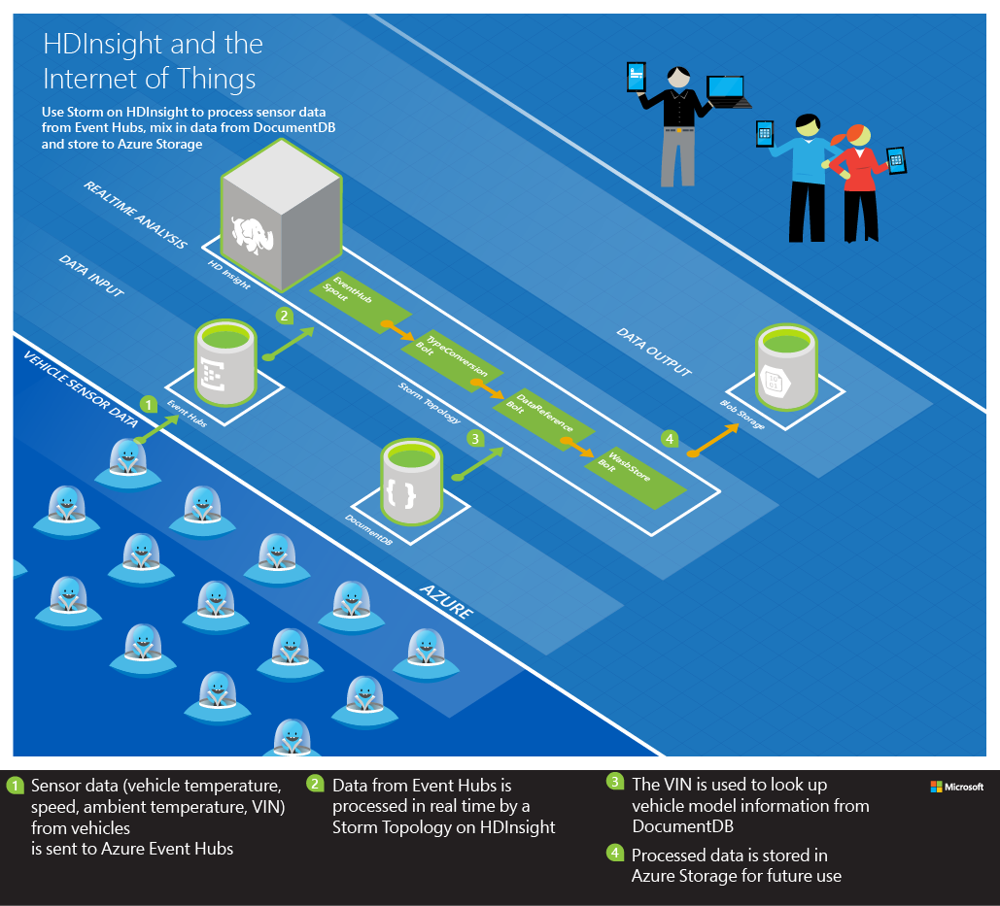

<properties
 pageTitle="Traiter les données de capteur véhicule avec vague d’Apache sur HDInsight | Microsoft Azure"
 description="Découvrez comment traiter les données de capteur véhicule de Hubs événement à l’aide de vague d’Apache sur HDInsight. Ajouter des données de modèle à partir de DocumentDB et stocker la sortie au stockage."
 services="hdinsight,documentdb,notification-hubs"
 documentationCenter=""
 authors="Blackmist"
 manager="jhubbard"
 editor="cgronlun"/>

<tags
ms.service="hdinsight"
ms.devlang="java"
ms.topic="article"
ms.tgt_pltfrm="na"
ms.workload="big-data"
ms.date="08/23/2016"
ms.author="larryfr"/>

#Traiter des données de capteur véhicule à partir d’Azure événement Hubs à l’aide de vague d’Apache sur HDInsight

Découvrez comment traiter les données de capteur véhicule à partir d’Azure événement Hubs à l’aide de vague d’Apache sur HDInsight. Cet exemple lit les données de capteur d’Azure événement Hubs enrichit les données en faisant référence à des données stockées dans Azure DocumentDB et enfin stocke les données dans le stockage Azure à l’aide du système de fichier Hadoop (HDFS).

##Vue d’ensemble

Ajout de capteurs à véhicules permet de prévoir les problèmes d’équipement basés sur les tendances de données historiques, ainsi que pour améliorer les versions futures basées sur l’analyse de motif de l’utilisation. Si traditionnel traitement par lots de MapReduce peut être utilisé pour cette analyse, vous devez pouvoir rapidement et efficacement charger les données de tous les véhicules Hadoop que MapReduce traitement puisse avoir lieu. En outre, vous souhaiterez peut-être effectuer des analyses pour les chemins critiques échec (température moteur, freins, etc.) en temps réel.

Azure événement Hubs sont conçus pour gérer le volume massif des données générées par capteurs et vague d’Apache sur HDInsight peut être utilisée pour charger et traiter les données avant de les stocker dans HADOOP (sauvegardé par stockage Azure) pour traitement MapReduce supplémentaire.

##Solution

Données de télémétrie de température du moteur, température et la vitesse d’un véhicule sont enregistrées par capteurs, puis envoyés aux événements Hubs ainsi que Identification nombre (du véhicule de la voiture) et un cachet d’heure. À partir de là, une topologie vague d’exécution sur une vague Apache sur HDInsight cluster lit les données, il traite et qu’il stocke dans HADOOP.

Pendant le traitement, le numéro d’identification est utilisée pour récupérer des informations sur le modèle à partir d’Azure DocumentDB. Il est ajouté au flux de données avant d’être stockée.

Les composants utilisés dans la topologie vague de sont :

* **EventHubSpout** - lit les données à partir d’Azure événement Hubs

* **TypeConversionBolt** - convertit la chaîne JSON d’événement Hubs en un tuple contenant les valeurs de données de température du moteur, la température, vitesse, VIN et horodatage

* **DataReferencBolt** - ressemble le modèle de véhicule de DocumentDB à l’aide de la solution VIN

* **WasbStoreBolt** - stocke les données à HADOOP (stockage Azure)

Voici un diagramme de cette solution :

> [AZURE.NOTE] Il s’agit d’un diagramme simplifié et chaque composant de la solution peut avoir plusieurs instances. Par exemple, les plusieurs instances de chaque composant de la topologie sont réparties entre les nœuds dans la vague de sur cluster HDInsight.

##Mise en œuvre

Complète, solution automatisée pour ce scénario est disponible dans le cadre du référentiel [HDInsight-vague de-exemples](https://github.com/hdinsight/hdinsight-storm-examples) sur GitHub. Pour utiliser cet exemple, suivez les étapes de la [IoTExample README. MD](https://github.com/hdinsight/hdinsight-storm-examples/blob/master/IotExample/README.md).

## Étapes suivantes

Pour les autres exemples de topologies vague, voir [exemples de topologies pour vague d’HDInsight](hdinsight-storm-example-topology.md).
