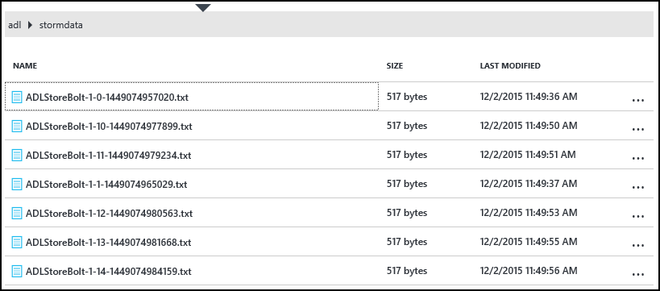
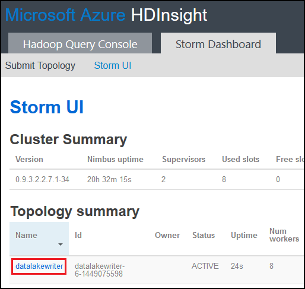

<properties
pageTitle="Utiliser le magasin de Lake de données Azure avec vague d’Apache sur Azure HDInsight"
description="Apprenez à écrire des données au magasin Lake des données Azure à partir d’une topologie vague Apache sur HDInsight. Ce document et l’exemple associé, vous montrer comment le composant HdfsBolt peut être utilisé pour écrire des données Lake Store."
services="hdinsight"
documentationCenter="na"
authors="Blackmist"
manager="jhubbard"
editor="cgronlun"/>

<tags
ms.service="hdinsight"
ms.devlang="na"
ms.topic="article"
ms.tgt_pltfrm="na"
ms.workload="big-data"
ms.date="09/06/2016"
ms.author="larryfr"/>

#Utiliser le magasin de Lake de données Azure avec vague d’Apache avec HDInsight

Azure Data Lake Store est un service de stockage cloud compatible HADOOP qui propose haut débit, de disponibilité, durabilité et fiabilité pour vos données. Dans ce document, vous allez apprendre à utiliser une topologie vague basé sur Java pour écrire des données au magasin Lake des données Azure à l’aide du composant [HdfsBolt](http://storm.apache.org/javadoc/apidocs/org/apache/storm/hdfs/bolt/HdfsBolt.html) , qui est fourni dans le cadre de vague d’Apache.

> [AZURE.IMPORTANT] L’exemple de topologie utilisé dans ce document repose sur les composants qui sont inclus avec vague de sur clusters HDInsight, peuvent nécessiter des modifications pour pouvoir fonctionner avec Azure données Lake Store lorsqu’il est utilisé avec autre cluster Apache vague.

##Conditions préalables

* [Java JDK 1.7](https://www.oracle.com/technetwork/java/javase/downloads/jdk7-downloads-1880260.html) ou version ultérieure
* [Maven 3.x](https://maven.apache.org/download.cgi)
* Un abonnement Azure
* Vague d’une version de cluster HDInsight 3,2. Pour créer une nouvelle vague de sur cluster HDInsight, suivez les étapes dans le document [à l’aide de HDInsight utiliser avec données Lake Store Azure](../data-lake-store/data-lake-store-hdinsight-hadoop-use-portal.md) . Les étapes décrites dans ce document vous guidera dans la création d’un nouveau cluster HDInsight et Azure données Lake Store.  

    > [AZURE.IMPORTANT] Lorsque vous créez le cluster HDInsight, vous devez sélectionner __vague de__ comme type de cluster et __3,2__ en tant que la version. Le système d’exploitation peut être Windows ou Linux.  

###Configurer les variables d’environnement

Variables d’environnement suivantes peuvent être définis lorsque vous installez Java et JDK sur votre poste de développement. Toutefois, vous devez vérifier qu’ils existent et qu’ils contiennent les valeurs correctes pour votre système.

* __JAVA_HOME__ - doivent pointer vers le répertoire où l’environnement d’exécution Java (JRE) est installé. Par exemple, dans une distribution Unix ou Linux, il doit avoir une valeur semblable à `/usr/lib/jvm/java-7-oracle`. Dans Windows, il a la valeur semblable à `c:\Program Files (x86)\Java\jre1.7`.

* __Chemin d’accès__ : doit contenir les chemins d’accès suivants :

    * __JAVA\_famille__ (ou le chemin d’accès équivalent)
    
    * __JAVA\_HOME\bin__ (ou le chemin d’accès équivalent)
    
    * Le répertoire où Maven est installé

##Implémentation de la topologie

L’exemple utilisée dans ce document est écrit en Java et utilise les composants suivants :

* __TickSpout__: génère les données utilisées par d’autres composants de la topologie.

* __PartialCount__: compte les événements générés par TickSpout.

* __FinalCount__: agrégats compter les données à partir de PartialCount.

* __ADLStoreBolt__: écrit des données dans l’aide du composant [HdfsBolt](http://storm.apache.org/javadoc/apidocs/org/apache/storm/hdfs/bolt/HdfsBolt.html) Azure Data Lake Store.

Le projet contenant cette topologie est disponible au téléchargement à partir de [https://github.com/Azure-Samples/hdinsight-storm-azure-data-lake-store](https://github.com/Azure-Samples/hdinsight-storm-azure-data-lake-store).

###Présentation ADLStoreBolt

La ADLStoreBolt est le nom utilisé pour l’instance HdfsBolt dans la topologie écrit dans Azure données Lake. Ce n’est pas une version spéciale de HdfsBolt créé par Microsoft ; Toutefois, il repose sur les valeurs de configuration de site de base, ainsi que les composants Hadoop qui sont inclus dans Azure HDInsight à la communication avec les données Lake.

En particulier, lorsque vous créez un cluster de HDInsight, vous pouvez l’associer à un magasin Lake de données Azure. Cette opération inscrit entrées dans core-site pour le magasin de Lake données que vous avez sélectionné, qui sont utilisées par les composants tels que hadoop client et hadoop Hadoop pour permettre la communication avec les données Lake Store.

> [AZURE.NOTE] Microsoft a collaboré code au Hadoop Apache et aux projets vague qui permet de communiquer avec le stockage Azure Data Lake Store et Blob Azure, mais cette fonctionnalité ne peut pas être incluse par défaut dans autres répartitions Hadoop et vague de.

La configuration de HdfsBolt dans la topologie est la suivante :

    // 1. Create sync and rotation policies to control when data is synched
    //    (written) to the file system and when to roll over into a new file.
    SyncPolicy syncPolicy = new CountSyncPolicy(1000);
    FileRotationPolicy rotationPolicy = new FileSizeRotationPolicy(0.5f, Units.KB);
    // 2. Set the format. In this case, comma delimited
    RecordFormat recordFormat = new DelimitedRecordFormat().withFieldDelimiter(",");
    // 3. Set the directory name. In this case, '/stormdata/'
    FileNameFormat fileNameFormat = new DefaultFileNameFormat().withPath("/stormdata/");
    // 4. Create the bolt using the previously created settings,
    //    and also tell it the base URL to your Data Lake Store.
    // NOTE! Replace 'MYDATALAKE' below with the name of your data lake store.
    HdfsBolt adlsBolt = new HdfsBolt()
        .withFsUrl("adl://MYDATALAKE.azuredatalakestore.net/")
        .withRecordFormat(recordFormat)
        .withFileNameFormat(fileNameFormat)
        .withRotationPolicy(rotationPolicy)
        .withSyncPolicy(syncPolicy);
    // 4. Give it a name and wire it up to the bolt it accepts data
    //    from. NOTE: The name used here is also used as part of the
    //    file name for the files written to Data Lake Store.
    builder.setBolt("ADLStoreBolt", adlsBolt, 1)
      .globalGrouping("finalcount");
      
Si vous êtes habitué à l’aide de HdfsBolt, vous remarquerez qu’il s’agit de toute la configuration assez standard à l’exception de l’URL. L’URL ne fournit le chemin d’accès à la racine de votre magasin Lake de données Azure.

Dans la mesure où écriture au magasin des données Lake utilise HdfsBolt et est un changement d’URL, vous devriez pouvoir prendre n’importe quelle topologie existant écrit dans HDFS ou WASB à l’aide de HdfsBolt et facilement le modifier pour qu’elle utilise Azure données Lake magasin.

##Générer et empaqueter la topologie

1. Télécharger l’exemple de projet à partir de [https://github.com/Azure-Samples/hdinsight-storm-azure-data-lake-store](https://github.com/Azure-Samples/hdinsight-storm-azure-data-lake-store
) pour votre environnement de développement.

2. Ouvrir le `StormToDataLake\src\main\java\com\microsoft\example\StormToDataLakeStore.java` dans un éditeur et recherchez la ligne qui contient `.withFsUrl("adl://MYDATALAKE.azuredatalakestore.net/")`. Modifier __MYDATALAKE__ le nom de la banque d’informations données Azure Lake vous avez utilisé lors de la création de votre serveur HDInsight.

3. À partir d’une commande invite, terminal ou session shell, accédez à la racine du projet téléchargé et exécutez les commandes suivantes pour générer et empaqueter la topologie.

        mvn compile
        mvn package
    
    Une fois la génération et l’emballage terminée, il y ait un répertoire nommé `target`, qui contient un fichier nommé `StormToDataLakeStore-1.0-SNAPSHOT.jar`. Cet onglet contient la topologie compilée.

##Déployer et exécuter sur HDInsight basé sur Linux

Si vous avez créé une vague de basé sur Linux sur cluster HDInsight, suivez les étapes ci-dessous pour déployer et exécuter la topologie.

1. Utilisez la commande suivante pour copier la topologie pour le cluster HDInsight. Remplacez __utilisateur__ par le nom d’utilisateur SSH utilisée pour créer le cluster. Remplacez __NOMDUCLUSTER__ par le nom du cluster.

        scp target\StormToDataLakeStore-1.0-SNAPSHOT.jar USER@CLUSTERNAME-ssh.azurehdinsight.net:StormToDataLakeStore-1.0-SNAPSHOT.jar
    
    Lorsque vous y êtes invité, entrez le mot de passe utilisé lors de la création de l’utilisateur SSH pour le cluster. Si vous avez utilisé une clé publique au lieu d’un mot de passe, vous devrez peut-être utiliser les `-i` paramètre pour spécifier le chemin d’accès à la clé privée correspondante.
    
    > [AZURE.NOTE] Si vous utilisez un client Windows pour le développement, vous disposez ne peut-être pas un `scp` commande. Si Oui, vous pouvez utiliser `pscp`, qui est disponible à partir de [http://www.chiark.greenend.org.uk/~sgtatham/putty/download.html](http://www.chiark.greenend.org.uk/~sgtatham/putty/download.html).

2. Une fois le téléchargement terminé, utilisez les éléments suivants pour vous connecter au cluster HDInsight à l’aide de SSH. Remplacez __utilisateur__ par le nom d’utilisateur SSH utilisée pour créer le cluster. Remplacez __NOMDUCLUSTER__ par le nom du cluster.

        ssh USER@CLUSTERNAME-ssh.azurehdinsight.net

    Lorsque vous y êtes invité, entrez le mot de passe utilisé lors de la création de l’utilisateur SSH pour le cluster. Si vous avez utilisé une clé publique au lieu d’un mot de passe, vous devrez peut-être utiliser les `-i` paramètre pour spécifier le chemin d’accès à la clé privée correspondante.
    
    > [AZURE.NOTE] Si vous utilisez un client Windows pour le développement, suivez les informations [se connecter à HDInsight basé sur Linux avec SSH à partir de Windows](hdinsight-hadoop-linux-use-ssh-windows.md) pour plus d’informations l’aide du client mastic pour vous connecter au cluster.
    
3. Une fois connecté, utilisez les éléments suivants pour démarrer la topologie :

        storm jar StormToDataLakeStore-1.0-SNAPSHOT.jar com.microsoft.example.StormToDataLakeStore datalakewriter
    
    Démarre la topologie avec un nom convivial de `datalakewriter`.

##Déployer et exécuter sur HDInsight fonctionnant sous Windows

1. Ouvrez un navigateur web et accédez à HTTPS://CLUSTERNAME.azurehdinsight.net, où __CLUSTERNAME__ est le nom de votre cluster HDInsight. Lorsque vous y êtes invité, fournir le nom d’utilisateur d’administration (`admin`) et le mot de passe que vous avez utilisé pour ce compte lorsque le cluster a été créé.

2. Dans le tableau de bord vague de, sélectionnez __Parcourir__ dans la liste déroulante __Fichier Jar__ , puis sélectionnez le fichier StormToDataLakeStore-1.0-SNAPSHOT.jar à partir de la `target` répertoire. Pour les autres entrées dans le formulaire, utilisez les valeurs suivantes :

    * Nom de la classe : com.microsoft.example.StormToDataLakeStore
    * Paramètres supplémentaires : datalakewriter
    
    

3. Sélectionnez le bouton __Envoyer__ pour télécharger et démarrer la topologie. Le champ de résultat sous le bouton __Envoyer__ doit afficher informations semblables au suivant une fois que la topologie a démarré :

        Process exit code: 0
        Currently running topologies:
        Topology_name        Status     Num_tasks  Num_workers  Uptime_secs
        -------------------------------------------------------------------
        datalakewriter       ACTIVE     68         8            10        

##Afficher les données de sortie

Il existe plusieurs méthodes pour afficher les données. Dans cette section, nous utilisons le portail Azure et la `hdfs` commande pour afficher les données.

> [AZURE.NOTE] Vous devez autoriser les topologies lancer plusieurs minutes avant de vérifier les données de sortie, afin que les données a été synchronisée avec plusieurs fichiers sur Azure données Lake Store.

* __À partir du [Portail Azure](https://portal.azure.com)__: dans le portail, sélectionnez le magasin de Lake données Azure que vous avez utilisé avec HDInsight.

    > [AZURE.NOTE] Si vous ne pas épingler le magasin de Lake données au tableau de bord du portail Azure, vous la trouverez en sélectionnant __Parcourir__ en bas de la liste à gauche, puis __Données Lake Store__, puis enfin le magasin.
    
    Dans les icônes en haut de la banque Lake de données, sélectionnez __Explorateur de données__.
    
    
    
    Ensuite, sélectionnez le dossier __stormdata__ . Une liste des fichiers texte doit être affichée.
    
    
    
    Sélectionnez une des fichiers pour afficher son contenu.

* __À partir du cluster__: Si vous vous êtes connecté au cluster HDInsight à l’aide de SSH (cluster Linux) ou de bureau à distance (cluster Windows), vous pouvez utiliser les éléments suivants pour afficher les données. Remplacez __DATALAKE__ par le nom de votre Lake données.

        hdfs dfs -cat adl://DATALAKE.azuredatalakestore.net/stormdata/*.txt

    Cela concatène les fichiers texte stockés dans l’annuaire et afficher des informations similaires à ce qui suit :
    
        406000000
        407000000
        408000000
        409000000
        410000000
        411000000
        412000000
        413000000
        414000000
        415000000
        
##Arrêter la topologie

Topologies vague seront exécute jusqu'à l’arrêt ou le cluster est supprimé. Pour arrêter les topologies, utilisez les informations suivantes.

__Pour HDInsight basé sur Linux__:

À partir d’une session SSH pour le cluster, utilisez la commande suivante :

    storm kill datalakewriter

__Pour HDInsight fonctionnant sous Windows__:

1. Dans le tableau de bord vague de (https://CLUSTERNAME.azurehdinsight.net), sélectionnez le lien __Vague d’interface utilisateur__ en haut de la page.

2. Une fois que l’interface utilisateur vague d’est chargée, sélectionnez le lien __datalakewriter__ .

    

3. Dans la section __Topologie Actions__ , sélectionnez __Supprimer__ , puis sélectionnez OK dans la boîte de dialogue qui s’affiche.

    

## Supprimer votre cluster

[AZURE.INCLUDE [delete-cluster-warning](../../includes/hdinsight-delete-cluster-warning.md)]

##Étapes suivantes

À présent que vous avez appris à utiliser vague d’écrire au magasin Lake des données Azure, découvrez d’autres [exemples de vague pour HDInsight](hdinsight-storm-example-topology.md).
