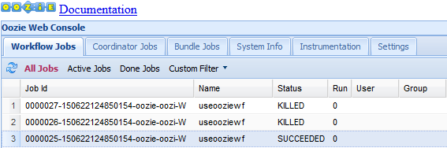
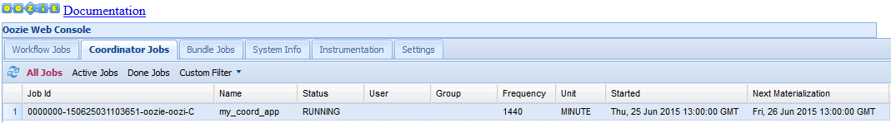

<properties
    pageTitle="Utiliser des flux de travail Hadoop Oozie dans basé sur Linux HDInsight | Microsoft Azure"
    description="Suivez Hadoop Oozie HDInsight basé sur Linux. Découvrez comment définir un flux de travail Oozie et envoyez une tâche Oozie."
    services="hdinsight"
    documentationCenter=""
    authors="Blackmist"
    manager="jhubbard"
    editor="cgronlun"
    tags="azure-portal"/>

<tags
    ms.service="hdinsight"
    ms.workload="big-data"
    ms.tgt_pltfrm="na"
    ms.devlang="na"
    ms.topic="article"
    ms.date="10/11/2016"
    ms.author="larryfr"/>

# Utiliser Oozie avec Hadoop pour définir et exécuter un flux de travail basés sur Linux HDInsight

[AZURE.INCLUDE [oozie-selector](../../includes/hdinsight-oozie-selector.md)]

Découvrez comment Apache Oozie permet de définir un flux de travail qui utilise Hive et Sqoop, puis exécutez le flux de travail sur un cluster HDInsight basé sur Linux.

Oozie Apache est un système de flux de travail/débute qui gère les travaux Hadoop. Il est intégré à la pile Hadoop, et il prend en charge Hadoop travaux pour Apache MapReduce cochon Apache, Apache ruche et Apache Sqoop. Il peut également être utilisé pour planifier des tâches spécifiques à un système, tels que les programmes Java ou des scripts shell

> [AZURE.NOTE] Une autre option pour la définition de flux de travail avec HDInsight est Azure Data Factory. Pour en savoir plus sur Azure Data Factory, voir [utiliser cochon et Hive avec Data Factory][azure-data-factory-pig-hive].

##Conditions préalables

Avant de commencer ce didacticiel, vous devez disposer des éléments suivants :

- **Abonnement un Azure**: voir [Azure obtenir la version d’évaluation gratuite](https://azure.microsoft.com/pricing/free-trial/).

- **Azure infrastructure du langage commun**: voir [installer et configurer l’infrastructure du langage commun Azure](../xplat-cli-install.md)
    
    [AZURE.INCLUDE [use-latest-version](../../includes/hdinsight-use-latest-cli.md)]

- **HDInsight un cluster**: voir [Prise en main HDInsight sous Linux](hdinsight-hadoop-linux-tutorial-get-started.md)

- **Base de données SQL Azure un**: sera créé, la procédure décrite dans ce document

##Exemple de processus

Le flux de travail que vous allez implémenter en suivant les instructions de ce document contient deux actions. Actions sont des définitions de tâches, telles que Hive, Sqoop, MapReduce ou un autre processus en cours d’exécution :

![Diagramme de flux de travail][img-workflow-diagram]

1. Une action Hive exécute un script HiveQL pour extraire des enregistrements à partir de la **hivesampletable** inclus avec HDInsight. Chaque ligne de données décrit une visite d’un appareil mobile spécifique. Le format d’enregistrement doit ressembler à ce qui suit :

        8       18:54:20        en-US   Android Samsung SCH-i500        California     United States    13.9204007      0       0
        23      19:19:44        en-US   Android HTC     Incredible      Pennsylvania   United States    NULL    0       0
        23      19:19:46        en-US   Android HTC     Incredible      Pennsylvania   United States    1.4757422       0       1

    Le script Hive utilisé dans ce document compte le nombre total de visites pour chaque plate-forme (par exemple, Android ou iPhone) et stocke les nombres dans une nouvelle table Hive.

    Pour plus d’informations sur Hive, voir [Utiliser la ruche avec HDInsight][hdinsight-use-hive].

2.  Une action Sqoop exporte le contenu de la nouvelle table Hive à une table dans une base de données SQL Azure. Pour plus d’informations sur Sqoop, voir [Utiliser Hadoop Sqoop avec HDInsight][hdinsight-use-sqoop].

> [AZURE.NOTE] Versions Oozie prises en charge sur les clusters HDInsight, voir [Quelles sont les nouveautés dans les versions de cluster Hadoop fournies par HDInsight ?] [hdinsight-versions].

##Créer le répertoire de travail

Oozie attend ressources requises pour une tâche stocké dans le même répertoire. Cet exemple utilise **wasbs : / / didacticiels/useoozie**. Utilisez la commande suivante pour créer ce répertoire et le répertoire de données qui contiendra la nouvelle table Hive créée par ce flux de travail :

    hdfs dfs -mkdir -p /tutorials/useoozie/data

> [AZURE.NOTE] La `-p` paramètre poussé tous les répertoires dans le chemin d’accès à être créées si elles n’existent pas déjà. Le répertoire de **données** permet de conserver les données utilisées par le script **useooziewf.hql** .

Également exécuter la commande suivante, qui garantit que Oozie peut se faire passer votre compte d’utilisateur lors de l’exécution des travaux Hive et Sqoop. Remplacez **nom_utilisateur** par votre nom d’utilisateur :

    sudo adduser USERNAME users

Si vous recevez une erreur indiquant que l’utilisateur est déjà membre du groupe utilisateurs, vous pouvez simplement l’ignorer.

##Ajouter un pilote de base de données

Étant donné que ce flux de travail utilise Sqoop pour exporter des données à la base de données SQL, vous devez fournir une copie du pilote JDBC utilisée pour communiquer avec la base de données SQL. Utilisez la commande suivante pour le copier dans le répertoire de travail :

    hdfs dfs -copyFromLocal /usr/share/java/sqljdbc_4.1/enu/sqljdbc*.jar /tutorials/useoozie/

Si votre flux de travail utilisé d’autres ressources, par exemple un fichier jar contenant une application MapReduce, vous devrez ajoutez également ces conditions.

##Définir la requête Hive

Procédez comme suit pour créer un script HiveQL qui définit une requête qui sera utilisée dans un flux de travail Oozie plus loin dans ce document.

1. Utiliser le protocole SSH pour vous connecter au cluster HDInsight basé sur Linux :

    * **Les clients Linux, Unix ou OS X**: voir [Utiliser SSH avec basé sur Linux Hadoop sur HDInsight de Linux, OS X ou Unix](hdinsight-hadoop-linux-use-ssh-unix.md)

    * **Les clients Windows**: consultez [Utiliser SSH avec basé sur Linux Hadoop sur HDInsight à partir de Windows](hdinsight-hadoop-linux-use-ssh-windows.md)

2. Utilisez la commande suivante pour créer un nouveau fichier :

        nano useooziewf.hql

1. Une fois que l’éditeur nano s’ouvre, utilisez ce qui suit le contenu du fichier :

        DROP TABLE ${hiveTableName};
        CREATE EXTERNAL TABLE ${hiveTableName}(deviceplatform string, count string) ROW FORMAT DELIMITED
        FIELDS TERMINATED BY '\t' STORED AS TEXTFILE LOCATION '${hiveDataFolder}';
        INSERT OVERWRITE TABLE ${hiveTableName} SELECT deviceplatform, COUNT(*) as count FROM hivesampletable GROUP BY deviceplatform;

    Il existe deux variables utilisées dans le script :

    - **${hiveTableName}**: contient le nom du tableau doit être créé
    - **${hiveDataFolder}**: contiendra l’emplacement où stocker les fichiers de données pour la table

    Le fichier de définition du flux de travail (workflow.xml dans ce didacticiel) passe ces valeurs à ce script HiveQL en cours d’exécution.

2. Appuyez sur Ctrl + X pour quitter l’éditeur. Lorsque vous y êtes invité, sélectionnez **Y** enregistrer le fichier, puis utilisez **entrée** pour utiliser le nom de fichier **useooziewf.hql** .

3. Utilisez les commandes suivantes pour copier **useooziewf.hql** vers **wasbs:///tutorials/useoozie/useooziewf.hql**:

        hdfs dfs -copyFromLocal useooziewf.hql /tutorials/useoozie/useooziewf.hql

    Ces commandes stockent le fichier **useooziewf.hql** sur le compte de stockage Azure associé à ce cluster, ce qui permet de conserver le fichier même si le cluster est supprimé. Permet de réaliser des économies en supprimant clusters lorsqu’ils ne sont pas en cours d’utilisation, tout en conservant vos tâches et les flux de travail.

##Définir le flux de travail

Définitions des flux de travail Oozie sont écrits en hPDL (un XML Process Definition Language). Utilisez les étapes suivantes pour définir le flux de travail :

1. L’instruction suivante permet de créer et modifier un fichier :

        nano workflow.xml

1. Une fois que l’éditeur nano s’ouvre, entrez les informations suivantes en tant que le contenu du fichier :

        <workflow-app name="useooziewf" xmlns="uri:oozie:workflow:0.2">
            <start to = "RunHiveScript"/>
            <action name="RunHiveScript">
            <hive xmlns="uri:oozie:hive-action:0.2">
                <job-tracker>${jobTracker}</job-tracker>
                <name-node>${nameNode}</name-node>
                <configuration>
                <property>
                    <name>mapred.job.queue.name</name>
                    <value>${queueName}</value>
                </property>
                </configuration>
                
                <param>hiveTableName=${hiveTableName}</param>
                <param>hiveDataFolder=${hiveDataFolder}</param>
            </hive>
            <ok to="RunSqoopExport"/>
            <error to="fail"/>
            </action>
            <action name="RunSqoopExport">
            <sqoop xmlns="uri:oozie:sqoop-action:0.2">
                <job-tracker>${jobTracker}</job-tracker>
                <name-node>${nameNode}</name-node>
                <configuration>
                <property>
                    <name>mapred.compress.map.output</name>
                    <value>true</value>
                </property>
                </configuration>
                <arg>export</arg>
                <arg>--connect</arg>
                <arg>${sqlDatabaseConnectionString}</arg>
                <arg>--table</arg>
                <arg>${sqlDatabaseTableName}</arg>
                <arg>--export-dir</arg>
                <arg>${hiveDataFolder}</arg>
                <arg>-m</arg>
                <arg>1</arg>
                <arg>--input-fields-terminated-by</arg>
                <arg>"\t"</arg>
                <archive>sqljdbc41.jar</archive>
                </sqoop>
            <ok to="end"/>
            <error to="fail"/>
            </action>
            <kill name="fail">
            <message>Job failed, error message[${wf:errorMessage(wf:lastErrorNode())}] </message>
            </kill>
            <end name="end"/>
        </workflow-app>

    Il existe deux actions définies dans le flux de travail :

    - **RunHiveScript**: il s’agit de l’action Démarrer et s’exécute le script Hive **useooziewf.hql**

    - **RunSqoopExport**: cette commande exporte les données créées à partir du script Hive à SQL de base de données à l’aide de Sqoop. Cela ne fonctionne que si l’action **RunHiveScript** réussit.

        > [AZURE.NOTE] Pour plus d’informations sur les flux de travail Oozie et utiliser les actions de flux de travail, voir [documentation Apache Oozie 4.0] [ apache-oozie-400] (pour HDInsight version 3.0) ou la [documentation Apache Oozie 3.3.2] [ apache-oozie-332] (pour HDInsight version 2.1).

    Notez que le flux de travail a plusieurs entrées, tel que `${jobTracker}`, qui seront remplacées par les valeurs que vous utilisez dans la définition de travail plus loin dans ce document.

    Notez également la `<archive>sqljdbc4.jar</arcive>` entrée dans la section Sqoop. Cela indique Oozie disponibilité cette archive pour Sqoop lors de l’exécution de cette action.

2. Utilisez Ctrl-X, **Y** puis appuyer sur **entrée** pour enregistrer le fichier.

3. Utilisez la commande suivante pour copier le fichier **workflow.xml** vers **wasbs:///tutorials/useoozie/workflow.xml**:

        hdfs dfs -copyFromLocal workflow.xml /tutorials/useoozie/workflow.xml

##Créer la base de données

Suivez les étapes décrites dans le document de [créer une base de données SQL](../sql-database/sql-database-get-started.md) pour créer une nouvelle base de données. Lorsque vous créez la base de données, utilisez __oozietest__ comme nom de base de données. Notez également du nom utilisé pour le serveur de base de données, comme cela sera nécessaire dans la section suivante.

###Créer une table

> [AZURE.NOTE] Il existe de nombreuses façons de se connecter à la base de données SQL pour créer une table. Les étapes suivantes utilisent [FreeTDS](http://www.freetds.org/) du cluster HDInsight.

3. Utilisez la commande suivante pour installer FreeTDS sur le cluster HDInsight :

        sudo apt-get --assume-yes install freetds-dev freetds-bin

4. Une fois FreeTDS a été installé, utilisez la commande suivante pour vous connecter au serveur de base de données SQL que vous avez créé précédemment :

        TDSVER=8.0 tsql -H <serverName>.database.windows.net -U <sqlLogin> -P <sqlPassword> -p 1433 -D oozietest

    Vous recevrez une sortie similaire à ce qui suit :

        locale is "en_US.UTF-8"
        locale charset is "UTF-8"
        using default charset "UTF-8"
        Default database being set to oozietest
        1>

5. À la `1>` invite, entrez les lignes suivantes :

        CREATE TABLE [dbo].[mobiledata](
        [deviceplatform] [nvarchar](50),
        [count] [bigint])
        GO
        CREATE CLUSTERED INDEX mobiledata_clustered_index on mobiledata(deviceplatform)
        GO

    Lorsque la `GO` instruction est entrée, les instructions précédentes seront évaluées. Cela crée une nouvelle table nommée **mobiledata** qui seront écrites dans en Sqoop.

    Pour vérifier que la table a été créée, utilisez ce qui suit :

        SELECT * FROM information_schema.tables
        GO

    Vous devriez voir sortie similaire à ce qui suit :

        TABLE_CATALOG   TABLE_SCHEMA    TABLE_NAME      TABLE_TYPE
        oozietest       dbo     mobiledata      BASE TABLE

8. Entrez `exit` à la `1>` invite pour quitter l’utilitaire tsql.

##Créer la définition de travail

La définition du travail explique où trouver workflow.xml, ainsi que d’autres fichiers utilisés par le flux de travail (par exemple, useooziewf.hql.) Il définit également les valeurs de propriétés utilisées dans le flux de travail et les fichiers associés.

1. Utilisez la commande suivante pour obtenir l’adresse complète WASB au stockage par défaut. Il sera utilisé dans le fichier de configuration dans un moment :

        sed -n '/<name>fs.default/,/<\/value>/p' /etc/hadoop/conf/core-site.xml

    Cela doit renvoyer des informations similaires à ce qui suit :

        <name>fs.defaultFS</name>
        <value>wasbs://mycontainer@mystorageaccount.blob.core.windows.net</value>

    Enregistrer le **wasbs://mycontainer@mystorageaccount.blob.core.windows.net** valeur, car il sera utilisé dans les étapes suivantes.

2. Utilisez la commande suivante pour obtenir le nom de domaine complet de la headnode cluster. Il sera utilisé pour l’adresse JobTracker pour le cluster. Il sera utilisé dans le fichier de configuration dans un moment :

        hostname -f

    Ceci renvoie des informations semblables à ce qui suit :

        hn0-CLUSTERNAME.randomcharacters.cx.internal.cloudapp.net

    Le port utilisé pour la JobTracker étant 8050, l’adresse complète à utiliser pour la JobTracker aura **hn0 CLUSTERNAME.randomcharacters.cx.internal.cloudapp.net:8050**.

1. Utilisez ce qui suit pour créer la configuration de la définition du travail Oozie :

        nano job.xml

2. Une fois que l’éditeur nano s’ouvre, utilisez ce qui suit le contenu du fichier :

        <?xml version="1.0" encoding="UTF-8"?>
        <configuration>

          <property>
            <name>nameNode</name>
            <value>wasbs://mycontainer@mystorageaccount.blob.core.windows.net</value>
          </property>

          <property>
            <name>jobTracker</name>
            <value>JOBTRACKERADDRESS</value>
          </property>

          <property>
            <name>queueName</name>
            <value>default</value>
          </property>

          <property>
            <name>oozie.use.system.libpath</name>
            <value>true</value>
          </property>

          <property>
            <name>hiveScript</name>
            <value>wasbs://mycontainer@mystorageaccount.blob.core.windows.net/tutorials/useoozie/useooziewf.hql</value>
          </property>

          <property>
            <name>hiveTableName</name>
            <value>mobilecount</value>
          </property>

          <property>
            <name>hiveDataFolder</name>
            <value>wasbs://mycontainer@mystorageaccount.blob.core.windows.net/tutorials/useoozie/data</value>
          </property>

          <property>
            <name>sqlDatabaseConnectionString</name>
            <value>"jdbc:sqlserver://serverName.database.windows.net;user=adminLogin;password=adminPassword;database=oozietest"</value>
          </property>

          <property>
            <name>sqlDatabaseTableName</name>
            <value>mobiledata</value>
          </property>

          <property>
            <name>user.name</name>
            <value>YourName</value>
          </property>

          <property>
            <name>oozie.wf.application.path</name>
            <value>wasbs://mycontainer@mystorageaccount.blob.core.windows.net/tutorials/useoozie</value>
          </property>
        </configuration>

    * Remplacez toutes les instances de **wasbs://mycontainer@mystorageaccount.blob.core.windows.net** avec la valeur que vous avez reçu précédemment.

    > [AZURE.WARNING] Vous devez utiliser le chemin d’accès complet WASB, avec le compte de stockage et le conteneur dans le cadre de la trajectoire. En utilisant le format court (wasbs : / / /) va entraîner l’action RunHiveScript échec quand le travail est démarré.

    * Remplacez **JOBTRACKERADDRESS** par l’adresse JobTracker/ResourceManager que vous avez reçu précédemment.

    * Remplacez **votre_nom** par votre nom d’utilisateur pour le cluster HDInsight.

    * Remplacez le **nom du serveur**, **adminLogin**et **adminPassword** avec les informations relatives à votre base de données SQL Azure.

    La plupart des informations de ce fichier est utilisé pour remplir les valeurs utilisées dans les fichiers workflow.xml ou ooziewf.hql (par exemple, ${nameNode}.)

    > [AZURE.NOTE] L’entrée **oozie.wf.application.path** définit où trouver le fichier workflow.xml, qui contient le flux de travail exécuté par cette tâche.

2. Utilisez Ctrl-X, **Y** puis appuyer sur **entrée** pour enregistrer le fichier.

##Envoyer et gérer le travail

Les étapes suivantes utilisent la commande Oozie pour envoyer et gérer des flux de travail Oozie sur le cluster. La commande Oozie est une interface conviviale via l' [API REST Oozie](https://oozie.apache.org/docs/4.1.0/WebServicesAPI.html).

> [AZURE.IMPORTANT] Lorsque vous utilisez la commande Oozie, vous devez utiliser le nom de domaine complet pour le headnode HDInsight. Ce nom de domaine complet est uniquement accessible à partir du cluster, ou si le cluster se trouve sur un réseau virtuel Azure, à partir d’autres ordinateurs sur le même réseau.

1. Pour obtenir l’URL du service Oozie, utilisez ce qui suit :

        sed -n '/<name>oozie.base.url/,/<\/value>/p' /etc/oozie/conf/oozie-site.xml

    Cela renverra une valeur semblable à ce qui suit :

        <name>oozie.base.url</name>
        <value>http://hn0-CLUSTERNAME.randomcharacters.cx.internal.cloudapp.net:11000/oozie</value>

    La partie **http://hn0-CLUSTERNAME.randomcharacters.cx.internal.cloudapp.net:11000/oozie** est l’URL à utiliser avec la commande Oozie.

2. Ce qui suit permet de créer une variable d’environnement pour l’URL, pour ne pas avoir à taper pour chaque commande :

        export OOZIE_URL=http://HOSTNAMEt:11000/oozie

    Remplacez l’URL avec l’option que vous avez reçu précédemment.

3. Utilisez ce qui suit pour soumettre la tâche :

        oozie job -config job.xml -submit

    Cela charge les informations de projet à partir de **job.xml** et il a été envoyé à Oozie, mais ne s’exécute pas.

    Une fois la commande terminée, elle doit renvoyer l’ID de la tâche. Par exemple, `0000005-150622124850154-oozie-oozi-W`. Cela servira à gérer le travail.

4. Affichez l’état de la tâche à l’aide de la commande suivante. Entrez l’ID du travail renvoyée par la commande précédente :

        oozie job -info <JOBID>

    Cela renvoie des informations semblables à ce qui suit.

        Job ID : 0000005-150622124850154-oozie-oozi-W
        ------------------------------------------------------------------------------------------------------------------------------------
        Workflow Name : useooziewf
        App Path      : wasbs:///tutorials/useoozie
        Status        : PREP
        Run           : 0
        User          : USERNAME
        Group         : -
        Created       : 2015-06-22 15:06 GMT
        Started       : -
        Last Modified : 2015-06-22 15:06 GMT
        Ended         : -
        CoordAction ID: -
        ------------------------------------------------------------------------------------------------------------------------------------

    Cette tâche a le statut `PREP`, qui indique qu’il a été envoyé, mais n’a pas encore commencé.

4. Pour démarrer la tâche, utilisez ce qui suit :

        oozie job -start JOBID

    Si vous vérifiez l’état après cette commande, qu’il soit en cours d’exécution et informations sont renvoyées pour les actions au sein de la tâche.

5. Une fois que la tâche est terminée avec succès, vous pouvez vérifier que les données a été générées et exportées à la table de base de données SQL à l’aide des commandes suivantes :

        TDSVER=8.0 tsql -H <serverName>.database.windows.net -U <adminLogin> -P <adminPassword> -p 1433 -D oozietest

    À la `1>` invite, entrez les informations suivantes :

        SELECT * FROM mobiledata
        GO

    Vous recevrez des informations similaires à ce qui suit :

        deviceplatform  count
        Android 31591
        iPhone OS       22731
        proprietary development 3
        RIM OS  3464
        Unknown 213
        Windows Phone   1791
        (6 rows affected)

Pour plus d’informations sur la commande Oozie, voir [Outil de ligne de commande Oozie](https://oozie.apache.org/docs/4.1.0/DG_CommandLineTool.html).

##API REST Oozie

L’API REST Oozie permettent de créer vos propres outils fonctionnant avec Oozie. HDInsight des informations spécifiques sur l’utilisation de l’API REST Oozie sont les suivantes :

* **URI**: l’API REST accessibles à partir de l’extérieur du cluster en`https://CLUSTERNAME.azurehdinsight.net/oozie`

* **Authentification**: vous devez vous authentifier à l’API en utilisant le compte cluster HTTP (administrateur) et le mot de passe. Par exemple :

        curl -u admin:PASSWORD https://CLUSTERNAME.azurehdinsight.net/oozie/versions

Pour plus d’informations sur l’utilisation de l’API REST Oozie, voir [API de Services Web Oozie](https://oozie.apache.org/docs/4.1.0/WebServicesAPI.html).

##Interface utilisateur Oozie Web

L’interface utilisateur Web Oozie fournit une vue basée sur le web dans l’état des travaux Oozie sur le cluster. Elle permet d’afficher le statut de la tâche, la définition de travail, la configuration, un graphique des actions dans les tâches et les journaux de la tâche. Vous pouvez également afficher les détails des actions au sein d’une tâche.

Pour accéder à l’interface utilisateur Web Oozie, procédez comme suit :

1. Créer un tunnel SSH pour le cluster HDInsight. Pour plus d’informations sur la façon de procéder, voir [Utiliser SSH tunnel pour accéder à l’interface utilisateur Ambari web, ResourceManager, JobHistory, NameNode, Oozie et autres web l’interface utilisateur](hdinsight-linux-ambari-ssh-tunnel.md).

2. Une fois un tunnel a été créé, ouvrez l’interface utilisateur du web Ambari dans votre navigateur web. L’URI pour le site Ambari est **https://CLUSTERNAME.azurehdinsight.net**. Remplacez **NOMDUCLUSTER** par le nom de votre cluster HDInsight basé sur Linux.

3. À partir du bord gauche de la page, sélectionnez **Oozie**, **Liens rapides**et **L’interface utilisateur de Oozie Web**.

    

4. L’interface utilisateur Web Oozie par défaut à l’affichage de tâches de flux de travail en cours d’exécution. Pour afficher toutes les tâches de flux de travail, sélectionnez **Toutes les tâches**.

    

5. Sélectionnez une tâche pour afficher plus d’informations sur la tâche.

    

6. Sous l’onglet Infos travail, vous pouvez afficher des informations sur l’impression de base, ainsi que les actions spécifiques au sein de la tâche. En utilisant les onglets dans la partie supérieure, vous pouvez visualiser l’accès de définition de travail, Configuration des tâches, le journal de travail ou afficher un dirigé acycliques Graph (DAG) de la tâche.

    * **Journal de travaux**: sélectionnez le bouton **GetLogs** pour obtenir tous les journaux de la tâche, ou utilisez le champ **Permet d’entrer un filtre de recherche** pour filtrer les journaux

        

    * **JobDAG**: le DAG est une représentation graphique des chemins d’accès aux données redirigé vers le flux de travail

        

7. Sélection d’une des actions à partir de l’onglet **Infos travail** affichera des informations sur l’action. Par exemple, sélectionnez l’action **RunHiveScript** .

    

8. Vous pouvez afficher les détails de l’action, notamment un lien vers l' **URL de la Console**, qui peut être utilisé pour afficher des informations JobTracker pour la tâche.

##Planification des tâches

Le coordinateur vous permet de spécifier un début, fin et fréquence occurrence pour les tâches afin qu’elles puissent être planifiées pour certaines heures.

Pour définir un planning pour le flux de travail, procédez comme suit :

1. Utilisez ce qui suit pour créer un nouveau fichier nommé **coordinator.xml**:

        nano coordinator.xml

    En tant que le contenu du fichier, utilisez ce qui suit :

        <coordinator-app name="my_coord_app" frequency="${coordFrequency}" start="${coordStart}" end="${coordEnd}" timezone="${coordTimezone}" xmlns="uri:oozie:coordinator:0.4">
          <action>
            <workflow>
              <app-path>${workflowPath}</app-path>
            </workflow>
          </action>
        </coordinator-app>

    Notez que cette option utilise `${...}` variables seront remplacées par les valeurs de la définition de travail. Les variables sont :

    * **${coordFrequency}**: délai entre l’exécution d’instances de la tâche
    * **${coordStart}**: heure de début de la tâche
    * **${coordEnd}**: l’heure de fin de tâche
    * **${coordTimezone}**: coordinateur tâches sont dans un fuseau horaire fixe avec sans heure (généralement représentée à l’aide de UTC). Ce fuseau horaire est appelé le « Oozie traitement fuseau horaire »
    * **${wfPath}**: le chemin d’accès workflow.xml

2. Utilisez Ctrl-X, **Y** puis appuyer sur **entrée** pour enregistrer le fichier.

3. Pour le copier dans le répertoire de travail pour cette tâche, utilisez ce qui suit :

        hadoop fs -copyFromLocal coordinator.xml /tutorials/useoozie/coordinator.xml

4. Pour modifier le fichier **job.xml** , utilisez ce qui suit :

        nano job.xml

    Apportez les modifications suivantes :

    * Modification `<name>oozie.wf.application.path</name>` à `<name>oozie.coord.application.path</name>`. Cette option indique à Oozie pour exécuter le fichier coordinateur au lieu du fichier de flux de travail

    * Ajoutez ce qui suit, qui sera jeux d’une variable utilisée dans le coordinator.xml pour qu’il pointe vers l’emplacement du workflow.xml :

            <property>
              <name>workflowPath</name>
              <value>wasbs://mycontainer@mystorageaccount.blob.core.windows.net/tutorials/useoozie</value>
            </property>

        Remplacer les valeurs de **mycontainer** et **mystorageaccount** avec les valeurs utilisées dans d’autres entrées dans le fichier job.xml.

    * Ajoutez les valeurs suivantes, qui définissent le début, fin et la fréquence à utiliser pour le fichier coordinator.xml :

            <property>
              <name>coordStart</name>
              <value>2015-06-25T12:00Z</value>
            </property>

            <property>
              <name>coordEnd</name>
              <value>2015-06-27T12:00Z</value>
            </property>

            <property>
              <name>coordFrequency</name>
              <value>1440</value>
            </property>

            <property>
              <name>coordTimezone</name>
              <value>UTC</value>
            </property>

        Ces définir l’heure de début à 12:00 25e juin 2015, l’heure de fin pour le 27 juin 2015 et l’intervalle pour exécuter cette tâche à tous les jours (l’argument fréquence est en minutes, jusqu'à 24 heures x 60 minutes = 1440 minutes.) Enfin, le fuseau horaire est défini au format UTC.

5. Utilisez Ctrl-X, **Y** puis appuyer sur **entrée** pour enregistrer le fichier.

6. Pour exécuter la tâche, utilisez la commande suivante :

        oozie job -config job.xml -run

    Cela soumettre et démarrer la tâche.

7. Si vous visitez l’interface utilisateur Web Oozie et sélectionnez l’onglet **Tâches coordinateur** , vous devez informations semblables à ce qui suit :

    

    Notez l’entrée **Matérialisation suivante** ; Il s’agit lorsque la tâche est exécutée suivante.

8. Similaire à la tâche de flux de travail antérieure, sélection de l’écriture dans l’interface utilisateur web affiche des informations sur la tâche :

    

    Notez que cela ne signifie qu’exécutions réussies de la tâche, pas des actions dans le flux de travail prévu. Pour voir qui, sélectionnez une des entrées de **l’Action** . Ceci affiche des informations similaires à celles récupérées pour la tâche de flux de travail antérieure.

    

##Résolution des problèmes

Lors de la résolution des problèmes avec les tâches Oozie, la Oozie UI est très utile car elle permet de vous permettent de visualiser facilement les deux journaux Oozie, ainsi que des liens dans les journaux JobTracker pour les tâches MapReduce tels que des requêtes Hive. En règle générale, le modèle de résoudre les problèmes doit être :

1. Affichez la tâche dans l’interface utilisateur de Oozie Web.

2. S’il existe une erreur ou une défaillance pour une action spécifique, sélectionnez l’action pour voir si le champ de **Message d’erreur** donne des informations supplémentaires sur l’échec.

3. Le cas échéant, utilisez l’URL de l’action pour afficher des détails (par exemple, les journaux JobTracker,) pour l’action.

Voici les erreurs spécifiques que vous pouvez rencontrer et comment les résoudre.

###JA009 : Ne peut pas initialisation cluster

**Symptômes**: l’état du travail remplacera par **suspendu**. Détails de la tâche affiche l’état de RunHiveScript en tant que **START_MANUAL**. Sélectionner l’action dévoilent le message d’erreur suivant :

    JA009: Cannot initialize Cluster. Please check your configuration for map

**Cause**: adresses WASB The utilisées dans le fichier **job.xml** ne contiennent pas le conteneur de stockage ou le nom de compte de stockage. Le format d’adresse WASB doit être `wasbs://containername@storageaccountname.blob.core.windows.net`.

**Résolution**: modifiez les adresses WASB utilisés par la tâche.

###JA002 : Oozie n’est pas autorisé à imiter &lt;utilisateur >

**Symptômes**: l’état du travail remplacera par **suspendu**. Détails de la tâche affiche l’état de RunHiveScript en tant que **START_MANUAL**. Sélectionner l’action dévoilent le message d’erreur suivant :

    JA002: User: oozie is not allowed to impersonate <USER>

**Cause**: les paramètres d’autorisation actuels n’autorisent pas Oozie à imiter le compte d’utilisateur spécifié.

**Résolution**: Oozie est autorisé à prendre l’identité utilisateurs dans le groupe **d’utilisateurs** . Utiliser le `groups USERNAME` pour afficher les groupes dont le compte d’utilisateur est membre. Si l’utilisateur n’est pas un membre du groupe **d’utilisateurs** , utilisez la commande suivante pour ajouter l’utilisateur au groupe :

    sudo adduser USERNAME users

> [AZURE.NOTE] Il peut prendre plusieurs minutes avant que HDInsight reconnaît que l’utilisateur a été ajouté au groupe.

###Lanceur d’erreur (Sqoop)

**Symptômes**: l’état du travail sera modifié **Killed**. Détails de la tâche affiche l’état RunSqoopExport comme **erreur**. Sélectionner l’action dévoilent le message d’erreur suivant :

    Launcher ERROR, reason: Main class [org.apache.oozie.action.hadoop.SqoopMain], exit code [1]

**Cause**: Sqoop ne peut pas charger le pilote de base de données nécessaire pour accéder à la base de données.

**Résolution**: lorsque vous utilisez Sqoop à partir d’un projet Oozie, vous devez inclure le pilote de base de données avec les autres ressources (par exemple, la workflow.xml) utilisé par la tâche.

Vous devez également référencer l’archive contenant le pilote de base de données à partir de la `<sqoop>...</sqoop>` section de workflow.xml.

Par exemple, pour le travail dans ce document, vous utiliseriez les opérations suivantes :

1. Copiez le fichier sqljdbc4.1.jar dans le répertoire /tutorials/useoozie :

         hadoop fs -copyFromLocal /usr/share/java/sqljdbc_4.1/enu/sqljdbc41.jar /tutorials/useoozie/sqljdbc41.jar

2. Modifier la workflow.xml pour ajouter les éléments suivants sur une nouvelle ligne ci-dessus `</sqoop>`:

        <archive>sqljdbc41.jar</archive>

##Étapes suivantes
Dans ce didacticiel, vous avez appris comment définir un flux de travail Oozie et comment exécuter une tâche Oozie. Pour plus d’informations sur l’utilisation de HDInsight, voir les articles suivants :

- [Utiliser un coordinateur Oozie temporelles avec HDInsight][hdinsight-oozie-coordinator-time]
- [Télécharger des données pour les projets Hadoop de HDInsight][hdinsight-upload-data]
- [Utiliser Sqoop avec Hadoop dans HDInsight][hdinsight-use-sqoop]
- [Utiliser Hive avec Hadoop sur HDInsight][hdinsight-use-hive]
- [Utiliser cochon avec Hadoop sur HDInsight][hdinsight-use-pig]
- [Développer des programmes Java MapReduce pour HDInsight][hdinsight-develop-mapreduce]

[hdinsight-cmdlets-download]: http://go.microsoft.com/fwlink/?LinkID=325563

[azure-data-factory-pig-hive]: ../data-factory/data-factory-data-transformation-activities.md
[hdinsight-oozie-coordinator-time]: hdinsight-use-oozie-coordinator-time.md
[hdinsight-versions]:  hdinsight-component-versioning.md
[hdinsight-storage]: hdinsight-use-blob-storage.md
[hdinsight-get-started]: hdinsight-get-started.md

[hdinsight-use-sqoop]: hdinsight-use-sqoop-mac-linux.md
[hdinsight-provision]: hdinsight-provision-clusters.md
[hdinsight-upload-data]: hdinsight-upload-data.md
[hdinsight-use-mapreduce]: hdinsight-use-mapreduce.md
[hdinsight-use-hive]: hdinsight-use-hive.md
[hdinsight-use-pig]: hdinsight-use-pig.md
[hdinsight-storage]: hdinsight-use-blob-storage.md
[hdinsight-get-started-emulator]: hdinsight-get-started-emulator.md

[hdinsight-develop-mapreduce]: hdinsight-develop-deploy-java-mapreduce-linux.md

[sqldatabase-create-configue]: sql-database-create-configure.md
[sqldatabase-get-started]: sql-database-get-started.md

[azure-create-storageaccount]: storage-create-storage-account.md

[apache-hadoop]: http://hadoop.apache.org/
[apache-oozie-400]: http://oozie.apache.org/docs/4.0.0/
[apache-oozie-332]: http://oozie.apache.org/docs/3.3.2/

[powershell-download]: http://azure.microsoft.com/downloads/
[powershell-about-profiles]: http://go.microsoft.com/fwlink/?LinkID=113729
[powershell-install-configure]: powershell-install-configure.md
[powershell-start]: http://technet.microsoft.com/library/hh847889.aspx
[powershell-script]: https://technet.microsoft.com/en-us/library/ee176961.aspx

[cindygross-hive-tables]: http://blogs.msdn.com/b/cindygross/archive/2013/02/06/hdinsight-hive-internal-and-external-tables-intro.aspx

[img-workflow-diagram]: ./media/hdinsight-use-oozie/HDI.UseOozie.Workflow.Diagram.png
[img-preparation-output]: ./media/hdinsight-use-oozie/HDI.UseOozie.Preparation.Output1.png
[img-runworkflow-output]: ./media/hdinsight-use-oozie/HDI.UseOozie.RunWF.Output.png

[technetwiki-hive-error]: http://social.technet.microsoft.com/wiki/contents/articles/23047.hdinsight-hive-error-unable-to-rename.aspx
