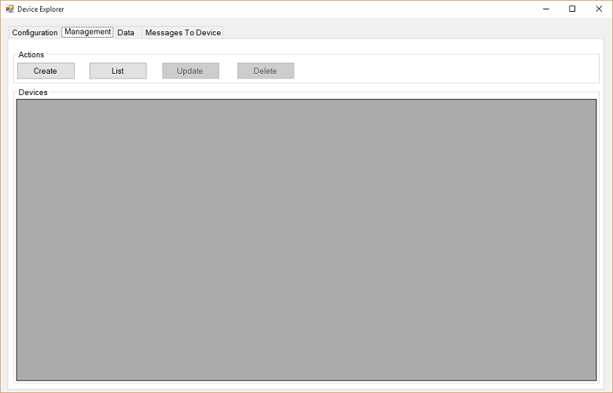

<properties
    pageTitle="À l’aide de l’appareil IoT Azure SDK pour C | Microsoft Azure"
    description="En savoir plus sur et commencer à utiliser avec des exemples de code de l’appareil IoT Azure SDK pour C."
    services="iot-hub"
    documentationCenter=""
    authors="olivierbloch"
    manager="timlt"
    editor=""/>

<tags
     ms.service="iot-hub"
     ms.devlang="cpp"
     ms.topic="article"
     ms.tgt_pltfrm="na"
     ms.workload="na"
     ms.date="09/06/2016"
     ms.author="obloch"/>

# <a name="introducing-the-azure-iot-device-sdk-for-c"></a>Présentation de l’appareil IoT Azure SDK pour C

Le **périphérique IoT Azure SDK** est un ensemble de bibliothèques conçues pour simplifier le processus d’événements envoi et réception de messages à partir du service **Azure IoT concentrateur** . Il existe différentes variations du Kit de développement, chaque ciblage une plateforme spécifique, mais cet article décrit l' **appareil IoT Azure SDK pour C**.

Le périphérique IoT Azure SDK pour C est écrit en C ANSI (C99) afin d’optimiser la portabilité. Cela rend parfaitement à fonctionner sur plusieurs plateformes et appareils, notamment l’emplacement dans lequel réduction disque et encombrement mémoire est une priorité.  

Il existe un large éventail de plateformes sur lequel le Kit de développement logiciel a été testé (voir la [Azure certifié pour le catalogue d’appareil IoT](https://catalog.azureiotsuite.com/) pour plus d’informations). Bien que cet article contient des procédures pas à pas d’exemples de code en cours d’exécution sur la plateforme Windows, n’oubliez pas que le code décrit dans cet article est exactement le même sur la plage de plateformes prises en charge.

Dans cet article vous allez découvrir l’architecture de l’appareil IoT Azure SDK pour C. Nous allons expliquer l’initialisation de la bibliothèque d’appareil, envoyer des événements à concentrateur IoT ainsi que recevoir des messages à partir de celui-ci. Les informations contenues dans cet article doivent être suffisant pour commencer à utiliser le Kit de développement, mais fournit également des liens vers des informations supplémentaires sur les bibliothèques.

## <a name="sdk-architecture"></a>Architecture du Kit de développement

Vous pouvez trouver le **périphérique IoT Azure SDK pour C** dans le référentiel de [Microsoft Azure IoT SDK](https://github.com/Azure/azure-iot-sdks) GitHub et afficher les détails de l’API dans la [référence de l’API C](http://azure.github.io/azure-iot-sdks/c/api_reference/index.html).

Vous trouverez la dernière version des bibliothèques dans la branche **maître** de ce référentiel :

  

Ce référentiel contient toute la gamme de périphérique IoT Azure SDK. Toutefois, cet article concerne l’appareil IoT Azure SDK *pour C* qui se trouve dans le dossier **c** .

  

* Vous trouverez l’implémentation principale du Kit de développement dans le **iothub\_client** dossier qui contient l’implémentation de la couche API plus bas dans le Kit de développement : la bibliothèque **IoTHubClient** . La bibliothèque **IoTHubClient** contient des API de mise en œuvre la messagerie brut pour envoyer des messages à concentrateur IoT ainsi que recevoir des messages à partir de celui-ci. Lorsque vous utilisez cette bibliothèque, vous êtes responsable de la mise en œuvre sérialisation des messages (éventuellement à l’aide de l’échantillon sérialiseur décrite ci-dessous), mais d’autres détails de communication avec concentrateur IoT sont gérées pour vous.
* Le dossier **sérialiseur** contient des fonctions d’assistance et exemples montrant comment sérialiser des données avant d’envoyer à Azure IoT concentrateur à l’aide de la bibliothèque du client. Notez que l’utilisation du sérialiseur n’est pas obligatoire et uniquement fourni sous forme de faciliter la tâche. Si vous utilisez la bibliothèque **sérialiseur** , vous commencez par définir un modèle qui spécifie les événements que vous voulez envoyer à concentrateur IoT ainsi que les messages que vous souhaitez recevoir à partir de celui-ci. Une fois que le modèle est défini, le Kit de développement vous offre une surface d’API qui vous permet d’utiliser facilement des événements et des messages sans avoir à vous soucier des détails de sérialisation.
La bibliothèque dépend des autres bibliothèques d’ouvrir la source qu’implémenter transport à l’aide de plusieurs protocoles (MQTT, AMQP).
* La bibliothèque **IoTHubClient** dépend des autres bibliothèques ouvrir la source :
   * La bibliothèque [C Azure partagés utilitaire](https://github.com/Azure/azure-c-shared-utility) qui fournit des fonctionnalités communes pour les tâches de base (comme chaîne de manipulation de liste, IO, etc....) nécessaire sur plusieurs SDK de C liés Azure
   * La bibliothèque [uAMQP Azure](https://github.com/Azure/azure-uamqp-c) implémentation du côté client de AMQP optimisée pour les appareils de contraintes de ressources.
   * La bibliothèque [uMQTT Azure](https://github.com/Azure/azure-umqtt-c) qui est une bibliothèque à usage général implémentation du protocole MQTT et optimisée pour les appareils de contraintes de ressources.

Tout cela est plus facile à comprendre en recherchant dans l’exemple de code. Les sections suivantes décrivent quelques des exemples d’applications qui sont inclus dans le Kit de développement. Cela devrait vous donner une idée pour les différentes fonctionnalités de couches de l’architecture du Kit de développement ainsi qu’une introduction à fonctionnement de l’API.

## <a name="before-running-the-samples"></a>Avant d’exécuter les exemples

Avant de pouvoir exécuter les exemples dans le périphérique IoT Azure SDK pour C, vous devez créer une instance du service dans votre abonnement Azure si vous ne pas encore et 2 tâches :
* préparer votre environnement de développement
* obtenir des informations d’identification de l’appareil.

Si vous avez besoin créer une instance d’Azure IoT concentrateur de votre abonnement Azure, suivez les instructions [ici](https://github.com/Azure/azure-iot-sdks/blob/master/doc/setup_iothub.md).

Le [fichier Lisez-moi](https://github.com/Azure/azure-iot-sdks/tree/master/c) inclus avec le Kit de développement fournit des instructions pour préparer votre environnement de développement et obtenir des informations d’identification de l’appareil.
Les sections suivantes incluent des commentaires supplémentaires sur ces instructions.

### <a name="preparing-your-development-environment"></a>Préparer votre environnement de développement

Tandis que les packages sont fournies pour certaines plateformes (par exemple, NuGet pour Windows ou apt_get pour Debian et Ubuntu) et les exemples utilisent ces packages lorsqu’elles sont disponibles, les instructions suivantes expliquent comment créer la bibliothèque et les exemples de formulaires directement le code.

Tout d’abord, vous devez obtenir une copie du Kit de développement de GitHub avant de générer la source. Vous devez obtenir une copie de la source de la branche **maître** du [référentiel GitHub](https://github.com/Azure/azure-iot-sdks).

Lorsque vous avez téléchargé une copie de la source, vous devez effectuer les étapes décrites dans l’article SDK [« Préparer votre environnement de développement »](https://github.com/Azure/azure-iot-sdks/blob/master/c/doc/devbox_setup.md).


Voici quelques conseils pour vous aider à effectuer la procédure décrite dans le guide de préparation :

-   Lorsque vous installez l’utilitaire **CMake** , choisissez l’option d’ajout **CMake** au système chemin d’accès pour **tous les utilisateurs** (ajout à **l’utilisateur actuel** fonctionne également) :

  


-   Avant d’ouvrir l' **invite de commandes pour les développeurs pour VS2015**, installez les outils de ligne de commande Git. Pour installer ces outils, procédez comme suit :

    1. Lancez le programme d’installation de **Visual Studio 2015** (ou sélectionnez **Microsoft Visual Studio 2015** dans le panneau de configuration **programmes et fonctionnalités** , puis sélectionnez **Modifier**).
    
    2. Vérifiez que la fonctionnalité **Git pour Windows** est sélectionnée dans le programme d’installation, mais vous pouvez également vérifier l’option **GitHub Extension pour Visual Studio** de fournir une intégration IDE :

        

    3. Exécutez l’Assistant de configuration pour installer les outils.

    4. Ajouter le répertoire Git outils **bin** à la variable d’environnement **PATH** système. Sous Windows, il ressemble à ceci :

        


Lorsque vous avez terminé toutes les étapes décrites dans la page [« Préparer votre environnement de développement »](https://github.com/Azure/azure-iot-sdks/blob/master/c/doc/devbox_setup.md) , vous êtes prêt à compiler les exemples d’applications.

### <a name="obtaining-device-credentials"></a>Obtenir des informations d’identification de l’appareil

À présent que votre environnement de développement a été configurée, la prochaine chose à faire est afin d’obtenir des informations d’identification de l’appareil.  Pour être en mesure d’accéder à un concentrateur IoT un périphérique, vous devez d’abord ajouter l’appareil dans le Registre de périphérique IoT concentrateur. Lorsque vous ajoutez votre appareil, vous recevrez un ensemble d’informations d’identification de périphérique dont vous avez besoin afin que le périphérique pour pouvoir vous connecter à un concentrateur IoT. Les exemples d’application que nous allons aborder dans la section suivante vous attendez pas ces informations d’identification sous la forme d’une **chaîne de connexion appareil**.

Il existe quelques outils fournis dans le référentiel libres SDK afin de gérer le IoT Hub. Un est un Windows application appelée Explorateur de périphérique, le deuxième élément est un node.js basé sur outil d’infrastructure du langage commun plates-formes croisées appelé iothub explorer. Vous pouvez en savoir plus sur ces outils [ici](https://github.com/Azure/azure-iot-sdks/blob/master/doc/manage_iot_hub.md).

Comme nous allons à exécuter les exemples sous Windows dans cet article, nous utilisons l’outil Explorateur de périphérique. Mais vous pouvez également utiliser l’Explorateur iothub si vous préférez utiliser les outils de l’infrastructure du langage commun.

L’outil [Explorateur de périphérique](https://github.com/Azure/azure-iot-sdks/tree/master/tools/DeviceExplorer) utilise les bibliothèques de service IoT Azure pour effectuer diverses tâches sur IoT Hub, y compris l’ajout des appareils mobiles. Si vous utilisez un appareil Explorer pour ajouter un périphérique, vous recevrez une chaîne de connexion correspondante. Vous devez cette chaîne de connexion pour que l’exemple applications s’exécutent.

Si vous n’êtes pas déjà familiarisé avec le processus, la procédure suivante explique comment utiliser Explorer appareil pour ajouter un périphérique et obtenir une chaîne de connexion appareil.

Vous pouvez trouver un programme d’installation de Windows pour l’outil Explorateur de périphérique sur le [Kit de développement logiciel relâchez la page](https://github.com/Azure/azure-iot-sdks/releases). Mais vous pouvez également exécuter l’outil directement à partir de son code ouvrant **[DeviceExplorer.sln](https://github.com/Azure/azure-iot-sdks/blob/master/tools/DeviceExplorer/DeviceExplorer.sln)** dans **Visual Studio 2015** et création d’une solution.

Lorsque vous exécutez le programme, vous verrez cette interface :

  

Entrez la **Chaîne de connexion IoT concentrateur** dans le premier champ, puis cliquez sur **mettre à jour**. Cela configure l’outil afin qu’il peut communiquer avec IoT concentrateur.

Une fois que la chaîne de connexion IoT concentrateur est configurée sur l’onglet **gestion** :

  

Il s’agit de l’endroit où vous permet de gérer les appareils enregistrées dans votre concentrateur IoT.

Vous pouvez créer un périphérique en cliquant sur le bouton **créer** . Une boîte de dialogue s’affiche avec un ensemble de clés prédéfinies (principales et secondaires). Tout ce que vous avez à faire est entrer un **ID de périphérique** , puis cliquez sur **créer**.

  

Une fois que l’appareil est créé, la liste des périphériques est mis à jour avec tous les appareils inscrits, y compris celle que vous venez de créer. Si vous le bouton droit de votre nouvel appareil, vous verrez ce menu :

  

Si vous choisissez l’option **Copier la chaîne de connexion pour périphérique sélectionné** , la chaîne de connexion pour votre appareil est copiée dans le Presse-papiers. Conserver une copie de la chaîne de connexion. Vous en aurez besoin lors de l’exécution des exemples d’application décrites dans les sections suivantes.

Une fois que vous avez terminé les étapes ci-dessus, vous êtes prêt à commencer à exécuter du code. Les deux échantillons doivent une constante en haut du fichier source principal qui vous permet d’entrer une chaîne de connexion. Par exemple, la ligne correspondante à partir de la **iothub\_client\_exemple\_amqp** application se présente comme suit.

```
static const char* connectionString = "[device connection string]";
```

Si vous voulez suivre, entrez la chaîne de connexion appareil ici, recompilation la solution et vous pourrez exécuter l’exemple.

## <a name="iothubclient"></a>IoTHubClient

Dans la **iothub\_client** dossier dans le référentiel azure-iot-SDK, il existe un dossier **exemples** qui contient une application appelée **iothub\_client\_exemple\_amqp**.

La version Windows de la **iothub\_client\_exemple\_ampq** application inclut la solution Visual Studio suivante :

  

Cette solution contient un projet unique. Il est important de noter qu’il existe quatre NuGet packages installés dans cette solution :

- Microsoft.Azure.C.SharedUtility
- Microsoft.Azure.IoTHub.AmqpTransport
- Microsoft.Azure.IoTHub.IoTHubClient
- Microsoft.Azure.uamqp

Vous devez toujours le package **Microsoft.Azure.C.SharedUtility** lorsque vous travaillez avec le Kit de développement. Étant donné que cet exemple s’appuie sur AMQP, vous devez également inclure les packages **Microsoft.Azure.uamqp** et **Microsoft.Azure.IoTHub.AmqpTransport** (il existe des packages équivalentes pour MQTT et HTTP). Étant donné que l’exemple utilise la bibliothèque **IoTHubClient** , vous devez également inclure le package **Microsoft.Azure.IoTHub.IoTHubClient** dans votre solution.

Vous pouvez trouver l’implémentation de l’application d’exemple dans la **iothub\_client\_exemple\_amqp.c** fichier source.

Nous allons utiliser cet exemple d’application vous guident que nécessaire d’utiliser la bibliothèque **IoTHubClient** .

### <a name="initializing-the-library"></a>L’initialisation de la bibliothèque

> [AZURE.NOTE] Avant de commencer à travailler avec les bibliothèques, vous devrez effectuer certaines l’initialisation de plateforme spécifique. Par exemple, si vous prévoyez d’utiliser AMQP sur Linux vous devez initialisation de la bibliothèque OpenSSL. Les exemples dans le [référentiel GitHub](https://github.com/Azure/azure-iot-sdks) appeler la fonction d’utilitaire **platform_init** lorsque le client démarre et appeler la fonction **platform_deinit** avant de quitter. Ces fonctions sont déclarées dans le fichier d’en-tête « platform.h ». Vous devez examiner les définitions de ces fonctions pour votre plateforme cible dans le [référentiel](https://github.com/Azure/azure-iot-sdks) pour déterminer si vous avez besoin inclure un code d’initialisation plateforme de votre client.

Pour commencer à travailler avec les bibliothèques que vous devez tout d’abord allouer une poignée de client IoT concentrateur :

```
IOTHUB_CLIENT_HANDLE iotHubClientHandle;
iotHubClientHandle = IoTHubClient_CreateFromConnectionString(connectionString, AMQP_Protocol);
```

Notez que nous allons passage d’une copie de notre chaîne de connexion appareil à cette fonction (celui nous obtenus à partir de l’Explorateur de périphérique). Nous avons également désigner le protocole que nous souhaitons utiliser. Cet exemple utilise AMQP, mais MQTT et HTTP sont également une option.

Lorsque vous avez un valide **IOTHUB\_CLIENT\_gérer**, vous pouvez commencer à appeler les API pour envoyer des événements et recevoir des messages à partir de IoT concentrateur. Nous allons aborder suivant.

### <a name="sending-events"></a>Envoi d’événements

Envoi d’événements à concentrateur IoT requiert que vous effectuez les étapes suivantes :

Tout d’abord, créez un message :

```
EVENT_INSTANCE message;
sprintf_s(msgText, sizeof(msgText), "Message_%d_From_IoTHubClient_Over_AMQP", i);
message.messageHandle = IoTHubMessage_CreateFromByteArray((const unsigned char*)msgText, strlen(msgText);
```

Ensuite, envoyer le message :

```
IoTHubClient_SendEventAsync(iotHubClientHandle, message.messageHandle, SendConfirmationCallback, &message);
```

Chaque fois que vous envoyez un message, vous spécifiez une référence à une fonction de rappel qui est appelée lorsque les données sont envoyées :

```
static void SendConfirmationCallback(IOTHUB_CLIENT_CONFIRMATION_RESULT result, void* userContextCallback)
{
    EVENT_INSTANCE* eventInstance = (EVENT_INSTANCE*)userContextCallback;
    (void)printf("Confirmation[%d] received for message tracking id = %d with result = %s\r\n", callbackCounter, eventInstance->messageTrackingId, ENUM_TO_STRING(IOTHUB_CLIENT_CONFIRMATION_RESULT, result));
    /* Some device specific action code goes here... */
    callbackCounter++;
    IoTHubMessage_Destroy(eventInstance->messageHandle);
}
```

Notez l’appel à la **IoTHubMessage\_Destroy** fonctionner lorsque vous avez terminé avec le message. Vous devez effectuer cet appel pour libérer les ressources affectées lorsque vous avez créé le message.

### <a name="receiving-messages"></a>Recevoir des messages

Réception d’un message est une opération asynchrone. Tout d’abord, vous inscrivez un rappel à appeler lorsque le périphérique reçoit un message :

```
int receiveContext = 0;
IoTHubClient_SetMessageCallback(iotHubClientHandle, ReceiveMessageCallback, &receiveContext);
```

Le dernier paramètre est un pointeur void vers comme vous le souhaitez. Dans l’échantillon, il est un pointeur vers un entier, mais cela peut s’expliquer un pointeur vers une structure de données plus complexe. Ainsi, la fonction de rappel fonctionne sur l’état partagé à l’appelant de cette fonction.

Lorsque le périphérique reçoit un message, la fonction de rappel enregistré est appelée :

```
static IOTHUBMESSAGE_DISPOSITION_RESULT ReceiveMessageCallback(IOTHUB_MESSAGE_HANDLE message, void* userContextCallback)
{
    int* counter = (int*)userContextCallback;
    const char* buffer;
    size_t size;
    if (IoTHubMessage_GetByteArray(message, (const unsigned char**)&buffer, &size) == IOTHUB_MESSAGE_OK)
    {
        (void)printf("Received Message [%d] with Data: <<<%.*s>>> & Size=%d\r\n", *counter, (int)size, buffer, (int)size);
    }

    /* Some device specific action code goes here... */
    (*counter)++;
    return IOTHUBMESSAGE_ACCEPTED;
}
```

Notez que vous utilisez la **IoTHubMessage\_GetByteArray** fonction permettant d’extraire le message, qui dans cet exemple est une chaîne.

### <a name="uninitializing-the-library"></a>Annuler l’initialisation de la bibliothèque

Lorsque vous avez terminé d’événements envoi et réception de messages, vous pouvez annuler l’initialisation de la bibliothèque IoT. Pour ce faire, exécutez l’appel de fonction suivant :

```
IoTHubClient_Destroy(iotHubClientHandle);
```

Libérez les ressources précédemment attribués par le **IoTHubClient\_CreateFromConnectionString** fonction.

Comme vous pouvez le voir, il est facile d’envoyer des événements et recevoir des messages avec la bibliothèque **IoTHubClient** . La bibliothèque gère les détails de communiquer avec IoT Hub, y compris le protocole à utiliser (point de vue du développeur, c’est une option de configuration simple).

La bibliothèque **IoTHubClient** fournit également un contrôle précis comment sérialiser les événements que votre appareil envoie à IoT concentrateur. Dans certains cas, il s’agit de le des avantages, mais dans d’autres cas, il s’agit d’un détail d’implémentation avec laquelle vous ne voulez pas être concerné. Si c’est le cas, vous pouvez envisager d’utiliser la bibliothèque de **sérialiseur** , nous allons décrire dans la section suivante.

## <a name="serializer"></a>Sérialiseur

Point de vue conceptuel la bibliothèque **sérialiseur** se trouve en haut de la bibliothèque **IoTHubClient** dans le Kit de développement. Il utilise la bibliothèque **IoTHubClient** pour la communication sous-jacente avec IoT concentrateur, mais elle ajoute des fonctions de modélisation qui suppriment la charge de la sérialisation des messages en matière de gestion du développeur. Comment cela fonctionne de la bibliothèque est préférable indiqué par un exemple.

Dans le **sérialiseur** dossier dans le référentiel azure-iot-SDK est un dossier **d’exemples** qui contient une application appelée **simplesample\_amqp**. La version Windows de cet exemple comprend la solution Visual Studio suivante :

  

Comme avec l’exemple précédent, celui-ci contient plusieurs packages NuGet :

- Microsoft.Azure.C.SharedUtility
- Microsoft.Azure.IoTHub.AmqpTransport
- Microsoft.Azure.IoTHub.IoTHubClient
- Microsoft.Azure.IoTHub.Serializer
- Microsoft.Azure.uamqp

Nous l’avons vu la plupart d'entre elles dans l’exemple précédent, mais **Microsoft.Azure.IoTHub.Serializer** sont les nouveautés. Cela est nécessaire lorsque nous utilisons la bibliothèque **sérialiseur** .

Vous pouvez trouver l’implémentation de l’exemple d’application dans le **simplesample\_amqp.c** fichier.

Les sections suivantes décrivent via les éléments clés de cet exemple.

### <a name="initializing-the-library"></a>L’initialisation de la bibliothèque

Pour commencer à travailler avec la bibliothèque **sérialiseur** , vous devez appeler l’initialisation API :

```
serializer_init(NULL);

IOTHUB_CLIENT_HANDLE iotHubClientHandle = IoTHubClient_CreateFromConnectionString(connectionString, AMQP_Protocol);

ContosoAnemometer* myWeather = CREATE_MODEL_INSTANCE(WeatherStation, ContosoAnemometer);
```

L’appel vers la **sérialiseur\_initialisation** fonction est un appel unique et est utilisée pour l’initialisation de la bibliothèque sous-jacente. Ensuite, vous appelez le **IoTHubClient\_CreateFromConnectionString** fonction, ce qui correspond à la même API comme dans l’échantillon **IoTHubClient** . Cet appel définit la chaîne de connexion périphérique (c’est également l’endroit où vous choisissez le protocole que vous voulez utiliser). Notez que cet exemple utilise AMQP comme type de transport, mais aurait pu utiliser HTTP.

Pour finir, appelez le **créer\_modèle\_INSTANCE** fonction. Notez que **WeatherStation** est l’espace de noms du modèle et **ContosoAnemometer** est le nom du modèle. Une fois que l’instance de modèle est créé, vous pouvez l’utiliser pour envoyer des événements et recevoir des messages. Toutefois, il est important de comprendre quels un modèle est.

### <a name="defining-the-model"></a>Définition du modèle

Un modèle dans la bibliothèque **sérialiseur** définit les événements que votre appareil peut envoyer à IoT concentrateur et les messages, appelés « *actions* » dans le langage de modélisation, il peut recevoir. Vous définissez un modèle à l’aide d’un ensemble de macros C comme dans le **simplesample\_amqp** exemple d’application :

```
BEGIN_NAMESPACE(WeatherStation);

DECLARE_MODEL(ContosoAnemometer,
WITH_DATA(ascii_char_ptr, DeviceId),
WITH_DATA(double, WindSpeed),
WITH_ACTION(TurnFanOn),
WITH_ACTION(TurnFanOff),
WITH_ACTION(SetAirResistance, int, Position)
);

END_NAMESPACE(WeatherStation);
```

Les **commencer\_espace de noms** et **fin\_espace de noms** macros les deux prennent l’espace de noms du modèle en tant qu’argument. Il est prévu que rien entre ces macros est la définition de vos modèles et les structures de données qui utilisent les modèles.

Dans cet exemple, il est un seul modèle appelé **ContosoAnemometer**. Ce modèle définit deux événements votre périphérique peut envoyer à IoT concentrateur : **ID de périphérique** et la **vitesse du vent**. Il définit également trois actions (messages) doit peut recevoir des votre appareil : **TurnFanOn**, **TurnFanOff**et **SetAirResistance**. Chaque événement a un type et chaque action a un nom (et éventuellement un ensemble de paramètres).

Les événements et les actions définies dans le modèle de définissent une surface API que vous pouvez utiliser pour envoyer des événements à IoT concentrateur, ainsi que de répondre aux messages envoyés à l’appareil. Ceci est mieux entendu via un exemple.

### <a name="sending-events"></a>Envoi d’événements

Le modèle définit les événements que vous pouvez envoyer à IoT concentrateur. Dans cet exemple, cela signifie qu’un des deux événements définis à l’aide de la macro **WITH_DATA** . Par exemple, si vous voulez envoyer un événement de **vitesse du vent** à un concentrateur IoT, il existe quelques étapes figurant dans cette se produire. La première consiste à définir les données que nous voulons à envoyer :

```
myWeather->WindSpeed = 15;
```

Le modèle que nous avons définie précédemment permet pour ce faire, définissez un membre d’une **structure**. Ensuite, nous sérialiser l’événement que nous voulez envoyer :

```
unsigned char* destination;
size_t destinationSize;

SERIALIZE(&destination, &destinationSize, myWeather->WindSpeed);
```

Ce code sérialise l’événement dans une mémoire tampon (référencée par la **destination**). Pour finir, nous enverrons l’événement à concentrateur IoT avec ce code :

```
sendMessage(iotHubClientHandle, destination, destinationSize);
```

Il s’agit d’une fonction d’assistance dans l’exemple d’application qui envoie notre événement série à IoT concentrateur :

```
static void sendMessage(IOTHUB_CLIENT_HANDLE iotHubClientHandle, const unsigned char* buffer, size_t size)
{
    static unsigned int messageTrackingId;
    IOTHUB_MESSAGE_HANDLE messageHandle = IoTHubMessage_CreateFromByteArray(buffer, size);
    if (messageHandle != NULL)
    {
        if (IoTHubClient_SendEventAsync(iotHubClientHandle, messageHandle, sendCallback, (void*)(uintptr_t)messageTrackingId) != IOTHUB_CLIENT_OK)
        {
            printf("failed to hand over the message to IoTHubClient");
        }
        else
        {
            printf("IoTHubClient accepted the message for delivery\r\n");
        }

        IoTHubMessage_Destroy(messageHandle);
    }
    free((void*)buffer);
    messageTrackingId++;
}
```

Ce code est très similaire à ce que nous l’avons vu dans le **iothub\_client\_exemple\_amqp** application, dans lequel nous avons créé un message à partir d’un tableau d’octets et ensuite utilisé **IoTHubClient\_SendEventAsync** pour l’envoyer à IoT concentrateur. Après cela nous simplement doivent libérer la poignée de message et sérialisé tampon de données que nous allouées précédemment.

Le second au dernier paramètre de **IoTHubClient\_SendEventAsync** est une référence à une fonction de rappel qui est appelée lorsque les données sont envoyées avec succès. Voici un exemple d’une fonction de rappel :

```
void sendCallback(IOTHUB_CLIENT_CONFIRMATION_RESULT result, void* userContextCallback)
{
    int messageTrackingId = (intptr_t)userContextCallback;

    (void)printf("Message Id: %d Received.\r\n", messageTrackingId);

    (void)printf("Result Call Back Called! Result is: %s \r\n", ENUM_TO_STRING(IOTHUB_CLIENT_CONFIRMATION_RESULT, result));
}
```

Le second paramètre est un pointeur vers le contexte de l’utilisateur ; le pointeur même nous passés à **IoTHubClient\_SendEventAsync**. Dans ce cas le contexte est un compteur simple, mais elle peut être tout ce que vous voulez.

C’est tout est à l’envoi d’événements. Rendues gauche pour couvrir consiste à recevoir des messages.

### <a name="receiving-messages"></a>Recevoir des messages

Réception d’un message fonctionne de la même façon aux façon dont les messages de travail dans la bibliothèque **IoTHubClient** . Tout d’abord, vous inscrire une fonction de rappel de message :

```
IoTHubClient_SetMessageCallback(iotHubClientHandle, IoTHubMessage, myWeather)
```

Ensuite, vous écrivez la fonction de rappel qui est appelée lorsqu’un message est reçu :

```
static IOTHUBMESSAGE_DISPOSITION_RESULT IoTHubMessage(IOTHUB_MESSAGE_HANDLE message, void* userContextCallback)
{
    IOTHUBMESSAGE_DISPOSITION_RESULT result;
    const unsigned char* buffer;
    size_t size;
    if (IoTHubMessage_GetByteArray(message, &buffer, &size) != IOTHUB_MESSAGE_OK)
    {
        printf("unable to IoTHubMessage_GetByteArray\r\n");
        result = EXECUTE_COMMAND_ERROR;
    }
    else
    {
        /*buffer is not zero terminated*/
        char* temp = malloc(size + 1);
        if (temp == NULL)
        {
            printf("failed to malloc\r\n");
            result = EXECUTE_COMMAND_ERROR;
        }
        else
        {
            memcpy(temp, buffer, size);
            temp[size] = '\0';
            EXECUTE_COMMAND_RESULT executeCommandResult = EXECUTE_COMMAND(userContextCallback, temp);
            result =
                (executeCommandResult == EXECUTE_COMMAND_ERROR) ? IOTHUBMESSAGE_ABANDONED :
                (executeCommandResult == EXECUTE_COMMAND_SUCCESS) ? IOTHUBMESSAGE_ACCEPTED :
                IOTHUBMESSAGE_REJECTED;
            free(temp);
        }
    }
    return result;
}
```

Ce code est réutilisable, c’est la même pour n’importe quelle solution. Cette fonction reçoit le message et prend en charge le routage à la fonction appropriée pendant l’appel à **EXECUTE\_commande**. La fonction appelée à ce stade dépend de la définition des actions dans notre modèle.

Lorsque vous définissez une action dans votre modèle, vous êtes amené à mettre en œuvre une fonction qui est appelée lorsque votre appareil reçoit le message correspondant. Par exemple, si votre modèle définit cette action :

```
WITH_ACTION(SetAirResistance, int, Position)
```

Vous devez définir une fonction avec cette signature :

```
EXECUTE_COMMAND_RESULT SetAirResistance(ContosoAnemometer* device, int Position)
{
    (void)device;
    (void)printf("Setting Air Resistance Position to %d.\r\n", Position);
    return EXECUTE_COMMAND_SUCCESS;
}
```

Notez que le nom de la fonction correspond au nom de l’action dans le modèle et que les paramètres de la fonction correspondent aux paramètres spécifiés pour l’action. Le premier paramètre est toujours requis et contient un pointeur à l’instance de notre modèle.

Lorsque le périphérique reçoit un message qui correspond à cette signature, la fonction correspondante est appelée. Par conséquent, à l’exception des difficultés inclure le code réutilisable de **IoTHubMessage**, recevoir des messages est simplement une question de définition d’une fonction simple pour chaque action définie dans votre modèle.

### <a name="uninitializing-the-library"></a>Annuler l’initialisation de la bibliothèque

Lorsque vous avez terminé de données envoi et réception de messages, vous pouvez annuler l’initialisation de la bibliothèque IoT :

```
        DESTROY_MODEL_INSTANCE(myWeather);
    }
    IoTHubClient_Destroy(iotHubClientHandle);
}
serializer_deinit();
```

Chacune de ces trois fonctions s’aligne avec les fonctions de l’initialisation trois décrites précédemment. Appel de ces API garantit que vous libérez des ressources précédemment alloués.

## <a name="next-steps"></a>Étapes suivantes

Cet article couvert les notions de base de l’utilisation des bibliothèques au sein de l' **appareil IoT Azure SDK pour C**. Il vous fourni avec suffisamment d’informations pour comprendre ce qui est inclus dans le Kit de développement, son architecture et comment commencer à utiliser avec les exemples de Windows. L’article suivant continue la description du Kit de développement tout d’abord [en savoir plus sur la bibliothèque IoTHubClient](iot-hub-device-sdk-c-iothubclient.md).

Pour plus d’informations sur le développement pour IoT concentrateur, voir la [IoT concentrateur SDK][lnk-sdks].

Pour en savoir davantage les fonctionnalités du concentrateur IoT, voir :

- [Simulation d’un appareil avec le Kit de développement de passerelle IoT][lnk-gateway]


[lnk-file upload]: iot-hub-csharp-csharp-file-upload.md
[lnk-create-hub]: iot-hub-rm-template-powershell.md
[lnk-c-sdk]: iot-hub-device-sdk-c-intro.md
[lnk-sdks]: iot-hub-devguide-sdks.md

[lnk-gateway]: iot-hub-linux-gateway-sdk-simulated-device.md
