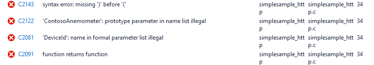

<properties
    pageTitle="APPAREIL IoT Azure SDK pour C - sérialiseur | Microsoft Azure"
    description="Pour plus d’informations sur l’utilisation de la bibliothèque de sérialiseur dans le périphérique IoT Azure SDK pour C"
    services="iot-hub"
    documentationCenter=""
    authors="olivierbloch"
    manager="timlt"
    editor=""/>

<tags
     ms.service="iot-hub"
     ms.devlang="cpp"
     ms.topic="article"
     ms.tgt_pltfrm="na"
     ms.workload="na"
     ms.date="09/06/2016"
     ms.author="obloch"/>

# <a name="microsoft-azure-iot-device-sdk-for-c--more-about-serializer"></a>Microsoft Azure IoT appareil SDK pour C – en savoir plus sur sérialiseur

[premier article](iot-hub-device-sdk-c-intro.md) de cette série ainsi que l' **appareil IoT Azure SDK pour C**. L’article suivant fournie une description plus détaillée de [**IoTHubClient**](iot-hub-device-sdk-c-iothubclient.md). Cet article complète couverture du SDK en fournir une description plus détaillée du composant restant : la bibliothèque **sérialiseur** .

L’article Introduction décrit l’utilisation de la bibliothèque **sérialiseur** pour envoyer des événements et recevoir des messages de IoT concentrateur. Dans cet article, nous étendre cette discussion en fournissant une explication plus complète représenter vos données avec le langage macro **sérialiseur** . L’article également comprend plus de détails sur la façon dont la bibliothèque sérialise messages (et dans certains cas, comment vous pouvez contrôler le comportement de sérialisation). Nous allons également décrire certains paramètres que vous pouvez modifier ce qui déterminent la taille des modèles que vous créez.

Enfin, l’article revisite certaines rubriques précédents articles telles que message et gestion de propriété. Comme nous allons savoir, ces fonctionnalités fonctionnent de la même façon à l’aide de la bibliothèque **sérialiseur** manière qu’avec la bibliothèque **IoTHubClient** .

Tout décrites dans cet article est basé sur les exemples **sérialiseur** . Si vous voulez suivre, voir la **simplesample\_amqp** et **simplesample\_http** applications incluses dans le périphérique IoT Azure SDK pour C.

Vous pouvez trouver le **périphérique IoT Azure SDK pour C** dans le référentiel de [Microsoft Azure IoT SDK](https://github.com/Azure/azure-iot-sdks) GitHub et afficher les détails de l’API dans la [référence de l’API C](http://azure.github.io/azure-iot-sdks/c/api_reference/index.html).

## <a name="the-modeling-language"></a>La langue de modélisation

L' [article Introduction](iot-hub-device-sdk-c-intro.md) dans cette série ainsi que l' **appareil IoT Azure SDK pour C** modélisation au moyen de l’exemple fourni dans la **simplesample\_amqp** application :

```
BEGIN_NAMESPACE(WeatherStation);

DECLARE_MODEL(ContosoAnemometer,
WITH_DATA(ascii_char_ptr, DeviceId),
WITH_DATA(double, WindSpeed),
WITH_ACTION(TurnFanOn),
WITH_ACTION(TurnFanOff),
WITH_ACTION(SetAirResistance, int, Position)
);

END_NAMESPACE(WeatherStation);
```

Comme vous pouvez le voir, la langue de modélisation est basée sur les macros C. Commencez toujours la définition de votre avec **début\_espace de noms** et se terminent toujours par **fin\_espace de noms**. Il est courant nommer l’espace de noms pour votre société ou, comme dans cet exemple, le projet que vous travaillez sur.

Ce qui se passe à l’intérieur de l’espace de noms sont des définitions de modèle. Dans ce cas, il est un seul modèle pour un anémomètre. Là encore, le modèle peut être n’importe quel nom, mais en règle générale, il s’agit pour le périphérique ou le type de données que vous voulez échanger avec IoT concentrateur.  

Modèles de contenir une définition des événements que vous pouvez pénétration à IoT concentrateur ( *données*) ainsi que les messages que vous pouvez recevoir IoT concentrateur ( *actions*). Comme vous pouvez voir dans l’exemple, les événements ont un type et un nom ; actions ont un nom et des paramètres facultatifs (chacun avec un type de).

N’est pas illustrée dans cet exemple sont des types de données supplémentaires qui sont prises en charge par le Kit de développement. Nous aborderons suivant.

> [AZURE.NOTE] Concentrateur IoT fait référence aux données qu'un appareil envoie à celui-ci comme des *événements*, tandis que le langage de modélisation fait référence à celui-ci sous forme de *données* (défini à l’aide de **WITH_DATA**). De même, IoT concentrateur fait référence aux données que vous envoyez aux périphériques sous forme de *messages*, alors que le langage de modélisation fait référence à celle-ci en tant qu' *actions* (défini à l’aide de **WITH_ACTION**). N’oubliez pas que ces termes peuvent être utilisées de manière interchangeable dans cet article.

### <a name="supported-data-types"></a>Types de données pris en charge

Types de données suivants sont pris en charge dans les modèles créés avec la bibliothèque **sérialiseur** :

| Type                    | Description                            |
|-------------------------|----------------------------------------|
| Double                  | double précision nombre à virgule flottante |
| ent                     | entier 32 bits                         |
| Flottement                   | nombre à virgule flottante simple précision |
| long                    | entier long                           |
| int8\_t                 | entier 8 bits                          |
| int16\_t                | entier 16 bits                         |
| Int32\_t                | entier 32 bits                         |
| Int64\_t                | entier 64 bits                         |
| bool                    | valeur booléenne                                |
| ASCII\_car\_ptr        | Chaîne de caractères ASCII                           |
| EDM\_DATE\_heure\_décalage | décalage de date                       |
| EDM\_GUID               | GUID                                   |
| EDM\_binaire             | en nombre binaire.                                 |
| DÉCLARER\_structure         | type de données complexe                      |

Commençons par le dernier type de données. La **DECLARE\_structure** vous permet de définir les types de données complexes, correspond au niveau supérieur les autres types de base. Ces regroupements nous permettent de définir un modèle qui ressemble à ceci :

```
DECLARE_STRUCT(TestType,
double, aDouble,
int, aInt,
float, aFloat,
long, aLong,
int8_t, aInt8,
uint8_t, auInt8,
int16_t, aInt16,
int32_t, aInt32,
int64_t, aInt64,
bool, aBool,
ascii_char_ptr, aAsciiCharPtr,
EDM_DATE_TIME_OFFSET, aDateTimeOffset,
EDM_GUID, aGuid,
EDM_BINARY, aBinary
);

DECLARE_MODEL(TestModel,
WITH_DATA(TestType, Test)
);
```

Notre modèle contient un événement de données unique de type **TestType**. **TestType** est un type complexe qui inclut plusieurs membres, qui collectivement montrent les types de base pris en charge par le **sérialiseur** modélisation de langage.

Avec un modèle à ceci, nous pouvons écrire du code pour envoyer des données à concentrateur IoT qui s’affiche comme suit :

```
TestModel* testModel = CREATE_MODEL_INSTANCE(MyThermostat, TestModel);

testModel->Test.aDouble = 1.1;
testModel->Test.aInt = 2;
testModel->Test.aFloat = 3.0f;
testModel->Test.aLong = 4;
testModel->Test.aInt8 = 5;
testModel->Test.auInt8 = 6;
testModel->Test.aInt16 = 7;
testModel->Test.aInt32 = 8;
testModel->Test.aInt64 = 9;
testModel->Test.aBool = true;
testModel->Test.aAsciiCharPtr = "ascii string 1";

time_t now;
time(&now);
testModel->Test.aDateTimeOffset = GetDateTimeOffset(now);

EDM_GUID guid = { { 0x00, 0x01, 0x02, 0x03, 0x04, 0x05, 0x06, 0x07, 0x08, 0x09, 0x0A, 0x0B, 0x0C, 0x0D, 0x0E, 0x0F } };
testModel->Test.aGuid = guid;

unsigned char binaryArray[3] = { 0x01, 0x02, 0x03 };
EDM_BINARY binaryData = { sizeof(binaryArray), &binaryArray };
testModel->Test.aBinary = binaryData;

SendAsync(iotHubClientHandle, (const void*)&(testModel->Test));
```

En fait, nous allons affectant une valeur à chaque membre de la structure de **Test** , puis en appelant **SendAsync** pour envoyer l’événement de données de **Test** dans le cloud. **SendAsync** est une fonction d’assistance qui envoie un événement de données unique à IoT concentrateur :

```
void SendAsync(IOTHUB_CLIENT_LL_HANDLE iotHubClientHandle, const void *dataEvent)
{
    unsigned char* destination;
    size_t destinationSize;
    if (SERIALIZE(&destination, &destinationSize, *(const unsigned char*)dataEvent) ==
    {
        // null terminate the string
        char* destinationAsString = (char*)malloc(destinationSize + 1);
        if (destinationAsString != NULL)
        {
            memcpy(destinationAsString, destination, destinationSize);
            destinationAsString[destinationSize] = '\0';
            IOTHUB_MESSAGE_HANDLE messageHandle = IoTHubMessage_CreateFromString(destinationAsString);
            if (messageHandle != NULL)
            {
                IoTHubClient_SendEventAsync(iotHubClientHandle, messageHandle, sendCallback, (void*)0);

                IoTHubMessage_Destroy(messageHandle);
            }
            free(destinationAsString);
        }
        free(destination);
    }
}
```

Cette fonction sérialise l’événement donnée et envoie à concentrateur IoT à l’aide de **IoTHubClient\_SendEventAsync**. Il s’agit du même code mentionné dans les articles précédents (**SendAsync** encapsule la logique dans une fonction pratique).

Une autre fonction d’assistance utilisée dans le code précédent est **GetDateTimeOffset**. Cette fonction transforme une heure précise en valeur de type **EDM\_DATE\_heure\_décalage**:

```
EDM_DATE_TIME_OFFSET GetDateTimeOffset(time_t time)
{
    struct tm newTime;
    gmtime_s(&newTime, &time);
    EDM_DATE_TIME_OFFSET dateTimeOffset;
    dateTimeOffset.dateTime = newTime;
    dateTimeOffset.fractionalSecond = 0;
    dateTimeOffset.hasFractionalSecond = 0;
    dateTimeOffset.hasTimeZone = 0;
    dateTimeOffset.timeZoneHour = 0;
    dateTimeOffset.timeZoneMinute = 0;
    return dateTimeOffset;
}
```

Si vous exécutez ce code, le message suivant est envoyé à IoT concentrateur :

```
{"aDouble":1.100000000000000, "aInt":2, "aFloat":3.000000, "aLong":4, "aInt8":5, "auInt8":6, "aInt16":7, "aInt32":8, "aInt64":9, "aBool":true, "aAsciiCharPtr":"ascii string 1", "aDateTimeOffset":"2015-09-14T21:18:21Z", "aGuid":"00010203-0405-0607-0809-0A0B0C0D0E0F", "aBinary":"AQID"}
```

Notez que la sérialisation est JSON, qui est le format généré par la bibliothèque **sérialiseur** . Notez également que chaque membre de l’objet JSON série correspond aux membres de la **TestType** que nous avons définie dans notre modèle. Les valeurs également correspondent exactement à celles qui sont utilisées dans le code. Toutefois, notez que les données binaires soient codé en base 64 : « AQID » est l’en base 64 codage de {0 x 01, 0 x 02, 0 x 03}.

Cet exemple illustre l’avantage de l’utilisation de la bibliothèque **sérialiseur** : elle permet d’envoyer JSON dans le cloud, sans avoir à traiter explicitement sérialisation dans notre application. Il nous suffit à vous soucier consiste à définir les valeurs des événements de données dans notre modèle et à l’appel API simples pour envoyer les événements dans le cloud.

Grâce à ces informations, nous pouvons définir les modèles qui incluent la plage de types de données pris en charge, y compris des types complexes (nous pourrions même inclure des types complexes dans d’autres types complexes). Cependant, il sérialisée JSON généré par l’exemple ci-dessus pour faire apparaître un point important. *Comment* nous envoyer des données avec la bibliothèque **sérialiseur** détermine précisément comment le JSON est constitué. Ce point particulier est ce que nous aborderons ensuite.

## <a name="more-about-serialization"></a>En savoir plus sur sérialisation

La section précédente met en surbrillance un exemple de résultats générés par la bibliothèque de **sérialiseur** . Dans cette section, nous vous expliquerons comment la bibliothèque sérialise les données et la façon dont vous pouvez contrôler ce comportement à l’aide de l’API de sérialisation.

Pour afficher la discussion sur la sérialisation, nous travaillons en collaboration avec un nouveau modèle basé sur un thermostat. Tout d’abord, nous allons fournir des informations générales sur le scénario que nous voulons adresse.

Nous voulons un thermostat mesurant la température et humidité du modèle. Chaque élément de données va être envoyé à concentrateur IoT différemment. Par défaut, les ingresses thermostat un événement température toutes les deux minutes ; un événement humidité est ingressed toutes les 15 minutes. Lorsque l’événement est ingressed, elle doit inclure un horodatage qui affiche la durée que la température correspondante ou humidité a été mesurée.

Étant donné ce scénario, nous allons expliquer deux façons de modéliser les données, et nous allons expliquer l’effet que modélisation a sur le résultat de la série.

### <a name="model-1"></a>Modèle 1

Voici la première version d’un modèle qui prend en charge le scénario précédent :

```
BEGIN_NAMESPACE(Contoso);

DECLARE_STRUCT(TemperatureEvent,
int, Temperature,
EDM_DATE_TIME_OFFSET, Time);

DECLARE_STRUCT(HumidityEvent,
int, Humidity,
EDM_DATE_TIME_OFFSET, Time);

DECLARE_MODEL(Thermostat,
WITH_DATA(TemperatureEvent, Temperature),
WITH_DATA(HumidityEvent, Humidity)
);

END_NAMESPACE(Contoso);
```

Notez que le modèle contient deux événements de données : **température** et **humidité**. Contrairement aux exemples précédents, le type de chaque événement est une structure définie à l’aide de **DECLARE\_structure**. **TemperatureEvent** inclut une mesure de température et un horodatage ; **HumidityEvent** contient une mesure humidité et un horodatage. Ce modèle permet de créer un moyen naturel modéliser les données pour le scénario décrit ci-dessus. Quand nous envoyer un événement dans le cloud, nous enverrons soit un horodatage/température ou une paire humidité/horodatage.

Nous pouvons envoyer un événement de température dans le cloud à l’aide de code comme suit :

```
time_t now;
time(&now);
thermostat->Temperature.Temperature = 75;
thermostat->Temperature.Time = GetDateTimeOffset(now);

unsigned char* destination;
size_t destinationSize;
if (SERIALIZE(&destination, &destinationSize, thermostat->Temperature) == IOT_AGENT_OK)
{
    sendMessage(iotHubClientHandle, destination, destinationSize);
}
```

Nous allons utiliser codé en dur des valeurs pour température et humidité dans l’exemple de code, mais imaginons que nous améliorons réellement extraient ces valeurs par échantillonnage les capteurs correspondantes sur le thermostat.

Le code ci-dessus utilise le programme d’assistance **GetDateTimeOffset** qui a été introduite précédemment. Pour des raisons qui seront utilisée comme effacer une version ultérieure, ce code sépare explicitement la tâche de sérialisation et envoi de l’événement. Le code précédent sérialise l’événement température dans un tampon. Ensuite, **sendMessage** est une fonction d’assistance (inclus dans **simplesample\_amqp**) qui envoie l’événement à IoT concentrateur :

```
static void sendMessage(IOTHUB_CLIENT_HANDLE iotHubClientHandle, const unsigned char* buffer, size_t size)
{
    static unsigned int messageTrackingId;
    IOTHUB_MESSAGE_HANDLE messageHandle = IoTHubMessage_CreateFromByteArray(buffer, size);
    if (messageHandle != NULL)
    {
        IoTHubClient_SendEventAsync(iotHubClientHandle, messageHandle, sendCallback, (void*)(uintptr_t)messageTrackingId);

        IoTHubMessage_Destroy(messageHandle);
    }
    free((void*)buffer);
}
```

Ce code est un sous-ensemble de l’application d’assistance **SendAsync** décrite dans la section précédente, afin que nous ne consulter dessus à nouveau.

Quand nous exécuter du code précédent pour envoyer l’événement température, ce formulaire série de l’événement est envoyé à IoT concentrateur :

```
{"Temperature":75, "Time":"2015-09-17T18:45:56Z"}
```

Nous améliorons envoyant une température qui est de type **TemperatureEvent** et cette structure contient un membre **température** et **l’heure** . Ceci est reflétée directement dans les données de série.

De même, nous pouvons envoyer un événement humidité avec ce code :

```
thermostat->Humidity.Humidity = 45;
thermostat->Humidity.Time = GetDateTimeOffset(now);
if (SERIALIZE(&destination, &destinationSize, thermostat->Humidity) == IOT_AGENT_OK)
{
    sendMessage(iotHubClientHandle, destination, destinationSize);
}
```

Le formulaire de série qui est envoyé à concentrateur IoT apparaît comme suit :

```
{"Humidity":45, "Time":"2015-09-17T18:45:56Z"}
```

Il s’agit là encore, comme prévu.

Avec ce modèle, vous pouvez imaginer événements comment supplémentaires peuvent être ajoutés facilement. Vous définissez des structures plus à l’aide **DECLARE\_structure**et inclure l’événement correspondant dans le modèle à l’aide **WITH\_données**.

À présent, nous allons modifier le modèle de sorte qu’il inclut les mêmes données, mais avec une structure différente.

### <a name="model-2"></a>Modèle 2

Prenez en compte ce modèle de remplacement à celui ci-dessus :

```
DECLARE_MODEL(Thermostat,
WITH_DATA(int, Temperature),
WITH_DATA(int, Humidity),
WITH_DATA(EDM_DATE_TIME_OFFSET, Time)
);
```

Dans ce cas, nous avons éliminer la **DECLARE\_structure** macros et définissez uniquement les éléments de données à partir de notre scénario à l’aide de types simples à partir du langage de modélisation.

Simplement pour l’instant, nous allons ignorer l’événement **horaire** . Avec ce côté, voici le code à pénétration **température**:

```
time_t now;
time(&now);
thermostat->Temperature = 75;

unsigned char* destination;
size_t destinationSize;
if (SERIALIZE(&destination, &destinationSize, thermostat->Temperature) == IOT_AGENT_OK)
{
    sendMessage(iotHubClientHandle, destination, destinationSize);
}
```

Ce code envoie l’événement série suivant à IoT concentrateur :

```
{"Temperature":75}
```

Et le code d’envoi de l’événement humidité se présente comme suit :

```
thermostat->Humidity = 45;
if (SERIALIZE(&destination, &destinationSize, thermostat->Humidity) == IOT_AGENT_OK)
{
    sendMessage(iotHubClientHandle, destination, destinationSize);
}
```

Ce code envoie au concentrateur IoT :

```
{"Humidity":45}
```

Jusqu’il n’existe aucune surprise. Maintenant nous allons modifier l’utilisation de la macro SERIALIZE.

La macro **SERIALIZE** peut prendre plusieurs événements de données en tant qu’arguments. Cela permet de sérialiser l’événement **température** et **humidité** ensemble et les envoyer à concentrateur IoT en un seul appel :

```
if (SERIALIZE(&destination, &destinationSize, thermostat->Temperature, thermostat->Humidity) == IOT_AGENT_OK)
{
    sendMessage(iotHubClientHandle, destination, destinationSize);
}
```

Vous pouvez deviner que le résultat de ce code est que les événements de deux fichiers de données sont envoyés à IoT concentrateur :

[

{« Température » : 75},

{« Humidité » : 45}

]

En d’autres termes, vous pouvez vous attendre que ce code est identique à l’envoi de **température** et **humidité** séparément. Il est juste une commodité pour passer des deux événements à **SERIALIZE** dans le même appel. Toutefois, qui n’est pas le cas. En revanche, le code ci-dessus envoie cet événement de données unique à IoT concentrateur :

{« Température » : 75, « humidité » : 45}

Cela peut sembler étrange car notre modèle définit **température** et **humidité** comme deux événements *distincts* :

```
DECLARE_MODEL(Thermostat,
WITH_DATA(int, Temperature),
WITH_DATA(int, Humidity),
WITH_DATA(EDM_DATE_TIME_OFFSET, Time)
);
```

Plus précisément, nous n’a pas été modéliser ces événements où **température** et **humidité** sont dans la même structure :

```
DECLARE_STRUCT(TemperatureAndHumidityEvent,
int, Temperature,
int, Humidity,
);

DECLARE_MODEL(Thermostat,
WITH_DATA(TemperatureAndHumidityEvent, TemperatureAndHumidity),
);
```

Si nous avons utilisé ce modèle, il est plus facile à comprendre comment **température** et **humidité** serait envoyée dans le même message série. Toutefois il peut ne pas être clair pourquoi il fonctionne de cette façon lorsque vous passez les deux événements de données à **SERIALIZE** à l’aide du modèle de 2.

Ce comportement est plus facile à comprendre si vous connaissez les hypothèses qui effectue la bibliothèque **sérialiseur** . Pour accélérer la lecture de cet revenons à notre modèle :

```
DECLARE_MODEL(Thermostat,
WITH_DATA(int, Temperature),
WITH_DATA(int, Humidity),
WITH_DATA(EDM_DATE_TIME_OFFSET, Time)
);
```

Pensez à ce modèle en termes orientée objet. Dans ce cas, nous allons modélisation un périphérique physique (un thermostat) et cet appareil comprend des attributs comme **température** et **humidité**.

Nous pouvons envoyer l’état entier de notre modèle avec un code comme suit :

```
if (SERIALIZE(&destination, &destinationSize, thermostat->Temperature, thermostat->Humidity, thermostat->Time) == IOT_AGENT_OK)
{
    sendMessage(iotHubClientHandle, destination, destinationSize);
}
```

En supposant que les valeurs de la température, humidité et l’heure sont définis, nous serait voir un événement comme est envoyé à un concentrateur IoT :

```
{"Temperature":75, "Humidity":45, "Time":"2015-09-17T18:45:56Z"}
```

Vous pouvez être uniquement amené à envoyer *certaines* propriétés du modèle dans le cloud (cela est particulièrement vrai si votre modèle contient un grand nombre d’événements de données). Il est utile envoyer uniquement un sous-ensemble des données événements, comme dans notre exemple précédent :

```
{"Temperature":75, "Time":"2015-09-17T18:45:56Z"}
```

Cette action génère exactement le même événement série comme si nous avions défini un **TemperatureEvent** avec un membre **température** et **l’heure** , comme nous l’avons fait avec le modèle 1. Dans ce cas nous ont été en mesure de générer exactement le même événement série à l’aide d’un autre modèle (2), car nous appelé **SERIALIZE** dans une autre façon.

Le point à retenir est que si vous passez plusieurs événements de données à **SERIALIZE,** puis il suppose que chaque événement est une propriété dans un seul objet JSON.

La meilleure approche dépend de vous et comment vous élaborez votre modèle. Si vous envoyez « événements » dans le cloud et chaque événement contient un ensemble de propriétés défini, la première approche est très utile. Dans ce cas, vous utiliseriez **DECLARE\_structure** pour définir la structure de chaque événement et les inclure dans votre modèle avec la **WITH\_données** macro. Puis vous envoyez chaque événement comme nous l’avons fait dans le premier exemple ci-dessus. Dans cette approche vous le feriez ne passer un événement de données unique à **sérialiseur**.

Si vous pensez que sur votre modèle de manière orientés objet, puis la deuxième approche peut-être répondre à vous. Dans ce cas, les éléments définis à l’aide de **WITH\_données** sont les « propriétés » de l’objet. Vous passez un autre sous-ensemble d’événements à **SERIALIZE** qui vous convient pas, selon la quantité de votre état de l’objet « » que vous voulez envoyer dans le cloud.

Approche nether est incorrecte ou droite. Simplement tenir compte du fonctionne de la bibliothèque **sérialiseur** , puis sélectionnez l’approche de modélisation qui correspond le mieux à vos besoins.

## <a name="message-handling"></a>Gestion des messages

Jusqu'à présent cet article a examiné uniquement envoi d’événements à IoT concentrateur et n’a pas adressé à recevoir des messages. Le fait que ce que nous avons besoin de savoir sur recevoir des messages a largement été couverte dans un [article précédent](iot-hub-device-sdk-c-intro.md). Rappeler à partir de cet article traiter les messages en enregistrant une fonction de rappel de message :

```
IoTHubClient_SetMessageCallback(iotHubClientHandle, IoTHubMessage, myWeather)
```

Vous ensuite écrire la fonction de rappel qui est appelée lorsqu’un message est reçu :

```
static IOTHUBMESSAGE_DISPOSITION_RESULT IoTHubMessage(IOTHUB_MESSAGE_HANDLE message, void* userContextCallback)
{
    IOTHUBMESSAGE_DISPOSITION_RESULT result;
    const unsigned char* buffer;
    size_t size;
    if (IoTHubMessage_GetByteArray(message, &buffer, &size) != IOTHUB_MESSAGE_OK)
    {
        printf("unable to IoTHubMessage_GetByteArray\r\n");
        result = EXECUTE_COMMAND_ERROR;
    }
    else
    {
        /*buffer is not zero terminated*/
        char* temp = malloc(size + 1);
        if (temp == NULL)
        {
            printf("failed to malloc\r\n");
            result = EXECUTE_COMMAND_ERROR;
        }
        else
        {
            memcpy(temp, buffer, size);
            temp[size] = '\0';
            EXECUTE_COMMAND_RESULT executeCommandResult = EXECUTE_COMMAND(userContextCallback, temp);
            result =
                (executeCommandResult == EXECUTE_COMMAND_ERROR) ? IOTHUBMESSAGE_ABANDONED :
                (executeCommandResult == EXECUTE_COMMAND_SUCCESS) ? IOTHUBMESSAGE_ACCEPTED :
                IOTHUBMESSAGE_REJECTED;
            free(temp);
        }
    }
    return result;
}
```

Cette implémentation de **IoTHubMessage** appelle la fonction spécifique pour chaque action dans votre modèle. Par exemple, si votre modèle définit cette action :

```
WITH_ACTION(SetAirResistance, int, Position)
```

Vous devez définir une fonction avec cette signature :

```
EXECUTE_COMMAND_RESULT SetAirResistance(ContosoAnemometer* device, int Position)
{
    (void)device;
    (void)printf("Setting Air Resistance Position to %d.\r\n", Position);
    return EXECUTE_COMMAND_SUCCESS;
}
```

**SetAirResistance** est alors appelé lorsque celui-ci est envoyé à votre appareil.

Ce que nous n’avons pas expliqué est encore l’aspect de la version série du message. En d’autres termes, si vous voulez envoyer un message **SetAirResistance** à votre appareil, quoi qui ressemble ?

Si vous envoyez un message à un appareil, vous le faites via le service IoT Azure SDK. Vous avez besoin de savoir quels chaîne à envoyer appeler une action particulière. Le format général pour l’envoi d’un message s’affiche comme suit :

```
{"Name" : "", "Parameters" : "" }
```

Vous envoyez un objet JSON série avec deux propriétés : **nom** est le nom de l’action (message) et **paramètres** contient les paramètres de cette action.

Par exemple, pour appeler **SetAirResistance** , vous pouvez envoyer ce message à un appareil :

```
{"Name" : "SetAirResistance", "Parameters" : { "Position" : 5 }}
```

Le nom de l’action doit correspondre exactement à une action définie dans votre modèle. Les noms de paramètres doivent correspondre également. Notez également la casse. **Nom** et les **paramètres** sont toujours en majuscules. Veillez à respecter la casse de votre nom de l’action et paramètres dans votre modèle. Dans cet exemple, le nom d’action est « SetAirResistance » et pas « setairresistance ».

Cette section décrit tout ce que vous devez savoir lorsque événements envoi et la réception des messages avec la bibliothèque **sérialiseur** . Avant de poursuivre, nous allons expliquer certaines vous pouvez configurer les paramètres qui contrôlent la taille de votre modèle est.

## <a name="macro-configuration"></a>Configuration des macros

Si vous utilisez la bibliothèque **sérialiseur** essentiel du Kit de développement importants se trouve dans la bibliothèque d’azure-c-partagé-utilitaires.
Si vous avez cloner le référentiel Azure-iot-SDK à partir de GitHub à l’aide de l’option--récursive, vous trouverez ici cette bibliothèque utilitaire partagé :

```
.\\c\\azure-c-shared-utility
```

Si vous n’avez pas cloner la bibliothèque, vous pouvez trouver [ici](https://github.com/Azure/azure-c-shared-utility).

Vous trouverez dans la bibliothèque d’utilitaires partagé, le dossier suivant :

```
azure-c-shared-utility\\macro\_utils\_h\_generator.
```

Ce dossier contient une solution Visual Studio appelée **macro\_utilitaires\_h\_generator.sln**:

  

Le programme dans cette solution génère la **macro\_utils.h** fichier. Il existe une macro par défaut\_fichier utils.h fourni avec le Kit de développement. Cette solution vous permet de modifier certains paramètres et puis recréer le fichier d’en-tête en fonction de ces paramètres.

Les deux paramètres principaux concernés avec sont **nArithmetic** et **nMacroParameters** qui sont définis dans ces deux lignes figurant dans la macro\_utils.tt :

```
<#int nArithmetic=1024;#>
<#int nMacroParameters=124;/*127 parameters in one macro definition in C99 in chapter 5.2.4.1 Translation limits*/#>

```

Ces valeurs sont les paramètres par défaut inclus avec le Kit de développement. Chaque paramètre a la signification suivante :

-   nMacroParameters – détermine le nombre de paramètres que vous pouvez avoir dans un DECLARE\_définition de la macro.

-   nArithmetic – détermine le nombre total de membres autorisée dans un modèle.

La raison pour laquelle que ces paramètres sont importants est car ils contrôlent la taille votre modèle peut être. Par exemple, considérez cette définition du modèle :

```
DECLARE_MODEL(MyModel,
WITH_DATA(int, MyData)
);
```

Comme indiqué précédemment, **DECLARE\_modèle** est simplement une macro C. Le nom du modèle et le **WITH\_données** instruction (encore une autre macro) est des paramètres de **DECLARE\_modèle**. **nMacroParameters** définit le nombre de paramètres peut être inclus dans **DECLARE\_modèle**. Définit efficacement, combien déclarations événement et une action de données que vous pouvez avoir. Dès lors, avec la limite par défaut 124 cela signifie que vous pouvez définir un modèle avec une combinaison d’environ 60 actions et des événements de données. Si vous essayez de dépassement de cette limite, vous recevrez des erreurs de compilation qui se présenter comme suit :

  

Le paramètre **nArithmetic** n’est plus sur le fonctionnement du langage macro interne de votre application.  Le nombre total de membres, que vous pouvez avoir dans votre modèle, y compris les macros **DECLARE_STRUCT** contrôlée. Si vous commencez à voir les erreurs de compilation telles que, puis vous devez essayez d’augmenter **nArithmetic**:

   

Si vous souhaitez modifier ces paramètres, modifiez les valeurs de la macro\_utils.tt de fichiers, la recompilation de la macro\_utilitaires\_h\_generator.sln solution, puis exécutez le programme compilé. Si vous le faites, une nouvelle macro\_utils.h fichier est généré et placé dans le. \\commune\\répertoire inc.

Pour pouvoir utiliser la nouvelle version de la macro\_utils.h, supprimer le package NuGet **sérialiseur** de votre solution et à la place inclure le projet Visual Studio **sérialiseur** . Cela permet à votre code afin de compiler par rapport au code source de la bibliothèque sérialiseur. Cela inclut la macro mis à jour\_utils.h. Si vous voulez faire ceci pour **simplesample\_amqp**, commencez par supprimer le package NuGet pour la bibliothèque sérialiseur à partir de la solution :

   

Ajoutez ensuite ce projet à votre solution Visual Studio :

> . \\c\\sérialiseur\\créer\\windows\\serializer.vcxproj

Lorsque vous avez terminé, votre solution doit ressembler à ceci :

   

Maintenant lorsque vous compilez votre solution, la macro mis à jour\_utils.h est inclus dans votre fichier binaire.

Notez qu’augmenter ces valeurs suffisamment élevés peut dépasser compilateur limites. À ce stade, la **nMacroParameters** est le paramètre principal avec lesquelles vous pouvez être concerné. La spécification C99 Spécifie qu’un minimum de 127 paramètres sont autorisées dans une définition de macro. Le compilateur Microsoft suit la spécification exactement (et a une limite de 127), afin que vous ne pourrez augmenter **nMacroParameters** au-delà de la valeur par défaut. Autres compilateurs permet aussi de faire (par exemple, le compilateur GNU prend en charge une limite supérieure).

Jusqu'à présent, nous avons traité pratiquement tout ce que vous devez savoir sur la façon d’écrire du code avec la bibliothèque **sérialiseur** . Avant de conclure, nous allons revoir certaines rubriques de précédents articles que vous vous demandez peut-être sur.

## <a name="the-lower-level-apis"></a>Les API de niveau inférieur

L’exemple d’application sur lequel axée cet article est **simplesample\_amqp**. Cet exemple utilise le niveau supérieur (le non-« Oudre ») API pour envoyer des événements et recevoir des messages. Si vous utilisez ces API, un thread d’arrière-plan s’exécute qui prend en charge de l’envoi des événements et la réception des messages. Toutefois, vous pouvez utiliser les API (Oudre) de niveau inférieur pour éliminer cette thread d’arrière-plan et prendre le contrôle explicit lorsque vous envoyez des événements ou recevez des messages à partir du cloud.

Comme décrit dans un [article précédent](iot-hub-device-sdk-c-iothubclient.md), il est un ensemble de fonctions qui se compose de l’API de niveau supérieur :

-   IoTHubClient\_CreateFromConnectionString

-   IoTHubClient\_SendEventAsync

-   IoTHubClient\_SetMessageCallback

-   IoTHubClient\_Destroy

Ces API est présentés dans **simplesample\_amqp**.

Il est également un analogue ensemble d’API de niveau inférieur.

-   IoTHubClient\_Oudre\_CreateFromConnectionString

-   IoTHubClient\_Oudre\_SendEventAsync

-   IoTHubClient\_Oudre\_SetMessageCallback

-   IoTHubClient\_Oudre\_Destroy

Notez que les API de niveau inférieur fonctionnent exactement comme décrit dans les articles précédents. Vous pouvez utiliser le premier jeu d’API si vous souhaitez un thread d’arrière-plan pour gérer les événements envoi et réception de messages. Vous utilisez le second jeu d’API si vous souhaitez contrôler explicite lorsque vous envoyez et recevez des données à partir du IoT Hub. Chacun des ensembles de travail API aussi bien avec la bibliothèque **sérialiseur** .

Pour obtenir un exemple d’utilisation de l’API de niveau inférieur à la bibliothèque **sérialiseur** , voir la **simplesample\_http** application.

## <a name="additional-topics"></a>Autres rubriques

Quelques autres rubriques aborder sont à nouveau propriété manipulation, à l’aide des options de configuration et les informations d’identification de l’autre appareil. Il s’agit de toutes les rubriques traitées dans un [article précédent](iot-hub-device-sdk-c-iothubclient.md). L’essentiel est que toutes ces fonctions fonctionnent de la même façon avec la bibliothèque **sérialiseur** qu’avec la bibliothèque **IoTHubClient** . Par exemple, si vous voulez joindre des propriétés à un événement à partir de votre modèle, vous utilisez **IoTHubMessage\_propriétés** et **carte**\_**AddorUpdate**la même façon que décrits précédemment :

```
MAP_HANDLE propMap = IoTHubMessage_Properties(message.messageHandle);
sprintf_s(propText, sizeof(propText), "%d", i);
Map_AddOrUpdate(propMap, "SequenceNumber", propText);
```

Si l’événement a été généré à partir de la bibliothèque **sérialiseur** ou créé manuellement à l’aide de la bibliothèque **IoTHubClient** n’a pas d’importance.

Pour les informations d’identification autre périphérique, à l’aide de **IoTHubClient\_Oudre\_créer** fonctionne aussi bien en tant que **IoTHubClient\_CreateFromConnectionString** pour allouer un **IOTHUB\_CLIENT\_gérer**.

Enfin, si vous utilisez la bibliothèque **sérialiseur** , vous pouvez définir les options de configuration avec **IoTHubClient\_Oudre\_SetOption** exactement comme vous l’avez fait lors de l’utilisation de la bibliothèque **IoTHubClient** .

Une fonctionnalité qui est propre à la bibliothèque **sérialiseur** sont l’initialisation API. Avant de commencer à travailler avec la bibliothèque, vous devez appeler **sérialiseur\_initialisation**:

```
serializer_init(NULL);
```

Pour cela, juste avant d’appeler **IoTHubClient\_CreateFromConnectionString**.

De même, lorsque vous avez terminé le dernier appel vous effectuerez utilisation de la bibliothèque, consiste à **sérialiseur\_deinit**:

```
serializer_deinit();
```

Dans le cas contraire, toutes les autres fonctionnalités répertoriées ci-dessus fonctionnent de la même façon dans la bibliothèque **sérialiseur** que dans la bibliothèque **IoTHubClient** . Pour plus d’informations sur ces rubriques, voir l' [article précédent](iot-hub-device-sdk-c-iothubclient.md) dans cette série.

## <a name="next-steps"></a>Étapes suivantes

Cet article décrit en détail les aspects uniques de la bibliothèque **sérialiseur** contenue dans l' **appareil IoT Azure SDK pour C**. Avec les informations fournies que vous devez avoir une bonne compréhension de l’utilisation de modèles pour envoyer des événements et recevoir des messages à partir du IoT Hub.

L’exercice pratique également la série en trois parties sur le développement d’applications avec le **périphérique IoT Azure SDK pour C**. Il s’agit de suffisamment d’informations non seulement mise en route, mais vous offre une connaissance approfondie du fonctionnement de l’API. Pour plus d’informations, il existe quelques exemples dans le Kit de développement non traitée ici. Dans le cas contraire, la [documentation SDK](https://github.com/Azure/azure-iot-sdks) est une ressource appropriée pour plus d’informations.


Pour plus d’informations sur le développement pour IoT concentrateur, voir la [IoT concentrateur SDK][lnk-sdks].

Pour en savoir davantage les fonctionnalités du concentrateur IoT, voir :

- [Simulation d’un appareil avec le Kit de développement de passerelle IoT][lnk-gateway]

[lnk-sdks]: iot-hub-devguide-sdks.md

[lnk-gateway]: iot-hub-linux-gateway-sdk-simulated-device.md
