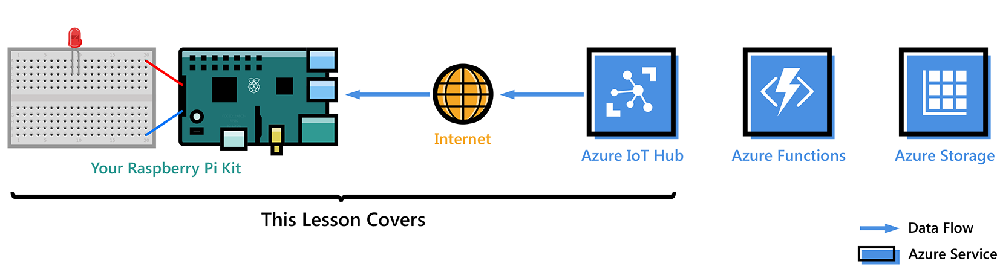

<properties
 pageTitle="Prise en main Raspberry Pi 3 | Microsoft Azure"
 description="Prise en main framboises Pi 3, de créer votre concentrateur IoT Azure et de connecter votre Pi au concentrateur IoT"
 services="iot-hub"
 documentationCenter=""
 authors="shizn"
 manager="timlt"
 tags=""
 keywords=""/>

<tags
 ms.service="iot-hub"
 ms.devlang="multiple"
 ms.topic="article"
 ms.tgt_pltfrm="na"
 ms.workload="na"
 ms.date="10/21/2016"
 ms.author="xshi"/>

# Prise en main Raspberry Pi 3

Dans ce didacticiel, vous commencez par les concepts de base de l’utilisation de framboises Pi 3 ce Raspbian en cours d’exécution. Vous découvrez puis comment se connecter en toute transparence vos appareils dans le cloud avec [Azure IoT concentrateur](iot-hub-what-is-iot-hub.md). Pour des exemples de Windows 10 IoT Core, visitez [windowsondevices.com](http://www.windowsondevices.com/).

## Leçon 1 : Configurer votre appareil

Dans cette leçon, vous configurez votre appareil framboises Pi 3 avec un système d’exploitation, configurez votre environnement de développement et déployez une application sur la Pi.

### Configurer votre périphérique

Configurer votre framboises Pi 3 pour la première utilisation et installez le système d’exploitation Raspbian, un système d’exploitation gratuit qui est optimisé pour le matériel framboises Pi.

*Durée estimée : 30 minutes* 

[Accédez à « Configurer votre appareil »](iot-hub-raspberry-pi-kit-node-lesson1-configure-your-device.md)

### Obtenez les outils
Téléchargez les outils et les logiciels de créer et déployer votre première application framboises Pi 3.

*Durée estimée : 20 minutes* 

[Obtenir des outils](iot-hub-raspberry-pi-kit-node-lesson1-get-the-tools-win32.md)

### Créez et déployez l’application clignoter

Cloner l’exemple Node.js d’application à partir de Github et gulp pour déployer cette application sur votre carte framboises Pi 3. Cet exemple d’application clignote la LED connecté à la carte toutes les deux secondes.

*Durée estimée : 5 minutes* 

[Accédez à « créer et déployer l’application clignoter »](iot-hub-raspberry-pi-kit-node-lesson1-deploy-blink-app.md)

## Leçon 2 : Créer votre concentrateur IoT

Dans cette leçon, vous créez votre compte Azure gratuit, mise en service de votre plateforme d’Azure IoT et créez votre premier périphérique dans Azure IoT hub.

Terminer la leçon 1 avant de commencer ce cours.

### Obtenez les outils Azure

Installer Azure Interface de ligne (commande Azure).

*Durée estimée : 10 minutes* 

[Accédez à « Outils Azure obtenir »](iot-hub-raspberry-pi-kit-node-lesson2-get-azure-tools-win32.md)

### Créer votre concentrateur IoT et inscrire votre framboises Pi 3

Créer votre groupe de ressources, mise en service de votre première concentrateur IoT Azure et ajouter votre premier périphérique au concentrateur IoT Azure à l’aide d’Azure infrastructure du langage commun. 

*Durée estimée : 10 minutes* 

[Accédez à « Créer votre concentrateur IoT et inscrire votre framboises Pi 3 »](iot-hub-raspberry-pi-kit-node-lesson2-prepare-azure-iot-hub.md)

## Leçon 3 : Envoyer des messages de l’appareil-nuage

Dans cette leçon, vous envoyez des messages à partir de votre Pi à votre concentrateur IoT. Vous également créez une application de fonction Azure qui Récupère les messages provenant de votre plateforme IoT et les écrit à Azure table storage.

Effectuez les leçons 1 et 2 avant de commencer ce cours.

### Créer une application de fonction Azure et un compte de stockage Azure

Utiliser un modèle Azure le Gestionnaire de ressources pour créer une application de la fonction Azure et un compte de stockage Azure.

*Durée estimée : 10 minutes* 

[Accédez à « Créer une application de fonction Azure et un compte de stockage Azure »](iot-hub-raspberry-pi-kit-node-lesson3-deploy-resource-manager-template.md)

### Exécuter l’exemple d’application pour envoyer des messages de l’appareil-nuage

Déploiement et l’exécution d’un exemple d’application sur votre appareil framboises Pi 3 qui envoie des messages à IoT concentrateur.

*Durée estimée : 10 minutes* 

[Accédez à « Lancer l’exemple d’application pour envoyer des messages de l’appareil-nuage »](iot-hub-raspberry-pi-kit-node-lesson3-run-azure-blink.md)

### Lire les messages conservées dans le stockage Azure
Surveiller les messages de l’appareil-nuage qu’ils sont écrits dans votre espace de stockage Azure.

*Durée estimée : 5 minutes* 

[Accédez à « lire les messages conservées dans le stockage Azure »](iot-hub-raspberry-pi-kit-node-lesson3-read-table-storage.md)

## Leçon 4 : Envoyer des messages de cloud vers le périphérique

Cette leçon explique comment envoyer des messages à partir de votre plateforme d’Azure IoT à votre framboises Pi 3. Les messages contrôlent et désactiver le comportement de la LED est connecté à votre Pi le. Un exemple d’application est prêt pour effectuer cette tâche.

Effectuez les leçons 1, 2 et 3 avant de commencer ce cours.

### Exécutez l’application exemple pour recevoir des messages de cloud vers le périphérique

L’exemple d’application dans la leçon 4 s’exécute sur votre Pi et surveille les messages provenant de votre plateforme IoT. Une nouvelle tâche choses envoie des messages à votre Pi votre concentrateur IoT faire clignoter le LED.

*Durée estimée : 10 minutes* 

[Accédez à « Lancer l’exemple d’application pour recevoir des messages de cloud vers le périphérique »](iot-hub-raspberry-pi-kit-node-lesson4-send-cloud-to-device-messages.md)

### Section facultative : modifier et désactiver le comportement de la LED le

Personnaliser les messages pour modifier la LED et désactiver le comportement.

*Durée estimée : 10 minutes* 

[Accédez à « section facultative : modifier et désactiver le comportement de la LED le »](iot-hub-raspberry-pi-kit-node-lesson4-change-led-behavior.md)

## Résolution des problèmes

Si vous répondez à n’importe quel problème pendant les leçons, vous pouvez rechercher des solutions de cette page.

[Accédez à « Résolution des problèmes »](iot-hub-raspberry-pi-kit-node-troubleshooting.md)
