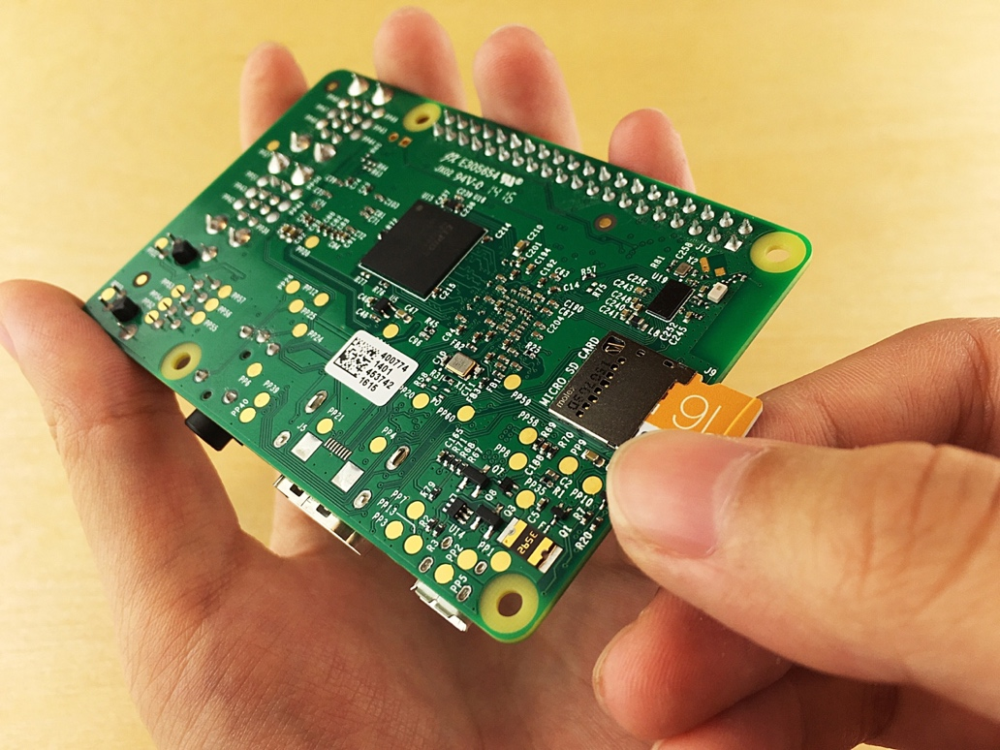

<properties
 pageTitle="Configurer votre périphérique | Microsoft Azure"
 description="Configurer votre framboises Pi 3 lors de la première utilisation et installez le système d’exploitation Raspbian, un système d’exploitation gratuit qui est optimisé pour le matériel framboises Pi."
 services="iot-hub"
 documentationCenter=""
 authors="shizn"
 manager="timlt"
 tags=""
 keywords=""/>

<tags
 ms.service="iot-hub"
 ms.devlang="multiple"
 ms.topic="article"
 ms.tgt_pltfrm="na"
 ms.workload="na"
 ms.date="10/21/2016"
 ms.author="xshi"/>

# 1.1 configurer votre appareil

## 1.1.1 ce que vous ferez

Configurer votre Pi pour la première utilisation et installez le système d’exploitation Raspbian, un système d’exploitation gratuit qui est optimisé pour le matériel framboises Pi. Si vous répondez à des problèmes, recherchent des solutions dans la [page de résolution des problèmes](iot-hub-raspberry-pi-kit-node-troubleshooting.md).

## 1.1.2 enseignements de cet article

Dans cette section, vous allez apprendre :

- Comment installer Raspbian sur votre Pi
- Comment faire pour démarrer votre Pi à l’aide d’un câble USB
- Comment se connecter votre Pi au réseau à l’aide d’un câble Ethernet ou Wi-Fi
- Comment ajouter une LED à la breadboard et le connecter à votre Pi

## 1.1.3 ce dont vous avez besoin

Pour terminer cette section, vous devez les composants suivants auprès de votre framboises Pi 3 Starter Kit :

- Le forum de framboises Pi 3
- La carte MicroSD 16 Go
- Fournir la puissance 2 a 5 v avec le câble USB micro six pieds
- La breadboard
- Fils de connecteur
- Une résistance Ohm 560
- Un LED diffus 10mm
- Le câble Ethernet

Vous devez également :

- Une connexion câblée ou sans fil pour votre Pi pour vous connecter à
- Une USB-SD carte mini SD carte ou graver l’image du système d’exploitation dans la carte MicroSD.
- Un ordinateur exécutant Windows, Mac ou Linux. L’ordinateur est utilisé pour installer Raspbian sur la carte MicroSD.
- Une connexion Internet pour télécharger les outils nécessaires et les logiciels

## 1.1.4 installer Raspbian sur la carte MicroSD

Préparer la carte MicroSD pour écrire la photo Raspbian à.

1. Télécharger Raspbian.
  1. [Télécharger](https://www.raspberrypi.org/downloads/raspbian/) le fichier zip pour Raspbian Jessie avec les pixels.
  2. Extraire l’image Raspbian dans un dossier sur votre ordinateur.
2. Installez Raspbian à la carte MicroSD.
  1. [Téléchargez](https://www.etcher.io) et installez l’utilitaire de graveur de carte SD Etcher.
  2. Exécutez Etcher et sélectionnez l’image Raspbian que vous avez extrait à l’étape 1.
  3. Sélectionnez le lecteur de carte MicroSD.
    Remarque : Etcher peut avoir déjà sélectionné le lecteur approprié.
  4. Cliquez sur Flash pour installer Raspbian à la carte MicroSD.
  5. Supprimer la carte MicroSD de votre ordinateur une fois terminé.
    Remarque : Il est recommandé de supprimer la carte MicroSD directement car Etcher éjecte automatiquement ou démonte la carte MicroSD à la fin.
  6. Insérer la carte MicroSD dans votre Pi.

## 1.1.5 sous tension votre Pi

Allumez votre Pi à l’aide du câble USB micro et l’alimentation.

> [AZURE.NOTE] Il est important d’utiliser l’alimentation dans le kit de qui se trouve au moins 2 a pour vous assurer que votre framboises est chargé suffisamment puissant pour fonctionner correctement.

## 1.1.6 connecter votre framboises Pi 3 au réseau

Vous pouvez connecter votre Pi à un réseau câblé ou à un réseau sans fil. Assurez-vous que votre Pi est connecté au réseau même que celui de votre ordinateur. Par exemple, vous pouvez vous connecter à votre Pi au même commutateur que votre ordinateur est connecté à.

### 1.1.6.1 se connecter à un réseau câblé

Utilisez le câble Ethernet pour connecter votre Pi à votre réseau câblé. Les deux voyants sur votre Pi activez si la connexion établie.

### 1.1.6.2 se connecter à un réseau sans fil

Suivez les [instructions](https://www.raspberrypi.org/learning/software-guide/wifi/) à partir de la base de Pi framboises pour vous connecter votre Pi à votre réseau sans fil. Ces instructions nécessitent d’abord vous connecter un moniteur et un clavier à votre Pi.

## 1.1.7 connecter la LED à votre Pi

Pour effectuer cette tâche, utilisez la [breadboard](https://learn.sparkfun.com/tutorials/how-to-use-a-breadboard), les fils de connecteur, la LED et de la résistance. Pour relier pour les ports [d’entrée/sortie à usage général](https://www.raspberrypi.org/documentation/usage/gpio/) (GPIO) de votre Pi. 

1. Se connecter à la plus courte et pouce des voyants à **GPIO terre (6 code confidentiel)**.
2. Se connecter à la plus longue pouce des voyants à un côté de la résistance.
3. Se connecter à l’autre pouce de la résistance à **4 GPIO (7 code confidentiel)**.

Notez que la polarité LED est importante. Ce paramètre polarité est connu sous faible Active.

Félicitations ! Vous avez correctement configuré votre Pi.

## 1.1.8 résumé

Dans cette section, vous avez appris à configurer votre Pi en installant Raspbian, connectez votre Pi à un réseau et connectez une LED à votre Pi. Notez que la LED ne s’allument encore. Dans la section suivante, vous installez les outils nécessaires et les logiciels de préparation pour l’exécution d’un exemple d’application sur votre Pi.

## Étapes suivantes

[1.2 obtenir les outils](iot-hub-raspberry-pi-kit-node-lesson1-get-the-tools-win32.md)
