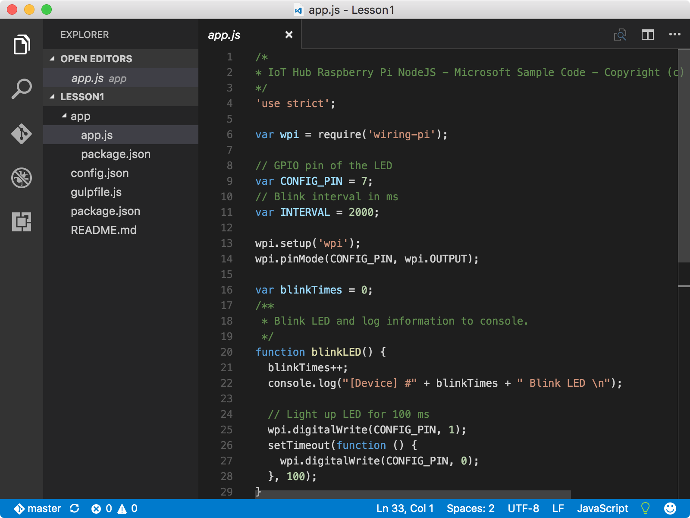
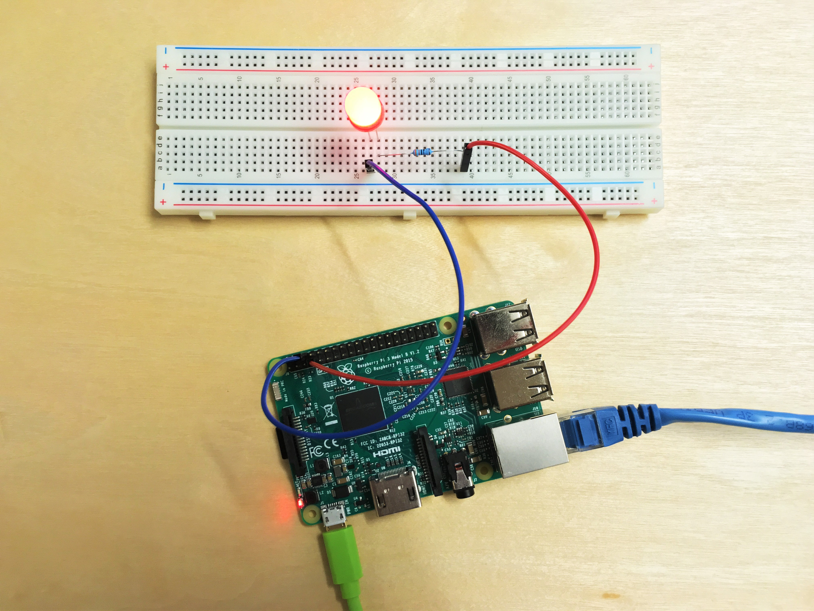

<properties
 pageTitle="Créez et déployez l’application clignoter | Microsoft Azure"
 description="Cloner l’exemple Node.js d’application à partir de Github et gulp pour déployer cette application sur votre carte framboises Pi 3. Cet exemple d’application clignote la LED connecté à la carte toutes les deux secondes."
 services="iot-hub"
 documentationCenter=""
 authors="shizn"
 manager="timlt"
 tags=""
 keywords=""/>

<tags
 ms.service="iot-hub"
 ms.devlang="multiple"
 ms.topic="article"
 ms.tgt_pltfrm="na"
 ms.workload="na"
 ms.date="10/21/2016"
 ms.author="xshi"/>

# <a name="13-create-and-deploy-the-blink-application"></a>1.3 Créez et déployez l’application clignoter

## <a name="131-what-you-will-do"></a>1.3.1 ce que vous ferez

Cloner l’exemple Node.js d’application à partir de Github et utiliser l’outil de choses à déployer l’exemple d’application à votre framboises Pi 3. L’exemple d’application clignote la LED connecté à la carte toutes les deux secondes. Si vous répondez à des problèmes, recherchent des solutions dans la [page de résolution des problèmes](iot-hub-raspberry-pi-kit-node-troubleshooting.md).

## <a name="132-what-you-will-learn"></a>1.3.2 enseignements de cet article

- Comment utiliser le `device-discover-cli` outil pour récupérer les informations de mise en réseau sur votre Pi.
- Comment déployer et exécuter l’exemple d’application sur votre Pi.
- Comment déployer et déboguer des applications exécutées à distance sur votre Pi.

## <a name="133-what-you-need"></a>1.3.3 ce dont vous avez besoin

Avec succès, vous devez avoir terminé les sections suivantes dans la leçon 1 :

- [Configurer votre périphérique](iot-hub-raspberry-pi-kit-node-lesson1-configure-your-device.md)
- [Obtenez les outils](iot-hub-raspberry-pi-kit-node-lesson1-get-the-tools-win32.md)

## <a name="134-obtain-the-ip-address-and-host-name-of-your-pi"></a>1.3.4 obtenir le nom de votre Pi IP adresse et hôte

Ouvrez une invite de commandes dans Windows ou une fenêtre de terminal dans Mac OS ou Ubuntu, puis exécutez la commande suivante :

```bash
devdisco list --eth
```

Vous devriez voir un résultat qui ressemble à ce qui suit :


Prenez note de la `IP address` et `hostname` de votre Pi. Vous avez besoin de ces informations plus loin dans cette section.

> [AZURE.NOTE] Assurez-vous que votre Pi est connecté au réseau même que celui de votre ordinateur. Par exemple, si votre ordinateur est connecté à un réseau sans fil alors que votre Pi est connecté à un réseau câblé, vous voyiez pas l’adresse IP dans la sortie devdisco.

## <a name="135-clone-the-sample-application"></a>1.3.5 cloner l’exemple d’application

Pour ouvrir l’exemple de code, procédez comme suit :

1. Cloner le référentiel exemple à partir de Github en exécutant la commande suivante :

    ```bash
    git clone https://github.com/Azure-Samples/iot-hub-node-raspberrypi-getting-started.git
    ```

2. Ouvrez l’exemple d’application dans le Code de Visual Studio en exécutant les commandes suivantes :

    ```bash
    cd iot-hub-node-raspberrypi-getting-started
    cd Lesson1
    code .
    ```



La `app.js` de fichier dans le `app` sous-dossier est le fichier source de clé qui contient le code pour contrôler la LED.

### <a name="136-install-application-dependencies"></a>1.3.6 installer dépendances des applications

Installer les bibliothèques et autres modules que vous avez besoin pour l’exemple d’application en exécutant la commande suivante :

```bash
npm install
```

## <a name="137-configure-the-device-connection"></a>1.3.7 configurer la connexion de l’appareil

Pour configurer la connexion du périphérique, procédez comme suit :

1. Générer le fichier de configuration de périphérique en exécutant la commande suivante :

    ```bash
    gulp init
    ```

    Le fichier de configuration `config-raspberrypi.json` contient les informations d’identification utilisateur que vous utilisez pour vous connecter votre Pi. Pour éviter la perte des informations d’identification de l’utilisateur, le fichier de configuration est généré dans le sous-dossier `.iot-hub-getting-started` du dossier personnel sur votre ordinateur.

2. Ouvrez le fichier de configuration de périphérique dans le Code de Visual Studio en exécutant la commande suivante :

    ```bash
    # For Windows command prompt
    code %USERPROFILE%\.iot-hub-getting-started\config-raspberrypi.json

    # For macOS or Ubuntu
    code ~/.iot-hub-getting-started/config-raspberrypi.json
    ```

3. Remplacez l’espace réservé `[device hostname or IP address]` avec l’adresse IP ou le nom d’hôte qui s’affiche dans la section 1.3.4.

    

Félicitations ! Vous avez correctement créé le premier exemple d’application pour votre Pi.

## <a name="138-deploy-and-run-the-sample-application"></a>1.3.8 déploiement et l’exécution de l’exemple d’application

### <a name="1381-install-nodejs-and-npm-on-your-pi"></a>1.3.8.1 installer Node.js et NPM sur votre Pi

Installer Node.js et NPM sur votre Pi en exécutant la commande suivante :

```bash
gulp install-tools
```

Il peut prendre 10 minutes pour terminer la première fois que vous exécutez cette tâche.

### <a name="1382-deploy-and-run-the-sample-app"></a>1.3.8.2 déploiement et l’exécution de l’exemple d’application

Déploiement et l’exécution de l’exemple d’application en exécutant la commande suivante :

```bash
gulp deploy && gulp run
```

### <a name="1383-verify-the-app-works"></a>1.3.8.3 vérifier le fonctionnement de l’application

Vous devez maintenant voir la LED sur votre Pi clignote toutes les deux secondes.  Si vous ne voyez pas la LED clignote, voir le [guide de dépannage](iot-hub-raspberry-pi-kit-node-troubleshooting.md) pour les solutions aux problèmes courants.


> [AZURE.NOTE] Utiliser `Ctrl + C` pour mettre fin à l’application.

## <a name="139-summary"></a>1.3.9 résumé

Vous avez installé les outils requis pour l’utiliser avec votre Pi et déployé un exemple d’application sur votre Pi faire clignoter le LED. Vous pouvez désormais vous déplacer à la leçon suivante pour créer, déployer et exécuter une autre application exemple reliant votre Pi Azure IoT concentrateur pour envoyer et recevoir des messages.

## <a name="next-steps"></a>Étapes suivantes

Vous êtes maintenant prêt à commencer leçon 2 qui commence par [obtenir les outils Azure](iot-hub-raspberry-pi-kit-node-lesson2-get-azure-tools-win32.md)
