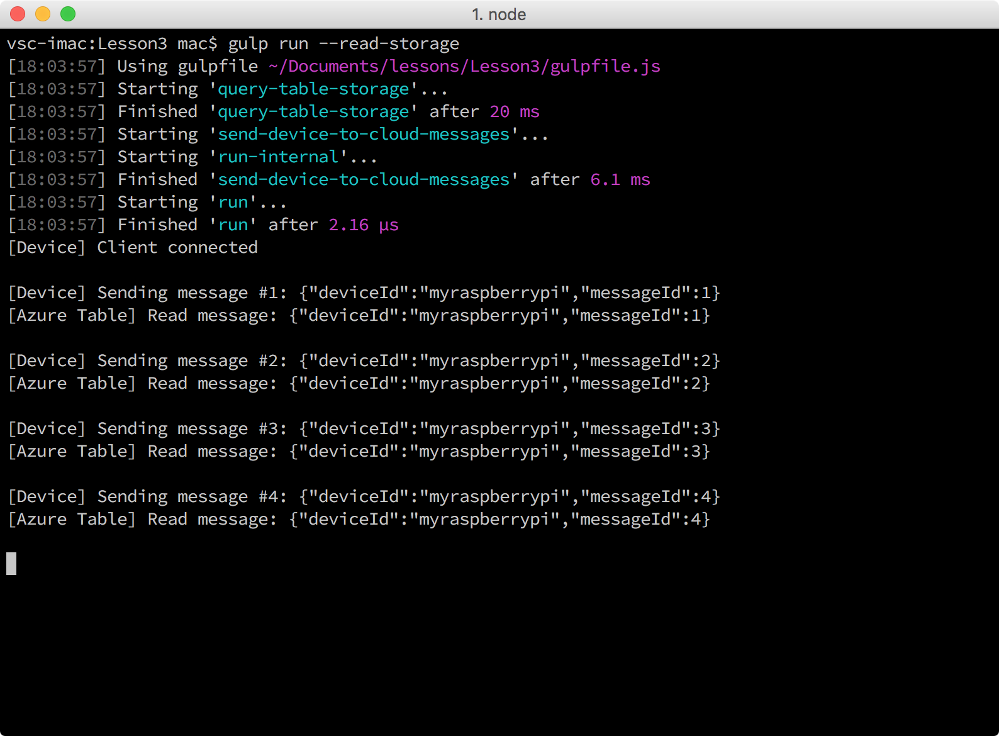

<properties
 pageTitle="Lire les messages conservées dans le stockage Azure | Microsoft Azure"
 description="Surveiller les messages de l’appareil-nuage qu’ils sont écrits dans votre espace de stockage de table Azure."
 services="iot-hub"
 documentationCenter=""
 authors="shizn"
 manager="timlt"
 tags=""
 keywords=""/>

<tags
 ms.service="iot-hub"
 ms.devlang="multiple"
 ms.topic="article"
 ms.tgt_pltfrm="na"
 ms.workload="na"
 ms.date="10/21/2016"
 ms.author="xshi"/>

# <a name="33-read-messages-persisted-in-azure-storage"></a>3.3 messages lus conservées dans le stockage Azure

## <a name="331-what-will-you-do"></a>3.3.1 que souhaitez-vous faire

Surveiller les messages d’appareil-nuage qui sont envoyés à partir de votre framboises Pi 3 à votre concentrateur IoT que les messages sont écrits sur le stockage de table Azure. Si vous répondez à des problèmes, recherchent des solutions dans la [page de résolution des problèmes](iot-hub-raspberry-pi-kit-node-troubleshooting.md).

## <a name="332-what-will-you-learn"></a>3.3.2 que vous allez apprendre

- L’utilisation de la tâche de lecture du message choses pour lire les messages conservées dans votre espace de stockage de table Azure.

## <a name="333-what-do-you-need"></a>3.3.3 qu’avez-vous besoin

- Avec succès, vous devez avoir terminé la section précédente, [exécutez l’application exemple clignoter Azure sur votre framboises Pi 3](iot-hub-raspberry-pi-kit-node-lesson3-run-azure-blink.md).

## <a name="334-read-new-messages-from-your-storage-account"></a>3.3.4 lire les nouveaux messages de votre compte de stockage

Dans la section précédente, vous avez exécuté un exemple d’application sur votre Pi. Les exemples de messages application envoyée à votre concentrateur IoT Azure. Les messages envoyés à votre plateforme IoT sont stockés dans votre espace de stockage de table Azure via l’application de la fonction Azure. Vous devez la chaîne de connexion de stockage Azure pour lire les messages à partir de votre espace de stockage de table Azure.

Pour lire les messages stockés dans votre espace de stockage de table Azure, procédez comme suit :

1. Obtenir la chaîne de connexion en exécutant les commandes suivantes :

    ```bash
    az storage account list -g iot-sample --query [].name
    az storage account show-connection-string -g iot-sample -n {storage name}
    ```

    La première commande récupère le `storage name` qui est utilisée dans la deuxième commande pour obtenir la chaîne de connexion. `iot-sample`est la valeur par défaut de `{resource group name}` si vous n’avez pas modifier la valeur dans la leçon 2.

2. Ouvrez le fichier de configuration `config-raspberrypi.json` fichier dans le Code de Visual Studio en exécutant la commande suivante :

    ```bash
    # For Windows command prompt
    code %USERPROFILE%\.iot-hub-getting-started\config-raspberrypi.json

    # For macOS or Ubuntu
    code ~/.iot-hub-getting-started/config-raspberrypi.json
    ```

3. Remplacer `[Azure Storage connection string]` avec la chaîne de connexion que vous avez obtenu à l’étape 1.
4. Enregistrer le `config-raspberrypi.json` fichier.
5. Envoyer des messages à nouveau et les lire à partir de votre espace de stockage de table Azure en exécutant la commande suivante :

    ```bash
    gulp run --read-storage
    ```

    Logique de lecture à partir du stockage de table Azure se trouve dans le `azure-table.js` fichier.

    

## <a name="335-summary"></a>3.3.5 résumé

Vous avez correctement connecté votre Pi à votre concentrateur IoT dans le cloud et l’exemple d’application clignoter permet d’envoyer des messages de l’appareil-nuage. L’application de la fonction Azure permet également de stocker les messages entrants de concentrateur IoT votre stockage de table Azure. Vous pouvez déplacer sur à la leçon suivante sur la façon d’envoyer des messages de cloud vers le périphérique à partir de votre plateforme IoT à votre Pi.

## <a name="next-steps"></a>Étapes suivantes

[Leçon 4 : Envoyer des messages de cloud vers le périphérique](iot-hub-raspberry-pi-kit-node-lesson4-send-cloud-to-device-messages.md)
