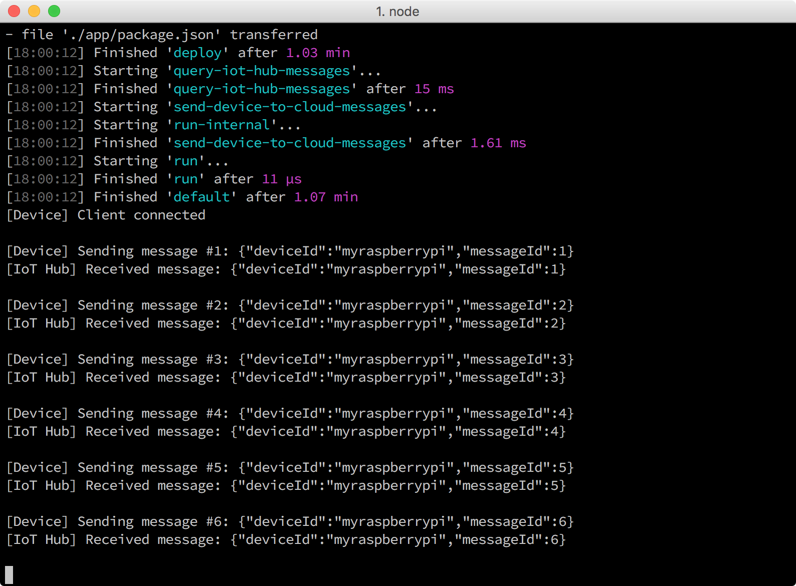

<properties
 pageTitle="Exécuter l’exemple d’application pour envoyer des messages de l’appareil-nuage | Microsoft Azure"
 description="Déploiement et l’exécution d’un exemple d’application sur votre framboises Pi 3 qui envoie des messages à IoT concentrateur et clignote la LED."
 services="iot-hub"
 documentationCenter=""
 authors="shizn"
 manager="timlt"
 tags=""
 keywords=""/>

<tags
 ms.service="iot-hub"
 ms.devlang="multiple"
 ms.topic="article"
 ms.tgt_pltfrm="na"
 ms.workload="na"
 ms.date="10/21/2016"
 ms.author="xshi"/>

# <a name="32-run-sample-application-to-send-device-to-cloud-messages"></a>3.2 exécuter exemple d’application pour envoyer des messages de l’appareil-nuage

## <a name="321-what-you-will-do"></a>3.2.1 ce que vous ferez

Déploiement et l’exécution d’un exemple d’application sur votre framboises Pi 3 qui envoie des messages à votre concentrateur IoT. Si vous répondez à des problèmes, recherchent des solutions dans la [page de résolution des problèmes](iot-hub-raspberry-pi-kit-node-troubleshooting.md).

## <a name="322-what-you-will-learn"></a>3.2.2 enseignements de cet article

- Comment utiliser l’outil de choses à déployer et exécuter l’exemple d’application Node.js sur votre Pi.

## <a name="323-what-you-need"></a>3.2.3 ce dont vous avez besoin

- Vous devez ont bien été effectuée la section précédente dans ce cours : [créer une application de la fonction Azure et d’un compte de stockage Azure pour traiter et stocker les messages de concentrateur IoT](iot-hub-raspberry-pi-kit-node-lesson3-deploy-resource-manager-template.md).

## <a name="324-get-your-iot-hub-and-device-connection-strings"></a>3.2.4 obtenir vos chaînes de connexion IoT concentrateur et appareil

La chaîne de connexion de périphérique permet de connecter la Pi à votre concentrateur IoT. Chaîne de connexion pour le hub IoT est utilisé pour connecter votre concentrateur IoT à l’identité du périphérique qui représente votre Pi dans le hub IoT.

- Obtenir la chaîne de connexion concentrateur IoT en exécutant la commande Azure infrastructure du langage commun suivante :

```bash
az iot hub show-connection-string --name {my hub name} --resource-group iot-sample
```

`{my hub name}`est le nom que vous avez spécifié dans la leçon 2. Utiliser `iot-sample` comme valeur de `{resource group name}` si vous n’avez pas modifier la valeur dans la leçon 2.

- Obtenir la chaîne de connexion de périphérique en exécutant la commande suivante :

```bash
az iot device show-connection-string --hub {my hub name} --device-id myraspberrypi --resource-group iot-sample
```

`{my hub name}`prend la même valeur que celle utilisée avec la commande précédente. Utiliser `iot-sample` comme valeur de `{resource group name}` et utiliser `myraspberrypi` comme valeur de `{device id}` si vous n’avez pas modifier la valeur dans la leçon 2.

## <a name="325-configure-the-device-connection"></a>3.2.5 configurer la connexion de l’appareil

1. Initialisation du fichier de configuration en exécutant les commandes suivantes :

    ```bash
    npm install
    gulp init
    ```

2. Ouvrez le fichier de configuration du dispositif `config-raspberrypi.json` dans le Code de Visual Studio en exécutant la commande suivante :

    ```bash
    # For Windows command prompt
    code %USERPROFILE%\.iot-hub-getting-started\config-raspberrypi.json
  
    # For macOS or Ubuntu
    code ~/.iot-hub-getting-started/config-raspberrypi.json
    ```

    

3. Vérifiez les remplacements suivants dans la `config-raspberrypi.json` fichier :

  - Remplacez **[appareil nom d’hôte ou l’adresse IP]** avec l’adresse IP du périphérique ou le nom d’hôte auprès du `device-discovery-cli` ou avec la valeur héritée de ce que vous avez configuré dans la leçon 1.
  - Remplacez **[chaîne de connexion d’un appareil de IoT]** avec la `device connection string` vous obtenues.
  - Remplacez **[chaîne de connexion d’un concentrateur de IoT]** avec la `iot hub connection string` vous obtenues.

Mise à jour de la `config-raspberrypi.json` fichier afin que vous pouvez déployer l’exemple d’application à partir de votre ordinateur.

## <a name="326-deploy-and-run-the-sample-application"></a>3.2.6 déploiement et l’exécution de l’exemple d’application

Déploiement et l’exécution de l’exemple d’application sur votre Pi en exécutant la commande suivante :

```bash
gulp
```

> [AZURE.NOTE] La tâche de choses par défaut s’exécute `install-tools`, `deploy`, et `run` tâches dans un ordre séquentiel. Dans la [leçon 1](iot-hub-raspberry-pi-kit-node-lesson1-deploy-blink-app.md), vous avez exécuté ces tâches séparément une après l’autre.

## <a name="327-verify-the-sample-application-works"></a>3.2.7 vérifier l’application exemple fonctionne

Vous devriez voir LED qui est connecté à votre Pi clignote toutes les deux secondes. Chaque fois que le clignote, l’exemple d’application envoie un message à votre plateforme IoT et vérifie que le message a été envoyé à votre concentrateur IoT. En outre, pour chaque message reçu par le hub IoT, le message est imprimé dans la fenêtre de la console. L’exemple d’application se termine automatiquement après l’envoi de 20 messages.



## <a name="328-summary"></a>3.2.8 résumé

Vous avez déployé et exécutez la nouvelle application exemple clignoter sur votre Pi pour envoyer des messages appareil-nuage à votre concentrateur IoT. Vous pouvez déplacer à la section suivante pour contrôler vos messages qu’ils sont écrits sur le compte de stockage Azure.

## <a name="next-steps"></a>Étapes suivantes

[3.3 messages lus conservées dans le stockage Azure](iot-hub-raspberry-pi-kit-node-lesson3-read-table-storage.md)