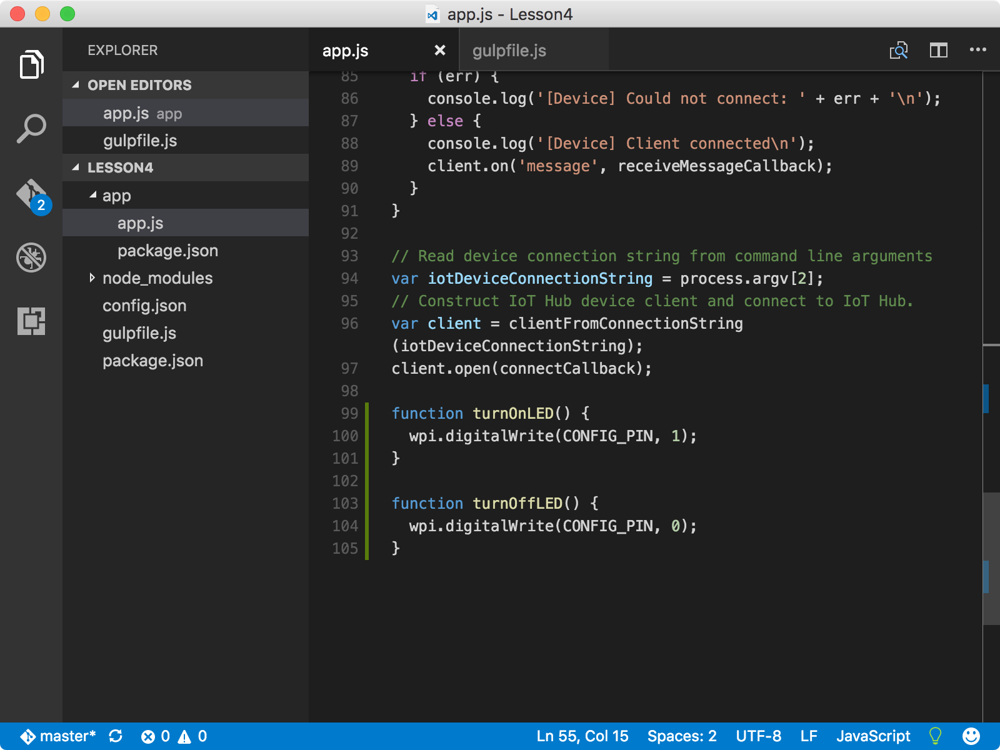
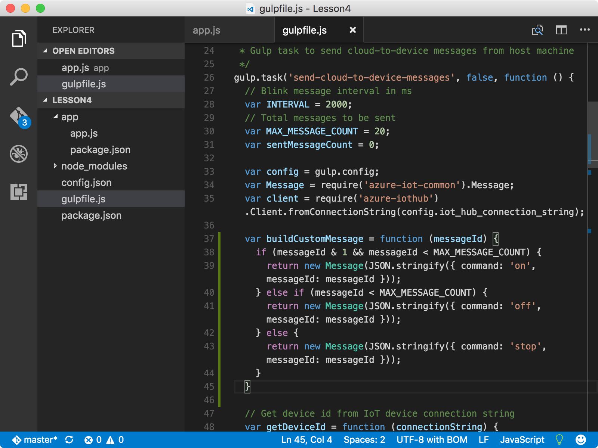

<properties
 pageTitle="Facultatif section : modifier et désactiver le comportement de la LED le | Microsoft Azure"
 description="Personnaliser les messages pour modifier la LED et désactiver le comportement."
 services="iot-hub"
 documentationCenter=""
 authors="shizn"
 manager="timlt"
 tags=""
 keywords=""/>

<tags
 ms.service="iot-hub"
 ms.devlang="multiple"
 ms.topic="article"
 ms.tgt_pltfrm="na"
 ms.workload="na"
 ms.date="10/21/2016"
 ms.author="xshi"/>

# <a name="42-optional-section-change-the-on-and-off-behavior-of-the-led"></a>4.2 section facultative : modifier et désactiver le comportement de la LED le

## <a name="421-what-you-will-do"></a>4.2.1 ce que vous ferez

Personnaliser les messages pour modifier la LED et désactiver le comportement. Si vous répondez à des problèmes, recherchent des solutions dans la [page de résolution des problèmes](iot-hub-raspberry-pi-kit-node-troubleshooting.md).

## <a name="422-what-you-will-learn"></a>4.2.2 enseignements de cet article

Utiliser des fonctions Node.js supplémentaires pour modifier la LED et désactiver le comportement.

## <a name="423-what-you-need"></a>4.2.3 ce dont vous avez besoin

Vous devez est terminé [4.1 exécuter un exemple d’application sur votre Pi framboises recevoir cloud aux messages de l’appareil](iot-hub-raspberry-pi-kit-node-lesson4-send-cloud-to-device-messages.md).

## <a name="424-add-nodejs-functions"></a>4.2.4 ajouter des fonctions Node.js

1. Ouvrez l’exemple d’application dans le code de Visual Studio en exécutant les commandes suivantes :

    ```bash
    cd Lesson4
    code .
    ```

2. Ouvrir le `app.js` de fichiers et ajoutez les fonctions suivantes à la fin :

    ```javascript
    function turnOnLED() {
      wpi.digitalWrite(CONFIG_PIN, 1);
    }

    function turnOffLED() {
      wpi.digitalWrite(CONFIG_PIN, 0);
    }
    ```

    

3. Ajouter les conditions suivantes avant par défaut dans le bloc switch case de la `receiveMessageCallback` fonction :

    ```javascript
    case 'on':
      turnOnLED();
      break;
    case 'off':
      turnOffLED();
      break;
    ```

    Maintenant que vous avez configuré l’exemple d’application pour répondre aux instructions plus de messages. L’instruction « sur » Active la LED et l’instruction « off » désactive la LED.

4. Ouvrez le fichier gulpfile.js et ajoutez une nouvelle fonction avant la fonction `sendMessage`:

    ```javascript
    var buildCustomMessage = function (messageId) {
      if ((messageId & 1) && (messageId < MAX_MESSAGE_COUNT)) {
        return new Message(JSON.stringify({ command: 'on', messageId: messageId }));
      } else if (messageId < MAX_MESSAGE_COUNT) {
        return new Message(JSON.stringify({ command: 'off', messageId: messageId }));
      } else {
        return new Message(JSON.stringify({ command: 'stop', messageId: messageId }));
      }
    }
    ```

    

5. Dans la `sendMessage` fonction, remplacez la ligne `var message = buildMessage(sentMessageCount);` avec la nouvelle ligne indiquée dans l’extrait de code suivante :

    ```javascript
    var message = buildCustomMessage(sentMessageCount);
    ```

6. Enregistrer toutes les modifications.

### <a name="425-deploy-and-run-the-sample-application"></a>4.2.5 déploiement et l’exécution de l’exemple d’application

Déploiement et l’exécution de l’exemple d’application sur votre Pi en exécutant la commande suivante :

```bash
gulp
```

Vous devriez voir la LED activé pour les deux secondes et puis désactivée pour un autre deux secondes. Le dernier message « arrêter » s’arrête à l’exemple d’application de s’exécuter.


Félicitations ! Vous avez personnalisé correctement les messages qui sont envoyés à la Pi votre concentrateur IoT.

### <a name="427-summary"></a>4.2.7 Résumé

Cette section facultative explique comment personnaliser les messages qui l’exemple d’application permet de contrôler et désactiver le comportement de la LED le dans une autre façon.

