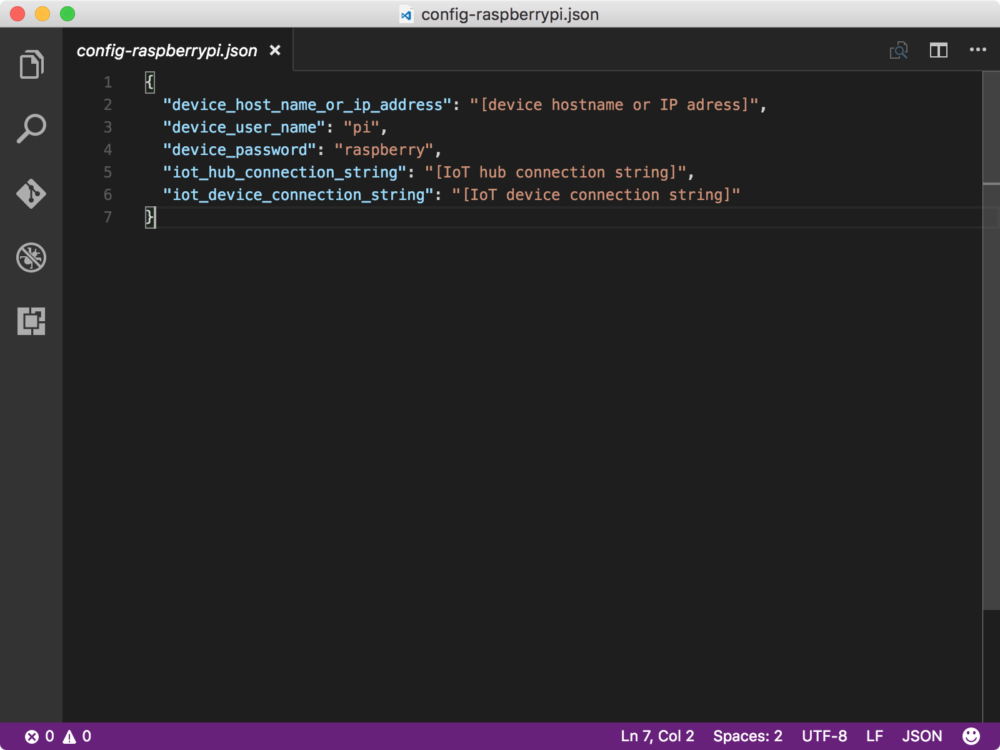

<properties
 pageTitle="Exécutez l’application exemple pour recevoir des messages de cloud vers le périphérique | Microsoft Azure"
 description="L’exemple d’application dans la leçon 4 s’exécute sur votre Pi et surveille les messages provenant de votre plateforme IoT. Une nouvelle tâche choses envoie des messages à votre Pi votre concentrateur IoT faire clignoter le LED."
 services="iot-hub"
 documentationCenter=""
 authors="shizn"
 manager="timlt"
 tags=""
 keywords=""/>

<tags
 ms.service="iot-hub"
 ms.devlang="multiple"
 ms.topic="article"
 ms.tgt_pltfrm="na"
 ms.workload="na"
 ms.date="10/21/2016"
 ms.author="xshi"/>

# <a name="41-run-the-sample-application-to-receive-cloud-to-device-messages"></a>4.1 exécuter l’exemple d’application pour recevoir des messages de cloud vers le périphérique

Dans cette section, vous déployez un exemple d’application sur votre framboises Pi 3. L’exemple d’application surveille les messages provenant de votre plateforme IoT. Vous pouvez également exécuter une tâche de choses sur votre ordinateur pour envoyer des messages à votre Pi depuis votre concentrateur IoT. Lors de la réception des messages, l’exemple d’application clignote la LED. Si vous répondez à des problèmes, recherchent des solutions dans la [page de résolution des problèmes](iot-hub-raspberry-pi-kit-node-troubleshooting.md).

## <a name="411-what-you-will-do"></a>4.1.1 ce que vous ferez

- Se connecter à votre concentrateur IoT l’exemple d’application.
- Déploiement et l’exécution de l’exemple d’application.
- Envoyer des messages à partir de votre plateforme IoT à votre Pi faire clignoter le LED.

## <a name="412-what-you-will-learn"></a>4.1.2 enseignements de cet article

- Découvrez comment contrôler les messages entrants à partir de votre plateforme IoT.
- Comment envoyer des messages de cloud vers le périphérique de votre plateforme IoT à votre Pi. 

## <a name="413-what-do-you-need"></a>4.1.3 qu’avez-vous besoin

- 3 Pi framboises qui a été configurée pour utiliser. Pour savoir comment configurer votre Pi, consultez [leçon 1 : prise en main avec votre appareil framboises Pi 3](iot-hub-raspberry-pi-kit-node-get-started.md)
- Un concentrateur IoT est créé dans votre abonnement Azure. Pour apprendre à créer votre concentrateur IoT Azure, voir [leçon 2 : créer votre concentrateur IoT Azure](iot-hub-raspberry-pi-kit-node-get-started.md)

## <a name="414-connect-the-sample-application-to-your-iot-hub"></a>4.1.4 se connecter à l’exemple d’application à votre concentrateur IoT

1. Vérifiez que vous êtes dans le dossier mis en pension `iot-hub-node-raspberrypi-getting-started`. Ouvrez l’exemple d’application dans le Code de Visual Studio en exécutant les commandes suivantes :

    ```bash
    cd Lesson4
    code .
    ```

    Notification de la `app.js` de fichier dans le `app` sous-dossier. La `app.js` fichier est le fichier de source de clé qui contient le code pour contrôler les messages provenant de IoT concentrateur. La `blinkLED` fonction clignote la LED.

    

2. Initialisation du fichier de configuration avec les commandes suivantes :

    ```bash
    npm install
    gulp init
    ```

    Si vous avez terminé la leçon 3 sur cet ordinateur, toutes les configurations sont héritées, vous pouvez donc passer à l’étape 4.1.5. Si vous terminé leçon 3 sur un autre ordinateur, vous devez remplacer les espaces réservés dans les `config-raspberrypi.json` fichier. La `config-raspberrypi.json` fichier se trouve dans le sous-dossier de votre dossier de base.

    

- Remplacez **[appareil nom d’hôte ou l’adresse IP]** par adresse IP ou le nom d’hôte que vous obtenez en exécutant la commande votre Pi`devdisco list --eth`
- Remplacez **[chaîne de connexion d’un appareil de IoT]** avec la chaîne de connexion appareil que vous obtenez en exécutant la commande `az iot hub show-connection-string --name {my hub name} --resource-group {resource group name}`.
- Remplacez **[chaîne de connexion d’un concentrateur de IoT]** avec la chaîne de connexion concentrateur IoT que vous obtenez en exécutant la commande `az iot device show-connection-string --hub {my hub name} --device-id {device id} --resource-group {resource group name}`.

## <a name="415-deploy-and-run-the-sample-application"></a>4.1.5 déploiement et l’exécution de l’exemple d’application

Déploiement et l’exécution de l’exemple d’application sur votre Pi en exécutant les commandes suivantes :
  
```
gulp
```

La commande choses s’exécute la tâche d’installer les outils en premier. Il déploie alors l’exemple d’application à votre Pi. Enfin, elle s’exécute l’application sur votre Pi et une tâche distincte sur votre ordinateur hôte pour envoyer des messages clignoter 20 à votre Pi votre concentrateur IoT.

Une fois que l’application d’exemple s’exécute, elle commence à écouter des messages à partir de votre plateforme IoT. Pendant ce temps, la tâche choses envoie plusieurs messages « clignoter » à partir de votre plateforme IoT à votre Pi. Pour chaque message clignoter reçu, l’exemple d’application appelle la fonction blinkLED pour clignoter le LED.

Vous devriez voir la LED clignote toutes les deux secondes que la tâche choses envoie des 20 messages à partir de votre plateforme IoT à votre Pi. La dernière est un message « arrêter » qui indique à l’application pour arrêter l’exécution.


## <a name="416-summary"></a>4.1.6 résumé

Vous avez correctement messages envoyés à partir votre concentrateur IoT à votre Pi faire clignoter le LED. Section suivante est section facultative qui vous montre comment modifier et désactiver le comportement de la LED le.

## <a name="next-steps"></a>Étapes suivantes

[Section facultative : modifier et désactiver le comportement de la LED le](iot-hub-raspberry-pi-kit-node-lesson4-change-led-behavior.md)