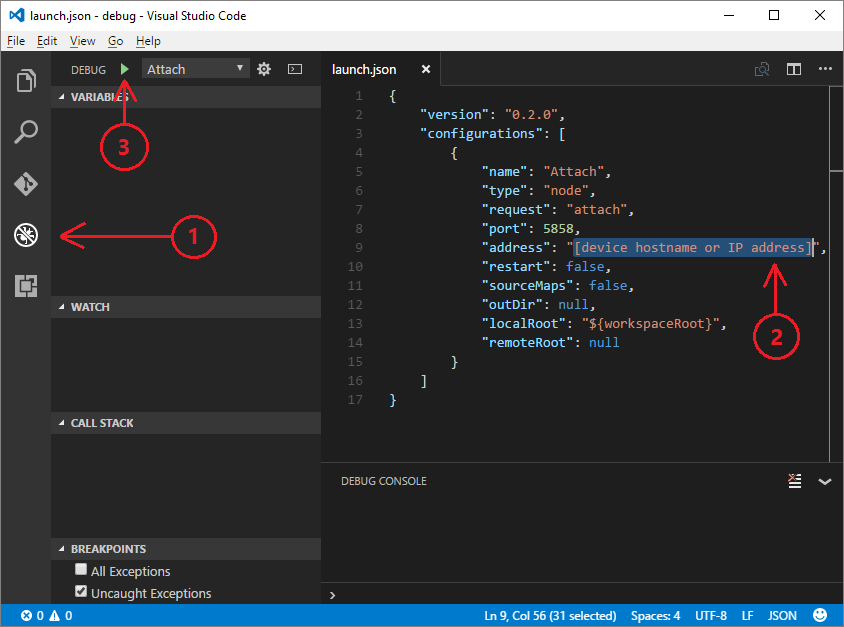

<properties
 pageTitle="Résolution des problèmes | Microsoft Azure"
 description="Résolution des problèmes de page pour une expérience framboises Pi Node.js"
 services="iot-hub"
 documentationCenter=""
 authors="shizn"
 manager="timlt"
 tags=""
 keywords=""/>

<tags
 ms.service="iot-hub"
 ms.devlang="multiple"
 ms.topic="article"
 ms.tgt_pltfrm="na"
 ms.workload="na"
 ms.date="10/21/2016"
 ms.author="xshi"/>

# <a name="troubleshooting"></a>Résolution des problèmes

## <a name="hardware-issues"></a>Problèmes de matériel

### <a name="the-application-runs-well-but-the-led-is-not-blinking"></a>L’application s’exécute correctement, mais la LED n’est pas clignote

Ce problème est toujours lié à la connectivité de circuit matériel. Utilisez les étapes suivantes pour identifier les problèmes.

1. Vérifier si vous choisissez la correcte **GPIO** sur votre carte. Les deux ports dans ce cours doivent être **GPIO terre (6 code confidentiel)** et **04 GPIO (7 code confidentiel)**.
2. Vérifiez si la polarité de votre LED est correcte. La branche plue doit indiquer la **positif**, code confidentiel anode.
3. Utilisez les **3.3V épingler** et le **code confidentiel terre** sur votre Pi Raspberry 3. Considérer votre Pi comme l’alimentation. Vérifiez si la LED fonctionne correctement.


### <a name="other-hardware-issues"></a>Autres problèmes de matériel

Pour plus d’informations sur la résolution de problèmes courants dans les 3 Pi framboises, reportez-vous à la [page Dépannage officiel](http://elinux.org/R-Pi_Troubleshooting).

## <a name="nodejs-package-issues"></a>Problèmes de package Node.js

### <a name="no-response-during-gulp-tasks"></a>Aucune réponse au cours des choses tâches

Si vous rencontrez des problèmes en cours d’exécution des tâches de choses, vous pouvez ajouter la `--verbose` option pour le débogage. Essayez de mettre fin à des tâches choses actuelles avec `Ctrl + C` puis exécutez la commande suivante dans la fenêtre de la console pour afficher les messages de débogage. Vous pouvez recevoir des messages d’erreur détaillés imprimés votre produit une sortie console. 

```bash
gulp --verbose
```

### <a name="device-discovery-issues"></a>Problèmes de découverte de périphériques

Pour résoudre les problèmes courants avec la `devdisco` commande, vérifiez le [fichier Lisez-moi](https://github.com/Azure/device-discovery-cli/blob/develop/readme.md).

### <a name="other-npm-issues"></a>Autres problèmes de NPM

Essayez de mettre à jour votre package NPM avec la commande suivante :

```bash
npm install -g npm
```

Si le problème persiste, laissez vos commentaires à la fin de cet article ou créer un problème Github dans notre [Exemple référentiel](https://github.com/Azure-Samples/iot-hub-node-raspberrypi-getting-started)

## <a name="remote-debugging"></a>Le débogage distant

### <a name="run-the-sample-application-in-debug-mode"></a>Exécutez l’application exemple en mode débogage

```bash
gulp run --debug
```

Lorsque le moteur de débogage est prêt, vous devriez voir ```Debugger listening on port 5858``` dans le résultat de la console.

### <a name="configure-vs-code-to-connect-to-the-remote-device"></a>Configurer Code VS pour vous connecter à l’appareil à distance

Ouvrez le panneau **Déboguer** sur le côté gauche.

Cliquez sur le bouton **Démarrer le débogage** (F5) vert. Code VS ouvre un fichier de **launch.json** , vous devez mettre à jour.

Mettre à jour le fichier **launch.json** avec le contenu suivant. Remplacer `[device hostname or IP address]` avec l’adresse IP du périphérique réel ou le nom d’hôte.   

```json
{
    "version": "0.2.0",
    "configurations": [
        {
            "name": "Attach",
            "type": "node",
            "request": "attach",
            "port": 5858,
            "address": "[device hostname or IP address]",
            "restart": false,
            "sourceMaps": false,
            "outDir": null,
            "localRoot": "${workspaceRoot}",
            "remoteRoot": null
        }
    ]
}
```



### <a name="attach-to-the-remote-application"></a>Joindre à l’application distante

Cliquez sur le bouton **Démarrer le débogage** (F5) vert pour démarrer le débogage. 

Lisez [JavaScript dans le Code VS](https://code.visualstudio.com/docs/languages/javascript#_debugging) pour en savoir plus sur le débogueur.


## <a name="azure-cli-issues"></a>Azure infrastructure du langage commun problèmes

Azure infrastructure du langage commun est une version preview. Vous pouvez faire référence au [Guide d’installation aperçu](https://github.com/Azure/azure-cli/blob/master/doc/preview_install_guide.md) pour chercher des solutions.

Si vous rencontrez des bogues avec l’outil, fichier un [problème](https://github.com/Azure/azure-cli/issues) dans la section **problèmes** de la mis en pension GitHub.

Pour résoudre les problèmes courants, vérifiez le [fichier Lisez-moi](https://github.com/Azure/azure-cli/blob/master/README.rst).

## <a name="python-installation-issues"></a>Problèmes d’installation Python

### <a name="legacy-installation-issues-macos"></a>Problèmes d’installation héritées (Mac OS)

Lorsque vous installez **pip**, une erreur d’autorisation est levée lorsqu’il y a héritées packages qui sont installés avec des autorisations **so** . Cette situation se produit car une installation précédente de Python à l’aide d’INFUSION (Mac OS) n’est pas complètement désinstallée. Certains packages **pip** à partir d’une installation précédente ont été créés par racine, ce qui provoque l’erreur d’autorisation. La solution consiste à supprimer les packages installés par racine. Procédez comme suit pour effectuer cette tâche :

1. Accédez à /usr/local/lib/python2.7/site-packages
2. Liste des packages créer par racine :`ls -l | grep root`
3. Désinstaller packages d’étape 2 :`sudo rm -rf {package name}`
4. Réinstaller Python.

## <a name="azure-iot-hub-issues"></a>Problèmes de concentrateur IoT Azure

Si vous avez déployé concentrateur Azure IoT avec `azure-cli`, et vous avez besoin d’un outil pour gérer les périphériques qui se connectent à votre concentrateur IoT, essayez les outils suivants :

### <a name="device-explorer"></a>Explorateur de périphérique

[Explorateur de périphérique](https://github.com/Azure/azure-iot-sdks/blob/master/tools/DeviceExplorer/doc/how_to_use_device_explorer.md) s’exécute sur votre ordinateur local Windows et se connecte à votre plateforme IoT dans Azure. Il communique avec les [points de terminaison IoT concentrateur](iot-hub-devguide.md)suivants :

- *Gestion des identités appareil* mise en service et la gestion des appareils enregistré avec votre concentrateur IoT.
- *Réception appareil-nuage* vous permettent de contrôler les messages envoyés à partir de votre appareil à votre plateforme IoT.
- *Envoyer le cloud vers le périphérique* à vous permettent d’envoyer des messages à vos périphériques de votre plateforme IoT.

Configurer votre `IoT hub connection string` au sein de cet outil pour toutes ses fonctionnalités.

### <a name="iot-hub-explorer"></a>Concentrateur IoT Explorer

[Concentrateur IoT Explorer](https://github.com/Azure/azure-iot-sdks/blob/master/tools/iothub-explorer/readme.md) est un outil d’infrastructure du langage commun de plateformes exemple pour gérer les appareils clients. L’outil vous permet de gérer les appareils mobiles dans le Registre identité, de contrôler les messages de l’appareil-cloud et envoyer des commandes cloud vers le périphérique.

Pour installer la dernière version (version préliminaire) de l’outil iothub explorer, exécutez la commande suivante dans votre environnement de ligne de commande :

```
npm install -g iothub-explorer@latest
```

Vous pouvez utiliser la commande suivante pour obtenir une aide supplémentaire sur toutes les commandes de l’Explorateur iothub et leurs paramètres :

```bash
iothub-explorer help
```

### <a name="use-azure-portal-to-manage-your-resources"></a>Portail Azure permet de gérer vos ressources

Dans ces leçons, un environnement d’infrastructure du langage commun complet est fourni pour créer et gérer toutes vos ressources Azure. Vous souhaiterez utiliser le [portail Azure](../azure-portal-overview.md) à l’aide de mise en service, gérer et déboguer vos ressources Azure.

## <a name="azure-storage-issues"></a>Problèmes de stockage Azure

[Explorateur de stockage Microsoft Azure (Preview)](http://storageexplorer.com) est une application autonome de Microsoft qui permet de travailler avec des données de stockage Azure sous Windows, Mac OS et Linux. Cet outil permet de vous connecter à votre tableau et afficher les données qu’il contient. Vous pouvez utiliser cet outil pour résoudre les problèmes de votre stockage Azure.
